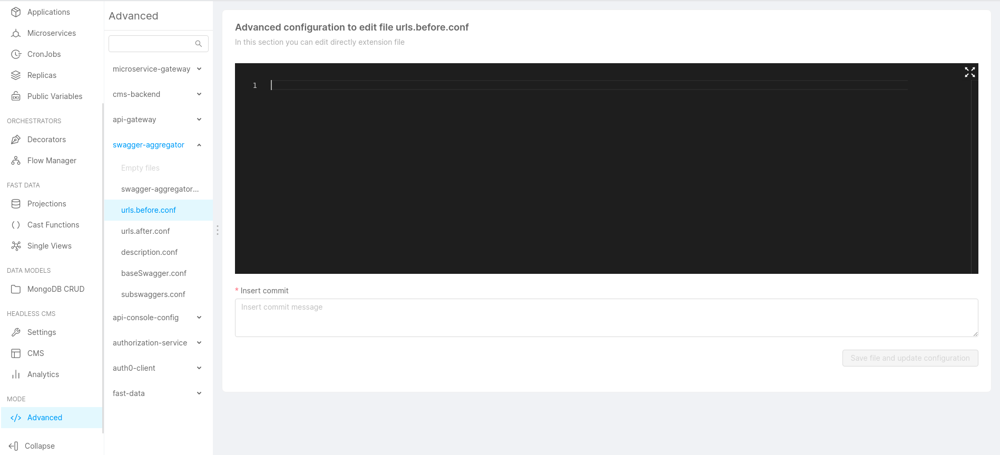

The Dev Portal uses the [Swagger Aggregator](/runtime_suite/swagger-aggregator/10_overview.md) to make all your OpenAPI specifications,
even the ones spread across different projects, available in a unique place.

:::caution
As mentioned [here](/runtime_suite_applications/dev_portal/application_creation.md#2-configure-api-portal), the version of your **api-portal** needs to be at least **1.14** in order to configure the api documentation correctly.
:::

## Merge the APIs of multiple projects

To include specifications from different projects, you can import them by URL using the Advanced section of the Design Area of the Console.

Check the [Swagger Aggregator Advanced Config](/development_suite/api-console/advanced-section/swagger-aggregator/configuration.md#servicesurlsbefore-and-servicesurlsafter)
for more details.

:::caution
Remember to set appropriate **request** and **limits** levels to the Swagger Aggregator microservice in order to avoid performance issues.

Check out the dedicated [section](/console/tutorials/set-requests-limits-of-a-microservice.mdx) for more information regarding requests and limits.
:::
