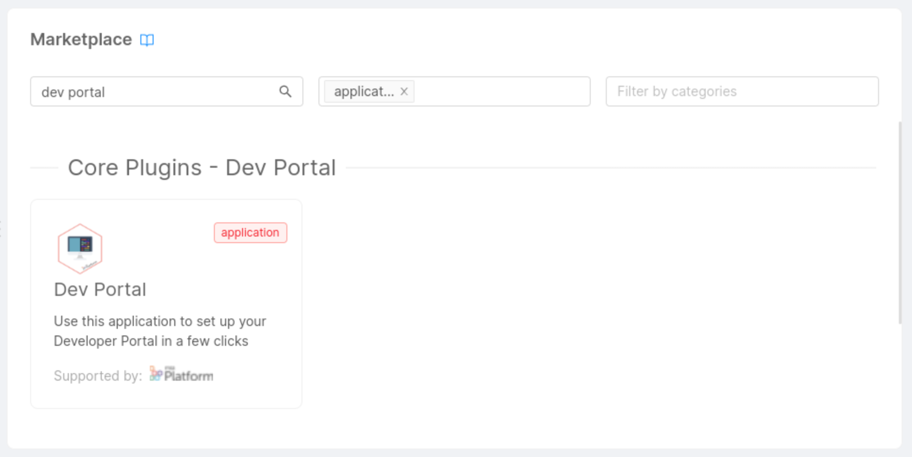
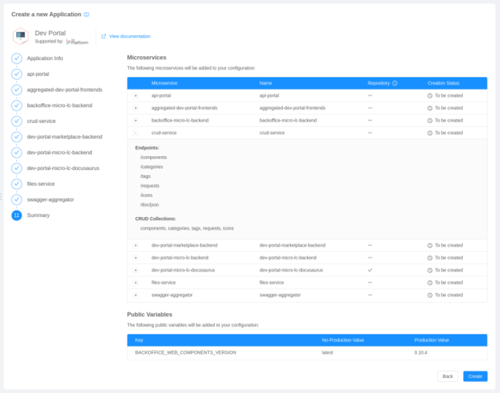

Creating the Developer Portal using the Mia-Platform Console is extremely simple. With just a few clicks and almost no configuration, you will be able to create all the necessary resources composing the Dev Portal architecture.

## Integration requirements

To integrate the Dev Portal, you only need to be able to access the project from which it will be exposed.

## Integration steps

To deploy a Dev Portal instance on the Mia Platform Console, you will have to:
- create the Dev Portal [application](/marketplace/applications/mia_applications.md);
- configure the theming properties of [micro-lc](https://microlc.io/);
- configure API documentation, authentication, and notifications (optional).

### 1. Create Dev Portal Application 

The first fundamental requirement for a correct Dev Portal configuration is creating the Dev Portal application through the [Marketplace](/marketplace/overview_marketplace.md).

The following steps will lead you to create an instance of the Dev Portal application:

1. Open the `Design` area of your project
2. Move to the `Application` section;
3. Create a new application using the **Dev Portal** application available in the `Core Plugins - Dev Portal` section of the marketplace:

   

4. Configure the name and the description for both the application and all the microservices composing it:

   :::note
   You can safely ignore the warning regarding CI on the `dev-portal-frontend` step, since the template will bring its own pipeline.
   :::

   

5. Review the creation of all the resources composing the application (microservices, endpoints, collections and public variables):

   

6. Complete the creation of the Dev Portal application by clicking `Create`.

### 2. Configure `dev-portal-frontend`

After creating the Dev Portal application, you will be able to customize it with your **logos** and default **theme colors**. 

The following steps will lead you to the configuration of the theming properties used by the Dev Portal.

1. Go to the `Microservices` section 
2. Open the detail of the microservice originally named `dev-portal-frontend`;
3. Move to the `ConfigMaps` section
4. In the file `configuration.json` edit the logo and colors following the documentation of [layout component](/microfrontend-composer/back-kit/60_components/390_layout.md) and of [theme manager component](/microfrontend-composer/back-kit/60_components/30_antd_theme_manager.md);
   
   :::caution
   The remaining configurations are already set for the `Dev Portal`: to know more about their purpose, please consult micro-lc [official documentantion](https://microlc.io/). 
   :::
