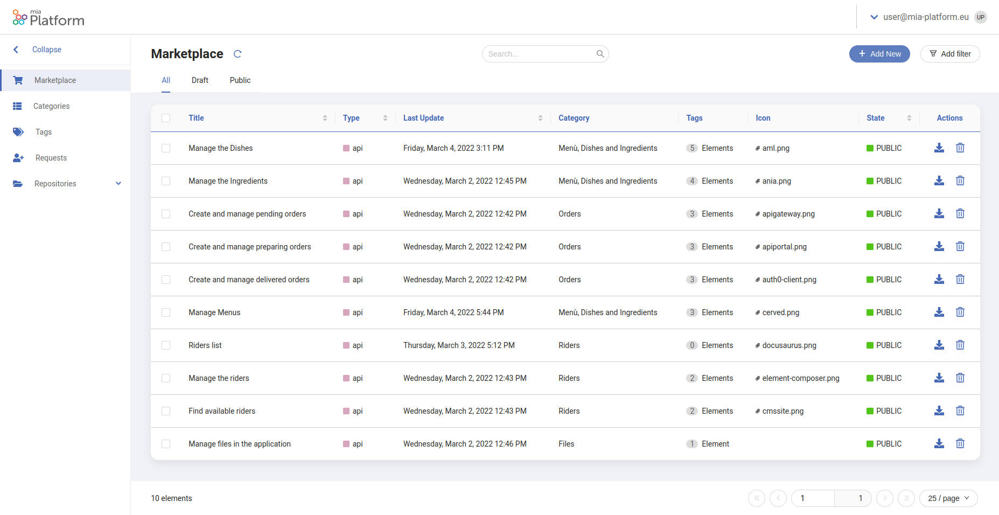
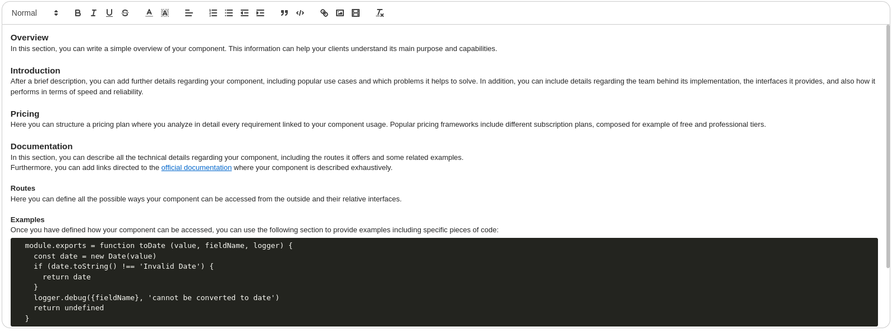
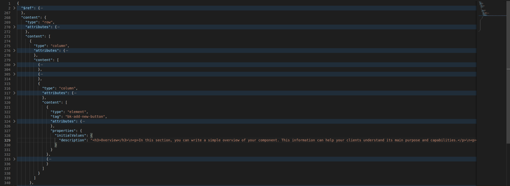
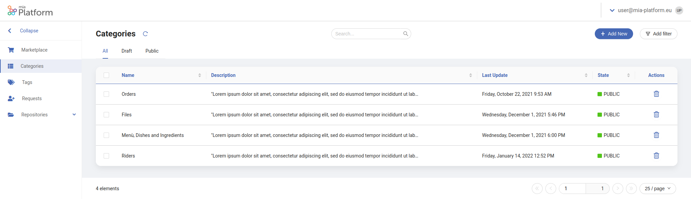
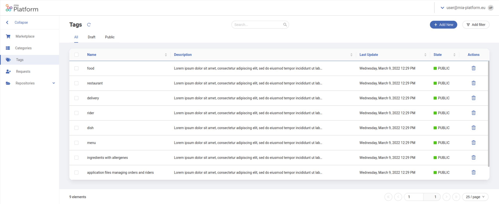

Once you successfully followed the [steps](/runtime_suite_applications/dev_portal/application_creation.md) to create the Dev Portal application, you can start adding all the information characterizing your organization at the endpoint `/dev-portal-backoffice/`. 

Through the **Backoffice** section of the Dev Portal, you can edit and manage all the data that will be shown in the Dev Portal Marketplace.

## Configure APIs and Events

The marketplace can show a preview of all the APIs and events of your organization, divided into different categories. 

By selecting a specific API or event, the user will be able to visualize a short overview and a longer description to gain more insight into it. A series of actions will also be able to the user. In particular, the user will be able to:

- Move to the API or event official documentation
- Move to the Api Portal 
- Request the Api Token

## The Marketplace Page

For the aforementioned reasons, the Backoffice section will contain a specific page to populate all the necessary information about APIs and events, the Marketplace page.

:::note
On the marketplace page, you will find an already populated list with all the APIs and events of your organization, automatically inferred from your Swagger or OpenAPI specifications.
:::

### Overview

From this page, you will be able to set all the details regarding a specific API or event. 



In particular, you will be able to set the following properties:

- **Title**: The name of the component you want to display on the marketplace card and at the top of the detail page;
  
- **Icon**: The icon to be displayed next to the component title;

- **Type**: The component type: API or event;

- **Last Update**: The date and time of the last modification applied to this entry;
  
- **Category**: The business level category you want to associate your component to. Each category will be displayed as a separate cluster of components on the home page (Please refer to the categories page [section](#the-categories-page) for further details about creating and modifying categories);

- **Tags**: The business-related concepts or keywords you want to associate your component to. Each tag will be displayed as an attribute of your component both in the home and in the detail pages (Please refer to the tags page [section](#the-tags-page) for further details about creating and modifying tags);

- **Description**: A description of your component, to be displayed both on the home page and on the component detail page. 
  When editing this field, a markdown editor is provided, so you can customize your description with **headings**, **links**, **code blocks** and **media contents** such as images, recordings, and videos. `h2`, `h3` and `h4` headings will be automatically mapped to a navigable page structure on the component detail page. You can also start editing this field from a custom template structure. (Learn more about configuring a custom template in the following [dedicated section](#set-a-custom-description-template));

- **Link to Documentation**: The link to a specific page of the Docusaurus Dev Portal plugin. It can be used to refer the API or event to a part of your documentation;

- **Link to Api Portal**: The link to the APi Portal corresponding specification.

- **Supporter Name**: The name of the organization supporting or providing this component.

- **Supporter Icon**: The icon of the organization supporting or providing this component.


### Create Modify and Publish

In order to display an API or event in the Marketplace section of the Dev Portal, you will eventually need to perform one of these actions.

- To **Create** a new entry in the Marketplace Page, simply 
  press the `Add New` button at the top-right angle of the page. 

  :::info
  Please consider custom created entries in the Marketplace table **cannot be automatically mapped** to your Swagger or OpenApi specifications
  :::

- To **Modify** an existing API or event, simply click on the corresponding row inside the table. Depending on your Dev Portal configuration, a drawer or a modal will be shown, where you will be able to edit each field of your component.

- To **Publish** your modifications, select with the tick boxes the corresponding rows you want to publish. If the rows you selected belong to the same publication status (all `DRAFT` or `PUBLIC`) you will be able to update their status with a button appearing at the bottom of the page. 

  :::caution warning
  **DRAFT** entries will not be displayed in the Marketplace section. Please make sure to publish all the entries you want to visualize.
  :::

### Set a Custom Description Template
Whenever you create a new component from the marketplace page, you will be able to start editing the **description field** from a predefined structure as shown below:



The following is the default template provided by the dev portal application. You can use it as a starting point to create your own custom template for your components pages.

```html title="template.html"
<h3>Overview</h3>
<p>In this section, you can write a simple overview of your component. This information can help your clients understand its main purpose and capabilities.</p>
<p><br></p>

<h3>Introduction</h3>
<p>After a brief description, you can add further details regarding your component, including popular use cases and which problems it helps to solve. In addition, you can include details regarding the team behind its implementation, the interfaces it provides, and also how it performs in terms of speed and reliability.</p>
<p><br></p>

<h3>Pricing</h3>
<p>Here you can structure a pricing plan where you analyze in detail every requirement linked to your component usage. Popular pricing frameworks include different subscription plans, composed for example of free and professional tiers.</p>
<p><br></p>

<h3>Documentation</h3>
<p>In this section, you can describe all the technical details regarding your component, including the routes it offers and some related examples.</p>
<p>Furthermore, you can add links directed to the <a href='https://docs.mia-platform.eu/' rel='noopener noreferrer' target='_blank'>official documentation</a> where your component is described exhaustively.</p>
<p><br></p>

<h4>Routes</h4>
<p>Here you can define all the possible ways your component can be accessed from the outside and their relative interfaces.</p>
<p><br></p>

<h4>Examples</h4>
<p>Once you have defined how your component can be accessed, you can use the following section to provide examples including specific pieces of code:</p>
<pre class='ql-syntax' spellcheck='false'>
  module.exports = function toDate (value, fieldName, logger) {
    const date = new Date(value)
    if (date.toString() !== 'Invalid Date') {
      return date
    }
    logger.debug({fieldName}, 'cannot be converted to date')
    return undefined
  }
</pre>
<p><br></p>

<h3>Support</h3>
<p>Here you can include a link redirecting to your customer support service: <a href='https://docs.mia-platform.eu/' rel='noopener noreferrer' target='_blank'>Learn more</a>.</p>
<p><br></p>

<h3>Terms of service</h3>
<p>In this section you can specify all the terms and conditions of the software license associated with your component. <a href='https://docs.mia-platform.eu/' rel='noopener noreferrer' target='_blank'>Terms of service</a>.</p>
<p><br></p>
```

If you wish to set your own custom description template, go to the microservices section of your project and search for the `dev-portal-backoffice` microservice. 

Among its configurations, you will find a file named `marketplace.confg.json`. This file is generally used to configure the structure of the [Marketplace page](#the-marketplace-page). However, you will also have the possibility to insert a default template by editing the `initialValues.description` field.

The description field can contain a mix of text and HTML tags structure, as shown below:



:::info
Please make sure to stringify your template before inserting it into the `dev-portal-backoffice` configuration.
:::

## The Categories Page

In order to subdivide APIs and events into different business logics or classifications, the Marketplace allows the creation of different categories in which components can be clustered.

Therefore, the Backoffice section contains a specific page to populate all the necessary information about categories, the Categories page.

### Overview

From this page, you will be able to set all the details regarding a specific category. 



In particular, you will be able to set the following properties:

- **Title**: The name of the category you want to display as a section title on the home page;

- **Description**: A description of the category you want to display. It will not appear as a visual element on the Marketplace but can be used to catalog with more precision each category;

- **Last Update**: The date and time of the last modification applied to this entry.

### Create Modify and Publish

In order to be able to select a specific category from the Marketplace Page, you will eventually need to perform one of these actions.

- To **Create** a new entry in the Categories Page, simply 
  press the `Add New` button at the top-right angle of the page.

- To **Modify** an existing category, simply click on the corresponding row inside the table. Depending on your Dev Portal configuration, a drawer or a modal will be shown, where you will be able to edit the selected category.

- To **Publish** your modifications, select with the tick boxes the corresponding rows you want to publish. If the rows you selected belong to the same publication status (all `DRAFT` or `PUBLIC`) you will be able to update their status with a button appearing at the bottom of the page. 

  :::caution warning
  **DRAFT** entries will not be displayed on the Marketplace Page. Please make sure to publish all the entries you may want to associate to an API or event.
  :::

## The Tags Page

In order to associate APIs and events with different business entities, concepts, or keywords, the Marketplace allows the creation of different tags which components can display among their details.

Therefore, the Backoffice section contains a specific page to populate all the necessary information about tags, the Tags page.

### Overview

From this page, you will be able to set all the details regarding a specific tag. 

 

In particular, you will be able to set the following properties:

- **Title**: The name of the tag you want to display in the component details;

- **Description**: A description of the tag you want to display. It will not appear as a visual element on the Marketplace but can be used to catalog with more precision each tag;

- **Last Update**: The date and time of the last modification applied to this entry.

### Create Modify and Publish

In order to be able to select a specific tag from the Marketplace Page, you will eventually need to perform one of these actions.

- To **Create** a new entry in the Tags Page, simply 
  press the `Add New` button at the top-right angle of the page.

- To **Modify** an existing tag, simply click on the corresponding row inside the table. Depending on your Dev Portal configuration, a drawer or a modal will be shown, where you will be able to edit the selected tag.

- To **Publish** your modifications, select with the tick boxes the corresponding rows you want to publish. If the rows you selected belong to the same publication status (all `DRAFT` or `PUBLIC`) you will be able to update their status with a button appearing at the bottom of the page. 

  :::caution warning
  **DRAFT** entries will not be displayed on the Marketplace Page. Please make sure to publish all the entries you may want to associate to an API or event.
  :::
  