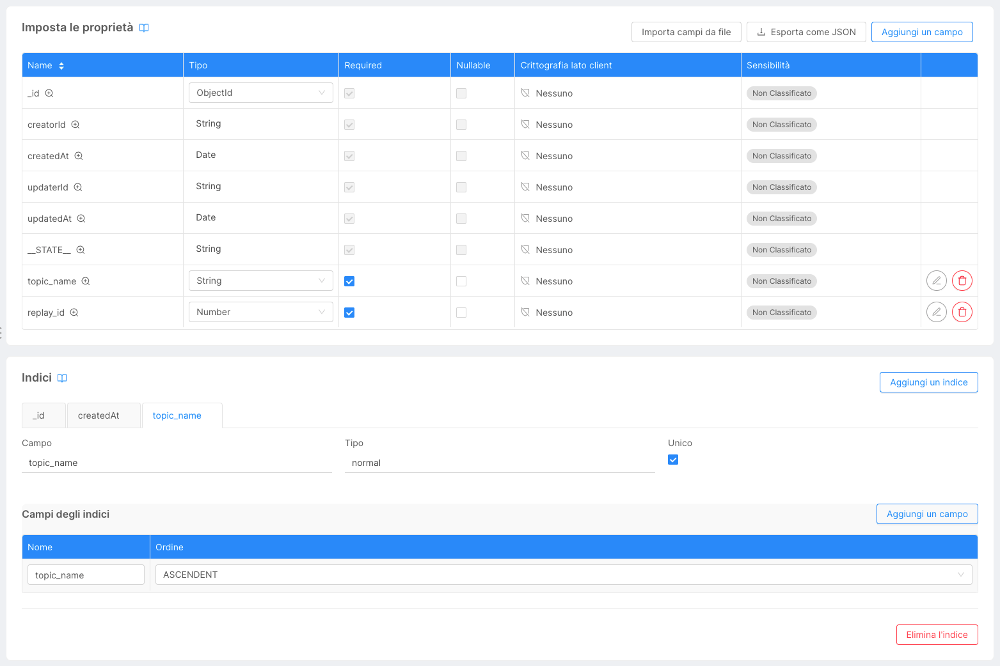

<!--
WARNING: this file was automatically generated by Mia-Platform Doc Aggregator.
DO NOT MODIFY IT BY HAND.
Instead, modify the source file and run the aggregator to regenerate this file.
-->

This small guide will detail how to install the connector and dlq services in your project and set them up.

## Install and Configure the Application

### Add the Application from the Marketplace

On the marketplace, look for the **Salesforce Streaming API Connector** application and add it to your project.
During the process, you will be able to change the name of the config maps and of the services themselves,
however it is not needed, you can confirm every dialog directly.

### Configure the Microservices

Go to the **Microservices** section and look for the `sforce-connector` and `sforce-connector-dlq` services
(if you didn't rename them during the previous phase). Then change any environment variable and config map file that 
you need to customize. We recommend to keep using environment/public variables where you see any, as they are 
variables that should change depending on the namespace. You can still change their names as you please.

### Create the Checkpoint CRUD Collection

As described in section [Connector in Depth](./11_connector_in_depth.md), you need to create a CRUD collection named
`streamingapi-checkpoints` with the following schema:
- required, non-null String `topic_name`
- required, non-null Number `replay_id`

Remember to index `topic_name` as unique and to set the default state for new documents as `PUBLIC`.

### Setup Kafka to Support Health Checks

Finally, you need to give the `operation describeconfigs` permission to your kafka user for the `cluster`
resource, otherwise the services liveness and readiness checks will always fail.
