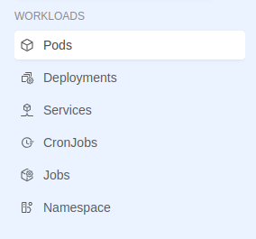

# Available Extension Locations

The Console allows you to embed extensions at specific locations defining the `destination.id` and these locations already contain menu items and groups which can also be used by our extensions. These locations are:

- **Tenant** with destinationId `tenant`
- **Project** with destinationId `project`
- **Runtime** with destinationId `runtime`

Each location has already menu groups that can be used as `category` id to which attach new menu item with your extension. 

## Tenant

  
 

  
  

This location is found on sections related to the Company on the URLs with prefix `/tenants/:tenantId` that represent the location path. As visible from the image, the sidebar already contains menu groups that can be used via categoryId:

- **GENERAL GROUP** (categoryId: `general`)
- **INFRASTRUCTURE GROUP** (categoryId: `infrastructure`)
- **GOVERNANCE GROUP** (categoryId: `governance`)
- **ACCESS MANAGEMENT GROUP** (categoryId: `access-management`)
- **ADMINISTRATION GROUP** (categoryId: `administration`)
- **EXTENSIBILITY GROUP** (categoryId: `extensibility`)

## Project

  
 

  
  

This location is found on sections related to the Project overview on the URLs with prefix `/projects/:projectId` that represent the location path. As visible from the image, the sidebar already contains menu groups that can be used via categoryId:

- **GENERAL GROUP** (categoryId: `general`)
- **ADMINISTRATION GROUP** (categoryId: `administration`)
- **RUNTIME GROUP** (categoryId: `runtime`)
- **ACCESS MANAGEMENT GROUP** (categoryId: `access-management`)

## Runtime

  
 

  
  

This location is found on the Runtime section of a Project on the URLs with prefix `/projects/:projectId/monitoring/environments/:envId` that represent the location path. As visible from the image, the sidebar already contains menu groups that can be used via categoryId:

- **WORKLOADS GROUP** (categoryId: `workloads`)

:::warning
Extensions routes placed in a specific location are visible only if the extension is activated in a context that includes that location. For this reason, an extension activated on the Project context cannot be seen if its routes are located on the `Tenant` location.
:::

## Parametrized iframe entry

Depending on the different locations where our extension is placed, the Console can interpolate specific parameters present on its entry, allowing you to customize your iframe based on the context in which it is inserted:

- **Tenant** resolves the `tenantId` parameter
- **Project** resolves the `tenantId` and `projectId` parameters
- **Runtime** resolves the `tenantId`, `projectId`, and `environmentId` parameters

Each extension can register a parameterized entry by inserting parameters in its string in the form of `{parameterName}` and these parameters will be resolved by the Console before fetching the iframe.

**Example**

Consider an extension that:

- is registered on the `Project` location and uses a parameterized entry `https://iframe-domain/any-path?tenant={tenantId}&project={projectId}`
- is active on the project with the ID `my-project-id` located in the tenant with the ID `my-tenant-id`

The Console displays the extension as soon as you enter the `my-project-id` project. When accessing its menu item on the sidebar, the parameterized entry is resolved and the website to be mounted in the iframe is retrieved at the URL address `https://iframe-domain/any-path?tenant=my-tenant-id&project=my-project-id`.

:::tip
The `{tenantId}`, `{projectId}` and `{environmentId}` parameters can be used in any the entry URL, so you can use them in the host, path, query string or anchor based on your webapplication needs.
:::
