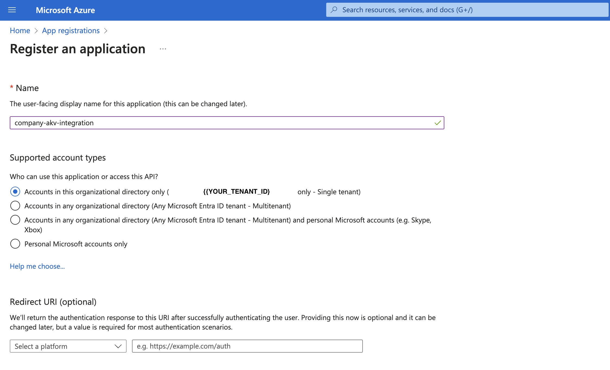
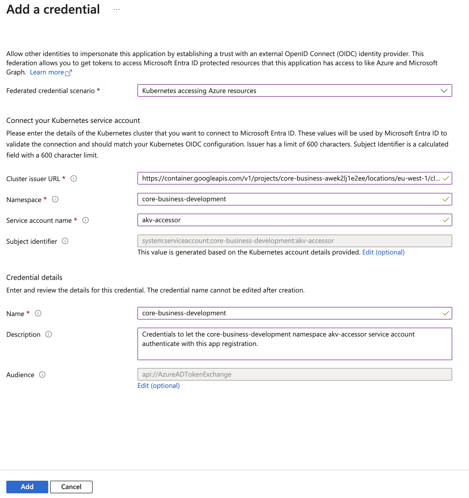
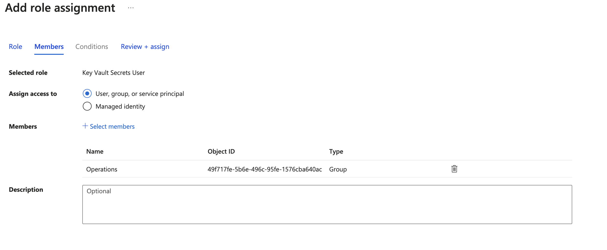
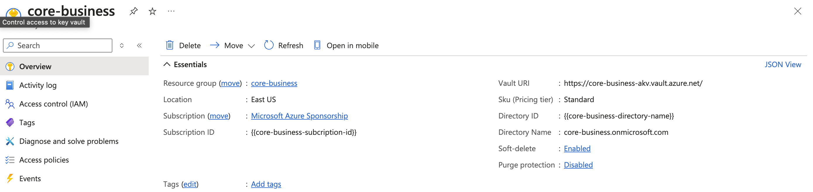
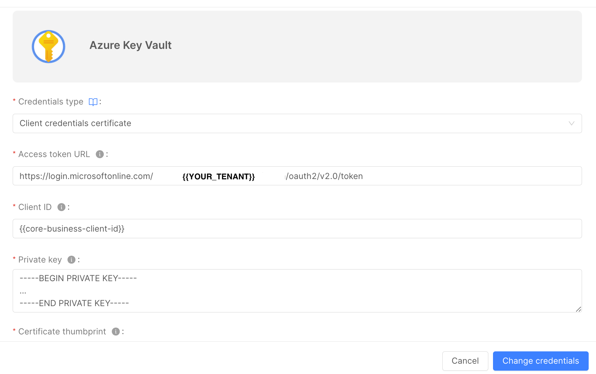
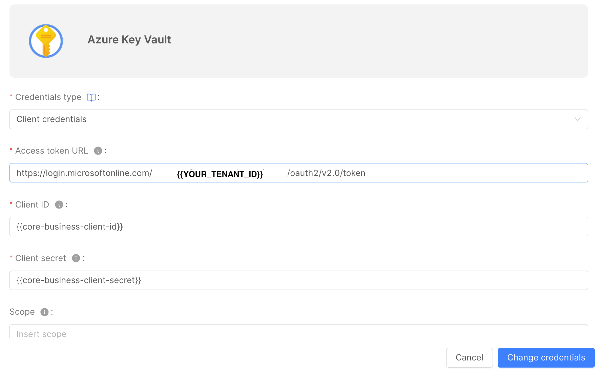
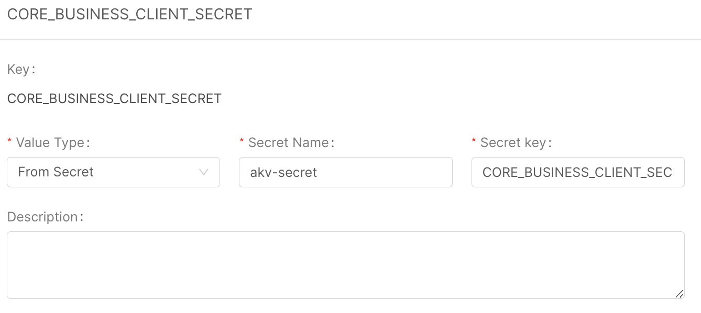

import Tabs from "@theme/Tabs";
import TabItem from "@theme/TabItem";

[Azure Key Vault](https://azure.microsoft.com/en-us/products/key-vault), serves as a valuable solution for securely storing and managing a wide range of sensitive information. This includes not only fundamental key-value pairs but also digital certificates and private keys. It ensures the continuous availability of these resources for our deployments and applications, enhancing security and accessibility.

:::warning
The current version of the Console can only acquire key-value pairs (aka secrets) from Key Vault.
:::

You can directly manage the secrets stored in Key Vault using the web interface of your Key Vault instance. The exclusive role of the Console is to retrieve the secrets keys from Key Vault and then create the respective Kubernetes configuration files to enable the external secrets operator to deploy the associated Kubernetes Secrets on the cluster.


To correctly configure a Key Vault in your project follow these steps:

1. [Install the `external-secrets` operator](https://external-secrets.io/) in the Kubernetes cluster where your project will be deployed
2. [Setup the Key Vault instance for the operator authentication](#setup-the-key-vault-instance)
3. [Setup the project to use the Azure Key Vault provider as a secret manager](#project-configuration)

## Setup the Key Vault instance

There are several ways to enable the operator authentication against the Key Vault instance, the one we support at the moment is the Workload Identity authentication. This authentication method does not require sharing any secret between the cluster and Key Vault.

### Workload Identity setup

The [Workload Identity](https://azure.github.io/azure-workload-identity/docs/) authentication works by establishing a trust relationship between a service account from the namespace of the Kubernetes cluster where your project will be deployed and the Azure Active Directory service that is responsible for the authentication and authorization against the Key Vault instance.

#### 1. Create an Azure Active Directory application

First off, you need to create an Azure application aka Service Principal. This application will be used as a conduit to Azure Key Vault and will set up all the required permissions and credentials. Follow the steps reported [here](https://learn.microsoft.com/en-us/azure/active-directory/develop/howto-create-service-principal-portal#register-an-application-with-microsoft-entra-id-and-create-a-service-principal).

#### 2. Authorize the AAD application

Once the AAD Application has been created you need to authorize it to read the secrets stored in Key Vault. This process depends on your organization's policies and the authorization method chosen, if you are using the RBAC authorization model follow [these steps](https://learn.microsoft.com/en-us/azure/key-vault/general/rbac-guide).

#### 3. Enable your cluster as an Open ID Connect provider

In this step, we are going to enable the cluster to act as an Open ID Connect provider. This step allows the verification of the token signed by the operator by Key Vault.

The actions to be performed in this step depend on the nature of your cluster:

- Managed clusters (i.e. AKS, GCP, ...) are usually easier to configure as an OIDC provider. In fact, GCP clusters usually are by default OIDC providers. While AKS clusters can be configured in [this way](https://azure.github.io/azure-workload-identity/docs/installation/managed-clusters.html).
- Self-managed clusters require a bit more work but [here](https://azure.github.io/azure-workload-identity/docs/installation/self-managed-clusters.html) there is a well-explained tutorial.

#### 4. Add the federated credentials to the application

In this last step, we are ready to associate the service account that will be automatically deployed in the cluster namespace associated to the environment of the project with the AAD Application created before.

On the Application main page, click on the `Certificates & secrets` menu voice on the left, then switch to the `Federated credential` tab and click `Add credential`, you will be prompted with a form. Inside the form fill in the `Subject identifier` field in the following way:

```
system:serviceaccount:<namespace>:akv-accessor
```

Where:

- `<namespace>` is the namespace where your project will be deployed. it depends on the environment of the project, its value can be retrieved from the [environments page](/console/project-configuration/manage-runtime-environments/index.md) in the Console.

The other fields of the form can be filled in as you wish.

This configuration can also be done from the Azure CLI program `az`, as explained [here](https://azure.github.io/azure-workload-identity/docs/topics/federated-identity-credential.html#federated-identity-credential-for-an-azure-ad-application).

## Setup the Console project

Once the Key Vault instance is configured, we are now ready to set up the Console project. The project set up can be split into three steps:

1. Azure Key Vault provider creation
2. Project configuration
3. Microservices configuration

### Azure Key Vault provider

In order to connect to the Azure Key Vault instance you have to create a provider. In the provider creation modal, select the `Azure Key Vault` type when prompted, then fill the fields as described in the [providers management page](/console/company-configuration/providers/configure-provider.mdx#connect-a-provider)

:::warning
Please notice that each provider is linked to an Azure Key Vault store, we advice to setup at least two providers for each project, one for production data and another for noprod data, each associated with the respective environment of the project.
:::

### Project configuration

Connect the provider to the project or environment through the CMS. Retrieve the previously generated provider's `_id` (you can find it inside the `Providers` section of the CMS) and use it to modify the `Environments variables` section in the CMS as follows:

```json
{
  "type": "azure-key-vault",
  "providerId": <providerId>,
  "azureClientId": <azureClientId>,
  "azureTenantId": <azureTenantId>,
  "serviceAccountName": <serviceAccountName>,
}
```

Where:

- `<providerId>` (**required**) is the `_id` of the provider created before
- `<azureClientId>` (**required**) is the client id of the Azure Active Directory application that will fetch the secrets from the cluster
- `<azureTenantId>` (**required**) the tenant identifier for your company on Azure
- `<serviceAccountName>` an optional name for the service account to use in the authentication process. Defaults to `akv-accessor`

:::warning
If `serviceAccountName` is defined the Console will not deploy the service account automatically but is your responsibility to provision it.
:::

You also have the option to distinguish between providers for specific environments. This enables you to establish various Azure Key Vault providers for different environments. To achieve this, you need to create an `environmentsVariables` object with the same structure as the one demonstrated above within the target environment object found in the `Environments` section of the project's page in the CMS. Any environment that doesn't specify its own `environmentsVariables` configuration will automatically inherit it from the project.

### Use Azure Key Vault secrets inside the Console

Secrets stored within an Azure Key Vault provider cannot be directly utilized as interpolations in the project's configuration. However, you can access these variables by creating a new microservice environment variable with the value type set to `from secret` linking a secret with name `akv-secret` and the secret key specified as the desired secret name. Detailed instructions for this process can be found in the [microservice configuration section](/development_suite/api-console/api-design/services.md#environment-variable-configuration).

By design, the `akv-secret` in the cluster is not automatically synchronized with its corresponding secrets on Azure Key Vault. Instead, when a new variable is added or removed in Key Vault, it is necessary to regenerate the Design configuration of the project to properly reconfigure the Kubernetes secret. Conversely, if a variable is edited, a new deploy of the target environment is required to update the variables on the cluster.

## Examples - AKV Integration on a GKE cluster

This example guides you, step by step, configuring AKV in your Company, linked to a _Google Kubernetes Engine_ cluster.
The starting environment of this example is a green field, neither the External Secret Operator has been installed.

### 1. Installing the External Secrets Operator

The first step in order to let your AKV integration work is to install the [External Secret Operator](https://external-secrets.io/latest/).

In this example we will use [_Helm_](https://helm.sh/) to install it, but you can find the complete installation guide at [this page](https://external-secrets.io/latest/introduction/getting-started/).

:::warning
Before installing the External Secret Operator, be sure to **be connected to the right k8s cluster**.
:::

With the following simple commands you can install the External Secret Operator:

```bash
helm repo add external-secrets https://charts.external-secrets.io

helm install external-secrets \
   external-secrets/external-secrets \
    -n external-secrets \
    --create-namespace
```

The commands above will install the External Secret Operator in a dedicated namespace, automatically created by _Helm_ during the installation process.
After the installation is complete, you should have 3 services up and running inside the `external-secrets` namespace:

```bash
$ kubectl get pods
NAME                                                         READY   STATUS    RESTARTS   AGE
external-secrets-operator-5db95c68b8-nn27p                   1/1     Running   0          6d
external-secrets-operator-cert-controller-568bd5d5cc-258j2   1/1     Running   0          6d
external-secrets-operator-webhook-85695d9f88-7mxbp           1/1     Running   0          6d
```

### 2. Azure setup

Azure needs different operations to let you complete the integration with the Mia-Platform Console and the External Secret Operator:
1. Create an Azure App Registration (aka _Service Principal_);
2. Create the _Service Principal_ credentials or certificate, to allow the login using it;
3. Add the "Federated Credentials" to the _Service Principal_, in order to let AKV authenticate with it through the k8s Cluster;
4. Authorize the _Service Principal_ reading data from the Azure Key Vault you need to access.

:::info
In this example we used the _Azure Portal_ to perform the operations above. If you prefer you can use the `az` client or the Azure REST APIs too.
:::

#### 1. Create the Service Principal

You have different ways to create a Service Principal. Following you will find two ways:
* **Azure Client** &rarr; using the `az` cli you can create it directly from your terminal. **This is the preferred way**;
* **Azure Portal** &rarr; using the Azure Portal UI directly.

<Tabs
  defaultValue="azure-client-service-principal-creation"
  groupId="service-principal-creation"
  values={[
      { label: 'Azure Client', value: "azure-client-service-principal-creation", },
      { label: 'Azure Portal', value: "azure-portal-service-principal-creation", },
  ]}
>

<TabItem value="azure-client-service-principal-creation">

To create the service principal through the `az` client follow these instructions.

1. Login on azure with the method you prefer:
  ```bash
  az login --tenant {{TENANT_ID}}
  ```

2. Set the subscription where you want to create the service principal:
  ```bash
  az account set --subscription {{SUBSCRIPTION_ID}}
  ```

3. Create the service principal. In this example, we will create a Service Principal that can authenticate itself with a "Client Credentials" authentication:
  ```bash
  az ad sp create-for-rbac --name {{SERVICE_PRINCIPAL_NAME}}
  ```

4. Save the result of the previous command, that will be similar to the following one:
  ```json
  {
    "appId": "{{SERVICE_PRINCIPAL_CLIENT_ID_GENERATED_BY_AZURE}}",
    "displayName": "{{SERVICE_PRINCIPAL_NAME}}",
    "password": "{{SERVICE_PRINCIPAL_CLIENT_SECRET}}",
    "tenant": "{{TENANT_ID}}"
  }
  ```

The information that you will use for the authentication are:
* **appId** &rarr; the username, or clientId;
* **password** &rarr; the password, or clientSecret.


</TabItem>

<TabItem value="azure-portal-service-principal-creation">

:::warning
The following instructions highly depends on the Azure Portal and could be changed in future.
:::

To create the Service Principal through the Azure Portal you just need to:
* open the Azure Portal _App Registrations_ page on your browser (usually the page is at [this link](https://portal.azure.com/#view/Microsoft_AAD_RegisteredApps/ApplicationsListBlade), but it can be different based on your Azure subscription);
* click on the "New registration" button;
* insert the name you prefer;
* select the account types &rarr; usually the "Accounts in this organizational directory only" is the used option;
* leave the "Redirect URI" empty;
* click on the "Register" button.



:::info
**Save the `clientId` generated by Azure**, the `Application (client) ID` field content, because you will need it later.
:::

</TabItem>

</Tabs>

#### 2. Create the Service Principal credentials or certificate

:::info
If you created the service principal through the `az client` and you already have its credentials, you can [go on with the next section](#3-add-the-federated-credentials).
:::

In order to authenticate using the Service Principal you just created, you need to create credentials or certificate:
* **client credentials**: with Client Credentials approach you will get a Bearer Token calling the Azure `/oauth` API using a `clientId` and a `clientSecret`;
* **client credentials certificate**: with the Certificate approach you will generate a private-public certificates pair and you will get a Bearer Token calling the Azure `/oauth` API without exchanging credentials, so **it's a more safer way**.

Read more on the [official Microsoft documentation](https://learn.microsoft.com/en-us/entra/identity-platform/howto-create-service-principal-portal#set-up-authentication).

In order to create the credentials or certificate to authenticate with Azure, once you created your app registration, follow these steps:

<Tabs
  defaultValue="client-credentials-certificate"
  groupId="service-principal-client-authentication"
  values={[
      { label: 'Client Credentials Certificate', value: "client-credentials-certificate", },
      { label: 'Client Credentials', value: "client-credentials", },
  ]}
>

<TabItem value="client-credentials-certificate">

First of all, you need to generate a certificate with its private key.
The suggested way is to generate a certificate **signed by a trusted certificate authority**.

Otherwise, **for testing purpose only**, you can also generate a self-signed certificate.

Following an example on how to generate a self-signed certificate valid for 1 year with openssl, **just for test purposes**:
```bash
# Interactive command, that will ask you for certificate data
openssl req -x509 -newkey rsa:4096 -keyout private-key-encrypted.pem -out certificate.pem -sha256 -days 365

# Now you should have a certificate and a private key, both in PEM format
ls -l
total 40
-rw-r--r--  1 nb196  staff  2094 Aug  1 18:26 certificate.pem
-rw-------  1 nb196  staff  3422 Aug  1 18:25 private-key-encrypted.pem

# Now you need to decrypt the private key with the following command, using the passphrase you typed with the previous openssl command
openssl rsa -in private-key-encrypted.pem -out private-key-decrypted.pem

ls -l
total 48
-rw-r--r--  1 nb196  staff  2094 Aug  1 18:26 certificate.pem
-rw-------  1 nb196  staff  3272 Aug  1 18:28 private-key-decrypted.pem
-rw-------  1 nb196  staff  3422 Aug  1 18:25 private-key-encrypted.pem
```

Read more on the [official Microsoft documentation](https://learn.microsoft.com/en-us/entra/identity-platform/howto-create-service-principal-portal#set-up-authentication).

After generatign the certificates pair:
* access your App page;
* on the menu on the left, click on "Manage" &rarr; "Certificates & secrets";
* select the "Certificate" tab;
* click on the "Upload certificate" button;
* upload the **certificate**, in one of the supported formats (in the example below, you should upload the `certificate.pem` file);
* _(recommended)_ give the certificate a description.

:::info
**Save the `Thumbprint` generated by Azure**, because you will need it later.
:::

:::warning
Remember to store the certificate, the private-key and the thumbprint **in a secure store**.
:::

</TabItem>

<TabItem value="client-credentials">

* access your App page;
* on the menu on the left, click on "Manage" &rarr; "Certificates & secrets";
* select the "Client secrets" tab;
* click on the "New client secret" button;
* set an expiration date;
* _(recommended)_ give the certificate a description.

Azure will generate a "`clientId` - `clientSecret`" pair that you can use to authenticate.

:::info
**Save the secret value generated by Azure**, because you will need it later.
:::

:::warning
Remember to copy the generated `clientId` and `clientSecret`. If you lose the `clientSecret` value you will not be able to get it anymore and you will need to create a new one.

Remember to store the "`clientId` - `clientSecret`" pair **in a secure store**.
:::

</TabItem>

</Tabs>

#### 3. Add the Federated Credentials

The "Federated Credentials" are needed to let your kubernetes cluster, and the External Secret Operator, able to authenticate with Azure using the Service Principal you previously created.

Before doing the steps below, you need to get the URL of the cluster issuer, that depends on the Cluster you are using.
This example is based on a Google Kubernetes Engine cluster, that is enabled as Open ID Connect provider by default.

The "Cluster issuer URL", that you will need to setup the "Federated Credentials", is dynamic and depends on your GKE cluster.
The URL format is the following one:
> https://container.googleapis.com/v1/projects/{{gcpProjectId}}/locations/{{location}}/clusters/{{clusterId}}

**Remember to change** the `{{gcpProjectId}}`, the `{{location}}` and the `{{clusterId}}` placeholders with the real values.

You will need to add a "Federated Credential" **for each runtime environment" you have on your project.
To do that:
* access your App page;
* on the menu on the left, click on "Manage" &rarr; "Certificates & secrets";
* select the "Federated credentials" tab;
* **for each runtime environment**:
  * click on the "Add credential" button;
  * select the "Kubernetes accessing Azure resources" scenario;
  * insert the "cluster issuer URL" you got before;
  * insert the k8s namespace;
  * insert the k8s service account name. The default one is `akv-accessor`;
  * give the Federated credential a name;
  * _(recommended)_ give the Federated credential a description;
  * leave the default "Audience";
  * click on the "Add" button.



#### 4. Authorize the Service Principal accessing the Azure Key Vault

To do that, you just need to modify the access settings of the Azure Key Vaults you want the Service Principal access to.

**For each AKV you want to access**:
* access the AKV page;
* on the menu on the left, click on "Access control (IAM)";
* click on the "Role assignments" tab;
* click on the "Add" &rarr; "Add role assignment" button;
* select the "Key Vault Secrets User" role, then press the "Next" button &rarr; with this role, you will only be able **to read secret values**, not write;
* select "Assign access to User, group, or service principal" then press on the "+Select members" button;
* look for the Service Principal using its name.

:::warning
For the last step, only privileged users will be able to search for app registration. If you didn't find the Service Principal, probably you don't have enough permissions on the Azure Key Vault instance.
:::



### 3. Console setup

In order to connect to the Azure Key Vault instance you have to create a provider.
In the provider creation modal, select the Azure Key Vault type when prompted, then fill the fields as described in the [providers management page](/console/company-configuration/providers/configure-provider.mdx#connect-a-provider).

Usually the AKV base URL has the following format:
> `https://{{akv-id}}.vault.azure.net/`

Anyway, you can get it accessing the AKV "Overview" page, Azure will show you it:


Based on the Service Principal authorization access you setup [above](#2-create-the-service-principal-credentials-or-certificate), you must choose the right authentication when configuring the AKV provider on the console.

<Tabs
  defaultValue="client-credentials-certificate"
  groupId="provider-client-authentication"
  values={[
      { label: 'Client Credentials Certificate', value: "client-credentials-certificate", },
      { label: 'Client Credentials', value: "client-credentials", },
  ]}
>

<TabItem value="client-credentials-certificate">



Insert the following information:
* **Access Token URL**: the Azure URL the Console will call to get the token. It has the following format:
> `https://login.microsoftonline.com/{tenant-id}/oauth2/v2.0/token`

* **Client ID**: the ID of the Service Principal you created [above](#1-create-the-service-principal). You can find it in the "Overview" page of the App Registration on the Azure Portal;

* **Private Key**: the private key in PEM format. In the example above, it should be the content of the `private-key-decrypted.pem` file;

* **Certificate Thumbprint**: a thumbprint generated by Azure when you added the Certificate inside the Service Principal;

* **Scope**: the Bearer Token scope. To interact with AKV, **it must be the following one**:
> `https://vault.azure.net/.default`

</TabItem>

<TabItem value="client-credentials">



Insert the following information:
* **Access Token URL**: the Azure URL the Console will call to get the token. It has the following format:
> `https://login.microsoftonline.com/{tenant-id}/oauth2/v2.0/token`

* **Client ID**: the ID of the Service Principal you created [above](#1-create-the-service-principal). You can find it in the "Overview" page of the App Registration on the Azure Portal;

* **Client secret**: the secret generated by Azure when you created the "Client Credentials" on the App Registration;

* **Scope**: the Bearer Token scope. To interact with AKV, **it must be the following one**:
> `https://vault.azure.net/.default`

</TabItem>

</Tabs>

Now that you created the AKV provider, you need to setup the projects you want to use it on.
To do that, you need to modify the project configurations on the Console CMS.

If you want to use a single AKV for all your runtime environments, you can just modify the `Environments variables` JSON, inserting the following information, as [reported above](#project-configuration):
```json
{
  "type": "azure-key-vault",
  "providerId": <providerId>,
  "azureClientId": <azureClientId>,
  "azureTenantId": <azureTenantId>,
  "serviceAccountName": <serviceAccountName>,
}
```

In this example we integrated the Console with just one AKV, but you can also setup different AKV for each runtime environment, as [reported above](#project-configuration).

#### Secrets usage

To use the secrets from the AKV, you just need to referencing it from a microservice on the Console.
Let's use "Core Business" as name of the project you want to use the AKV secrets.

* open the "Core Business" project design page;
* select the microservice you need to the secrets;
* select the tab "Environment Variables";
* create a new one;
* insert the key you want for your environment variable;
* select "from secret" as a value type;
* insert `akv-secret` as a secret name;
* insert the secret key, that **must be the same of the secret on AKV**.



Now if you save, the console will generate the files needed by the External Secret Operator in order to generate the `akv-secret` k8s Secret, containing the AKV secrets.
Deploying your project, if the setup process went well, you should find the following resources on the k8s namespace of your project:

```bash
$ kubectl get externalsecret
NAME                  STORE       REFRESH INTERVAL   STATUS         READY
akv-external-secret   akv-store   0                  SecretSynced   True

$ kubectl get secretstore
NAME        AGE    STATUS   CAPABILITIES   READY
akv-store   6d     Valid    Read           True

$ kubectl get sa
NAME           SECRETS   AGE
akv-accessor   0         6d

$ kubectl get secret
NAME                                                  TYPE                             DATA   AGE
akv-secret                                            Opaque                           1      6d
```


