Once you have created your Project, you can visualize and change its settings through the "Settings" section of the Console, within the "Project Overview" area.
The settings are grouped by subject area through dedicated tabs, as explained below.

## General

The "General" tab shows some general information about the Project, through a single card called "Project information".

### Project information

This card presents a summary in which the **name** and **description** given to the Project are displayed, along with the following information:
- **Project Owner**: Project owner information (typically, name and surname);
- **Team Contact**: contact information associated with the Project (typically, the Project owner's email);
- **Color (Hex)**: color of the top bar of the Project-related card on the homepage (in hexadecimal format);
- **Technologies**: tags specifying the different technologies and programming languages used within the Project.
- **Default Revision**: the default revision of the project. If it is not specified the Console uses `main` as default value, that will correspond to an empty configuration if no other `main` branch was previously created on the Project.

:::info
The `Default Revision` setting is only available on Projects with the [Enhanced Workflow](/development_suite/set-up-infrastructure/overview.md) enabled.
:::

The above information can be edited by clicking on the "Edit" button, which will open the modal below. It will then be sufficient to edit the fields to be updated and click the "Save changes" button to implement the change.

  

  

## Providers

The "Providers" tab shows information pertaining to the providers (Git Provider, Secret Manager, and CI/CD Tool) configured for the Project, through a single homonymous card.

This card presents an overview of which Git Provider, Secret Manager, and CI/CD Tool are configured for the Project, displaying their icon and name. The following information is also displayed:
- *Configuration Path Repository*
  * **Path**: path to the repository containing the Console configuration information.
- *Secret Manager Storage* (only if the Secret Manager is GitLab)
  * **Type**: type of Secret Manager, used to define where to find environment variables;
  * **Path**: path to the repository containing the Secret Manager configuration information.

## Workload & Runtime

The "Workload & Runtime" tab shows information about the Project workload and runtime settings through 5 cards: "Microservices", "Image Pull Secrets", "Deployment options", "Runtime", and "Security Features".

### Microservices

This card shows and gives the user the ability to change some settings related to the creation of microservices within the Project. Specifically:
- **Suggestion for Docker image**: defines the format of the Docker image name suggestion. It is one of `REPOSITORY`, `PROJECT_ID`, `CONSTANT_PREFIX` (the default is `PROJECT_ID`);
- **Prefix** (only if type is `CONSTANT_PREFIX`): defines the prefix that will appear in the suggestion for the Docker image name.

The above information can be edited by clicking on the "Edit" button, which will open a modal very similar to that seen for Project information. Upon clicking "Save changes", the information will be updated.

### Image Pull Secrets

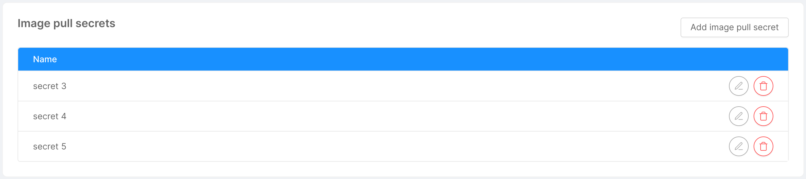

:::note
An imagePullSecret is a Kubernetes entity used to authenticate and authorize access to private container image registries. 
:::

:::caution

This section is deprecated, it is recommended to use manage the container registries through the [dedicated settings](#container-registries).

:::

This card shows the user, in the form of a table, the list of names that will be used in deployment and cronjob files for pulling Docker images. The user has the option of adding new names through the "Add Image Pull Secret" button, which will open a simple modal asking for the secret name. Similarly, a secret can be edited and deleted using the appropriate icons at the respective row in the table.

### Deployment options

This card allows users to manage some options regarding Project deployment.

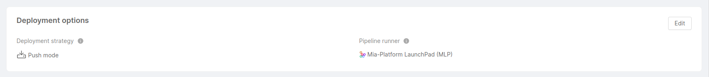

- **Deployment strategy**: specifies whether the Project deployment follows a [GitOps-based approach](/development_suite/deploy/gitops-based/index.md) or a [pipeline-based approach](/development_suite/deploy/pipeline-based/index.md).

  :::info
  The choice of the deployment strategy is only available on Projects with the [Enhanced Workflow](/development_suite/set-up-infrastructure/overview.md) enabled. Standard Projects only support a pipeline-based deployment strategy.
  :::
  
    - In **Pull mode**, through a GitOps tool connection, Project configurations saved on the Git repository are always consistent with the Project’s Runtime configurations

    - In **Push mode**, updates and changes to applications or configurations are initiated and directly pushed from a CI/CD pipeline to the target environment

- **Pipeline runner**: specifies the command line deployment tool used by the Project. This option is not available for Projects that adopt a "Pull" deployment strategy, where no pipeline runner is needed. The chosen tool can either be [Mia-Platform LaunchPad (MLP)](https://github.com/mia-platform/mlp), or another custom tool. 

The above information can be edited by clicking on the "Edit" button, which will open a modal where you can modify the Project deployment strategy and pipeline runner. Upon clicking "Save changes", the information will be updated.

  

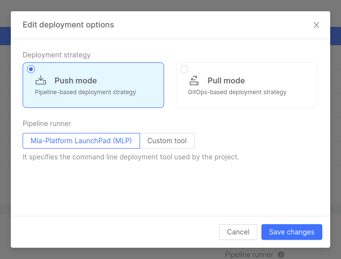

  

### Runtime

This card gives the user the ability to view and change some runtime settings. 

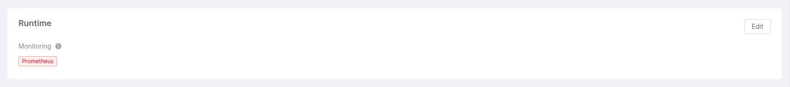

Specifically, the **Monitoring** configuration lets you choose between the different supported monitoring systems to gather metrics from your [Project microservices](/development_suite/api-console/api-design/microservice-monitoring.md).

:::info
[Prometheus Operator](https://github.com/prometheus-operator/prometheus-operator/blob/master/README.md#prometheus-operator) is currently the only supported monitoring system.
When using the Monitoring configuration tab in the Design section, the Console is responsible for defining and provisioning `ServiceMonitor` and `PodMonitor` based on your microservices configuration.

`ServiceMonitor` and `PodMonitor` are specific [Kubernetes Custom Resources](https://kubernetes.io/docs/tasks/extend-kubernetes/custom-resources/custom-resource-definitions),
defined by the Prometheus Operator, that help configuring [Prometheus scraping mechanism](https://prometheus.io/docs/prometheus/latest/configuration/configuration/).
:::

### Security features

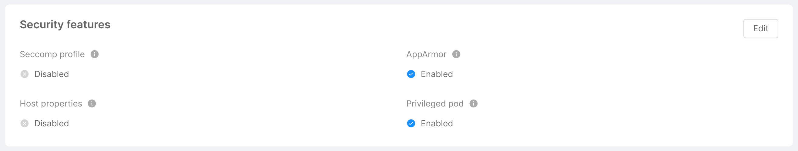

This card shows and gives the user the ability to change some security features, provided as pod annotations, pod specs and Security Context. Specifically:
- **Seccomp Profile**: if enabled, it enables the `seccompProfile` attribute of the `securityContext` object in order to restrict a Container's syscall. This feature is available as of Kubernetes v1.19 and you can learn more by taking a look at the [official Kubernetes documentation](https://kubernetes.io/docs/tutorials/security/seccomp/).
- **AppArmor**: it is a Linux Security Module that, if enabled, implements Mandatory Access Control since [Kubernetes v1.4](https://kubernetes.io/docs/tutorials/security/apparmor/). AppArmor annotations set up a profile used by containerd to harden containerized applications to contrain exploitation. The template for such profile is available [on GitHub](https://github.com/moby/moby/blob/master/profiles/apparmor/template.go).
- **Host Properties**: if enabled, it sets to `false` the following parameters, which could be used to allow access to shared information and elevate privileges:
  * `hostPID`: controls whether containers can share host process namespaces;
  * `hostIPC`: enables to read the shared memory between processes that communicate with IPC mechanisms;
  * `hostNetwork`: controls whether containers can use the host network and allows to bypass network policies.

  These fields are described in the [Pod Security Policies section of the official Kubernetes documentation](https://kubernetes.io/docs/concepts/security/pod-security-policy/).
- **Privileged Pod**: if enabled, it configures the following attributes in a `securityContext` object:
  * `allowPrivilegeEscalation`: controls whether a process can gain more privileges than its parent process, by default is set to true when the `CAP_SYS_ADMIN` capability is enabled or is run as privileged;
  * `privileged`: controls whether the Pod can run privileged containers.

  You can learn more about the `securityContext` object by taking a look at the [official Kubernetes documentation](https://kubernetes.io/docs/tasks/configure-pod-container/security-context/).

The above information can be edited by clicking on the "Edit" button, which will open the modal below, through which you can turn on/off the security features. Upon clicking "Save changes", the information will be updated.

  

  

## Rules

The "Rules" tab allows the user to customize rules defined for the Project.

### Saving options

This set of rules allows users to configure the Project **saving options**, which define settings and constraints relative to the saving process, such as the mandatory confirmation of the commit message before saving the Project configuration.

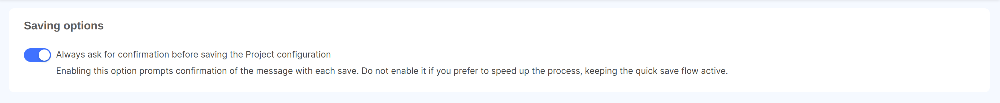

:::tip  
If you are a Company Owner and want to enable this setting for all Projects in your Company, you can do it from the [Company settings page](/console/company-configuration/settings.md#rules).
:::

## Feature Preview

The "Feature Preview" tab allows the user to visualize and activate features in early access on the specific Project, through a single card called "Feature Preview for your Project".

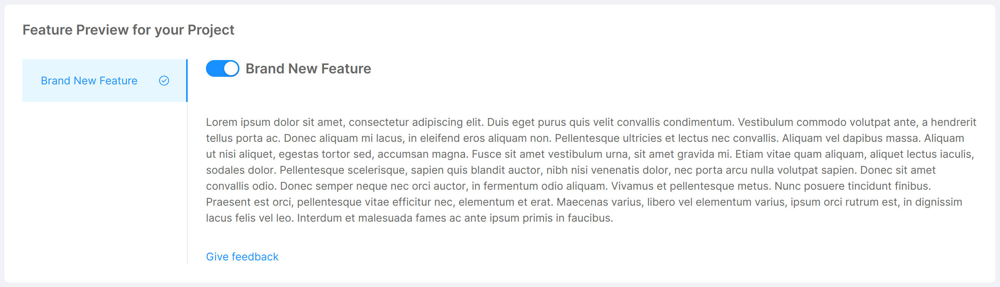

This card presents an overview of the features in early access that can be activated for the Project. For each feature, an illustrative image and description are shown, and to turn it on/off it is sufficient to toggle the corresponding switch. Additional feature information can be accessed through the "View Documentation" button located at the bottom of the feature description.

## Container Registries

The container registries section allows you to manage the container registries you can use to store the Docker images of [Templates](/marketplace/templates/mia_templates.md) and [Examples](/marketplace/examples/mia_examples.md) created from the Marketplace.

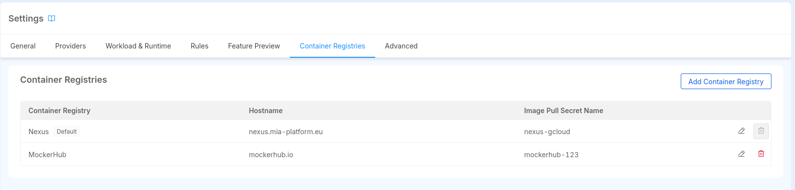

The Project is created with a predefined set of container registries, as configured in the [Project Blueprint section](/console/company-configuration/project-blueprint.md).

This section allows you to view, add, edit, and delete container registries.

You can add a new container registry by clicking on the "Add Container Registry" button. This will open a modal where you can insert the required information to add a new container registry:

- **Name**: the name of the container registry. You can choose any name you prefer. It is used to identify the container registry in the Console, therefore it is unique within the Project.
- **Registry Hostame**: the hostname of the container registry. It refers to the container registry URL, for example, `docker.io` for Docker Hub. Multiple container registries can have the same hostname, since they might have different credentials. It cannot be changed once the Container Registry is created.
- **Image Pull Secret Name**: the name of the Image Pull Secret that will be used by Kubernetes to pull images from the container registry. Notice that the Secret must be present in the Kubernetes cluster where the Project is deployed, the Console won't create it for you.
- **Default Registry**: if enabled, the container registry will be set as the default one for the Project, meaning it will be the default selected when creating a new service from a Template or Example. Notice that if the Project has only one container registry, it will be set as the default one automatically.

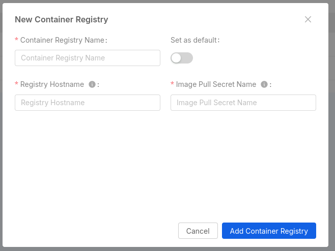

Through the dedicated buttons on the right of each row, you can edit or delete the container registry.

:::info

If a Project has not been configured with any container registry, the Docker Image field of the Templates and Examples will allow you to insert the Docker image directly, 
behaving like before the introduction of the container registries feature.

:::

### How Image Pull Secret are configured to Kubernetes

When creating Kubernetes manifests of the Project service deployments, the Console will create and insert an array of `imagePullSecrets` in the `spec` section of the `Deployment` 
This array contains all the names of the Image Pull Secrets configured in the Console, along with the Image Pull Secrets configured in the Container Registries section.

The configuration applies to all the Microservices and CronJobs of the Project.

## Advanced

The "Advanced" tab allows the user to visualize advanced information and perform sensitive operations.

### Enhanced Workflow

If the Project has not been configured to use the [Enhanced Project Workflow](/development_suite/set-up-infrastructure/overview.md), users will see a card that illustrates the required steps to perform the migration.

 

 There are some necessary [manual adjustments](/development_suite/set-up-infrastructure/overview.md#migrating-your-projects) to be made to ensure everything works fine after the migration is completed. The user will be asked to confirm that all steps have been addressed before continuing. 

  

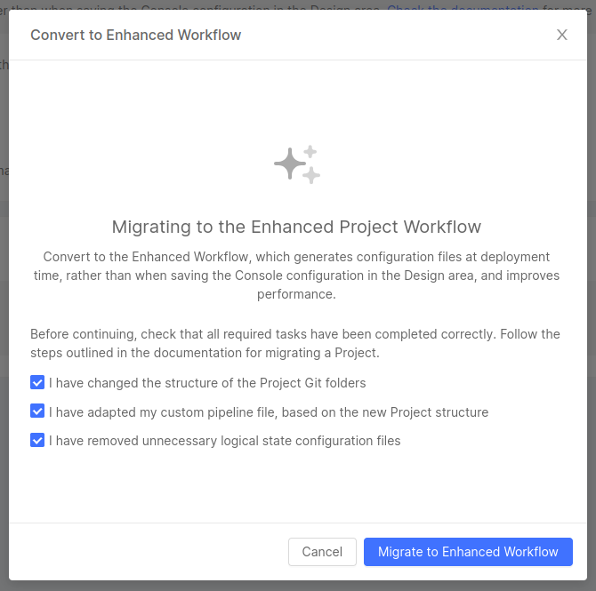

  

 Once the migration is complete, users can start working with the Enhanced Workflow.

### Advanced actions

The only action that can be taken at the moment is to delete the Project itself. You can find a detailed description of the deletion flow [here](/console/project-configuration/delete-a-project.md).

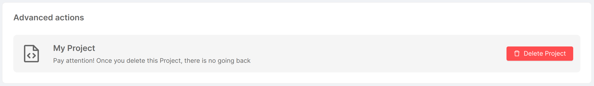