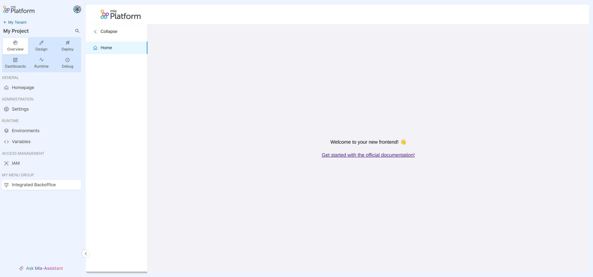

# Create your extension

Following this tutorial you will learn how to add the Backoffice as an extension within a Project, in order to consult it directly from the Console.

## Prerequisites

This guide requires that you have:

- A Company on which you are Company Owner. Its identifier should be used each time there is the `my-tenant-id` occurrence.
- The Company has a project reachable externally, otherwise create one by referring to this [guide](/console/project-configuration/create-a-project.mdx).
- The `Microfrontend Composer Toolkit` application created and exposed to view the Backoffice frontend. Follow this section of the [guide](/microfrontend-composer/tutorials/basics.mdx#setup-the-microservices) to do so.
- The response from the Backoffice endpoint can be embedded within an iframe. See this [link](/development_suite/api-console/api-design/endpoints.md#manage-advanced-endpoint-parameters) for more information.
- Miactl tool installed consulting the guide on this [link](/cli/miactl/20_setup.md)


## 1. Register Backoffice Extension

Once that all requisites are satisfied, you can register the Backoffice as an extension using the following command:

```sh
miactl extensions apply --endpoint https://<my-console-domain>/ --company-id my-tenant-id -f ./<relative-path>/my-extension.json
```

where in the file `my-extension.json` there are the info to register:

```json
{
  "name": "Integrated Backoffice",
  "description": "Extension to integrate Backoffice on Console",
  "entry": "https://<my-domain>/mfe-application/home",
  "type": "iframe",
  "destination": {
    "id": "project",
    "path": "/backoffice"
  },
  "activationContexts": [
    "project"
  ],
  "iconName": "PiProjectorScreenChartLight",
  "menu": {
    "id": "backoffice-route",
    "labelIntl": {
      "en": "Integrated Backoffice",
      "it": "Backoffice integrato"
    }
  },
  "category": {
    "id": "my-menu-group",
    "labelIntl": {
      "en": "My Menu Group",
      "it": "Il mio gruppo menu"
    }
  }
}
```

:::tip
You can limit extension visibility based on Console User Capabilities; for instance, if you want to show your extension only to users who can deploy a project, you can configure the `permissions` key defined in this way:

```js
{
  "permissions": ["console.company.project.environment.deploy.trigger"]
}
```

You can find out available capabilities in the [Identity and access management page](/development_suite/identity-and-access-management/console-levels-and-permission-management.md#identity-capabilities-inside-console).
:::

:::info
These registered routes are rendered as a menu item with label `Integrated Backoffice` that is attached to a `category` menu group with label `My menu group`. If you do not want to create new menu group, you can 
- define the `category.id` value using an [existing menu groups](/console/console-extensibility/locations.md) corresponding to the chosen location applied as `destination.id` (e.g. `runtime` for the project location). In this case the `category.labelIntl` and `category.order` should be undefined.
- not define the `category` field, so that the menu item will not be attached on any menu group 
:::


**Response on success**
```markdown
Successfully applied extension with id `my-extension-id`
```

### Edit the registered extension

If you need to correct or modify your newly registered extension, you can do so using the same miactl command and specifing the extension ID with the proper flag:

```sh
miactl extensions apply --endpoint https://<my-console-domain>/ --company-id my-tenant-id -f ./<relative-path>/my-extension.json --extension-id my-extension-id 
```


  See the complete example

The `my-extension.json` file should always contains all the extension info, both those to edit and both those that are already registered:

```json
{
  "name": "Integrated Backoffice",
  "description": "Extension to integrate Backoffice on Console",
  "entry": "https://<my-domain>/mfe-application/home",
  "type": "iframe",
  "destination": {
    "id": "project",
    "path": "/backoffice"
  },
  "activationContexts": [
    "project"
  ],
  "iconName": "PiProjectorScreenChartLight",
  "menu": {
    "id": "backoffice-route,",
    "labelIntl": {
      "en": "Edited Integrated Backoffice",
      "it": "Backoffice Integrato Modificato"
    }
  },
  "category": {
    "id": "my-menu-group,",
    "labelIntl": {
      "en": "My Menu Group",
      "it": "Il mio gruppo menu"
    }
  }
}
```

**Response on success**: 
```markdown
Successfully applied extension with id `my-extension-id`
```

In this example, the `labelIntl` of the menu item has been modified.


## 2. Check that the new extension is registered

You can use the `list` and `get` commands to verify that the registration is done correctly:

**List command**
```sh
miactl extensions list --endpoint https://<my-console-domain>/ --company-id my-tenant-id
```

**Get command**
```sh
miactl extensions get --endpoint https://<my-console-domain>/ --company-id my-tenant-id --extension-id my-extension-id
```

where the `list` command returns all the registered extensions on the company `my-tenant-id`, instead the `get` command returns only the requested extension with all its info.

## 3. Activate the extension

After registering you can proceed with its activation on a project using the `activate` command:

```sh
miactl extensions activate --endpoint https://<my-console-domain>/ --company-id my-tenant-id --project-id my-project-id --extension-id my-extension-id
```

**Response on success**
```markdown
Successfully activated extension `my-extension-id` for project: `my-project-id`
```

:::info
The extension can be activated on any projects inside the Company `my-tenant-id` changing the project ID in the miactl context.
:::

## 4. Enjoy the final result

Once that the new extension is correctly registered and activated, the final result should be similar to this:



## 5. Deactivate the Backoffice extension

To restore the initial state of the Console, you can deactivate the new extension using the `deactivate` command:

```sh
miactl extensions deactivate --endpoint https://<my-console-domain>/ --company-id my-tenant-id --project-id my-project-id --extension-id my-extension-id
```

**Response on success**
```markdown
Successfully deactivated extension `my-extension-id` for project: `my-project-id`
```

Now, the extension should no longer be visible in the Console.

## 6. Remove definitely the Backoffice extension

To perform a complete cleanup and remove the newly registered extension, you can use the `delete` command:

```sh
miactl extensions delete --endpoint https://<my-console-domain>/ --company-id my-tenant-id --extension-id my-extension-id
```

**Response on success**
```markdown
Successfully deleted extension from Company
```

You can repeat [step 2](#2-check-that-the-new-extension-is-registered) to verify that the extension has been successfully removed.
