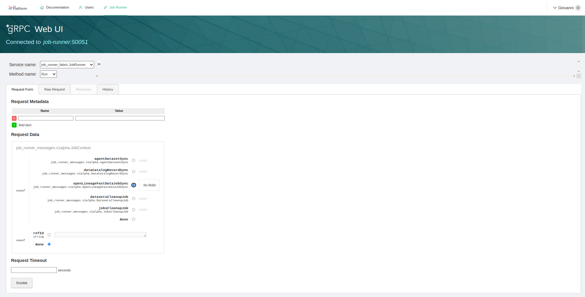

import jobsSchema from "@site/static/schemas/data_fabric/data-catalog-job-runner-jobs.config.schema.json"
import runnerSchema from "@site/static/schemas/data_fabric/data-catalog-job-runner.config.schema.json"
import secretsSchema from "@site/static/schemas/data_fabric/data-catalog-job-runner-secret-names.config.schema.json"
import Tabs from '@theme/Tabs';
import TabItem from '@theme/TabItem';
import SchemaViewer from "./../fast_data/snippets/schema_viewer.mdx"
import bffSchema from "@site/static/schemas/data_fabric/data-catalog-fabric-bff.config.schema.json"

Data Catalog _Job Runner_ can trigger the execution of different jobs that can update the state of the Data Catalog solution. 

The service keeps an internal queue where different requests sent by the Data Catalog UI are processed and executed, while collecting feedback
that can be sent back to clients that need to obtain information about the status of the current jobs that are running.

## Available Jobs

Here are listed the main jobs that the service can execute. 

### Agent Dataset Scan

_Agent Dataset Scan_ is a procedure that queries datasources for the data schemas of the resources they own and stores them into the Data Catalog
as documents compliant to the [Open Lineage specification](https://openlineage.io/). The job provides facilities to:

1. query tables schemas;
2. aggregate them in a unique JSON format;
3. store the resulting datasets into the MongoDb database of the Data Catalog application.

This job can be triggered by configuring a __Connection__ from [its section in the Data Catalog UI](/data_catalog/frontend/data_catalog_connections.mdx).

#### Odbc Connections

In the context of databases, it requires [Open Database Connectivity (ODBC)](https://en.wikipedia.org/wiki/Open_Database_Connectivity) drivers to connect to external DBMS.
The service comes already equipped with the following ODBC drivers:

- `ODBC Driver 18 for SQL Server`,
- `MySQL ODBC 9.1 Unicode Driver`,
- `MySQL ODBC 9.1 ANSI Driver`,
- `MySQL ODBC 8.0 Unicode Driver`,
- `MySQL ODBC 8.0 ANSI Driver`,
- `PostgreSQL ANSI`,
- `PostgreSQL Unicode`,
- `Oracle 23 ODBC driver`,
- `Saphana HDBODBC`

### Data Catalog Sync

_Data Catalog Sync_ is a procedure that is automatically scheduled after an [_Agent Dataset Scan_](#agent-dataset-scan) job: 
its duty is to align the datasets retrieved previously by the Agent and convert theminto assets that can be managed by the Data Catalog application.

### Connection Cleanup

_Connection Cleanup_ is a set of procedures that are launched automatically when a user [deletes a connection from the Data Catalog UI](/data_catalog/frontend/data_catalog_connections.mdx#delete-connection). 
These jobs will delete all assets related to a connection. In particular:

- `datasetsCleanupJob`: will delete Open Lineage datasets linked to a connection;
- `jobsCleanupJob`: will delete all Jobs defined for the connection's datasets. 

### Fast Data Jobs Sync 

_Fast Data Jobs Sync_ is a procedure that generates [Open Lineage Jobs](https://openlineage.io/docs/spec/facets/job-facets/) from existing [Fast Data pipelines of the Runtime Management](/fast_data/runtime_management/overview.mdx).

This jobs can be linked to existing [Mia Platform CRUD connections](/data_catalog/frontend/data_catalog_connections.mdx#mia-platform)  where the proper namespace details have been defined, 
so that they can be accessible from the [Data Lineage section](/data_catalog/frontend/data_lineage.mdx).

#### Trigger Job

To launch the _Fast Data Jobs Sync_ procedure you have to manually invoke the gRPC method. 

Data Catalog Application is shipped with an already pre-configured [`grpcui`](https://github.com/fullstorydev/grpcui),
that is exposed under proper permissions as part of the [Secure Access microfrontend](/data_catalog/secure_access.mdx#microfrontend-composer).

From there, you can pick the `JobRunner` service, choose the `Run` method and then pick the `openLineageFastDataJobSync` option as request.
You need also to specify the name of the `producer` as a string parameter: this information will be displayed in the [Data Catalog UI Job Details section.](/data_catalog/frontend/data_lineage.mdx#job-details)



:::tip
If you've already set up a Data Catalog Application that didn't have a [`grpcui`](https://github.com/fullstorydev/grpcui) microservice, you can create one with the following parameters:

- __Docker Image Name__: `fullstorydev/grpcui:v1.4.1`;
- __Command Line Arguments__:
  ```bash
  -plaintext
  -base-path=/ui/job-runner
  -bind=0.0.0.0
  -connect-fail-fast=false
  job-runner:50051
  ```
- __Container Ports__:
  - __Port Name__: `http`
  - __Port__: 80
  - __Target Port__: 8080
  - __Protocol__: `TCP`
- __Probe Types__: `TCP`

Finally, you can add the endpoint `/ui/job-runner` (with rewrite base path as `/ui/job-runner`) having the permissions defined [in the Secure Access chapter](/data_catalog/secure_access.mdx#endpoints-2).
Remember also to add `admin:producers` to the set of permissions. 
:::

## Configuration

### Environment Variables

Fabric BFF can be customized using the following environment variables:

| Name                          | Required | Description                                                                                                                       | Default Value                       |
|-------------------------------|----------|-----------------------------------------------------------------------------------------------------------------------------------|-------------------------------------|
| `GRPC_PORT`                   | -        | This variable determines the TCP port where the **GRPC controller** binds its listener                                            | 50051                               |
| `LOG_LEVEL`                   | -        | Specify the centralized application log level, choosing from options such as `debug`, `error`, `info`, `trace` or `warn`          | `info`                              |
| `JOB_RUNNER_FOLDER`           | -        | Set the location of the configuration files                                                                                       | `~/.fd/job-runner`                  |
| `FAST_DATA_JOBS_FOLDER`       | -        | Set the location of _Fast Data Jobs Sync_ configuration file.                                                                     | `~/.fd/fast-data-jobs`              |
| `ODBCINI`                     | -        | Optional full path where a custom `.odbc.ini` can be used to retrieve user defined data sources                                   | `~/.fd/job-runner/.odbc.ini`        |

### Main Configuration

The [main configuration](#main-configuration) of the service is handled by a `config.json`, located at the path defined by the `JOB_RUNNER_FOLDER`.

When instantiating [Data Catalog application](/runtime_suite_applications/data-catalog/10_overview.md), Job Runner service configuration is generated with
a dedicated Config Map, named `job-runner-config`. This file contains a template configuration that should help in configuring the service.

<SchemaViewer schema={runnerSchema}/>

In the paragraph below is explained how to configure the persistence layer.

#### Persistence Layer

:::info
Currently only [MongoDB](https://mongodb.com/) is supported as persistence layer for storing relevant data.
:::

:::caution
The MongoDB database selected for storing Data Catalog data **must be configured to have [`replicaSet` enabled](https://www.mongodb.com/docs/manual/replication/)**, since
Job Runner exploits features that can be used only when a `replicaSet` is available.
:::

In order to carry out all its operations, Job Runner requires a _persistence layer_ where relevant information, such as auditing details, are stored. This configuration can be set under
the `persistence.configuration` key of the configuration file. The main properties are:

- `url` &rarr; the connection string to your MongoDB instance;
- `database` &rarr; the database name where to search for the  collections relevant to Job Runner service. Please notice that setting this property will **override** the database
name potentially set in the connection string.

:::tip
The following properties support [secrets resolution](/fast_data/configuration/secrets_resolution.md):

- `persistence.configuration.url`
- `persistence.configuration.database`
:::

### Fast Data Jobs Sync Configuration

Since the _Fast Data Job Sync_ may need to retrieve Control Plane pipelines from a different database, it's also possible to provide an additional persistence configuration to
specify the databases to retrieve data. This optional configuration can be read from a `config.json` file located at the path defined by the `FAST_DATA_JOBS_FOLDER` environment variable.

<SchemaViewer schema={jobsSchema}/>

:::tip
The following properties support [secrets resolution](/fast_data/configuration/secrets_resolution.md):

- `controlPlane.configuration.url`
- `controlPlane.configuration.database`
:::

### Secrets Names Configuration

To let the Data Catalog UI be aware of possible secret that can be used within connection definitions, the service can be additionally 
configured with a `secret.json` file located at the `JOB_RUNNER_FOLDER`.

The configuration is a key-value pair JSON representation where:

- the keys represent the __secret name__ that can be used by external services as reference when triggering a job. This name will be made available by the [gRPC method `ListSecretNames`](#configuration-1) to the [Data Catalog Frontend](/data_catalog/frontend/data_catalog_connections.mdx#input-management) during Connection creation;
- the values represent a secret (that can be represented according to [Fast Data secret resolution](/fast_data/configuration/secrets_resolution.md)).

<SchemaViewer schema={secretsSchema}/>

:::caution
When the service receives a request to trigger a job, it will first try to resolve the secrets contained in the request by looking at the entries of this file: 
if no secret can be found, the service will try to read the corresponding secret from the process environment. 
:::

### ODBC Configuration

An ODBC connection can configured either by the means of __Connection Strings__ or __Data Source Names (DSN)__.

A __Connection String__ is a string of key-value pairs where each of them represents a parameter of your connection.

__Data Source Names (DSN)__ are symbolic names that can be linked to an ODBC connection. Job Runner service can read into a user-defined `.odbc.ini` file to load
at runtime the ODBC connections that can be executed through DSN. The list of available DSN then can be used by the Data Catalog UI while configuring an ODBC connection.

Job Runner reads DSN in its user-defined `.odbc.ini` located by default in the main configuration folder. To learn more about DSN and their connection parameters, 
please refer [to the official documentation](https://learn.microsoft.com/en-us/sql/connect/odbc/dsn-connection-string-attribute).

Here are listed some example for the supported ODBC drivers:

#### Oracle

Job Runner needs additional configuration to run jobs towards Oracle databases. 

With Oracle databases, connectivity can be handled with [`tnsnames.ora` files and/or wallets](https://docs.oracle.com/en/database/oracle/oracle-database/18/netrf/local-naming-parameters-in-tnsnames-ora-file.html#GUID-12C94B15-2CE1-4B98-9D0C-8226A9DDF4CB).

#### TS Names

The service expects such assets in the Config Map located at `/opt/oracle/instantclient/network/admin/`, which must be checked to not overwrite the content of the whole folder. 

#### Wallets

Oracle Wallet contains authentication and signal credentials of a database, which needs to be built with the whole service. 

To add an oracle wallet to Job Runner service, you have to __replace the microservice container with a custom container located in your registry.
This custom container consists of a `Dockerfile`, which uses the Job Runner service as base layer and adds on top of it the desired wallets.

Once the custom wallets are copied into the container's `/opt/oracle/instantclient/network/admin/`, you can tune the `sqlora.net` file registering the path `/opt/oracle/instantclient/network/admin/`. 
This path can be overridden by the means of the environment variable `TNS_ADMIN`. 

```docker title=Dockerfile
FROM nexus.mia-platform.eu/data-fabric/job-runner:<latest version>
COPY <wallet location> /opt/oracle/instantclient/network/admin/

COPY <<EOF /opt/oracle/instantclient/network/admin/sqlora.net
WALLET_LOCATION = (SOURCE = (METHOD = file) (METHOD_DATA = (DIRECTORY="/opt/oracle/instantclient/network/admin"))) SSL_SERVER_DN_MATCH=yes

EOF
```

<Tabs groupId='oracle-odbc' queryString>

<TabItem value="connection-string" label="Connection String">

The list of all the available connection parameters can be found in the [official Oracle documentation](https://docs.oracle.com/en//database/oracle/oracle-database/23/odbcd/basic-programming-oracle-odbc.html#GUID-634470F3-DAEE-481D-9EB4-16BF1FC6ABA2).

```
driver=Oracle 23 ODBC driver;dbq=<SERVERNAME>;uid=<UID>;pwd=<PWD>;
```

Please note that `dbq` field can either be the an entry of your `tsnames.ora` file or an inline entry such as:

```
(DESCRIPTION=(ADDRESS=(PROTOCOL=TCP)(HOST=0.0.0.0)(PORT=5041))(CONN ...))
```

</TabItem>

<TabItem value="dsn" label="DSN">

Here's an example of a `.odbc.ini` file containing an Oracle DSN.

```ini
# 👇 change the placeholder with the name of your connection
[{CONNECTION NAME}]
AggregateSQLType=FLOAT
Application Attributes=T
Attributes=W
BatchAutocommitMode=IfAllSuccessful
BindAsFLOAT=F
CacheBufferSize=20
CloseCursor=F
# 👇 ...optional description
Description= 
DisableDPM=F
DisableMTS=T
DisableRULEHint=T
Driver=Oracle 23 ODBC driver
EXECSchemaOpt=
EXECSyntax=T
Failover=T
FailoverDelay=10
FailoverRetryCount=10
FetchBufferSize=64000
ForceWCHAR=F
LobPrefetchSize=8192
Lobs=T
Longs=T
MaxLargeData=0
MaxTokenSize=8192
MetadataIdDefault=F
# 👇 ...db password credentials
Password= 
QueryTimeout=T
ResultSets=T
# 👇 ...here goes the DBQ field of the connection string, or an entry name of a configured tsnames.ora
ServerName= 
SQLGetData extensions=F
SQLTranslateErrors=F
StatementCache=F
Translation Option=0
UseOCIDescribeAny=F
# 👇 ...db username credentials
UserID= 
```

</TabItem>

</Tabs>

#### PostgreSQL

<Tabs groupId='pgsql-odbc' queryString>

<TabItem value="connection-string" label="Connection String">

The list of all the available connection parameters can be found in the [official documentation](https://odbc.postgresql.org/docs/config-opt.html).

```
driver={PostgreSQL Unicode};server=<HOSTNAME>;port=5432;uid=<UID>;pwd=<PWD>;database=<DATABASE>;
```

</TabItem>
<TabItem value="dsn" label="DSN">

Here's an example of a `.odbc.ini` file containing a PostgreSQL DSN.

```ini
; 👇 change the placeholder with your connection name
[{NAME}]
; 👇 here goes the name of the database you want to connect
Database= 
; 👇 [optional] here goes the description of your connection
Description=
Driver=PostgreSQL Unicode
Port=5432
; 👇 database host location
ServerName= 
; 👇 database username
Username=
; 👇 database password
Password=
```

</TabItem>
</Tabs>

#### MySQL

<Tabs groupId='mysql-odbc' queryString>

<TabItem value="connection-string" label="Connection String">

The list of all the available connection parameters can be found in the [official documentation](https://dev.mysql.com/doc/connector-odbc/en/connector-odbc-configuration-connection-without-dsn.html).

```
driver={MySQL ODBC 9.1 Unicode Driver};server=<HOSTNAME>;port=5432;uid=<UID>;pwd=<PWD>;database=<DATABASE>;
```

</TabItem>
<TabItem value="dsn" label="DSN">

Here's an example of a `.odbc.ini` file containing a MySQL DSN. (for more details, refer to the [official documentation](https://dev.mysql.com/doc/connector-odbc/en/connector-odbc-configuration-dsn-unix.html))

```ini
; 👇 change the placeholder with your connection name
[{NAME}]
Driver=MySQL ODBC 9.1 Unicode Driver
; 👇 here goes the port of your database (if not specified, defaults to 3306)
Port=
; 👇 here goes the name of the database you want to connect
Database=
; 👇 database host location
Server= 
; 👇 database username
Username=
; 👇 database password
Password=
```

</TabItem>
</Tabs>

#### MSSQL

You can refer to [the official documentation](https://learn.microsoft.com/en-us/sql/connect/odbc/dsn-connection-string-attribute?view=sql-server-ver16) for a list of all the supported parameters.

<Tabs groupId='mssql-odbc' queryString>

<TabItem value="connection-string" label="Connection String">

```
Driver={ODBC Driver 18 for SQL Server};Server=<HOSTNAME>;Database=<DBNAME>;Uid=<USERNAME>;Pwd=<PWD>;TrustServerCertificate=yes
```

</TabItem>
<TabItem value="dsn" label="DSN">

Here's an example of a `.odbc.ini` file containing a MSSQL DSN. Username and password must be provided from the Data Catalog UI.

```ini
; 👇 change the placeholder with your connection name
[{NAME}]
Driver=ODBC Driver 18 for SQL Server
; 👇 here goes the name of the database you want to connect
Database=
; 👇 write in the form of "tcp:<hostname>,<port number>"
Server=
; 👇 enable self-signed encryption
TrustServerCertificate=yes
```

</TabItem>
</Tabs>

#### SAP HANA

<Tabs groupId='saphana-odbc' queryString>

<TabItem value="connection-string" label="Connection String">

You can refer to [the official documentation](https://help.sap.com/docs/SAP_HANA_CLIENT/f1b440ded6144a54ada97ff95dac7adf/7cab593774474f2f8db335710b2f5c50.html) for a list of all the supported parameters.

```
Driver={Saphana HDBODBC};ServerNode=<HOSTNAME>:<PORT>;DatabaseName=<DBNAME>;UID=<USERNAME>;PWD=<PWD>;
```

</TabItem>
<TabItem value="dsn" label="DSN">

Here's an example of a `.odbc.ini` file containing a SAP HANA DSN. Username and password must be provided from the Data Catalog UI.

```ini
; 👇 change the placeholder with your connection name
[{NAME}]
Driver=Saphana HDBODBC
; 👇 here goes the name of the database you want to connect
DatabaseName=
; 👇 write in the form of "<hostname>:<port number>"
ServerNode=
```

</TabItem>
</Tabs>

## gRPC Services

The request exchanged between Fabric BFF and Job Runner services are performed through [gRPC](https://grpc.io/).

Thus, on Job Runner service is necessary to advertise the port where the gRPC controller is exposed, which by default is the `50051`.
This operation can be achieved by setting the proper port to the list of [_Container Ports_](/development_suite/api-console/api-design/microservice-container-ports.md)
that can be found in the Console Design area, under the specific microservice resource.

:::tip
When instantiating Data Catalog application, _Container Ports_ are pre-filled with all the needed ports using their default value.  
In case the gRPC port chosen through [environment variables](#environment-variables) has been edited, please change the _Container Ports_ accordingly.
:::

Here are listed the main services that are exposed by the service.

### ODBC Client

Service responsible to retrieve information about the status of the ODBC driver. It has the following methods:
  - `ListDrivers`: unary RPC returning the list of drivers configured within the service;
  - `ListDataSources`: unary RPC returning the list of data sources configured within the service.
### Configuration

Service responsible to retrieve information about the main configuration of the service. It has the following methods:
  - `ListSecretNames`: unary RPC returning the names of secrets configured in the [Secret Names Configuration section](#secret-names-configuration).
### Job Runner 

Service responsible to interact with the JobRunner service. It has the following methods:
  - `Run`: unary RPC that receive the context of [a job](#available-jobs) and executes it, returning the corresponding identifier;
  - `Abort`: unary RPC that, given a job id, stops the execution of [a job](#available-jobs) currently executed by the service;
  - `List`: unary RPC returning the list of jobs that are currently executed by the service;
  - `History`: unary RPC returning the list of jobs that have been executed by the service;
  - `Status`: server streaming RPC returning feedback messages from the active jobs. 

## Migration Guides

### From Data Catalog Agent 0.6.x or 0.7.x

_Job Runner_ allows to run [Data Catalog Agent][data-catalog-agent] via scheduling instead of a kubernetes cronjob.

Connections, previously configured on [Data Catalog Agent][data-catalog-agent], have a 1-to-1 mapping on _Job Runner_ data catalog agent sync jobs.

The following features are **NOT** supported anymore:

- connection via custom [Data Catalog Agent][data-catalog-agent] configuration (only connection-string and DSN allowed).
- `settings.connectionName` parameter.
- `target`.

#### Migrate a custom configuration

A [Data Catalog Agent][data-catalog-agent] connection is a key/value pair

```json
{
    "my-connection": {
        "type": "odbc",
        "configuration": {
            "vendor": "oracle",
            ...
        }
    }
}
```

and the [Connections UI](/data_catalog/frontend/data_catalog_connections.mdx) maps the `key` to the connection's `name` while the rest of the configuration is identical in case of a connection string.

When not using connection strings but [Data Catalog Agent][data-catalog-agent] custom, per-vendor, configuration, the connection string must be extracted from those parameters.

#### MS SQL Server

The connection string must be in the form

```plain
Driver={};Server={},{};Database={};Uid={};Pwd={};{}
```

`Driver` must be one of the supported [MS SQL Server drivers](#odbc-connections).
`Server` is a comma separated string formatted as `<IP>,<PORT>`. `Database` is the name of the remote catalog/schema. `Uid` and `Pwd` are the user credentials.
Any additional flag must be a trailing semi-colon separated list of attributes.

:::caution
We recommend to store the connection string as a secret in the _Job Runner_ and reference it via UI
:::

The other supported connection is via [`DSN` names](#mssql)

#### MySQL

The connection string must be in the form

```plain
DRIVER={};SERVER={};PORT={};DATABASE={};UID={};PWD={};{}
```

`DRIVER` must be one of the supported [MySQL drivers](#odbc-connections) as reported by the [compatibility matrix](https://dev.mysql.com/doc/connector-odbc/en/connector-odbc-support-version-history.html).
`SERVER` is the IP or Domain name of the database while `PORT` the socket port. `DATABASE` is the name of the remote catalog/schema. `UID` and `PWD` are the user credentials.
Any additional flag must be a trailing semi-colon separated list of attributes.

:::caution
We recommend to store the connection string as a secret in the _Job Runner_ and reference it via UI
:::

The other supported connection is via [`DSN` names](#mysql)

#### Oracle

The connection string must be in the form

```plain
DRIVER={};UID={};PWD={};DBQ={};{}
```

`DRIVER` must be one of the supported [Oracle drivers](#odbc-connections).
`UID` and `PWD` are the user credentials. `DBQ` is the reference of a name specified in the `tnsnames.ora` file (or inline).
Any [additional flag](https://docs.oracle.com/en/database/oracle/oracle-database/23/odbcd/basic-programming-oracle-odbc.html#GUID-4B3ABFE7-3038-4975-8637-C71FFB2CD82A)
must be a trailing semi-colon separated list of attributes.

:::caution
We recommend to store the connection string as a secret in the _Job Runner_ and reference it via UI
:::

The other supported connection is via [`DSN` names](#oracle)

#### PostgreSQL

The connection string must be in the form

```plain
DRIVER={};SERVER={};PORT={};DATABASE={};UID={};PWD={};{}
```

`DRIVER` must be one of the supported [PostgreSQL drivers](#odbc-connections).
`SERVER` is the IP or Domain name of the database while `PORT` the socket port. `DATABASE` is the name of the remote catalog/schema. `UID` and `PWD` are the user credentials.
Any [additional flag](https://odbc.postgresql.org/docs/config.html) must be a trailing semi-colon separated list of attributes.

:::caution
We recommend to store the connection string as a secret in the _Job Runner_ and reference it via UI
:::

The other supported connection is via [`DSN` names](#postgresql)

#### PostgreSQL

The connection string must be in the form

```plain
driver={};serverNode={}:{};databaseName={};UID={};PWD={};{}
```

`DRIVER` must be one of the supported [PostgreSQL drivers](#odbc-connections).
`serverNode` is in the format `<IP>:<PORT>`. `databaseName` is the name of the remote catalog/schema. `UID` and `PWD` are the user credentials.
Any additional flag must be a trailing semi-colon separated list of attributes.

:::caution
We recommend to store the connection string as a secret in the _Job Runner_ and reference it via UI
:::

The other supported connection is via [`DSN` names](#sap-hana)

#### Migrate `settings.connectionName`

Use the value directly in the Connections UI connection name.

#### Targets

Within _Data Catalog_ the `mia-open-lineage` target is the only one allowed and auto-configured from the _Job Runner_ persistence layer.

[data-catalog-agent]: /runtime_suite_templates/data-catalog-agent/10_overview.md
