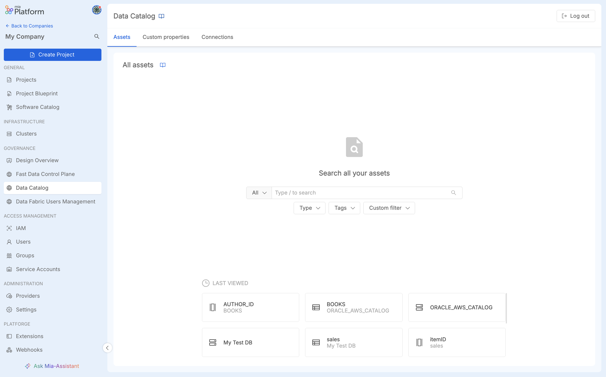

**Mia-Platform Data Catalog** solution provides a centralized place wherein users can have a detailed overview of the available data assets, facilitating the consultation and allowing to perform metadata enrichment on them.  
Data Catalog frontend communicates with [Open Lineage](/data_catalog/data_catalog_open_lineage.mdx) backend
via [Fabric BFF](/data_catalog/data_catalog_fabric_bff.mdx) component.



## Features

Mia-Platform Data Catalog frontend offers a user-friendly UI having:

* an [Asset Discovery section](/data_catalog/frontend/data_catalog_assets.mdx)  that allows users to navigate data assets and to perform a series of actions useful for data governance and metadata enrichment;
* a [Data Lineage section](/data_catalog/frontend/data_lineage.mdx) that allows users to understand, visualize, and describe the flow and transformations of data within an organization;
* a [Connections section](/data_catalog/frontend/data_catalog_connections.mdx) that allows users to manage the connections used to retrieve assets.

## Configuration

In this section is explained how the Data Catalog Frontend service should be configured in order to properly satisfy the requests.

### Environment Variables

Data Catalog UI can be customized using the following environment variables:

| Name                    | Required | Description                                                    | Default Value    |
|-------------------------|----------|----------------------------------------------------------------|------------------|
| `BASE_PATH`             | &check;  | Path prefix to be added to all the frontend resources          | `/data-catalog/` |
| `DATA_CATALOG_BASE_URL` |          | Base path where the backend APIs would be called from frontend |                  |

As effect of them, by default the Data Catalog application exposes its frontend over the `/data-catalog/` base path.
This value can be overridden by changing the environment variable `BASE_PATH` with `/<your-base-path>/` as value.

Bear in mind that changing the `BASE_PATH` environment variable requires to change also the [rewrite base path](/development_suite/api-console/api-design/endpoints.md#about-rewrite-base-path)
of exposed endpoint to `/<your-base-path>`.

### Endpoints

In order to allow incoming traffic from outside to Data Catalog Frontend, it is necessary to configure the main service endpoint.
This can be configured in the `Endpoints` page of Console Design area, as explained [here](/development_suite/api-console/api-design/endpoints.md).

| Endpoint        | Rewrite Base Path | Microservice      | Description                                 |
|-----------------|-------------------|-------------------|---------------------------------------------|
| `/data-catalog` | `/data-catalog`   | `data-catalog-fe` | Base path from which the frontend is served |

:::tip
Please, ensure that:
- in case `BASE_PATH` environment variable has been changed on the service, the Rewrite Base path must be changed accordingly
- in case the security layer is enabled, remember to flag the `Authetication required` checkbox
:::


### Enable Websocket support

Data Catalog Frontend relies on websocket for providing updates when interacting with the feature of  metadata [_bulk edit_](#bulk-actions).
By default, [websocket protocol upgrade](https://developer.mozilla.org/en-US/docs/Web/HTTP/Protocol_upgrade_mechanism#upgrading_to_a_websocket_connection)
is not supported by API Gateways that can be found in Mia-Platform Marketplace.
Consequently, it is necessary to carry out a manual update of your API Gateway configuration in Console [Advanced Section](/development_suite/api-console/advanced-section/index.md).

Below are provided the configuration for the API Gateways that can be configured out of the box in Console. These configurations both use endpoint `/data-catalog/bulk-actions` as the one
where the websocket communications should be enabled. In case `Fabric BFF` service exposes the bulk edit endpoint elsewhere, please update the configuration accordingly.

For more details on the websocket endpoint, please read the [endpoint paragraph](/data_catalog/data_catalog_open_lineage.mdx#endpoints) of Open Lineage service documentation.

#### Envoy

When using Envoy as API Gateway the additional configuration for supporting websocket protocol upgrade needs to be inserted in the file `api-gateway-envoy/patches.yml`.

```yaml title=api-gateway-envoy/patches.yml
- listener_name: frontend
  # https://www.envoyproxy.io/docs/envoy/v1.31.1/api-v3/extensions/filters/network/http_connection_manager/v3/http_connection_manager.proto#envoy-v3-api-msg-extensions-filters-network-http-connection-manager-v3-httpconnectionmanager-upgradeconfig
  'filter_chains.0.filters.0.typed_config.upgrade_configs':
    upgrade_type: "websocket"
```

:::caution
Please notice that the above configuration:
- affects only the first [filter chain](https://www.envoyproxy.io/docs/envoy/v1.31.1/api-v3/config/listener/v3/listener_components.proto#config-listener-v3-filterchain) and subsequently the first [filter](https://www.envoyproxy.io/docs/envoy/v1.31.1/api-v3/config/listener/v3/listener_components.proto#envoy-v3-api-msg-config-listener-v3-filter) definition.
-  is specific for the `frontend` listener of Envoy. In case it has been decided to expose the Data Catalog solution
under a [different listener](/development_suite/api-console/api-design/listeners.md), remember to update the configuration accordingly.
:::

#### Nginx

When using Nginx as API Gateway the additional configuration for supporting websocket protocol upgrade needs to be inserted in the file `api-gateway/server-extension.conf`.

```nginx title=api-gateway/server-extension.conf
location /data-catalog/bulk-actions {
    proxy_pass http://$proxy_name$proxy_url;

    proxy_set_header X-Real-IP $remote_addr;
    proxy_set_header Host $host;
    proxy_set_header X-Forwarded-For $proxy_add_x_forwarded_for;

    # WebSocket support
    proxy_http_version 1.1;
    proxy_set_header Upgrade $http_upgrade;
    proxy_set_header Connection upgrade;
}
```

### Embed as Console Extension

Data Catalog UI can be embedded as an extension of Mia-Platform Console using [Mia-Platform Platforge](/release-notes/v13/v13-overview#platforge-enhance-extensibility).
In this manner, Data Catalog UI can be accessed seamlessly through the same interface without requiring your Console users to open another application in their browser.

In order to achieve so, Mia-Platform Console offers an integrated tool for [managing extensions](/console/company-configuration/extensions.md)
that streamlines the registration procedure. The main information needed for registering Data Catalog UI as extension is the production URL
where the frontend is served. In case it is not already known, it should be possible to retrieve it by following these instructions:

- select your project where the Data Catalog application has been configured
- navigate to `Overview > Environments` page and select your production environment
- from the opened page, press the edit button, select and copy the `Project URL`
- combine the configured Data Catalog Frontend base path with the URL obtained in the previous step

:::tip
Considering the capability of Data Catalog to manage multiple runtimes, it is recommended to embed the Data Catalog Frontend at Company level (set _Destination Area_ property to `Company Overview`).
:::

Furthermore, since at the moment a Console Extension can be added <u>only as an iFrame</u>, it is necessary to relax the Data Catalog Frontend endpoint configuration to support it in Console. As a result,
the API Gateway in front of the Data Catalog Frontend would add the proper value to the `X-Frame-Options` header. Indeed, such header is set to `SAMEORIGIN` by default to prevent embedding deployed applications in other websites.

To edit the header value, please head to the `Endpoints` page and select the main endpoint for Data Catalog Frontend. Within the `Endpoint Settings` card, select the `Advanced` tab and then choose `Any Origin` from `Iframe embedding options`, as shown in the following image:


