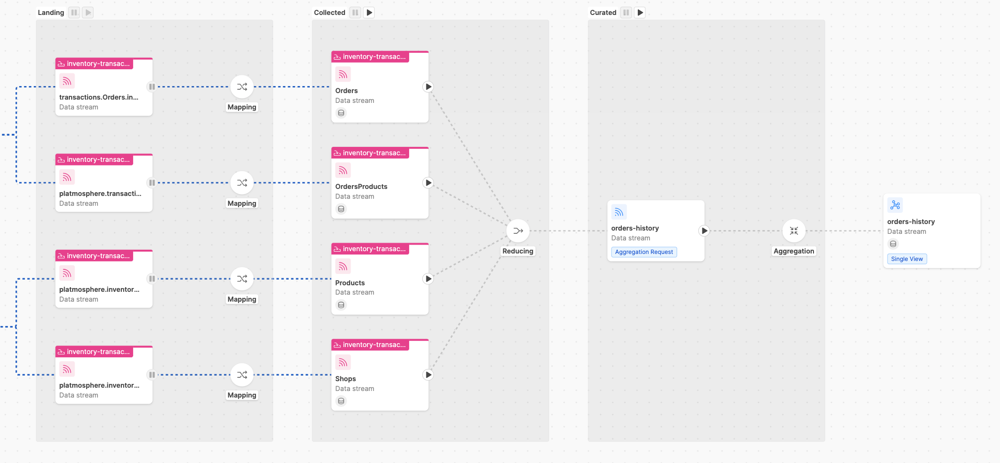
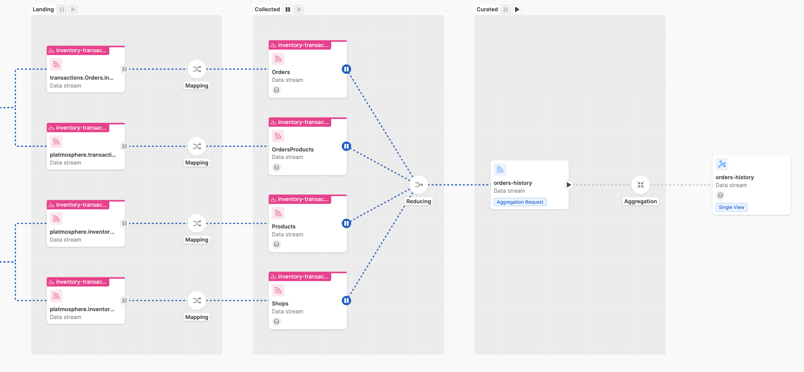

import Tabs from '@theme/Tabs';
import TabItem from '@theme/TabItem';

__Data Loading__ is a fundamental process to introduce information from the Systems of Record to your Fast Data system:
through Change Data Capture (CDC) solutions, data streams will flow into your Event Streaming Platform of choice
and then be processed by the Fast Data architecture of the runtime.

In this section, we will explore the two main operations that impacts Data Loading.

## Initial Load

In Fast Data, __Initial Load__ operations are made to synchronize the Systems of Record's tables with the Fast Data Projections.

### Overview

Beside the standard real-time data stream, the Initial Load operation is carried out by the CDC, 
which will produce ingestion messages for each record of the tables that have been chosen to be sent to Fast Data. 

:::caution
Usually CDCs will stop the capture of real time events to the source systems during an Initial Load:
this means that other tables not involved in the operation will not receive updates during the operation.
:::

### Scenarios

This operation is needed when:

- the Fast Data is initialized, to make it consistent with the source system;
- there has been some _disalignment_ between the source system and Fast Data, due to either
  infrastractural problems or misconfigurations

### Best Practices

Since Initial Load may involve tables having huge size, is necessary to prepare your infrastructure accordingly 
and stop the generation of Single Views.

:::tip
If you need to Bootstrap either Fast Data services or infrastructural component, you can check out [this section](/fast_data/faq/bootstrapping_fast_data.md#what-should-be-the-required-resources-to-perform-an-initial-load). 
:::

Before an Initial Load takes place, you have to prepare your [Fast Data architecture](/fast_data/concepts/architecture.md#putting-it-all-together) accordingly.

<Tabs groupId='fast-data-architecture'>

<TabItem value="event-driven" label="Event-Driven Architecture" default>

First, you have to check that ingestion topics have been correctly defined for the Projections that needs to be populated.

Then, if there exists a Single View Trigger Generator that consumes the messages produced into the `pr-update` topics of
the projections, you have to check that message consuming is not up-and-running (either by using Runtime Management or setting replicas to zero).

In this way, during the ingestion phase, strategies will not be executed. Once the ingestion procedure has been completed, you can restart
the SVTG, so that strategies will generate the single view identifiers accordingly.

##### Using Runtime Management

With [Runtime Management](/fast_data/runtime_management/overview.mdx), is possible to manage Initial Load operations without altering your configuration.

From the [Control Plane frontend](/fast_data/runtime_management/control_plane_frontend.mdx), you have to check first that the Domain Pipeline that will consume messages
is in a running state. Then, in the Single View pipeline that will receive data streams
from the projections involved in the Initial Load, both `Collected` and `Curated` stages must be in a __Paused State__.

The state of your pipeline should match the example shown below, where a data stream generating a single view 
named `orders-history` is completely paused.  



Then, once the Initial Load has been completed and messages have been stored correctly on MongoDB, you can put the `Collected`
stage back to the __Running State__ and let the underlying SVTG consuming the `pr-update` messages to generate the `trigger` messages.



:::tip
If the Initial Load involves projections having large datasets, is suggested to __only__ restart the base projection, i.e. the projection
that is the root of your single view aggregation (see [Glossary](/fast_data/concepts/glossary.mdx)). 

Then, from your Kafka instance, you should reset the offsets of `pr-update` topics to the last messages sent by the Initial Load procedure.
:::

Finally, to generate the single view documents, you can restart the `Curated` stage and let the underlying Single View Creator compute
the aggregation of single view documents from the `trigger` messages generated from the previous stage.  
</TabItem>


<TabItem value="standard" label="Standard Architecture">
First, you have to check that ingestion topics have been correctly defined for the Projections that needs to be populated.

Then, you need to disable strategy execution or the Real-Time Updater that will be registered to the projections by either:

- setting the environment variable `GENERATE_KAFKA_PROJECTION_CHANGES` to `false`
or
- disable the strategies linked to the Single View involved [from the dedicated section](/fast_data/configuration/single_views.md#link-projections-to-the-single-view) 

After the Initial Load has been completed, is possible to generate the corresponding Single Views 
that have the projections as dependencies by performing a [Full Refresh operation](#full-refresh). 

</TabItem>

</Tabs>

## Full Refresh

In Fast Data, __Full Refresh__ operations are made to regenerate the documents of a whole single view collection.

### Overview

The operation is carried out within the Fast Data Architecture, to let the Single View Creator (SVC) performing
the aggregation of all the documents of a Single View collection.  

### Scenarios 

This operation may be needed to make the single view aggregation consistent with the source system when:

- fields have been _added_/_removed_ _to_/_from_ a projection after the Initial Load and 
  needs to be _added_/_removed_ _into_/_from_ the Single View;
- there has been some _disalignment_ in the single view generation process, due to either
  infrastractural problems or misconfigurations.

### Best Practices

Before refreshing a single view collection, be sure that strategies have been disabled:
this is to ensure that projections are not changing while the refresh operation is taking place,
which benefits also the memory usage of your database infrastructure.

Below you can find the instructions to setup your runtime based on the
[Fast Data architecture](/fast_data/concepts/architecture.md#putting-it-all-together) you have deployed.

<Tabs groupId='fast-data-architecture'>

<TabItem value="event-driven" label="Event-Driven Architecture" default>

To do so, you can either use Runtime Management or setting to zero the replicas of the Single View Trigger
Generator (SVTG) linked to the single view that needs to be re-generated.

:::tip
If the full refresh operation will target a large number of single view documents, consider increasing the replicas
of your Single View Creator (SVC) to speed up the aggregation process. 
:::

##### Using Runtime Management

With [Runtime Management](/fast_data/runtime_management/overview.mdx), is possible to manage Full Refresh operations without altering your project configuration.

From the Control Plane frontend, you have to check in the Single View pipelines that the `Collected` stage is in a
__Paused State__, while the `Curated Stage` must be in a __Running State__.


</TabItem>


<TabItem value="standard" label="Standard Architecture">

You need to disable strategy execution of the Real-Time Updater that will be registered to the projections by either:

- setting the environment variable `GENERATE_KAFKA_PROJECTION_CHANGES` to `false`
or
- disable the strategies linked to the Single View involved [from the dedicated section](/fast_data/configuration/single_views.md#link-projections-to-the-single-view) 

</TabItem>

</Tabs>

Then, to refresh a single view collection, either projection changes or trigger messages must be generated manually.

Below, you can find some useful Node.js scripts that can be used a starting point to write your refresh logic.

<Tabs groupId="full-refresh-scripts">

<TabItem value="trigger" label="Trigger Messages">

This script will generate `trigger` messages [based on their specification](/fast_data/concepts/inputs_and_outputs.md#single-view-trigger-message).

First, create a blank project and install the following dependencies:

```bash
npm init -y
npm i mongodb kafkajs ramda
```

Then, place the following script to your newly created project 
and replace the different placeholders accordingly to your needs.

```js title=index.js
const { MongoClient } = require('mongodb')
const { pick } = require('ramda')
const { Kafka, CompressionTypes, CompressionCodecs } = require('kafkajs')

const fs = require('fs/promises')

function getTriggerMessage({
  projection, 
  singleViewIdentifier,
  singleViewName,
  clientId,
  operationTimestamp,
}) {
  return {
    key: singleViewIdentifier,
    value: {
      type: "aggregation",
      singleViewName,
      singleViewIdentifier, 
      change: {
        data: projection.document,
        projectionIdentifier: projection.identifier, 
        projectionName: projection.name
      }
      __internal__kafkaInfo: {
        ...projection.document.__internal__kafkaInfo,
        // metadata used to understand that trigger message has been
        // generated by a local full refresh 
        timestamp: operationTimestamp,
        topic: clientId,
      }
    },
    headers: {
        messageSchema: {
            type: 'sv-trigger',
            version: 'v1.0.0',
        }
    }              
  }
}

async function main(projectionName, triggerTopic, singleViewName, batchSize = 500) {
  const mongoClient = new MongoClient(/** db connection stringstring */)
  const interval = setInterval(() => console.log(`Updated ${counter} docs`), 5000)

  const operationTimestamp = new Date()
  const clientId = `${process.env.USER}.local.trigger-generator`

  let counter = 0
  const kafka = new Kafka({
      brokers: [/** ... put here your kafka brokers ... */],
      clientId,
      // SSL Configuration
      ssl: true,
      sasl: {
        /** replace with your authentication mechanism */
      },
  })
  
  const producer = kafka.producer()
  
  try {
    await producer.connect()
    await mongoClient.connect()
    const db = mongoClient.db()

    const collection = db.collection(projectionName)

    const indexes = await collection.indexes()
    const primaryKeyIndex = indexes.find(index => index.name === 'mia_primary_key_index')
    const primaryKeys = Object.keys(primaryKeyIndex.key)
    // we check that the collection is a projection 
    if(!primaryKeyIndex) {
        throw new Error('no pk index found for projection.')
    }
    
    const messages = []
    // by sorting with the _id field, is possible to restart generation using
    // the skip parameter of mongodb
    const cursor = collection.find({}).sort({_id: -1}) 
    
    const getSingleViewIdentifier = (document) => {
      /** here you write the logic to obtain the identifier from base projection document */
      return {
        // ...
      }
    }
    for await(document of cursor) {
      const message = getTriggerMessage({
        projection: {
          document,
          identifier: pick(projection.primaryKeys, projection.doc),
          name: projectionName
        }, 
        singleViewIdentifier: getSingleViewIdentifier(document),
        singleViewName,
        operationTimestamp,
        clientId,
      })
      messages.push({
          key: JSON.stringify(message.key),
          value: JSON.stringify(message.value),
          headers: JSON.stringify(message.headers)
      })
      // sends batch equals to batchSize
      if (messages.length === batchSize) {       
          await Promise.resolve(producer.send({
              topic: triggerTopic,
              messages,
              // if many messages are involved, consider using GZIP compression
              // compression: CompressionTypes.GZIP 
          }))
          counter += batchSize
          // reset messages count
          messages.splice(0, messages.length)
      }
    }

    await Promise.resolve(producer.send({
        topic,
        messages,
    }))
    counter += messages.length
    console.log(`Updated ${counter} docs. End.`)
  } catch(err) {
      console.error('received error from generation: ', err)
  } finally {
      console.log('closing connections')
      clearInterval(interval)
      await mongoClient.close()
      await producer.disconnect()
  }
}

main('base-projection-name', 'trigger-topic-name', 'single-view-name')
```

Finally, you can launch the script from your command line terminal.

</TabItem>

<TabItem value="pc" label="Projection Changes">

This script will generate `projection changes` records [based on their specification](/fast_data/concepts/inputs_and_outputs.md#projection-changes).

First, create a blank project and install the following dependencies:

```bash
npm init -y
npm i mongodb
```

Then, place the following script to your newly created project 
and replace the different placeholders accordingly to your needs.

```js title=index.js
const { MongoClient } = require('mongodb')
const fs = require('fs/promises')

function getProjectionChangesRecord({
  projection, 
  singleViewIdentifier,
  singleViewName,
  clientId,
  operationTimestamp,
}) {
  return {
    type: singleViewName,
    identifier: singleViewIdentifier, 
    changes: [{
      __STATE__: "NEW",
      ...projection.__internal__kafkaInfo,
      // metadata used to understand that trigger message has been
      // generated by a local full refresh 
      timestamp: operationTimestamp,
      topic: clientId,

    }],
    createdAt: operationTimestamp,
    updatedAt: operationTimestamp,          
  }
}

async function main(projectionName, projectionChangesCollectionName, singleViewName, batchSize = 500) {
  const mongoClient = new MongoClient(/** db connection stringstring */)
  const interval = setInterval(() => console.log(`Updated ${counter} docs`), 5000)

  const operationTimestamp = new Date()
  const clientId = `${process.env.USER}.local.pc-generator`

  let counter = 0
  const kafka = new Kafka({
      brokers: [/** ... put here your kafka brokers...*/],
      clientId,
      // SSL Configuration
      ssl: true,
      // SASL Configuration con username e pass utenza tecnica
      sasl: {
        /** replace with your authentication mechanism*/
      },
  })
  
  const producer = kafka.producer()
  
  try {
    await producer.connect()
    await mongoClient.connect()
    const db = mongoClient.db()

    const projectionCollection = db.collection(projectionName)
    const projectionChangesCollection = db.collection(projectionChangesCollectionName)

    const indexes = await projectionCollection.indexes()
    const primaryKeyIndex = indexes.find(index => index.name === 'mia_primary_key_index')
    const primaryKeys = Object.keys(primaryKeyIndex.key)
    // we check that the collection is a projection 
    if(!primaryKeyIndex) {
        throw new Error('no pk index found for projection.')
    }
    
    const promises = []
    // by sorting with the _id field, is possible to restart generation using
    // the skip parameter of mongodb
    const cursor = projectionCollection.find({}).sort({_id: -1}) 
    
    const getSingleViewIdentifier = (document) => {
      /** here you write the logic to obtain the identifier from base projection document */
      return {
        // ...
      }
    }
    for await(projection of cursor) {
      const singleViewIdentifier = getSingleViewIdentifier(projection)
      const pcRecord = getProjectionChangesRecord({
        projection, 
        singleViewIdentifier,
        singleViewName,
        operationTimestamp,
        clientId,
      })
      promises.push(
        projectionChangesCollection.updateOne({
          type: singleViewName,
          identifier: singleViewIdentifier,
        }, {
          $set: {
            ...pcRecord
          }
        }, {
          upsert: true
        })
      )
      // sends batch equals to batchSize
      if (messages.length === batchSize) {       
        await Promise.all(promises)
        counter += batchSize
        // reset messages count
        promises.splice(0, promises.length)
      }
    }

    await Promise.all(producer.send(promises))
    counter += promises.length
    console.log(`Updated ${counter} docs. End.`)
  } catch(err) {
    console.error('received error from generation: ', err)
  } finally {
    console.log('closing connections')
    clearInterval(interval)
    await mongoClient.close()
    await producer.disconnect()
  }
}

main('base-projection-name', 'pc-collection-name', 'single-view-name')
```

Finally, you can launch the script from your command line terminal.

</TabItem>

</Tabs>