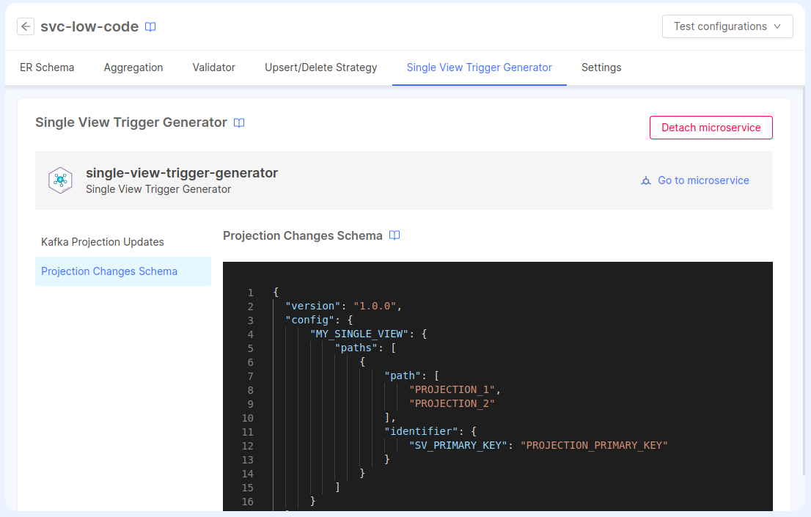

import EventStoreConfiguration from "@site/static/schemas/fast-data-event-store-config.schema.json"
import SchemaViewer from "../snippets/schema_viewer.mdx"

The Single View Trigger Generator has 3 fundamental parts:

- The consumption of pr-update messages
- The strategy execution
- The production of `sv-trigger` messages or `pc` records

For each part we will need to configure a set of [environment variables](#environment-variables) and [config maps](#config-maps).

## Environment variables

The following table indicates all the available environment variables for you to customize the service to your needs.

:::note
When creating the service from the marketplace the following environment variables will be added for you with some default values but you still need to properly update them to make the service work
:::

| Name                             | Required | Description                                                                                                                                                                                                                                | Default value |
| -------------------------------- | -------- | ------------------------------------------------------------------------------------------------------------------------------------------------------------------------------------------------------------------------------------------ | ------------- |
| LOG_LEVEL                        | &check;  | Level to use for logging; to choose from: error, fatal, warn, info, debug, trace, silent                                                                                                                                                   | silent        |
| MONGODB_URL                      | &check;  | MongoDB URL where the projections are stored                                                                                                                                                                                               | -             |
| MONGODB_NAME                     | &check;  | MongoDB Database name where the projections are stored                                                                                                                                                                                     | -             |
| EVENT_STORE_CONFIG_PATH          | &check;  | Path to the [Event Store Config](#event-store-config) file                                                                                                                                                                                 | -             |
| EVENT_STORE_TARGET               | &check;  | Kafka topic to send the `sv-trigger` messages or MongoDB collection to save the `pc` records                                                                                                                                               | -             |
| SINGLE_VIEW_NAME                 | &check;  | The name of the Single View                                                                                                                                                                                                                | -             |
| KAFKA_PROJECTION_UPDATES_FOLDER  | &check;  | Path to the [Kafka Projection Updates](#kafka-projection-updates) folder                                                                                                                                                                   | -             |
| ER_SCHEMA_FOLDER                 | &check;  | Path to the [ER Schema](#er-schema) folder                                                                                                                                                                                                 | -             |
| PROJECTION_CHANGES_SCHEMA_FOLDER | &check;  | Path to the [Projection Changes Schema](#projection-changes-schema) folder                                                                                                                                                                 | -             |
| MANUAL_STRATEGIES_FOLDER         | -        | Absolute path of custom strategy functions folder. These functions are used in `__fromFile__` annotations inside the [Kafka Projection Updates Configuration](/fast_data/configuration/config_maps/kafka_projection_updates.mdx)           | -             |
| TRIGGER_CUSTOM_FUNCTIONS_FOLDER  | -        | Absolute path of custom functions folder. These functions are used in `__fromFile__` annotations inside the [Projection Changes Schema Configuration](/fast_data/configuration/config_maps/projection_changes_schema.md#custom-functions). | -             |
| CONTROL_PLANE_CONFIG_PATH        | -        | Starting from `v3.3.0`, is possible to configure Runtime Management. More details [on the dedicated section](/fast_data/runtime_management/workloads.mdx?workload=svtg#single-view-trigger-generator)                                      | -             |
| CONTROL_PLANE_BINDINGS_PATH      | -        | Starting from `v3.3.0`, is possible to configure Runtime Management. More details [on the dedicated section](/fast_data/runtime_management/workloads.mdx?workload=svtg#single-view-trigger-generator)                                      | -             |

## Attaching a Service to a Single View

To simplify the configuration of the Single View Trigger Generator service, you can attach a previously created Single View Trigger Generator service from the marketplace to a Single View. Here's how to do it:

* create your Single View and attach a _Single View Creator Service_ to it [from the dedicated configuration page](/fast_data/configuration/single_view_creator/index.md#attach_to_single_view). This is necessary because the Single View Trigger Generator can work with only one Single View Creator Service.
* within the _Single View Creator_ tab of the _Single View_ modal, enter the configuration page of the Single View Creator that you've configured.
* in the _Single View Trigger Generator_ tab, you can choose a Single View Trigger Generator from the available services.

Once the service has been attached, you can manage the content of the [_Projection Changes Schema config map_](/fast_data/configuration/config_maps/projection_changes_schema.md) and the [_Kafka Projection Updates config map_](/fast_data/configuration/config_maps/kafka_projection_updates.mdx).



Any updates to these configurations will be reflected in the service config maps after saving the configuration.

:::tip Shared ER Schema
Additionally, when a service is attached to a Single View, the _ER Schema_ config map will be shared between the Single View Creator and the Single View Trigger Generator.

Also, the environment variable `SINGLE_VIEW_NAME` will be set automatically to the name of the Single View.
:::

:::warning
When a Single View Trigger Generator is attached to a Single View, the environment variable `SINGLE_VIEW_NAME` will be set to "read-only" mode, as well as the config maps for the _ER Schema_, _Projection Changes Schema_, and _Kafka Projection Updates_.

If you prefer to manually configure these services, you can always detach the service in the _Single View Trigger Generator_ tab via the _Detach microservice_ button on the top-right side of the page. After saving the configuration, the environment variable and the config maps will be again editable from the _Microservices_ section.
:::

## Config Maps

The service can use the following 3 config maps:

:::note
When creating the service from the marketplace the following config maps will be created for you with some default values. The _Event Store Config_ must be manually modified from the _Microservice_ page to include all the missing configuration, but the _ER Schema_, the _Projection Changes Schema_ and the _Kafka Projection Updates_ configuration can be simplified by attaching the service to a Single View: in this case, the environment variables and config maps for these three config maps will be automatically managed by the application.
:::

### ER Schema

The ER Schema config map contains the `erSchema.json` file which describes the relationships between each projection of the [System of Record](/fast_data/concepts/the_basics.md#system-of-record-sor).

Remember to copy/paste the mount path into the `ER_SCHEMA_FOLDER` environment variable so the service can read the file.
To know more on how to configure the file please go to the [ER Schema](/fast_data/configuration/config_maps/erSchema.md) page.

### Projection Changes Schema

The Projection Changes Schema config map contains the `projectionChangesSchema.json` file which defines how to get to the base projection of the single view starting from the projection in which we received the ingestion message.

Remember to copy/paste the mount path into the `PROJECTION_CHANGES_SCHEMA_FOLDER` environment variable so the service can read the file.
If you need more info on how to configure the `projectionChangesSchema.json` file, please refer to the [Projection Changes Schema](/fast_data/configuration/config_maps/projection_changes_schema.md) page.

### Kafka Projection Updates

The Kafka Projection Updates config map contains the `kafkaProjectionUpdates.json` file which defines the topics from where to consume the [Projection Updates](/fast_data/concepts/inputs_and_outputs.md#projection-update) and the strategy to apply to each message.

Remember to copy/paste the mount path into the `KAFKA_PROJECTION_UPDATES_FOLDER` environment variable so the service can read the file.
If you need more info on how to configure the `kafkaProjectionUpdates.json` file, please refer to the [Kafka Projection Updates](/fast_data/configuration/config_maps/kafka_projection_updates.mdx) page.

:::caution
If you attach the service to a Single View, the _Kafka Projection Updates_ config map will be read-only.

If you need to use manual strategies for one or more projections, you have to create an additional config map
having the manual strategies, that will be linked to the service by the usage of the `MANUAL_STRATEGIES_FOLDER` environment variable.
:::

### Event Store Config

The `Event Store Config` is a JSON file containing the configuration of the consumer and producer of the service itself and it has the following format:

```json
{
  "consumer": {
    "kafka": {
      // Kafka consumer configuration (see below)
    }
  },
  "producer": {
    "<kafka | mongo>": {
      // Kafka or mongo producer configuration (see below)
    }
  }
}
```

:::caution
Mind that only one producer and consumer must be configured at a time so the service knows which kind to use. Providing more than one consumer or producer will fail the configmap validation and shut down the service at start up.
:::

The JSON configuration must be compliant to the following JSON Schema.

<SchemaViewer schema={EventStoreConfiguration} />

#### Secrets Resolution

Starting from `v3.3.1`, the following fields can contain secrets that can be managed using the [Fast Data Secrets Resolution mechanism](/fast_data/configuration/secrets_resolution.md):

- `consumer.kafka.['bootstrap.servers']`
- `consumer.kafka.['sasl.username']`
- `consumer.kafka.['sasl.password']`
- `consumer.kafka.['ssl.passphrase']`
- `consumer.kafka.['ssl.keystore.certificate.chain']`
- `producer.kafka.['bootstrap.servers']`
- `producer.kafka.['sasl.username']`
- `producer.kafka.['sasl.password']`
- `producer.kafka.['ssl.passphrase']`
- `producer.kafka.['ssl.key.password']`
- `producer.mongo.['url']`

#### Consumers

At the moment you can only configure your consumer with kafka which will read `pr-update` messages from the Real-Time Updater. To configure it you must follow the JsonSchema specification above.

#### Producers

For the producers you can choose between two options: Kafka or MongoDB ([`sv-trigger` vs. `pc`](/fast_data/single_view_trigger_generator.md#sv-trigger-vs-pc)).

With MongoDB you will save Projection Changes on the DB just like the Real-Time Updater does. With Kafka instead it will send `sv-trigger` messages which will also be read by the Single View Creator by changing its configuration to do so.

To configure it you must follow the JsonSchema specification above.

:::tip
Starting from version `v3.1.6` of the SVTG, is possible to add into the Kafka producer configuration the property `compressionName`, to apply a particular encoding to `sv-trigger` messages. Allowed values are:

* `gzip`
* `snappy`
* `none` (default, if no options are provided)

While this option can be useful for messages having a large size, can increase the processing time due to the computational resources needed to apply the compression.
:::

#### Examples

Below you can find a list of example configurations, based on the two different types of producers.


Kafka Consumer with MongoDB Producer


```json
{
  "consumer": {
    "kafka": {
      "brokers": "localhost:9092,localhost:9093",
      "clientId": "client-id",
      "consumerGroupId": "group-id",
      "consumeFromBeginning": true,
      "logLevel": "NOTHING"
    }
  },
  "producer": {
    "mongo": {
      "url": "mongodb://localhost:27017",
      "dbName": "pc-sv-books-test"
    }
  }
}
```


Kafka Consumer with Kafka Producer


```json
{
  "consumer": {
    "kafka": {
      "brokers": "localhost:9092,localhost:9093",
      "clientId": "client-id",
      "consumerGroupId": "group-id",
      "consumeFromBeginning": true,
      "logLevel": "NOTHING"
    }
  },
  "producer": {
    "kafka": {
      "brokers": "localhost:9092,localhost:9093",
      "clientId": "client-id",
      "logLevel": "NOTHING"
    }
  }
}
```


Kafka Consumer with Kafka Producer having Snappy compression


```json
{
  "consumer": {
    "kafka": {
      "brokers": "localhost:9092,localhost:9093",
      "clientId": "client-id",
      "consumerGroupId": "group-id",
      "consumeFromBeginning": true,
      "logLevel": "NOTHING"
    }
  },
  "producer": {
    "kafka": {
      "brokers": "localhost:9092,localhost:9093",
      "clientId": "client-id",
      "logLevel": "NOTHING",
      "compressionName": "snappy"
    }
  }
}
```


Kafka with Authentication


```json
{
  "consumer": {
    "kafka": {
      "brokers": "localhost:9092,localhost:9093",
      "clientId": "client-id",
      "consumerGroupId": "group-id",
      "consumeFromBeginning": true,
      "sasl": {
        "username": "my-username",
        "password": "my-password",
        "mechanism": "plain", // 'scram-sha-256', 'scram-sha-512'
      },
      "ssl": true,
      "logLevel": "NOTHING"
    }
  },
  "producer": {
    "kafka": {
      "brokers": "localhost:9092,localhost:9093",
      "clientId": "client-id",
      "logLevel": "NOTHING",
      "ssl": true,
      "sasl": {
        "username": "my-username",
        "password": "my-password",
        "mechanism": "plain", // 'scram-sha-256', 'scram-sha-512'
      }
    }
  }
}
```


## Runtime Management

:::info
This feature is supported from version `3.3.0` of the Single View Trigger Generator.
:::

By specifying the environment variables `CONTROL_PLANE_CONFIG_PATH`, you enable the SVTG to receive and execute the commands from the [Runtime Management](/fast_data/runtime_management/overview.mdx).

:::caution
By design, every service interacting with the Control Plane starts up in a paused state, unless the Control Plane
has already resumed the data stream before.

Therefore, when the SVTG starts up, the trigger generation will not start automatically.

In this case, you just need to send a `resume` command to one of the projections managed by the SVTG.
:::

You can read about the setup of the Single View Trigger Generator in [its dedicated section](/fast_data/runtime_management/workloads.mdx?workload=svtg#single-view-trigger-generator).

