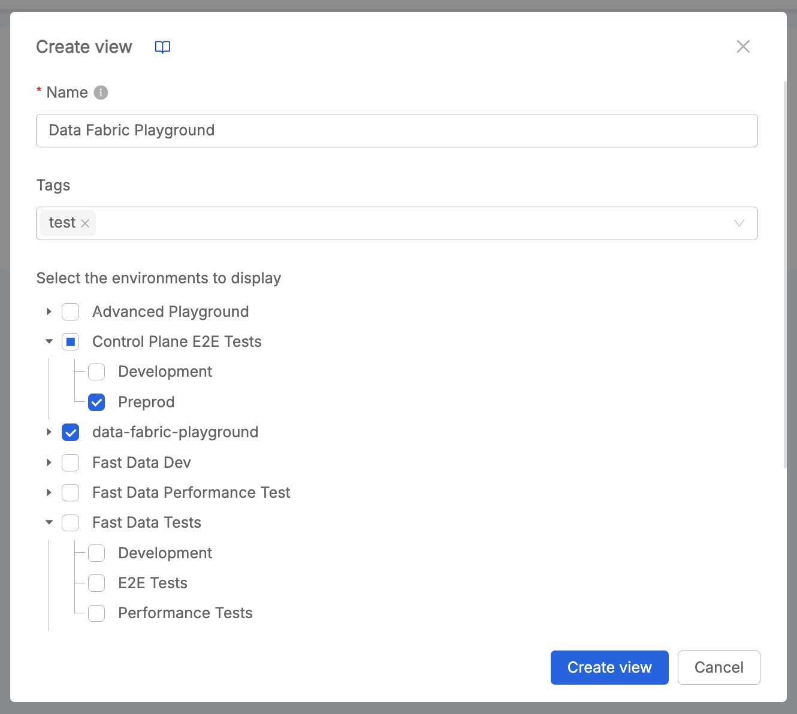
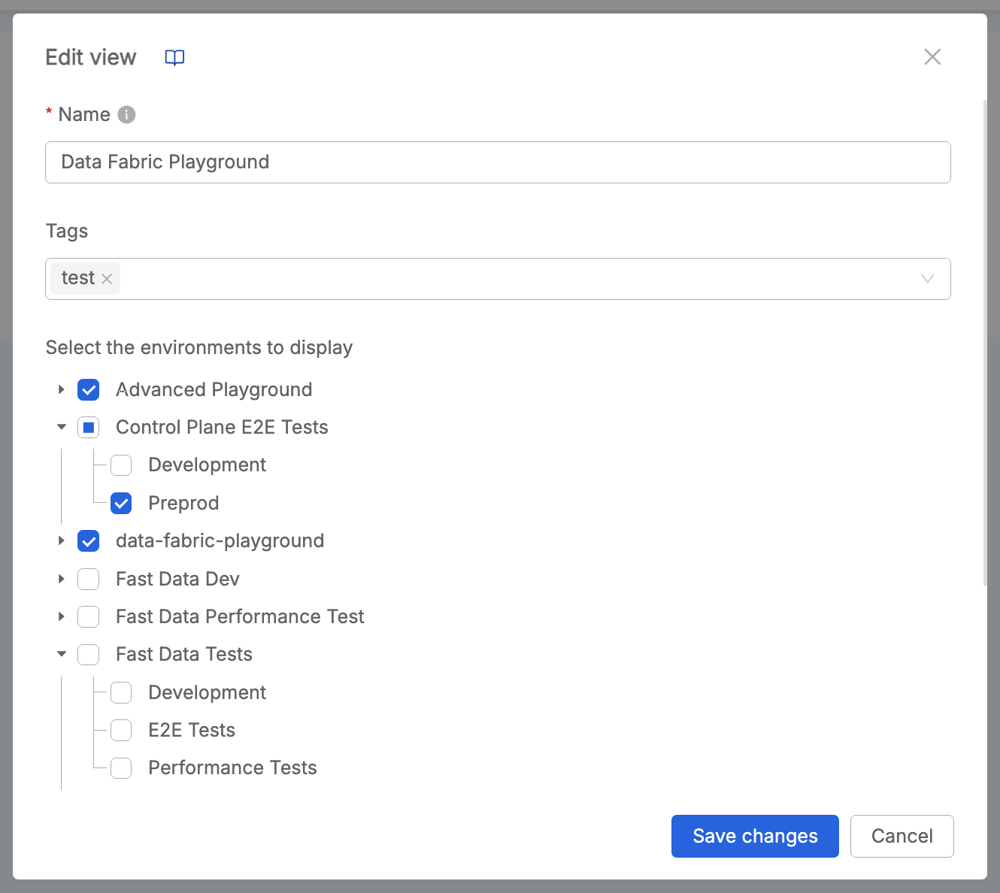
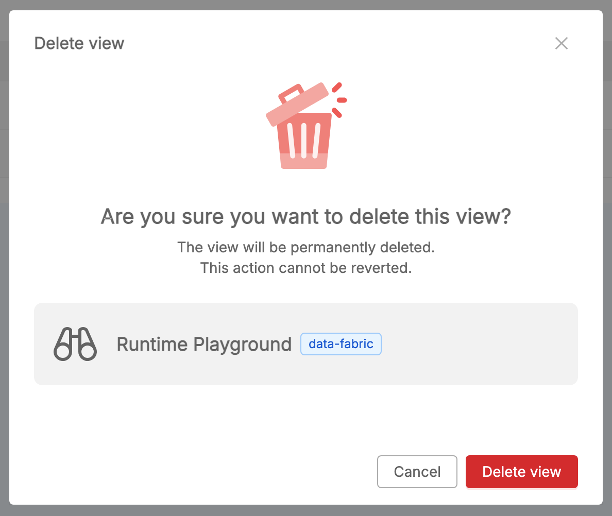
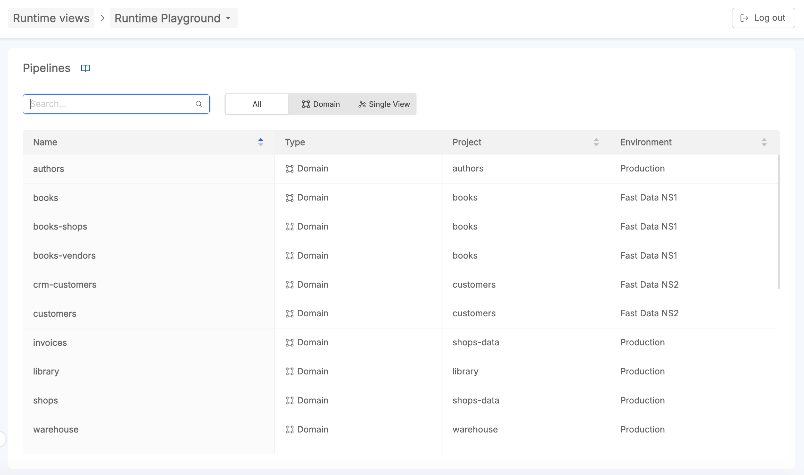
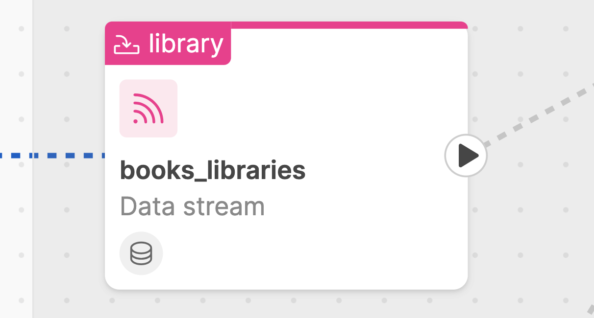
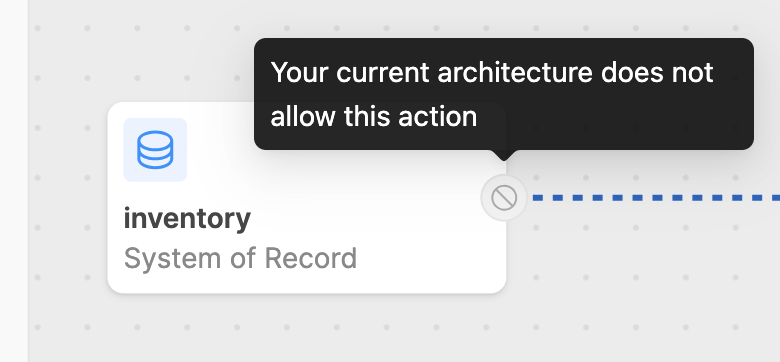
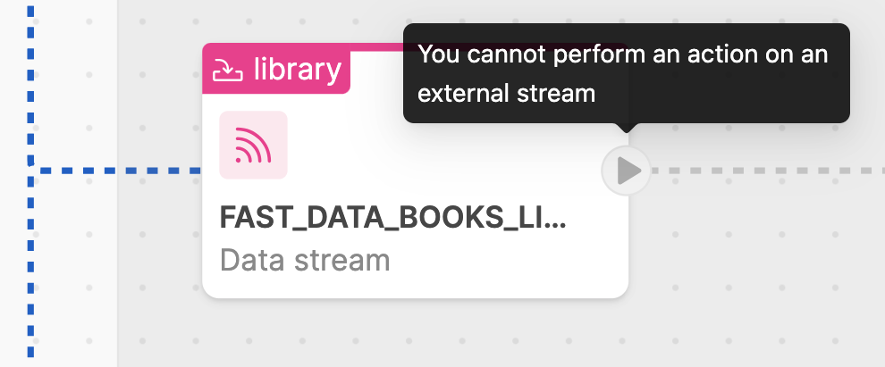
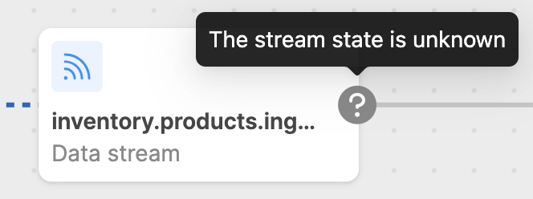

Fast Data Runtime Management solution has a dedicated frontend that allows interacting with [Control Plane](/fast_data/runtime_management/control_plane.mdx) via [Fabric BFF](/fast_data/runtime_management/control_plane_fabric_bff.mdx)
component.


> Fast Data Runtime Management solution embedded in Mia-Platform Console, with visibility at Company level.

## Features

This frontend enables the user to:

- manage runtimes views;
- retrieve pipelines details;
- visualize pipelines structure and receive live updates about the state of the underlying Fast Data Runtime;
- execute actions on pipelines state, that is pausing or resuming one or more data streams

In the next paragraph, all these features are described in detail.

### Runtime Views Management

Users with enough permissions can manage [Runtime Views](/fast_data/runtime_management/overview.mdx#runtime-view) inside Control Plane frontend.  
Thanks to Runtime Views, it is possible to group together runtime environments belonging to your Company Projects.  
In other words, the Fast Data Runtime View is a **logical entity** that aims at grouping together Fast Data runtime environments; these logical groupings may either arise from business requirements or spontaneously depending on how Console projects are related each other.  

#### Create Runtime View

Click on the top-right button to start adding a Runtime View.  



Choose a name that identifies the Runtime View, and optionally insert proper tags to better describe it.  
Then, select among the available runtime environments of your Company Projects.

:::caution
In order for a _runtime_ to be recognized and managed by the main Control Plane instance, it has to belong to **one and only one** _runtime view_. Consequently,
_runtimes_ that do not belong to any _runtime view_ are <u>simply ignored</u> by the system, while it is forbidden for a _runtime_ to belong to multiple _runtime views_.
:::

Once runtimes have been selected, click `Create View` button.

#### Edit Runtime View

It is possible to modify a Runtime View, by choosing to click the `Edit Runtime View` option from the multi-action button at the right of the related table item identifying that runtime view.  



In particular, it is possible to change runtime view Name, tags, and assigned runtime environments.

:::caution
In case a runtime environment is already assigned to another runtime view, this is not selectable among the list of available runtimes to be chosen.
:::

#### Delete Runtime View

It is possible to delete a Runtime View, by choosing to click the `Delete Runtime View` option from the multi-action button at the right of the related table item identifying that runtime view.  



:::caution
When confirming the delete action, the runtime view will be permanently deleted, without the possibility to revert it.
:::

### Pipelines Overview

Within a runtime view, the list of Fast Data pipelines released on the runtime environments that have been assigned to that view is displayed.
In particular, two types of pipelines are shown: [Domain pipelines](/fast_data/runtime_management/overview.mdx#domain-pipeline) and [Single View pipelines](/fast_data/runtime_management/overview.mdx#single-view-pipeline).



User can search a pipeline of interest, or filter on the type of pipeline (either _Domain_ or _Single View_).

Once clicked on a pipeline, the user will be redirected to the pipeline detail page. It is a canvas where all the stages and states of the pipeline are rendered.

### States of Data Streams

In this section we are going to describe in detail how the different states of the Fast data system at runtime are represented in the pipeline, and what actions the user can take to interact with the pipeline.

Along a pipeline, it is possible to identify different graphical elements useful for representing the various states of your data streams 
in real-time and for highlighting architectural aspects of your Fast Data configuration.

For each data streams, an action button is provided in an initial state, which may change based on:
- the feedback provided by the workloads managing the data streams;
- the configuration of the workloads

:::tip
From Control Plane settings located at the bottom-right of the canvas, user can decide to switch-off / switch-on the animation of the running streams.
:::

#### Running

When messages consumption is active along a data stream, the __running__ state is rendered. 

<div style={{display: 'flex', justifyContent: 'center'}}>
  <div style={{display: 'flex', width: '500px'}}> 


  </div>
</div>

This means that the Fast Data workloads involved in consuming events on that data stream are in `running` state.  

#### Paused

When messages consuption is paused along a data stream, the __paused__ state is rendered. 

<div style={{display: 'flex', justifyContent: 'center'}}>
  <div style={{display: 'flex', width: '500px'}}> 



  </div>
</div>

This means that the Fast Data workloads involved on that data stream are in `paused` state and 
their are not consuming messages along that data stream.

#### Loading

When user interacts with the frontend in order to perform play/pause actions along data streams, a loading state is rendered, meaning 
that an action is going to be performed on that data stream and control plane has sent the command to the involved microservice and 
is waiting for a feedback from that specific microservice.  

<div style={{display: 'flex', justifyContent: 'center'}}>
  <div style={{display: 'flex', width: '500px'}}> 


  </div>
</div>

Typically, after a loading state, if action succeeds, the data stream will change its state from paused to running or viceversa; if action does not succeed, an error will be displayed to user and the data stream will not change its status.

#### Unsupported

Depending on the configured Fast Data architecture, sometimes the unsupported status can appear along a data pipeline. 

<div style={{display: 'flex', justifyContent: 'center'}}>
  <div style={{display: 'flex', width: '500px'}}> 



  </div>
</div>

For example, this status appears in the ingestion phase, where is not possible to alter the behavior of a CDC acquiring events from external sources.

#### Disabled

There could be the case in which a play/pause action cannot be performed by user. 

<div style={{display: 'flex', justifyContent: 'center'}}>
  <div style={{display: 'flex', width: '500px'}}> 



  </div>
</div>

This status can appear in the Single View pipeline's artifacts belonging to the Landing stage, 
since their actions are managed by a domain pipeline.

#### Unknown

The unknown status appears when Control Plane system is not able to identify the state of a certain data stream.

<div style={{display: 'flex', justifyContent: 'center'}}>
  <div style={{display: 'flex', width: '500px'}}> 



  </div>
</div>

This status can appear when: 

- there may be some misconfigurations on the Fast Data pipeline;
- workloads are not sending their feedback to the Control Plane.

### Monitoring and Interacting with pipelines

From Control Plane frontend, user can monitor the status of each Fast Data pipeline in real-time and interact with 
it by pausing/resuming messages consumption on the available data streams. 

#### Pause and Resume

It's possible to click on the play/pause buttons distributed along the various data streams of the pipeline.  


Once clicked on the button, a [Loading state](#loading) appears and a message on the top of the frontend shows a countdown of 5s within 
which the user can decide to revoke the triggered action:

- if revoked, the previous state will be restored without any impact on Fast Data runtime; 

or

- if not, Control Plane will receive the command and send the corresponding state to the target microservice involved on that data stream. 

After the loading state, if the action is successful, the data stream will accordingly change its status in either [running](#running) or [paused](#paused).

#### Bulk actions

_Bulk actions_ can enhance user experience in interacting with pipelines. 

With a simple click on a play/pause button located at the top of each main Fast Data architectural step 
(Ingestion, Landing, Collected, Curated phases), user can pause all the active data streams, or can resume all the paused ones.


:::tip 
Bulk actions are useful in case of large data pipelines and to speed up runtime management: for example, they can be leveraged during an [Initial Load management process](/fast_data/concepts/data_loading.mdx#initial-load).

In fact, with the first deploy of Fast Data pipelines on a runtime environment, if the system is correctly configured, the pipelines start running by default.

Consequently, thanks to bulk actions, the user can easily pause specific steps of the pipeline as needed, enabling an efficient step-by-step management of the Initial Load process.

In this way, ingestion of huge datasets can be performed without saturating the underlying infrastructure, without damaging other data streams running at the same runtime. 
:::

## Configuration

In this section is explained how the Control Plane Frontend service should be configured in order to properly satisfy the requests.

### Environment Variables

Control Plane UI can be customized using the following environment variables:

| Name                     | Required | Description                                                    | Default Value     |
|--------------------------|----------|----------------------------------------------------------------|-------------------|
| `BASE_PATH`              | &check;  | Path where the frontend will be accessible in the browser      | `/control-plane/` |
| `CONTROL_PLANE_BASE_URL` |          | Base path where the backend APIs would be called from frontend |                   |

As a consequence, by default the Control Plane application exposes its frontend over the `/control-plane/` base path.
This value can be overridden by changing the environment variable `BASE_PATH` with `/<your-base-path>/` as value.

Bear in mind that changing the `BASE_PATH` environment variable requires to change also the [rewrite base path](/development_suite/api-console/api-design/endpoints.md#about-rewrite-base-path) of exposed endpoint to `/<your-base-path>`.

### Endpoints

In order to allow incoming traffic from outside to Control Plane Frontend, it is necessary to configure the main service endpoint. This can be configured in the `Endpoints` page of Console Design area, as explained [here](/development_suite/api-console/api-design/endpoints.md).

| Endpoint         | Rewrite Base Path | Microservice       | Description                                 |
|------------------|-------------------|--------------------|---------------------------------------------|
| `/control-plane` | `/control-plane`  | `control-plane-fe` | Base path from which the frontend is served |

:::tip
Please, ensure that:
- in case `BASE_PATH` environment variable has been changed on the service, the Rewrite Base path must be changed accordingly
- in case the security layer is enabled, remember to flag the `Authentication required` checkbox
:::

### Enable Websocket support

Control Plane Frontend relies on websocket for providing live updates to displayed data. By default, [websocket protocol upgrade](https://developer.mozilla.org/en-US/docs/Web/HTTP/Protocol_upgrade_mechanism#upgrading_to_a_websocket_connection) is not supported by API Gateways that can be found in Mia-Platform Marketplace.
Consequently, it is necessary to carry out a manual update of your API Gateway configuration in Console [Advanced Section](/development_suite/api-console/advanced-section/index.md).

Below are provided the configuration for the API Gateways that can be configured out of the box in Console. These configurations both use endpoint `/fast-data/feedback` as the one
where the websocket communications should be enabled. In case `Fabric BFF` service exposes the feedback endpoint elsewhere, please update the configuration accordingly.

For more details on the websocket endpoint, please read the [endpoint paragraph](/fast_data/runtime_management/control_plane.mdx#endpoints) of Control Plane service documentation.

#### Envoy

When using Envoy as API Gateway the additional configuration for supporting websocket protocol upgrade needs to be inserted in the file `api-gateway-envoy/patches.yml`.

```yaml title=api-gateway-envoy/patches.yml
- listener_name: frontend
  # https://www.envoyproxy.io/docs/envoy/v1.30.1/api-v3/extensions/filters/network/http_connection_manager/v3/http_connection_manager.proto#envoy-v3-api-msg-extensions-filters-network-http-connection-manager-v3-httpconnectionmanager-upgradeconfig
  'filter_chains.0.filters.0.typed_config.upgrade_configs':
    upgrade_type: "websocket"
```

:::caution
Please notice that the above configuration:
- affects only the first [filter chain](https://www.envoyproxy.io/docs/envoy/v1.29.3/api-v3/config/listener/v3/listener_components.proto#config-listener-v3-filterchain) and subsequently the first [filter](https://www.envoyproxy.io/docs/envoy/v1.29.3/api-v3/config/listener/v3/listener_components.proto#envoy-v3-api-msg-config-listener-v3-filter) definition.
-  is specific for the `frontend` listener of Envoy. In case it has been decided to expose the Fast Data Control Plane
  system under a [different listener](/development_suite/api-console/api-design/listeners.md), remember to update the configuration accordingly.
:::

#### Nginx

When using Nginx as API Gateway the additional configuration for supporting websocket protocol upgrade needs to be inserted in the file `api-gateway/server-extension.conf`.

```nginx title=api-gateway/server-extension.conf
location /fast-data/feedback {
    proxy_pass http://$proxy_name$proxy_url;

    proxy_set_header X-Real-IP $remote_addr;
    proxy_set_header Host $host;
    proxy_set_header X-Forwarded-For $proxy_add_x_forwarded_for;

    # WebSocket support
    proxy_http_version 1.1;
    proxy_set_header Upgrade $http_upgrade;
    proxy_set_header Connection upgrade;
}
```

### Embed as Console Extension

Fast Data Control Plane UI can be embedded as an extension of Mia-Platform Console using [Mia-Platform Platforge](/release-notes/v13/v13-overview#platforge-enhance-extensibility).
In this manner, Control Plane UI can be accessed seamlessly through the same interface without requiring your Console users to open another application in their browser.

In order to achieve so, Mia-Platform Console offers an integrated tool for [managing extensions](/console/company-configuration/extensions.md) that streamlines the registration procedure.
The main information needed for registering Control Plane UI as extension is the production URL where the frontend is served. In case it is not already known, it should be possible to retrieve it
by following these instructions:

- select your project where the Fast Data Control Plane application has been configured
- navigate to `Overview > Environments` page and select your production environment
- from the opened page, press the edit button, select and copy the `Project URL`
- combine the configured Control Plane Frontend base path with the URL obtained in the previous step

:::tip
Considering the capability of Fast Data Control Plane to manage multiple runtimes, it is recommended to embed the Control Plane Frontend at Company level (set _Destination Area_ property to `Company Overview`).
:::

Furthermore, since at the moment a Console Extension can be added <u>only as an iFrame</u>, it is necessary to relax the Control Plane Frontend endpoint configuration to support it in Console. As a result,
the API Gateway in front of the Control Plane Frontend would add the proper value to the `X-Frame-Options` header. Indeed, such header is set to `SAMEORIGIN` by default to prevent embedding deployed applications in other websites.

To edit the header value, please head to the `Endpoints` page and select the main endpoint for Control Plane Frontend. Within the `Endpoint Settings` card, select the `Advanced` tab and then choose `Any Origin` from `Iframe embedding options`, as shown in the following image:


