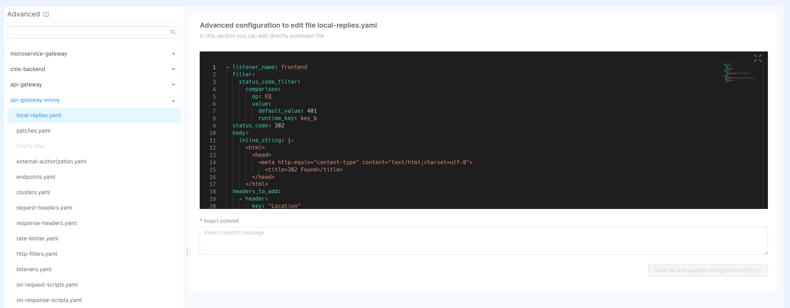
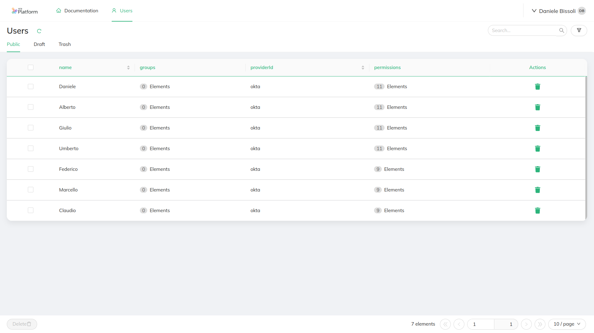
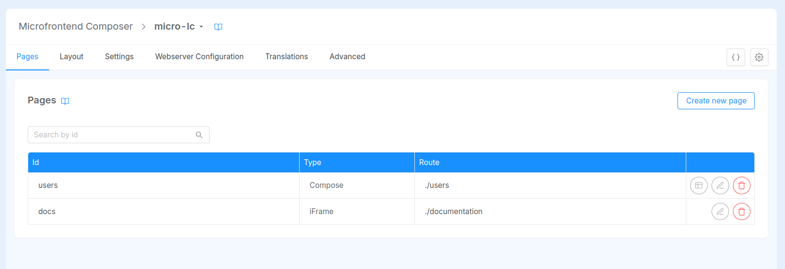
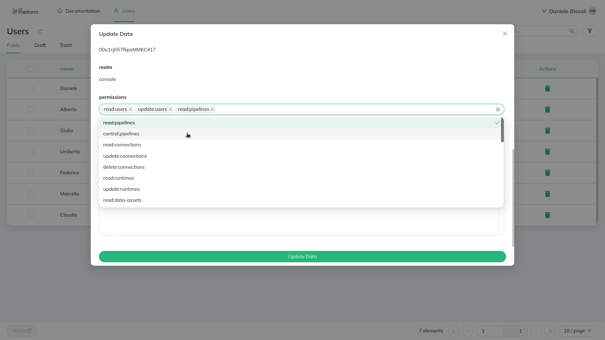

In order to ensure that only authorized people can access Fast Data Runtime Management system and consequently
visualize or change its state, it is important to properly set up a security layer.

In the following page are described the requirements and a procedure that can be executed to achieve the goal of securing Fast Data Runtime Management application.
This procedure is inspired by this [guide](/console/tutorials/configure-marketplace-components/auth-architecture/external-idp-internal-session.md)
which employs Mia-Platform Marketplace components and exploits Mia-Platform Console features.

:::note
Please, bear in mind that there are many ways for securing the access to an application and the one provided here is meant to be a streamlined guide which
may be followed, adapted according to your needs or taken just as an inspiration for building your security layer. 
:::

## Requirements

- access to [Fast Data Control Plane](/runtime_suite_applications/fast-data-control-plane/10_overview.md) application, which automatically
  scaffold the configurations regarding microservices, collections, endpoints and variables needed for controlling Fast Data
  Runtime Management solution and protecting its access. Generated resources need to be further customized depending on your needs and credentials.
- an introduction to [Envoy](https://envoyproxy.io/), which is employed as API Gateway by the application. It is also
  possible to employ [Nginx](https://www.nginx.com/) as API Gateway, though the focus of this guide is on the former.
- an Identity Provider, which manages users' identities. The one employed throughout this guide is [Okta](https://www.okta.com/),
  although any other Identity Provider supported by the Mia-Platform [Authentication Service](/runtime_suite/authentication-service/10_overview.md)
  can be adopted in place of Okta within this guide.

## Authentication Flow

In this section are described which resources should be configured in order to properly protect the access to the Fast Data
Runtime Management solution.

### Services

Upon application instantiation, the following services should have been generated for handling the authentication flow:

- [`api-gateway`](/runtime_suite/envoy-api-gateway/overview.md), which is the entrypoint of your project requests
- [`authentication-service`](/runtime_suite/authentication-service/10_overview.md), which is the service that interacts with your Identity Provider to verify your users identity
- [`crud-service`](/runtime_suite/crud-service/10_overview_and_usage.md), which allows to query via HTTP requests the underlying
database where users are stored
- `login-site`, a simple frontend employed for handling the authentication flow in user browser

#### Api Gateway

For the current use case no further configuration is needed for this service in Console _Design_ area. However, if there
is a need for updating any specific detail, please look for more information at the dedicated [documentation page](/runtime_suite/envoy-api-gateway/overview.md).

#### Authentication Service

:::caution
In order to follow through this guide it is necessary to ensure that at least version `v3.10.0` of Authentication Service has been configured.  
Earlier versions do not fully support `permissions` key in `/user-info` details and therefore they would not be retrieved
when checking for user's authorization
:::

The service configuration is created with a set of preconfigured variables, such as the connection to Redis
(see the [paragraph below](#redis-configuration)), and a config map that lists the supported applications.
Within the config map that contains the known applications it is already possible
to find the definition of an application that uses Okta as Identity Provider.

:::tip
In case you would prefer using another Identity Provider, please read the [authentication-service documentation](/runtime_suite/authentication-service/20_configuration.mdx) to learn
which ones are supported and how to configure the desired one in place of Okta.
:::

The configuration of included application only requires to set up few public and secret environment variables to be operational.
These variables are summarized in the tables below, divided for location where they should be stored. In fact, the former ones
should be added under the _Variables_ tab of _Project Overview_ area, while the latter can be configured in the _Public Variables_ of the _Design_ section.

| Secret Variable       | Explanation                                                               |
|-----------------------|---------------------------------------------------------------------------|
| CP_OKTA_CLIENT_ID     | client id obtained when registering this specific application on Okta     |
| CP_OKTA_CLIENT_SECRET | client secret obtained when registering this specific application on Okta |

| Public Variable | Explanation                                                                                                         |
|-----------------|---------------------------------------------------------------------------------------------------------------------|
| OKTA_BASE_URL   | base url where your Identity Provider is exposed                                                                    |
| CP_APP_ID       | application identifier employed when registering this specific application on Okta (e.g. `fast-data-control-plane`) |
| CP_PROVIDER_ID  | provider identifier employed when registering this specific application on Okta (e.g. `okta-development`)           |
| CP_REDIS_SCOPE  | redis scope in case of a multi-tenant architecture                                                                  |
| CP_BASE_URL     | base url where the project is exposed                                                                               |

:::note
After the creation of the Control Plane application, the public variables specified above should already appear in the
corresponding section, each of them with an empty value.
:::

Filling the variables listed above allows to generate a complete configuration at deploy time. An example of such configuration for Okta
can be fond in the panel below.

Authentication Service | Configuration Example (with variables to be interpolated)

```json title=config.json
{
  "apps": {
    "{{CP_APP_ID}}": {
      "providers": {
        "{{CP_PROVIDER_ID}}": {
          "order": 10,
          "type": "okta",
          "label": "Login with Okta",
          "clientId": "{{CP_OKTA_CLIENT_ID}}",
          "clientSecret": "{{CP_OKTA_CLIENT_SECRET}}",
          "baseUrl": "{{OKTA_BASE_URL}}",
          "authUrl": "{{OKTA_BASE_URL}}/oauth2/v1/authorize",
          "tokenUrl": "{{OKTA_BASE_URL}}/oauth2/v1/token",
          "userInfoUrl": "{{OKTA_BASE_URL}}/oauth2/v1/userinfo",
          "userSettingsURL": "{{OKTA_BASE_URL}}/enduser/settings",
          "logoutUrl": "{{OKTA_BASE_URL}}/oauth2/v1/logout",
          "scope": [
            "openid",
            "profile",
            "email",
            "offline_access"
          ]
        }
      },
      "redirectUrl": "{{CP_BASE_URL}}/web-login/oauth/callback",
      "defaultRedirectUrlOnSuccessfulLogin": "/",
      "authorizeStateRequired": true,
      "realm": "console",
      "isWebsiteApp": true,
      "issuer": "{{CP_APP_ID}}",
      "defaultGroups": []
    }
  }
}
```


In addition to previous configurations, the service needs to mount a private key as a secret. This key is employed to
sign JWTs that are set as _session id_ for authenticated users. In case the service has been instantiated through the
`Fast Data Control Plane` application, a secret has already been associated (_but not created_) to the service, which is named `authentication-service-secrets`.

:::caution
These instructions below assume that the tool employed for deploying Console projects is [`mlp`](/runtime_suite_tools/mlp/10_overview.md).
Please, remember to adapt them according to your actual deployment tool and/or secret management configuration.
:::

In order for the Console to automatically create the secret at deploy time it is then necessary to edit the file `mlp.yaml`,
that can be found within your project repository root folder, and extend it with the following entry under the `secrets` key:

```yaml title=mlp.yaml
secrets:
  # ...
  - name: "authentication-service-secrets"
    when: "always"
    data:
      - from: "literal"
        key: "private-key.pem"
        value: "{{CP_JWT_CLIENT_PRIVATE_KEY}}"
  # ...
```

This will create at deploy time a K8s secret named `authentication-service-secrets`, which will contains a property `private-key.pem` mapped
to the value of the interpolated variable `CP_JWT_CLIENT_PRIVATE_KEY`.  
To provide the proper value, please generate a private key, for example as follows,

```shell
ssh-keygen -t rsa -b 4096 -m PEM -f private.key
```

and then create the corresponding environment variable `CP_JWT_CLIENT_PRIVATE_KEY` in the _Variables_ tab of _Console Project Overview_ area.  
Finally, please ensure that on the `authentication-service`, located under the _Microservices_ section in the Console _Design_ area,
the environment `MIA_JWT_TOKEN_PRIVATE_KEY_FILE_PATH` is set to `/secrets/private-key.pem` (where the folder is driven
by the secret mount path and the file name corresponds to the `key` property set in the `mlp.yaml` configuration entry).

In case more details are needed on this latter part, please head over to the `authentication-service` [documentation page](/runtime_suite/authentication-service/30_usage.md#asymmetric-signing-algorithm-rsa256).

#### Login Site

No further configuration is needed for this service.

:::tip
In case it is needed to [embed Fast Data Control Plane solution within Mia-Platform Console](/fast_data/runtime_management/control_plane_frontend.mdx#embed-as-console-extension),
please ensure that login site version greater or equal to `v8.1.2` which supports handling authentication both via redirect and as popup
when requested from an iFrame.
:::

#### CRUD Service

No further configuration is needed for this service, other than ensuring that environment variable `MONGODB_URL` is correctly set,
that is either interpolated from a [Project Secret Variable](/console/project-configuration/manage-environment-variables/index.md) or loaded from a K8s secret.

#### Redis Configuration

In case you don't already have a Redis instance configured dedicated for authentication purposes, in the steps below it described how to configure
your own in-memory only instance:

- enter your project _Design_ area and select _Microservices_ section
- click on the button _Create a Microservice_ button and select _From Docker image_
- in the form that is opened enter `redis-auth` as name and `bitnami/redis:6.2.14` and Docker image name and click the `Create` button
- upon the service page opens, head over _Container Ports_ card and edit the predefined one to use port `6379` for _port_ and _target port_
- in the _Runtime_ card enable readiness and liveness probes on TCP port to ensure the service is working properly once released
- additionally, in the _Microservice_ card set the memory and cpu request/limits as follows:
  - memory &rarr; 15m / 50m;
  - cpu &rarr; 15m / 50m;
- now, let's move to the environment variables tab and add the following variables:
  - `REDIS_PASSWORD` set to `{{CP_REDIS_MASTER_PASSWORD}}`
- finally, switching to the _Config Maps_ tab, let's create a config map named `cp-redis-auth-configuration` that should be mounted
at `/opt/bitnami/redis/mounted-etc/`. In this config map a file named `redis.conf` should be created. Within this file it is possible
to insert the Redis configurations shown below.

  ```text title=redis.conf
  ## GENERIC ##
  port 6379
  # listen on all the interfaces for incoming connections
  bind 0.0.0.0
  
  ## NO DISK PERSISTENCE ##
  save ""
  appendonly no
  
  ## SECURITY ##
  protected-mode yes
  
  # NOTE: +@connection is necessary to be placed after -@dangerous, otherwise the user won't have the permissions to connect to Redis
  user {{CP_REDIS_USERNAME}} on +@all -@dangerous +@connection allkeys allchannels >{{CP_REDIS_PASSWORD}}
  
  # disable default user
  user default off
  ```
    
The provided Redis configuration describes disk persistence management (in-memory only) and introduce a dedicated user with their ACLs.
To complete the configuration it is necessary to create the following secret environment variables in the _Project Overview_ area:

| Secret Variable          | Explanation                                                                                                                                            |
|--------------------------|--------------------------------------------------------------------------------------------------------------------------------------------------------|
| CP_REDIS_MASTER_PASSWORD | root password to allow Redis start (not used by any service - it can be loaded from a secret when configured within the service environment variables) |
| CP_REDIS_USERNAME        | username of the Redis account to be employed by the authentication-service for accessing Redis                                                         |
| CP_REDIS_PASSWORD        | password of the Redis account to be employed by the authentication-service for accessing Redis                                                         |

### Endpoints

Below is reported the list of endpoints related to the authentication flow that are created with the instantiation of Control Plane application. Please
ensure that they are exposed with the proper security options.

| Endpoint        | Service                | Authentication Required | User Group Permission |
|-----------------|------------------------|:-----------------------:|-----------------------|
| `/web-login`    | login-site             |            -            | true                  |
| `/authorize`    | authentication-service |            -            | true                  |
| `/oauth/token`  | authentication-service |            -            | true                  |
| `/logout`       | authentication-service |            -            | true                  |
| `/refreshtoken` | authentication-service |            ✅            | true                  |
| `/userinfo`     | authentication-service |            ✅            | true                  |
| `/apps`         | authentication-service |            -            | true                  |

Knowing these endpoints are exposed, it is now possible to configure the redirect urls that some Identity Providers,
such as Okta or Auth0, require to complete the application registration.
These endpoints will be then employed during the authentication flow to constrain the redirects
the Identity Provider can perform. In this case the endpoint that should be configured are the following ones:

- Sign-in redirect URIs → `<project-base-url>/web-login/oauth/callback`
- Sign-out redirect URIs → `<project-base-url>/logout`

where `<project-base-url>` is the base url where the project of interest is exposed to.

### Collections

The authentication flow via the `authentication-service` requires also the introduction of a CRUD Collection, where
users details are saved upon successful login. These user information can then be employed in the authorization flow, which is
described later.  
By default the `Fast Data Control Plane` application creates the collection for you and instantiates the CRUD Service,
which is employed by the authentication service to access the collection. Additionally, below it is also provided the
collection definition ready for being imported, in case it may be necessary to move or replicate the collection in another Console project. 


Control Plane Users Collection Definition (import ready)

```json
{
  "data": {
    "collections": {
      "users": {
        "id": "users",
        "name": "users",
        "fields": [
          {
            "name": "_id",
            "type": "ObjectId",
            "required": true,
            "nullable": false,
            "description": "_id"
          },
          {
            "name": "creatorId",
            "type": "string",
            "required": true,
            "nullable": false,
            "description": "creatorId"
          },
          {
            "name": "createdAt",
            "type": "Date",
            "required": true,
            "nullable": false,
            "description": "createdAt"
          },
          {
            "name": "updaterId",
            "type": "string",
            "required": true,
            "nullable": false,
            "description": "updaterId"
          },
          {
            "name": "updatedAt",
            "type": "Date",
            "required": true,
            "nullable": false,
            "description": "updatedAt"
          },
          {
            "name": "__STATE__",
            "type": "string",
            "required": true,
            "nullable": false,
            "description": "__STATE__"
          },
          {
            "name": "name",
            "type": "string",
            "required": false,
            "nullable": false,
            "sensitivityValue": 0,
            "encryptionEnabled": false,
            "encryptionSearchable": false
          },
          {
            "name": "groups",
            "type": "Array_string",
            "required": false,
            "nullable": false,
            "sensitivityValue": 0,
            "encryptionEnabled": false,
            "encryptionSearchable": false
          },
          {
            "name": "username",
            "type": "string",
            "required": false,
            "nullable": false,
            "sensitivityValue": 0,
            "encryptionEnabled": false,
            "encryptionSearchable": false
          },
          {
            "name": "email",
            "type": "string",
            "required": false,
            "nullable": false,
            "sensitivityValue": 0,
            "encryptionEnabled": false,
            "encryptionSearchable": false
          },
          {
            "name": "providerId",
            "type": "string",
            "required": true,
            "nullable": false,
            "sensitivityValue": 0,
            "encryptionEnabled": false,
            "encryptionSearchable": false
          },
          {
            "name": "providerUserId",
            "type": "string",
            "required": true,
            "nullable": false,
            "sensitivityValue": 0,
            "encryptionEnabled": false,
            "encryptionSearchable": false
          },
          {
            "name": "realm",
            "type": "string",
            "required": false,
            "nullable": false,
            "sensitivityValue": 0,
            "encryptionEnabled": false,
            "encryptionSearchable": false
          },
          {
            "name": "metadata",
            "type": "RawObject",
            "required": false,
            "nullable": false,
            "sensitivityValue": 0,
            "encryptionEnabled": false,
            "encryptionSearchable": false
          },
          {
            "name": "permissions",
            "type": "Array_string",
            "required": false,
            "nullable": false,
            "sensitivityValue": 0,
            "encryptionEnabled": false,
            "encryptionSearchable": false
          }
        ],
        "internalEndpoints": [
          {
            "basePath": "/users",
            "defaultState": "PUBLIC"
          }
        ],
        "type": "collection",
        "indexes": [
          {
            "name": "_id",
            "type": "normal",
            "unique": true,
            "fields": [
              {
                "name": "_id",
                "order": 1
              }
            ]
          },
          {
            "name": "createdAt",
            "type": "normal",
            "unique": false,
            "fields": [
              {
                "name": "createdAt",
                "order": -1
              }
            ]
          },
          {
            "name": "stateIndex",
            "type": "normal",
            "unique": false,
            "fields": [
              {
                "name": "__STATE__",
                "order": 1
              }
            ]
          },
          {
            "name": "nameSearch",
            "type": "normal",
            "unique": false,
            "fields": [
              {
                "name": "email",
                "order": 1
              },
              {
                "name": "name",
                "order": 1
              },
              {
                "name": "__STATE__",
                "order": 1
              }
            ]
          },
          {
            "name": "upsertSupport",
            "type": "normal",
            "unique": false,
            "fields": [
              {
                "name": "providerId",
                "order": 1
              },
              {
                "name": "providerUserId",
                "order": 1
              },
              {
                "name": "realm",
                "order": 1
              }
            ]
          }
        ],
        "description": "Collection of users",
        "tags": [
          "collection"
        ]
      }
    }
  },
  "metadata": {
    "branchName": "master",
    "exportTimestamp": "2024-09-13T07:00:00.000Z",
    "isImported": false,
    "pathRefType": "revisions",
    "projectId": "",
    "projectName": ""
  }
}
```


### Advanced

In this section are described additional tweaks to be carried out on the API Gateway (Envoy), that enhance the interaction with
the runtime system and allow this solution to support authentication.

These modifications should be inserted in the proper file in the **Advanced** section of the Console _Design_ area, under
the key `api-gateway-envoy`.



:::note
Before proceeding, be sure to have configured Control Plane endpoints accordingly to their [specific documentation](/fast_data/runtime_management/control_plane.mdx#endpoints).
:::

#### Automatic redirect upon receiving 401 HTTP error

This configuration edit should be inserted in the file `local-replies.yml` and it enforces a redirect to the login
page every time a 401 HTTP error is encountered by the system. This ensures that the users authenticate before returning
to the page they were trying to browse.

```yml title=api-gateway-envoy/local-replies.yml
- listener_name: frontend
  filter:
    status_code_filter:
      comparison:
        op: EQ
        value:
          default_value: 401
          runtime_key: key_b
  status_code: 302
  body:
    inline_string: |-
      <html>
        <head>
          <meta http-equiv="content-type" content="text/html;charset=utf-8">
            <title>302 Found</title>
        </head>
      </html>
  headers_to_add:
    - header:
        key: "Location"
        value: "/web-login?appId={{CP_APP_ID}}&providerId={{CP_PROVIDER_ID}}&redirect=%REQ(:PATH)%"
      append: false
    - header:
        key: "Set-Cookie"
        value: "sid=; Max-Age=0"
      append: false
```

:::note
If you're using API Gateway with Nginx, please consider using [this approach for automatic redirects](/runtime_suite_applications/secure-api-gateway/20_configuration.md#nginx).
:::

## Authorization Flow

In this section are described which resources and permissions should be configured in order to properly grant the access
to the Fast Data Runtime Management solution only to authorized users.

### Services

Upon application instantiation, the following services should have been generated for handling the authorization flow within your project:

- [`authentication-service`](/runtime_suite/authorization-service/10_overview.md), which is in charge of verifying whether an
authenticated user has been granted the permissions to access the resource they are requesting. This service works in tandem
with `api-gateway` and `authentication-service` to fulfill its role;

#### Authorization Service

This service is introduced when creating the application and it is already preconfigured with all the necessary configurations.
In case the service already exists in your project, please ensure the following environment variables on the service contain
the these values below:

| Environment Variable     | Value                                                                                                                                          |
|--------------------------|------------------------------------------------------------------------------------------------------------------------------------------------|
| HEADERS_TO_PROXY         | connection,upgrade,sec-websocket-protocol,sec-websocket-version,x-request-id,request-id,cookie,authorization,client-type,host,x-forwarded-host |
| USERINFO_URL             | http://authentication-service/userinfo                                                                                                         |
| USER_PROPERTIES_TO_PROXY | provider,email,username,name,permissions,metadata                                                                                              |

In order to support real-time updates in the Fast Data Runtime Management system, it is important to allow proxying the following
headers:
- [`connection`](https://developer.mozilla.org/en-US/docs/Web/HTTP/Headers/Connection)
- [`upgrade`](https://developer.mozilla.org/en-US/docs/Web/HTTP/Headers/Upgrade)
- [`sec-websocket-protocol`](https://developer.mozilla.org/en-US/docs/Web/HTTP/Protocol_upgrade_mechanism#websocket-specific_headers)
- [`sec-websocket-version`](https://developer.mozilla.org/en-US/docs/Web/HTTP/Protocol_upgrade_mechanism#websocket-specific_headers)

In addition, `USER_PROPERTIES_TO_PROXY` must be edited to include also `permissions` key, so that `permissions` property is loaded, checked
and then forwarded to the underlying components.

### Endpoints

In addition to the endpoints described in the [Authentication Flow](#endpoints) section, here are described the ones that expose
all the functionalities of Fast Data Runtime Management system, both the frontend and backend components.

| Endpoint         | Service          | Authentication Required  | User Group Permission              |
|------------------|------------------|:------------------------:|------------------------------------|
| `/fast-data`     | fabric-bff       |            ✅            | `false`                            |
| `/control-plane` | control-plane-fe |            ✅            | `true`                             |

### Routes

In order to finely control which operations a user can carry out over Control Plane APIs, a set of permissions has been devised, which
is listed here:

| Permission          | Context                                                                                  |
|---------------------|------------------------------------------------------------------------------------------|
| `read:pipelines`    | allows listing runtimes, their status and visualizing their pipelines list and structure |
| `control:pipelines` | enables changing pipelines state (`pause` / `resume`)                                    |
| `update:runtimes`   | enables creating, updating or deleting runtime views                                     |
| `read:users`        | enables a user to access the user management application in read-only mode               |
| `update:users`      | enables a user to edit users details in the user management application                  |

:::caution
Please, beware that:
- these **permissions are Company-wise**, that is once a user gets the permissions to update a pipeline state, it can
change it for all the pipelines. Currently, there is no filter mechanism that allows a user to manage only Fast Data Runtimes of projects
they can access to;
- the **default permissions configuration make them independent one from another**. A users needs to obtain both
_read_ and _update_ permissions to use all the _Control Plane UI_ features and fully manage Fast Data Runtimes.  
For example, a user with `control:pipelines` permissions can effectively change the state of a pipeline, but only in case it knows
the pipeline identifier beforehand, since it cannot list the existing pipelines; 
:::

The permissions described in the table above needs then to be applied to all the different routes exposed by Control Plane application,
so that each operation is covered with the correct grant.

| Endpoint                                  | Type      | Method | User Group Permissions             |
|-------------------------------------------|-----------|--------|------------------------------------|
| `/fast-data/feedback`                     | Websocket | HEAD   | `permissions["read:pipelines"]`    |
| `/fast-data/feedback`                     | Websocket | GET    | `permissions["read:pipelines"]`    |
| `/fast-data/control`                      | REST      | HEAD   | `permissions["control:pipelines"]` |
| `/fast-data/control`                      | REST      | POST   | `permissions["control:pipelines"]` |
| `/fast-data/runtimes/items`               | REST      | GET    | `permissions["read:pipelines"]`    |
| `/fast-data/runtimes/items`               | REST      | POST   | `permissions["update:runtimes"]`   |
| `/fast-data/runtimes/items/:id`           | REST      | GET    | `permissions["read:pipelines"]`    |
| `/fast-data/runtimes/items/:id`           | REST      | PATCH  | `permissions["update:runtimes"]`   |
| `/fast-data/runtimes/items/:id`           | REST      | DELETE | `permissions["update:runtimes"]`   |
| `/fast-data/runtimes/items/:id/pipelines` | REST      | GET    | `permissions["read:pipelines"]`    |
| `/fast-data/runtimes/stats`               | REST      | GET    | `permissions["read:pipelines"]`    |

:::caution
Please ensure that all these endpoints and subsequent routes are set with _Authentication Required_ in their security details tab.
:::

Furthermore, when **publicly** exposing the gRPC services of main Control Plane instance, we recommend to introduce a security measure to prevent
unwanted communications. This can be obtained by setting a [Basic Authentication](https://developer.mozilla.org/en-US/docs/Web/HTTP/Authentication#basic_authentication_scheme)
on your ingress controller or an [API key](/development_suite/api-console/api-design/api_key.md) to be verified by the Authorization Service.

Configuration of an API Key can be carried out directly in Console as explained [here](/development_suite/api-console/api-design/api_key.md#create-a-new-api-key),
whereas in this [documentation page](/development_suite/api-console/api-design/endpoints.md#manage-the-security-of-your-endpoints) is explained
how to protect an endpoint with it.
In the table below are listed which exposed endpoints should be protected by API Key,
assuming the name assigned to the `clientType` is `control_plane_operator`:

| Endpoint                                    | Type | API Key required | User Group Permissions                   |
|---------------------------------------------|------|:----------------:|------------------------------------------|
| `/grpc.reflection.v1.ServerReflection`      | gRPC |     &check;      | `clientType == "control_plane_operator"` |
| `/grpc.reflection.v1alpha.ServerReflection` | gRPC |     &check;      | `clientType == "control_plane_operator"` |                                                             |
| `/control_plane_fabric.RuntimeManagement`   | gRPC |     &check;      | `clientType == "control_plane_operator"` |
| `/control_plane_fabric.ControlPlane`        | gRPC |     &check;      | `clientType == "control_plane_operator"` |
| `/control_plane_fabric.FastDataControl`     | gRPC |     &check;      | `clientType == "control_plane_operator"` |

:::tip
Upon securing gRPC endpoints with an API Key, please remember to [add the needed header](/fast_data/runtime_management/control_plane_operator.mdx#upstream)
(`secret`) to the configuration of all your _Control Plane Operators_.
:::

## Users Management

Controlling which users can access the Fast Data Runtime Management system and their assigned permissions can be done either
via directly editing database records or calling CRUD Service APIs. However, having a front-end to execute these actions
would be a nice add-on to simplify these actions and to reduce errors related to possible mis-configurations.

This can be achieved thanks to the [Microfrontend Composer](/microfrontend-composer/what-is.md) tool, which allows crafting
and configuring web pages and applications. In particular, it is possible to build the pages for listing the users,

An example of application that can be created is shown in the picture below:



> Example of Users Management UI that is generated by the Fast Data Control Plane application


### Microfrontend Composer

:::caution
In order to use Microfrontend Composer in Console it is necessary to purchase the dedicated license. For more information, please ask to your Mia-Platform referent. Nonetheless,
the application will create tha _user management_ pages, but those won't be easily editable from the Composer configurator.
:::

Upon application instantiation, a predefined set of web pages are created and ready to be used once the project is deployed.
In case you would like to customize those pages here are provided their configuration, one for control plane users, one for
the roles and one for their bindings. These configuration can be loaded either as config map of [micro-lc](https://micro-lc.io/docs/) service
or within the advanced tab of the corresponding page in the Composer.


Control Plane Users Page

```json title=users-config.json
{
  "definitions": {
    "dataSchema": {
      "type": "object",
      "required": [
        "providerId",
        "providerUserId"
      ],
      "properties": {
        "_id": {
          "formOptions": {
            "hiddenOnInsert": true,
            "readOnlyOnUpdate": true
          },
          "type": "string",
          "visualizationOptions": {
            "hidden": true
          }
        },
        "creatorId": {
          "formOptions": {
            "hiddenOnInsert": true,
            "readOnlyOnUpdate": true,
            "disabled": false,
            "hidden": true
          },
          "type": "string",
          "visualizationOptions": {
            "hidden": true
          }
        },
        "createdAt": {
          "formOptions": {
            "hiddenOnInsert": true,
            "readOnlyOnUpdate": true,
            "disabled": false,
            "hidden": true
          },
          "dateOptions": {
            "displayFormat": "YYYY-MM-DD hh:mm"
          },
          "format": "date-time",
          "type": "string",
          "visualizationOptions": {
            "hidden": true
          }
        },
        "updaterId": {
          "formOptions": {
            "hiddenOnInsert": true,
            "readOnlyOnUpdate": true,
            "hiddenOnUpdate": true
          },
          "type": "string",
          "visualizationOptions": {
            "hidden": true
          }
        },
        "updatedAt": {
          "formOptions": {
            "hiddenOnInsert": true,
            "readOnlyOnUpdate": true,
            "hiddenOnUpdate": false,
            "hidden": true
          },
          "dateOptions": {
            "displayFormat": "YYYY-MM-DD hh:mm"
          },
          "format": "date-time",
          "type": "string",
          "visualizationOptions": {
            "hidden": true
          }
        },
        "__STATE__": {
          "enum": [
            "PUBLIC",
            "DRAFT",
            "TRASH",
            "DELETED"
          ],
          "formOptions": {
            "readOnlyOnUpdate": true,
            "readOnly": false,
            "placeholder": "PUBLIC"
          },
          "type": "string",
          "visualizationOptions": {
            "hidden": true
          }
        },
        "name": {
          "type": "string",
          "formOptions": {
            "readOnly": true
          }
        },
        "groups": {
          "type": "array",
          "items": {
            "type": "string"
          }
        },
        "username": {
          "type": "string",
          "formOptions": {
            "readOnly": true
          },
          "visualizationOptions": {
            "hidden": true
          }
        },
        "email": {
          "type": "string",
          "formOptions": {
            "readOnly": true
          },
          "visualizationOptions": {
            "hidden": true
          }
        },
        "providerId": {
          "type": "string",
          "formOptions": {
            "readOnly": true
          }
        },
        "providerUserId": {
          "type": "string",
          "formOptions": {
            "readOnly": true
          },
          "visualizationOptions": {
            "hidden": true
          }
        },
        "realm": {
          "type": "string",
          "formOptions": {
            "readOnlyOnInsert": false,
            "readOnly": true
          },
          "visualizationOptions": {
            "hidden": true
          }
        },
        "permissions": {
          "type": "array",
          "items": {
            "type": "string",
            "enum": [
              "read:pipelines",
              "control:pipelines",
              "update:runtimes",
              "read:data-assets",
              "update:metadata-assets",
              "read:users",
              "update:users"
            ]
          },
          "dataSchema": {
            "type": "array",
            "items": {
              "type": "string",
              "enum": [
                "read:pipelines",
                "control:pipelines",
                "update:runtimes",
                "read:data-assets",
                "update:metadata-assets",
                "read:users",
                "update:users"
              ]
            }
          }
        },
        "metadata": {
          "type": "object",
          "visualizationOptions": {
            "hidden": true
          }
        }
      }
    }
  },
  "content": {
    "content": [
      {
        "content": [
          {
            "tag": "div",
            "content": [
              {
                "properties": {
                  "content": "Users"
                },
                "tag": "bk-title"
              },
              {
                "tag": "bk-refresh-button",
                "attributes": {
                  "style": "margin-left: 14px; align-self: end;"
                }
              },
              {
                "tag": "div",
                "attributes": {
                  "style": "flex-grow: 1;"
                }
              },
              {
                "properties": {
                  "placeholder": "Search..."
                },
                "tag": "bk-search-bar"
              },
              {
                "properties": {
                  "content": "",
                  "clickConfig": {
                    "type": "event",
                    "actionConfig": {
                      "label": "filter",
                      "payload": {}
                    }
                  },
                  "type": "outlined",
                  "iconId": "FunnelPlotOutlined"
                },
                "tag": "bk-button"
              }
            ],
            "attributes": {
              "style": "display: flex; flex-direction: row; gap: 10px; padding: 0 20px;"
            }
          },
          {
            "tag": "div",
            "attributes": {
              "style": "width: 100%; display: flex; justify-content: space-between;"
            },
            "content": [
              {
                "attributes": {
                  "style": "flex-grow: 1;"
                },
                "properties": {
                  "tabs": [
                    {
                      "key": "public",
                      "title": "Public",
                      "filters": [
                        {
                          "property": "__STATE__",
                          "operator": "equal",
                          "value": "PUBLIC"
                        }
                      ],
                      "order": 0
                    },
                    {
                      "title": "Draft",
                      "key": "draft",
                      "order": 2,
                      "filters": [
                        {
                          "property": "__STATE__",
                          "operator": "equal",
                          "value": "DRAFT"
                        }
                      ]
                    },
                    {
                      "title": "Trash",
                      "filters": [
                        {
                          "property": "__STATE__",
                          "operator": "equal",
                          "value": "TRASH"
                        }
                      ],
                      "order": 3,
                      "key": "trash"
                    }
                  ]
                },
                "tag": "bk-tabs"
              },
              {
                "attributes": {
                  "style": "margin-right: 4px"
                },
                "properties": {
                  "dataSchema": {
                    "$ref": "#/definitions/dataSchema"
                  },
                  "filters": []
                },
                "tag": "bk-filters-manager"
              }
            ]
          },
          {
            "tag": "div",
            "attributes": {
              "style": "padding: 0 20px;"
            },
            "content": {
              "tag": "bk-breadcrumbs",
              "properties": {
                "dataSchema": {
                  "$ref": "#/definitions/dataSchema"
                }
              }
            }
          }
        ],
        "tag": "header",
        "attributes": {
          "style": "display: flex; flex-direction: column; padding-top: 10px; background-color: white;"
        }
      },
      {
        "content": [
          {
            "properties": {
              "dataSchema": {
                "$ref": "#/definitions/dataSchema"
              },
              "rowActions": {
                "kind": "icons",
                "actions": [
                  {
                    "label": "Delete",
                    "icon": "fas fa-trash",
                    "kind": "event",
                    "content": "delete-data",
                    "meta": {
                      "actionId": "delete-data"
                    },
                    "requireConfirm": true
                  }
                ]
              },
              "fitParentContainer": true
            },
            "tag": "bk-table"
          },
          {
            "properties": {
              "requireConfirm": {
                "onClose": true,
                "onSave": true
              },
              "dataSchema": {
                "$ref": "#/definitions/dataSchema"
              },
              "width": "70vw",
              "allowObjectAsTable": false,
              "editorHeight": "30vh",
              "allowNavigation": true
            },
            "tag": "bk-form-modal"
          },
          {
            "tag": "bk-confirmation-modal"
          },
          {
            "properties": {
              "rootElementSelectors": "main.micro-lc-layout-content",
              "successEventMap": {
                "create-data": {
                  "title": "Success",
                  "content": "Data successfully created",
                  "type": "success"
                },
                "update-data": {
                  "title": "Success",
                  "content": "Data successfully updated",
                  "type": "success"
                },
                "delete-data": {
                  "title": "Success",
                  "content": "Data successfully deleted",
                  "type": "success"
                }
              },
              "errorEventMap": {
                "create-data": {
                  "title": "Error",
                  "content": "An error occurred during order creation",
                  "type": "error"
                },
                "update-data": {
                  "title": "Error",
                  "content": "An error occurred during order updated",
                  "type": "error"
                },
                "delete-data": {
                  "title": "Error",
                  "content": "An error occurred during order deletion",
                  "type": "error"
                }
              }
            },
            "tag": "bk-notifications",
            "attributes": {}
          }
        ],
        "tag": "main",
        "attributes": {
          "style": "flex-grow: 1; background-color: #f0f2f5; padding: 20px; overflow-y: auto;"
        }
      },
      {
        "content": [
          {
            "properties": {
              "dataSchema": {
                "$ref": "#/definitions/dataSchema"
              },
              "width": "40vw"
            },
            "tag": "bk-filter-drawer"
          }
        ],
        "tag": "aside"
      },
      {
        "content": [
          {
            "tag": "bk-bulk-delete"
          },
          {
            "tag": "bk-bulk-actions",
            "properties": {
              "dataSchema": {
                "$ref": "#/definitions/dataSchema"
              }
            }
          },
          {
            "tag": "div",
            "attributes": {
              "style": "flex-grow: 1;"
            }
          },
          {
            "tag": "bk-footer",
            "attributes": {
              "style": "display: flex; justify-content: end; align-items: center;"
            }
          },
          {
            "tag": "bk-pagination",
            "properties": {
              "pageSize": 10
            }
          }
        ],
        "tag": "footer",
        "attributes": {
          "style": "display: flex; flex-direction: row; flex-wrap: wrap; padding: 10px 20px; background-color: white; gap: 10px; position: sticky; bottom: 0; z-index: 10"
        }
      },
      {
        "properties": {
          "basePath": "/v2/authz/users",
          "dataSchema": {
            "$ref": "#/definitions/dataSchema"
          }
        },
        "tag": "bk-crud-client"
      }
    ],
    "tag": "div",
    "attributes": {
      "style": "width: 100%; height: 100%; display: flex; flex-direction: column; position: relative;"
    }
  },
  "sources": [
    "https://cdn.mia-platform.eu/backoffice/bk-web-components/{{BACK_KIT_VERSION}}/dist/bk-web-components.esm.js"
  ]
}
```




The screenshot above shows what the Composer tool should look like based on the application configuration.
Before deploying, please verify that micro-lc public variables have been created, that are:

| Public Variable          | Current Version Value | Minimum Version Value |
|--------------------------|-----------------------|-----------------------|
| MICRO_LC_VERSION         | 2.4.0                 | 2.4.0                 |
| MICRO_LC_MANAGER_VERSION | 3.1.1                 | 3.1.1                 |
| BACK_KIT_VERSION         | 1.5.6                 | 1.5.6                 |

These variables are employed by the Console to define the version of the service and libraries used by micro-lc at deploy time.
They can be upgraded whenever an update is available.

### Endpoints

Here are reported the endpoints that should be exposed from the project in order to enable users managements: 

| Endpoint                   | Service    | Authentication Required | User Group Permission                                          |
|----------------------------|------------|:-----------------------:|----------------------------------------------------------------|
| `/micro-lc-configurations` | micro-lc   |            ✅            | `true`                                                         |
| `/mgmt`                    | micro-lc   |            ✅            | `true`                                                         |
| `/authz/users`             | crud       |            ✅            | `permissions["read:users"]` \|\| `permissions["update:users"]` |

### Routes

In additions to endpoints definitions provided above, in order to further refine who can manage the users and their permissions for Fast Data
Runtime Management system, each endpoint sub-route should define the specific permission grant that user require to own in order to
successfully access the requested resource. The following table provides a recap of each route with the needed permissions. 

| Endpoint                  | Type | Method | User Group Permissions                                         |
|---------------------------|------|--------|----------------------------------------------------------------|
| `/mgmt/users`             | REST | GET    | `permissions["read:users"]` \|\| `permissions["update:users"]` |
| `/authz/users/`           | REST | GET    | `permissions["read:users"]`                                    |
| `/authz/users/export`     | REST | GET    | `permissions["read:users"]`                                    |
| `/authz/users/count`      | REST | GET    | `permissions["read:users"]`                                    |
| `/authz/users/:id`        | REST | GET    | `permissions["read:users"]`                                    |
| `/authz/users/`           | REST | POST   | `permissions["update:users"]`                                  |
| `/authz/users/bulk`       | REST | POST   | `permissions["update:users"]`                                  |
| `/authz/users/upsert-one` | REST | POST   | `permissions["update:users"]`                                  |
| `/authz/users/state`      | REST | POST   | `permissions["update:users"]`                                  |
| `/authz/users/:id/state`  | REST | POST   | `permissions["update:users"]`                                  |
| `/authz/users/`           | REST | DELETE | `permissions["update:users"]`                                  |
| `/authz/users/:id`        | REST | DELETE | `permissions["update:users"]`                                  |
| `/authz/users/`           | REST | PATCH  | `permissions["update:users"]`                                  |
| `/authz/users/`           | REST | PATCH  | `permissions["update:users"]`                                  |

:::caution
Please ensure that all these endpoints and routes are set with _Authentication Required_ in their security details tab.
:::

### The First User

Upon releasing this user management solution, the users table will be empty. Consequently, nobody may enter
the application from frontend at the beginning. To grant the permissions to the `admin` user, that is the one that usually first
performs the login procedure, it is necessary to either edit the database record associated to such user and insert the needed permissions,
or to temporarily remove the permissions from `/authz/users/` endpoint's routes till at least the first user
has been granted the read/edit users permissions.

Below is presented the procedure to grant the needed permissions for managing users of Fast Data Control Plane application.

Let's start by observing a record of `users` collection:

```json
{
  "_id" : ObjectId("6606e94a0e85630ccda72486"),
  "__STATE__" : "PUBLIC",
  "providerId" : "okta",
  "providerUserId" : "user-id",
  "realm" : "my-kingdom",
  "createdAt" : ISODate("2024-03-29T16:00:00.000+0000"),
  "creatorId" : "public",
  "email" : "alice@platform.world",
  "groups" : [],
  "name" : "Alice",
  "updatedAt" : ISODate("2024-09-13T14:00:00.000+0000"),
  "updaterId" : "public",
  "username" : "",
  "permissions": [
    // add here the necessary permissions, such as "read:users", "update:users"
  ]
}
```

The above document is created the first time a user logs in through the configured Authentication Flow. As it can be seen,
the user does not belong to any `groups` nor it owns any `permissions`. In order to grant `Alice` the rank of _user master_ (admin)
it is sufficient to add these permissions as strings to the `permissions` array:

- `read:users`
- `update:users`

Afterward, `Alice` user needs to log out of the application and login again to obtain such permissions
and be able to manage further application users.

:::note
We acknowledge this procedure of managing users does not provide a seamless experience.
We are working to improve this and reduce configuration friction.
:::

### Managing User Permissions

Every time a user logs in for the first time in the Fast Data Control Plane application, the _users_ collection
is filled with the corresponding user record. Consequently, in order for them to be able to access Fast Data Control Plane
features they need to receive the proper permissions, that can be granted through the dedicated UI.

Opening the [users management frontend](#users-management), which can be reached by default at the path `/mgmt/users` under the domain
exposed by your Mia-Platform Console project, the first thing that be observed is the users table. This
table lists all the users that ever logged in Fast Data Control Plane application, alongside their details and permissions.

To update a user's permissions, please search for such user and click on its entry in the table. It will open a modal window
showing a set of user's details and scrolling it will be possible to access the list of permissions.


> Modal window showing the `permissions` field with the values that can be set in the array

Once the needed permissions are added to the `permissions`, click the _Update Data_ button to store the changes.
Now, the user who has just received the new permissions **must log out and login again** to be able to access Fast Data
Control Plane UI with the new set of grants.
