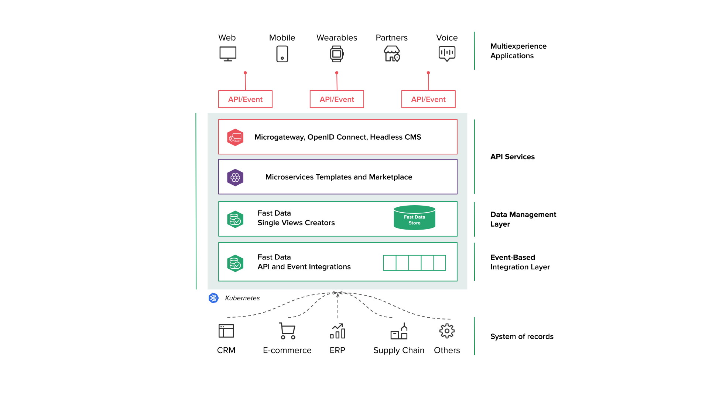
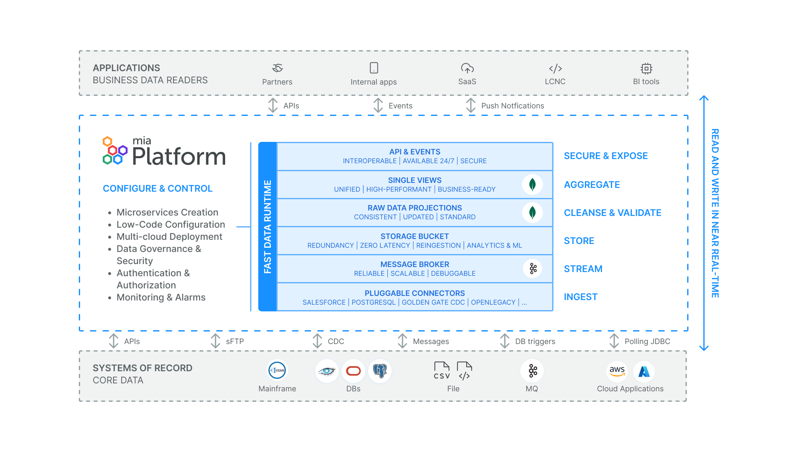

In this page you will learn what is **Mia-Platform Fast Data**, its main concepts and:

* Why Fast Data is important for the **evolution of your business**.
* Fast Data **improves the data management**.
* The role of Fast Data to accomplish your *Data Integration Hub*.
* How Fast Data **is different** from similar products.
* **GDPR**

## Product overview

Business is changing rapidly with companies aiming to provide seamless digital experiences across numerous touchpoints and applications. APIs are crucial in this scenario, as they enable data exposure from different sources to various channels.

Mia-Platform Fast Data let you to decouple your data from different sources, that we call **Systems of Record** (SoRs), aggregate them into a single MongoDB collection called **Single View** than can be easily queried by your APIs and thus build your out-of-the-box **Digital Integration Hub** (DIH). The consolidation is performed only when the source data changes, ensuring read operations are blazing fast since the data is pre-aggregated.

The aggregation is performed using an important intermediary collection known as **Projection**. This collection is a standardized version of the original data, featuring only the fields of interest and *casting* them into a common format. For example, while your data sources might use various date formats, proper configuration allows you to unify them into a single format used across all Projections.

Additionally, Mia-Platform Fast Data offers pre-built microservices and a user-friendly interface for setting up data flows in a low-code manner. This approach allows you to get started quickly and efficiently.

Visit **[this page](/fast_data/concepts/architecture.md)** to learn more about the architecture of Mia-Platform Fast Data.

## Why Fast Data

Mia-Platform Fast Data combines **Data Mesh** and **Data Fabric** strategy, leveraging a suite of highly configurable tools that integrate the advantages of **Internal Developer Platform** while operationalizing your own **Digital Integration Hub**.

Data Mesh architecture is a decentralized alternative to central data lakes. It organizes data by specific business domains, giving domain teams ownership and accountability for their data, which enhances data quality and governance. Data Mesh allows teams to independently scale their data systems using the technologies and tools that best fit their needs.

Data Fabric is an adaptive, flexible, and secure integrated data architecture that provides a unified view of data across various sources, addressing challenges faced by data lakes. It simplifies data integration, transformation, and movement, allowing for faster and more efficient data access

### Legacy system offloading

Working with legacy systems to build services that rely on fragmented data from non-scalable, load-heavy environments can present several challenges. When accessing and aggregating data from various systems on demand, you may encounter issues such as:

* Increased response times.
* High CPU/memory usage due to the growing number of queries.
* Network congestion.

Mia-Platform Fast Data addresses these challenges by providing a solution where legacy systems are complemented by synced and transformed counterparts known as Projections, and aggregated versions stored in Single Views. These collections are maintained in MongoDB, which alleviates the need to repeatedly query and request for access to your DBs. Instead, the legacy systems are only required to send updates as events occur.

### 24/7 operations

Mia-Platform Fast Data ensures uninterrupted access to real-time data, available 24/7, even during maintenance or system downtime. Our solution ensures that data provisioning remains seamless and reliable, leveraging a resilient data layer that operates continuously regardless of API availability or system status. This setup allows channels to be served and critical information to be accessed without interruption, ensuring that your data remains accessible and operational around the clock.

### Data standardization

As mentioned before in Product overview section, Mia-Platform Fast Data gathers data from different System of Records (APIs, CDC, DB triggers etc.) and aggregates them into a single MongoDB collection called Single View, according to your business model.
With this data standardization process, your data is transformed into the exact format you require, ensuring consistency and compatibility across all datasets. This streamlined approach facilitates seamless data sharing with various channels and applications integrated with Mia-Platform Fast Data. As a result, you can efficiently distribute standardized data, enhancing interoperability and reducing the complexity typically associated with data exchange between disparate systems.

### Up-to-date picture of fast-changing data

By maintaining your data consistently synchronized across all systems, with Mia-Platform Fast Data you ensure that every application and service have access to the most up-to-date and accurate information. The Single View, a document that consolidates data from one or more Projections, is refreshed whenever any Projection contributing data to it is modified, ensuring that aggregation occurs immediately upon data changes rather than during query time.
This alignment not only enhances operational efficiency but also significantly improves the user experience by providing reliable, timely data. Users benefit from faster response times, fewer errors, and a seamless interaction with your services, ultimately leading to higher satisfaction and trust in your system's capabilities.

### Making your company a Digital Platform

SQL data residing in legacy systems can be quite challenging to integrate in modern systems. Moving data to MongoDB with the help of Fast Data, you will unlock the potential to become a real Digital Platform. Specifically, you will be able to:

* Automatically expose the data through API, thanks to the CRUD service.
* Automatically generate API and data documentation, thanks to the API Portal.
* Scale horizontally with ease, thanks to MongoDB architecture.

With these new tools your company can grow faster than ever, become more connected, and fully become omnichannel.

## Fast Data improves the data management

Mia-Platform Fast Data makes data management operations less complex and more 'user friendly'. In this section, we introduce you to the technologies that make all this possible.

### Ready-to-Use Data Connectors

Mia-Platform Fast Data utilizes an event streaming platform to ingest messages about changes within your systems (e.g., create, update, or delete operations) in near real-time. The components responsible for transmitting these changes to the event streaming platform are known as **[connectors](/fast_data/connectors/overview.md)**.
A connector monitors changes in the data sources and forwards them to one or more Kafka topics. The data is then processed on parallel queues and converted into a format compatible with Mia-Platform Fast Data. This decouples data reading from processing, enhancing reliability and robustness.

You can either develop a custom connector tailored to your specific needs or use one of the connectors available in the **[Mia-Platform Marketplace](/marketplace/overview_marketplace.md)**.

### No Code / Low Code Data management

Mia-Platform Fast Data implements its own data management logic that lets you save time during setup. We are talking about **No Code / Low Code (NC/LC)** functionalities.
This system leverages two core principles: No Code Fast Data and Low Code Fast Data.

With **No Code** functionality, you can configure your project quickly with minimal manual intervention. From Mia-Platform Console v10.6.0 onward, enabling the No Code feature (which may require coordination with your System Administrator) allows you to define relationships between projections within the ER Schema.
With **Low Code**, you only need to:
1. Define relationships between Projections in the ER Schema.
2. Specify which projection changes trigger updates to specific Single Views.
3. Provide a declarative definition of Single Views, based on Projection fields and other flexible options.

For further information about our No Code / Low Code logic, please visit the **[dedicated page](/fast_data/no_code_overview.md)**.

### Control Plane

Control Plane is essential for monitoring and governing the execution of Mia-Platform Fast Data pipelines across various runtime environments:

* Monitor the status of various runtime pipelines.
* Using a dedicated frontend, users can resume or stop pipeline components by sending commands to the underlying microservices.
* Collect feedback from workloads to verify their operational status within the associated pipelines.

For more information about Control Plane configuration, visit **[this page](/fast_data/runtime_management/control_plane.mdx)**. 

## Fast Data to accomplish your Data Integration Hub

Mia-Platform allows you to set up and deploy your end-to-end **Digital Integration Hub-enabled API platform**, as mentioned in the **[Gartner® Hype Cycle™ for Application Architecture and Integration, 2022](https://mia-platform.eu/news-en/gartner-application-architecture-and-integration/)**.

Digital Integration Hub is an important architectural component offering low-latency, high-throughput data access via APIs and event-based mechanisms. It separates SoRs sources from external channels through a data management layer that ensures data synchronization using event-driven patterns.

Key benefits are:
* Access aggregated real-time data scattered across SoRs.
* Upgrade legacy systems with minimal disruption to the API layer.
* Ensure continuous data provisioning 24/7, even when some APIs are temporarily unavailable.
* Maintain data availability 24/7, even when systems are offline for scheduled maintenance.
* Serve channels with a persistent data layer, ensuring access even during system downtimes.
* Reduce the load on costly SoRs by offloading tasks to API services.
* Facilitate data integration by forwarding DIH data to other endpoints.
* Offer real-time connectors for data analytics and business intelligence (BI) applications.

## How is Fast Data different from similar products?

"ETL" systems (Extract, Transform, Load) have been industry standards for decades, forming a core component of data management.
What differentiates Mia-Platform Fast Data is its ease of setup through **No Code / Low Code** functionality, full customizability via JavaScript code as configured, and its integration within an **ecosystem** that provides all necessary tools for maximizing standardized and aggregated data.

Moreover, you can build your Data Product utilizing a suite of tools specifically engineered to optimize Data acquisition and pipeline efficiency, for example: 
* **[Data Catalog](/data_catalog/overview.mdx)**: a command-line interface binary designed to query data sources for their schemas and transmit them to a target location. Data Catalog acts as a driver for collecting and unifying views of tables and collections from various sources (SoRs).
* **[Bucket Storage Support](/fast_data/bucket_storage_support/overview.md)** allows messages passing through a channel to be stored in an external storage system, such as a Google Cloud Storage bucket or any bucket compatible with the Amazon AWS S3 interface.
* **[Flow Manager Service](/console/tutorials/configure-marketplace-components/flow-manager.md)**: a saga orchestrator, capable of managing workflows structured using the Saga Pattern architectural framework.
* **[CRUD Service](/runtime_suite/crud-service/10_overview_and_usage.md)**: its purpose is to abstract Data Collections, enabling developers to easily, scalably, and securely expose CRUD APIs over the database.

Visit the **[Mia-Platform Marketplace](/marketplace/overview_marketplace.md)** page where you can find other useful ready-to-use plugins.

Fast Data is used in production by many large companies, with millions of events handled every day, so you can be confident it is a reliable solution.

## GDPR

Mia-Platform Fast Data services may log the primary keys of your projections, single views, and Kafka message keys. Ensure these do not contain sensitive information to comply with GDPR policies. If they do, configure topic retentions according to the regulations and notify the Mia-Platform referent to adjust log retention settings accordingly.
