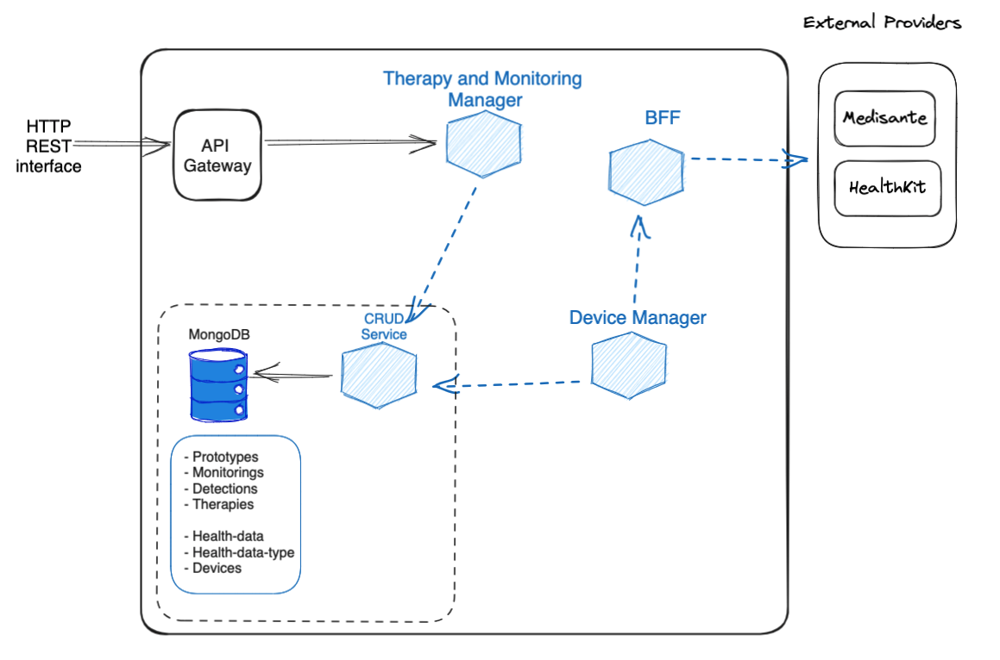

The **Therapy & Device Module** provides developers with a pre-made but extensible solution to set up Therapy and Monitoring Manager, and Device Manager.

This Therapy and Device release is meant to create an application for quickly set up the Therapy and monitoring module to exploit all the Therapy and Monitoring Manager functionalities, Device Module to exploit all the Device Manager functionalities and have the related FE interface as demo portal.

The module is packaged as a Mia-Platform Application, enabling developers to configure everything in just a few steps and have all the services up and running.

It installs the [Therapy and Monitoring Manager Service][mia-therapy-and-monitoring-manager] and its dependencies. The therapy and monitoring manager (TMM) is a service enabling health care professionals to manage patients therapies and monitor patients health conditions, adherence and compliance to therapy.
It also installs [Device Manager][mia-device-manager] and its dependencies. The device manager is a service that integrates the data from medical devices and wearables and make it available through the portal.
This is the list of the installed microservices:

- [Therapy and Monitoring Manager][mia-therapy-and-monitoring-manager]
- [Device Manager][mia-device-manager]
- [API Gateway][mia-api-gateway]
- [CRUD Service][mia-crud-service]

Finally, a BFF is installed to act as the module interface for the external providers.

## Module Architecture

This is an high level overview of the TDM:

*Overview of Therapy and Device Module architecture, based on an Http REST interface.*

All data, with the exception of users, is handled by the [CRUD Service][mia-crud-service], which is a thin layer API built over a [MongoDB][mongodb] database.
These are the database collections in the **Therapy and Monitoring Manager**. You can read more on [Therapy and Monitoring Manager][mia-therapy-and-monitoring-manager-crud] configuration documentation:
- Prototypes
- Monitoring
- Detections
- Therapies

Details about the devices, health data and their schemas are in the [Device Manager][mia-device-manager-crud] configuration documentation.
These are the database collections in Device Manager:
- HealthDataTypes
- HealthData
- Devices

[mia-therapy-and-monitoring-manager]: /runtime_suite/therapy-and-monitoring-manager/20_configuration.md
[mia-therapy-and-monitoring-manager-crud]: /runtime_suite/therapy-and-monitoring-manager/20_configuration.md#crud-collections
[mia-device-manager-crud]: /runtime_suite/device-manager/20_configuration.md#crud-collections

[mia-therapy-and-monitoring-manager]: /runtime_suite/therapy-and-monitoring-manager/20_configuration.md
[mia-device-manager]: /runtime_suite/device-manager/20_configuration.md
[mia-crud-service]: /runtime_suite/crud-service/10_overview_and_usage.md
[mia-api-gateway]: /runtime_suite/api-gateway/10_overview.md

[mongodb]: https://www.mongodb.com/
