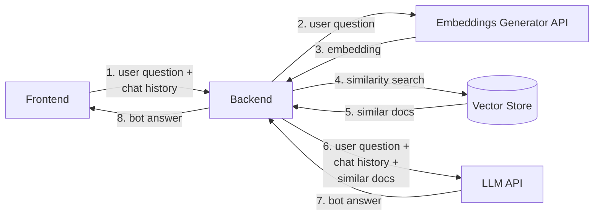

The _AI RAG Template_ is a template to build and run your own RAG application and build a Chatbot that is capable to perform a conversation with a user.

The service is developed using the [LangChain](https://python.langchain.com/docs/get_started/introduction/) framework, which enables creating sequences of complex interactions using Large Language Models. The web server is implemented using the [FastAPI](https://fastapi.tiangolo.com/) framework.

In order to work, it is required to have a MongoDB instance to be used as Vector Store and that supports [MongoDB Vector Search indexes](https://www.mongodb.com/docs/atlas/atlas-vector-search/tutorials/vector-search-quick-start/), which means an Atlas instance with version 6 or above.

## Overview

The following is the high-level architecture of the template.



### Embeddings

Please mind that the template does not include embeddings or any logic to create them. It is intended that the Vector Store will include the embeddings (or these are generated separately). In any case, please ensure that the embedding model used the populate the Vector Store is the same embedding model used when running the service, otherwise the service will generate answers only based on its own knowledge, without being able to use the Vector Store, with the risk of hallucinations when chatting with the user.

### API

Read more at [the related page](/runtime_suite_templates/ai-rag-template/20_apis.md)

## Environment Variables

The following environment variables are required for the service to work:

- **PORT**: the port used to expose the API (default: _3000_)
- **LOG_LEVEL**: the level of the logger (default: _INFO_)
- **CONFIGURATION_PATH**: the path that contains the [JSON configuration file](#configuration)
- **MONGODB_CLUSTER_URI**: the MongoDB connection string
- **LLM_API_KEY**: the API Key of the LLM (_NOTE_: currently, we support only the OpenAI models, thus the API Key is the same as the OpenAI API Key)
- **EMBEDDINGS_API_KEY**: the API Key of the embeddings model (_NOTE_: currently, we support only the OpenAI models, thus the API Key is the same as the OpenAI API Key)

It is suggested to save the environment variables in a `.env` file.

## Configuration

The service requires several configuration parameters for execution. Below is an example of configuration:

```json
{
  "llm": {
    "type": "openai",
    "name": "gpt-3.5-turbo",
    "temperature": 0.7,
  },
  "embeddings": {
    "type": "openai",
    "name": "text-embedding-3-small"
  },
  "vectorStore": {
    "dbName": "database-test",
    "collectionName": "assistant-documents",
    "indexName": "vector_index",
    "relevanceScoreFn": "euclidean",
    "embeddingKey": "embedding",
    "textKey": "text",
    "maxDocumentsToRetrieve": 4,
    "minScoreDistance": 0.5
  },
  "chain": {
    "aggregateMaxTokenNumber": 2000,
    "rag": {
      "promptsFilePath": {
        "system": "/path/to/system-prompt.txt",
        "user": "/path/to/user-prompt.txt"
      }
    }
  }
}
```

Description of configuration parameters:

| Param Name | Description |
|------------|-------------|
| LLM Type | Identifier of the provider to use for the LLM. Default: `openai`. See more in [Supported LLM providers](#supported-llm-providers) |
| LLM Name | Name of the chat model to use. [Must be supported by LangChain.](https://python.langchain.com/docs/integrations/chat/) |
| LLM Temperature | Temperature parameter for the LLM, intended as the grade of variability and randomness of the generated response. Default: `0.7` (suggested value). |
| Embeddings Type | Identifier of the provider to use for the Embeddings. Default: `openai`. See more in [Supported Embeddings providers](#supported-embeddings-providers) |
| Embeddings Name | Name of the encoder to use. [Must be supported by LangChain.](https://python.langchain.com/docs/integrations/text_embedding/) |
| Vector Store DB Name | Name of the MongoDB database to use as a knowledge base. |
| Vector Store Collection Name | Name of the MongoDB collection to use for storing documents and document embeddings. |
| Vector Store Index Name | Name of the vector index to use for retrieving documents related to the user's query. The application will check at startup if a vector index with this name exists, it needs to be updated or needs to be created. |
| Vector Store Relevance Score Function | Name of the similarity function used for extracting similar documents using the created vector index. In case the existing vector index uses a different similarity function, the index will be updated using this as a similarity function. |
| Vector Store Embeddings Key | Name of the field used to save the semantic encoding of documents. In case the existing vector index uses a different key to store the embedding in the collection, the index will be updated using this as key. Please mind that any change of this value might require to recreate the embeddings. |
| Vector Store Text Key | Name of the field used to save the raw document (or chunk of document). |
| Vector Store Max. Documents To Retrieve | Maximum number of documents to retrieve from the Vector Store. |
| Vector Store Min. Score Distance | Minimum distance beyond which retrieved documents from the Vector Store are discarded. |
| Chain Aggregate Max Token Number | Maximum number of tokens extracted from the retrieved documents from the Vector Store to be included in the prompt (1 token is approximately 4 characters). Default is `2000`. |
| Chain RAG System Prompts File Path | Path to the file containing system prompts for the RAG model. If omitted, the application will use a standard system prompt. More details in the [dedicated paragraph](#configure-your-own-system-and-user-prompts). |
| Chain RAG User Prompts File Path | Path to the file containing user prompts for the RAG model. If omitted, the application will use a standard system prompt. More details in the [dedicated paragraph](#configure-your-own-system-and-user-prompts). |

### Supported LLM providers

The property `type` inside the `llm` object of the configuration should be one of the supported providers for the LLM.
Currently, the supported LLM providers are:

- OpenAI (`openai`), in which case the `llm` configuration could be the following:
  ```json
  {
    "type": "openai",
    "name": "gpt-3.5-turbo",
    "temperature": 0.7,
  }
  ```
  with the properties explained above.

- Azure OpenAI (`azure`), in which case the `llm` configuration could be the following:
  ```json
  {
    "type": "azure",
    "name": "gpt-3.5-turbo",
    "deploymentName": "dep-gpt-3.5-turbo",
    "url": "https://my-company.openai.azure.com/",
    "apiVersion": "my-azure-api-version",
    "temperature": 0.7
  }
  ```

  While, `type` is always `azure`, and `name` and `temperature` have been already explained, the other properties are:
  | Name |  Description |
  |------|-------------|
  | `deploymentName` | Name of the deployment to use. |
  | `url` | URL of the Azure OpenAI service to call. |
  | `apiVersion` | API version of the Azure OpenAI service. |

### Supported Embeddings providers

The property `type` inside the `embeddings` object of the configuration should be one of the supported providers for the Embeddings.
Currently, the supported Embeddings providers are:

- OpenAI (`openai`), in which case the `embeddings` configuration could be the following:
  ```json
  {
    "type": "openai",
    "name": "text-embedding-3-small",
  }
  ```
  with the properties explained above.

  - Azure OpenAI (`azure`), in which case the `embeddings` configuration could be the following:
  ```json
  {
    "type": "azure",
    "name": "text-embedding-3-small",
    "deploymentName": "dep-text-embedding-3-small",
    "url": "https://my-company.openai.azure.com/",
    "apiVersion": "my-azure-api-version"
  }
  ```
  While, `type` is always `azure`, and `name` have been already explained, the other properties are:
  
  | Name |  Description |
  |------|-------------|
  | `deploymentName` | Name of the deployment to use. |
  | `url` | URL of the Azure OpenAI service to call. |
  | `apiVersion` | API version of the Azure OpenAI service. |

### Configure your own system and user prompts

The application sends to the LLM a prompt that is composed of a _system prompt_ and a _user prompt_:

- the _system prompt_ is a message that provides instructions to the LLM on how to respond to the user's input.
- the _user prompt_ is a message that contains the user's input.

A default version of these prompts are included in the application, but you can also use your own prompts to instruct the LLM to behave in a more specific way, such as behaving as a generic assistant in any field or as an expert in a specific field related to the embedding documents you are using.

Both the system and user prompts are optional, but if you want to use your own prompts, you need to create a text file with the content of the prompt and specify the path to the file in the configuration at `chain.rag.systemPromptsFilePath` and `chain.rag.userPromptsFilePath` respectively.

Moreover, the _system prompt_ must include the following placeholders:

- `{chat_history}`: placeholder that will be replaced by the chat history, which is a list of messages exchanged between the user and the chatbot until then (received via the `chat_history` property from the body of the [`/chat/completions` endpoint](#chat-endpoint-chatcompletions))
- `{output_text}`: placeholder that will be replaced by the text extracted from the embedding documents

> **Note**
>
> The application already includes some context text to explain what the chat history is and what the output text is, so you don't need to add your explanation to the system prompt.

Also, the _user prompt_ must include the following placeholder:

- `{query}`: placeholder that will be replaced by the user's input (received via the `chat_query` property from the body of the [`/chat/completions` endpoint](#chat-endpoint-chatcompletions))

Generally speaking, it is suggested to have a _system prompt_ tailored to the needs of your application, to specify what type of information the chatbot should provide and the tone and style of the responses. The _user prompt_ can be omitted unless you need to specify particular instructions or constraints specific to each question.

### Create a Vector Index

:::info
MongoDB Vector Search Index is updated automatically by the application at its startup, always updating the `path`, the `numDimensions` and the `similarity` fields according to the configuration. 

It also creates the index with the name `vectorStore.indexName` if it does not exist.

This part is included only for information purposes.
:::

This template requires a [MongoDB Vector Search Index](https://www.mongodb.com/docs/atlas/atlas-vector-search/vector-search-type/) to function correctly, and requires using MongoDB Atlas or a MongoDB on-premise cluster with version 6 or above.

The Vector Search Index should have the following structure:

```json
{
    "fields": [
        {
            "type": "vector",
            "path": "<<embeddingsKey>>",
            "numDimensions": 768,
            "similarity": "<<relevanceScoreFn>>"
        }
    ]
}
```

where:
- `embeddingsKey` is the name of the field used to store the semantic encoding of documents.
- `relevanceScoreFn` is the name of the similarity function used for extracting similar documents using the created vector index. In case the existing vector index uses a different similarity function, the index will be updated using this as a similarity function.
- the `numDimensions` value depends on the Embedding Model used (supported: `text-embedding-3-small`, `text-embedding-3-large` and its deployment versions - if using Azure OpenAI).

:::warning
In the event that an error occurs during the creation or update of the Vector Index, the exception will be logged, but the application will still start. However, the functioning of the service is not guaranteed.
:::
