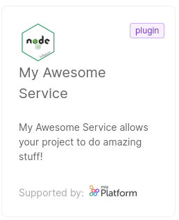

:::info

You need to have *Company Owner* or *Project Administrator* role at Company level to perform this action

:::

Imagine you are a software developer, working for the Company "Acme Corporation".

You have developed a new service (for example a NodeJS service) 
called "My Awesome Service". The service is a plugin, i.e. users are only required to configure it and deploy it in their project.
You now want it to be available in the Marketplace of your Company.

First of all, you need to create a JSON file as explained in [this guide](/software-catalog/manage-items/overview.md#how-to-configure-a-new-item).
Save the file, for example as `myAwesomeService.json` file.

The file contents will look like this:

Click to expand <code>myAwesomeService.json</code>

```json
{
  "description": "My Awesome Service allows your project to do amazing stuff!",
  "documentation": {
    "type": "externalLink",
    "url": "https://docs.example.org/AwesomeService"
  },
  "image": {
    "localPath": "./awesomeService.png"
  },
  "name": "My Awesome Service",
  "itemId": "my-awesome-service",
  "repositoryUrl": "https://git.example.org/awesome-service",
  "resources": {
    "services": {
      "api-portal": {
        "componentId": "my-awesome-service",
        "containerPorts": [
          {
            "from": 80,
            "name": "http",
            "protocol": "TCP",
            "to": 8080
          }
        ],
        "defaultEnvironmentVariables": [
          {
            "name": "HTTP_PORT",
            "value": "8080",
            "valueType": "plain"
          }
        ],
        "defaultLogParser": "mia-nginx",
        "defaultProbes": {
          "liveness": {
            "path": "/index.html"
          },
          "readiness": {
            "path": "/index.html"
          }
        },
        "defaultResources": {
          "memoryLimits": {
            "max": "25Mi",
            "min": "5Mi"
          }
        },
        "description": "My Awesome Service allows your project to do amazing stuff!",
        "dockerImage": "docker.example.org/awesome-service:1.0",
        "name": "awesome-service",
        "repositoryUrl": "https://git.example.org/awesome-service",
        "type": "plugin"
      }
    }
  },
  "supportedBy": "Acme Corporation Inc.",
  "supportedByImage": {
    "localPath": "./acmeCorporation.png"
  },
  "tenantId": "acme-corporation",
  "type": "plugin"
}
```


You also want users to write services in your brand new programming language, `Acme.Js`.

To do this, you need to create a [Template](/marketplace/templates/mia_templates.md), which is a skeleton with a minimal setup: your users are required to write business code from scratch.


Click to expand <code>myAcmeJsTemplate.json</code>

```json
{
  "categoryId": "acmejs",
  "description": "This template allows you to start setting up a service written in Acme.Js",
  "documentation": {
    "type": "markdown",
    "url": "https://raw.githubusercontent.com/acme-corporation/Acme-Js-template/master/README.md"
  },
  "image": {
    "localPath": "./acmeJsTemplate.png"
  },  
  "itemId": "acmejs-template",
  "name": "Acme.Js Template",
  "releaseStage": "",
  "resources": {
    "services": {
      "acmejs-template": {
        "archiveUrl": "https://github.com/acme-corporation/Acme-Js-template/archive/master.tar.gz",
        "containerPorts": [
          {
            "from": 80,
            "name": "http",
            "protocol": "TCP",
            "to": 8080
          }
        ],
        "defaultEnvironmentVariables": [
          {
            "name": "HTTP_PORT",
            "value": "8080",
            "valueType": "plain"
          }
        ],
        "defaultLogParser": "mia-nginx",
        "description": "This template allows you to start setting up a service written in Acme.Js",
        "name": "acmejs-template",
        "type": "template"
      }
    }
  },
  "supportedBy": "Acme Corporation Inc.",
  "supportedByImage": {
    "localPath": "./acmeCorporation.png"
  },
  "tenantId": "acme-corporation",
  "type": "example",
  "visibility": {
    "allTenants": false,
    "public": true
  }
}
```


To highlight the potentialities of `Acme.Js` and introduce your users to the new programming language, you also decide to provide a working [Example](/marketplace/examples/mia_examples.md) with minimal business code.


Click to expand <code>myAcmeJsExample.json</code>

```json
{
  "categoryId": "acmejs",
  "description": "A simple Hello World example based on Acme Corporation Acme.Js Template.",
  "documentation": {
    "type": "markdown",
    "url": "https://raw.githubusercontent.com/acme-corporation/Acme-Js-example/master/README.md"
  },
  "image": {
    "localPath": "./acmeJsExample.png"
  },
  "itemId": "acme-js-example",
  "name": "TypeScript Hello World Example",
  "resources": {
    "services": {
      "acme-js-example": {
        "archiveUrl": "https://github.com/acme-corporation/Acme-Js-example/archive/master.tar.gz",
        "containerPorts": [
          {
            "from": 80,
            "name": "http",
            "protocol": "TCP",
            "to": 3000
          }
        ],
        "name": "acme-js-example",
        "type": "example"
      }
    }
  },
  "supportedBy": "Acme Corporation Inc.",
  "supportedByImage": {
    "localPath": "./acmeCorporation.png"
  },
  "tenantId": "mia-platform",
  "type": "example",
  "visibility": {
    "allTenants": false,
    "public": true
  }
}
```


Notice that the `image` and `supportedByImage` objects are populated with local paths to images: make sure the images exist and that their path is correct.

To create the items on the Marketplace, open up a terminal in directory where the files are placed and run this command:

```sh
miactl marketplace apply -f myAwesomeService.json -f myAcmeJsTemplate.json -f myAcmeJsExample.json
```

This command will create the Marketplace items and upload the images along with them.

A message will confirm the operation, returning some information as shown here below:

```sh
3 of 3 items have been successfully applied:

  ID                        ITEM ID             NAME                 STATUS   

  65368hf0c91d871a87afbcbf  my-awesome-service   My Awesome Service   Inserted  
  65368hf0c91d871a87afvedc  acme-js-template     Acme.Js Template     Inserted  
  65368hf0c91d871a87afdase  acme-js-example      Acme.Js Example      Inserted  
```

After the upload, the image keys will be replaced with the `imageUrl` and the `supportedByImageUrl`; to obtain the updated version of an item, use the `get` command:

```sh
miactl marketplace get 65368hf0c91d871a87afbcbf > myAwesomeService.json

miactl marketplace get 65368hf0c91d871a87afvedc > myAcmeJsTemplate.json

miactl marketplace get 65368hf0c91d871a87afdase > myAcmeJsExample.json
```

:::tip
The local file fields won't be updated after the item creation.
We recommend to always download a new copy afterwards to keep your local copy up to date.
:::

From now on, the items you created will be visible as a clickable card inside the Internal Company Marketplace section of the Console.

For example, here is "My Awesome Service"'s card:



:::tip

Further information about the `apply` command can be found in the [dedicated doc](/cli/miactl/30_commands.md#apply).

:::
