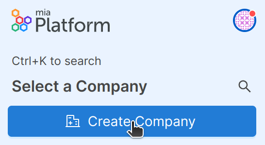
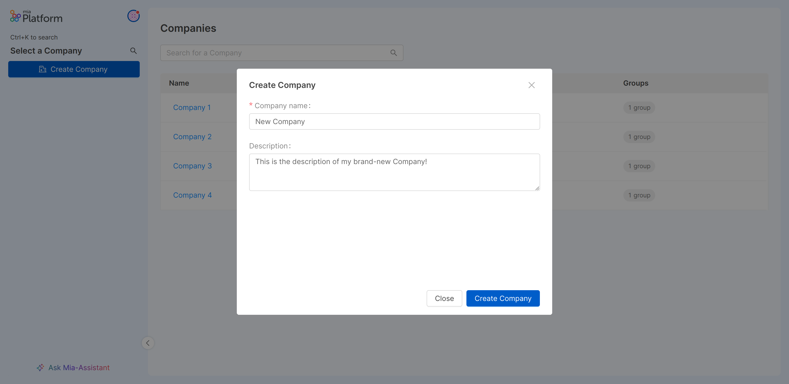

A Company is a resource that provides governance on all the Projects it contains.

Within a Company, it is possible to:

- configure the infrastructure on which new Projects will be based;
- analyze the configuration of all existing Projects;
- manage users and permissions.

#### SaaS

To create a new Company in the Mia-Platform SaaS Console, open a [Service Request](https://makeitapp.atlassian.net/servicedesk/customer/portal/21/group/79/create/340) and the Company will be created for you.

#### On-Premise

Before creating a new Company in a Mia-Platform On-Premise Console installation, contact your Mia-Platform referent.

Once you made sure you meet all the necessary requirements to create a new Company, you can continue with this guide.

<br/>

The next steps will guide you through all the processes to create and correctly configure a new Company.

### Requirements

To create and configure a Company, you must have:

- access to the Console CMS (granted by the `console_cms` group)
- `Console Super User` role, or `console.root.company.create` permission

## Create a Company from the Console
The easiest and most straightforward way to create a Company is to do it through the Mia-Platform Console.

From the main screen, a simple click on the “Create Company” button will open a modal that requires 2 pieces of information to be entered: Company name (required) and description. Once entered simply click on “Create Company” to confirm the creation, and the new Company will appear in the table.

<div style={{display: 'flex', flexDirection: 'column', alignItems: 'center'}}>
  <div style={{width: '35%'}}>



  </div>
  <div>



  </div>
</div>

## Create a Company from API

You can create a new Company by making a POST request to the `/api/backend/companies` API.

:::warning
Endpoint `/api/backend/companies` has been deprecated in favor of the new endpoint `/tenants`.
:::

:::info
This API is visible inside the Console API Portal (`{{CONSOLE-HOST}}/documentations/api-portal/`), under the `Companies` tag.
:::

You will be asked to set the **name** and the **description** of the Company to add (only name is required).

In addition, you will be added as the first Company user with the role of [`Company Owner`](/development_suite/identity-and-access-management/console-levels-and-permission-management.md#users-capabilities-inside-console).

### Example call

```bash
curl --request POST \
  --url "https://{CONSOLE_HOST}/api/backend/companies" \
  --header 'Accept: application/json' \
  --header 'Content-Type: application/json' \
  --header 'Authorization: Bearer {TOKEN}' \
  --data   '{
           "name": "your-company-name",
           "description": "your-company-description"
           }'
```

where `CONSOLE_HOST` is the base path of your Console installation and `TOKEN` is the access token to use to create the new Company.

## Create a Company from CMS

It is also possible to manually create a Company from the Console CMS. 

However, you will lose some of the automation provided by the Company creation API, such as adding the first user or providing a Company unique identifier.

:::danger
It is recommended to use the API to create a new Company. Use this method only if strictly necessary.
:::

<details>
<summary>Detailed guide</summary>

### Create the Company

Visit the Console CMS page and open the `Companies` section.

Click the `Add new` button, you will be asked to provide an **id**, a **name**, and a **description** for the Company (only id and name are required). 

You will be able to set all the optional fields after the creation of the Company.
For further information regarding other configuration fields, visit the dedicated [section](#default-configuration-for-a-new-project) later on this page.

### Add the first Company User

Once your Company has been created using CMS, you need to associate the first user to be able to access the Company from the Console. 
The first user may either be yourself or another user on the Platform. 

Regardless, head over to the CMS page and click the `Bindings` menu item.

:::caution
Only a restricted set of users have access to the users' management section in CMS, contact your Console Administrator to obtain the right permissions to access this functionality.
:::

In the `Bindings` section, click the `Add new` button and fill in the form:
- type a custom **Binding ID**

:::danger
The _Binding ID_ must be unique in the whole collection!  

As a general recommendation, we suggest `{companyId}-{desiredRole}`, however in some cases, a more complex structure may be necessary.
:::

- select the proper **Role** (since it is the first user, it is recommended to set the role [`Company Owner`](/development_suite/identity-and-access-management/console-levels-and-permission-management.md#users-capabilities-inside-console))

- select the correct user as **Subject**

- assign the correct **Resource** by filling it with an object as follows:

```json
{
  "resourceType": "company",
  "resourceId": "{THE COMPANY ID YOU PROVIDED UPON CREATION}"
}
```

</details>
