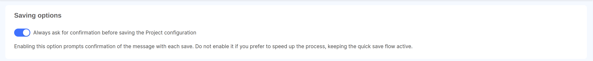

The **Settings** section allows you to view and define various configurations and settings related to your Company.

### Rules

The **Rules** tab allows the user to customize rules defined for the Company and its Projects.

#### Saving options

This rule allows users to manage the **Saving options** for all Projects in the Company: in particular, Company Owners can decide to add a confirmation constraint on the commit message inserted by users before each save in the Project Design area.  
This setting can be useful if your Company must comply with specific regulations regarding the information associated to each save of the Project configuration.

:::info  
If the setting is enabled on the Company, it cannot be overridden at Project level. On the other hand, if more strict constraints are needed only on a specific Project, this setting can be enabled selectively from the [Rules tab of the Project Settings page](/console/project-configuration/project-settings.md#rules), keeping it disabled at Company level.
:::

#### AI Settings

The **AI Settings** rule allows the user to manage the **AI Settings** for all Projects in the Company.  
In particular, Company Owners can decide to enable or disable the AI agentic features for all Projects in the Company.

:::info
The agentic features are the ones that allow the AI to take actions on behalf of the user, accessing Company data.

An example of an agentic feature is the **Debug** command. Other features in [Mia Assistant documentation](/console/assistant/overview.md).
:::
