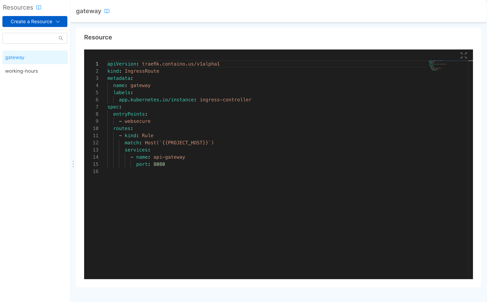
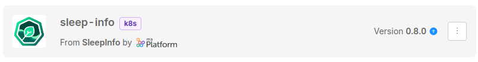
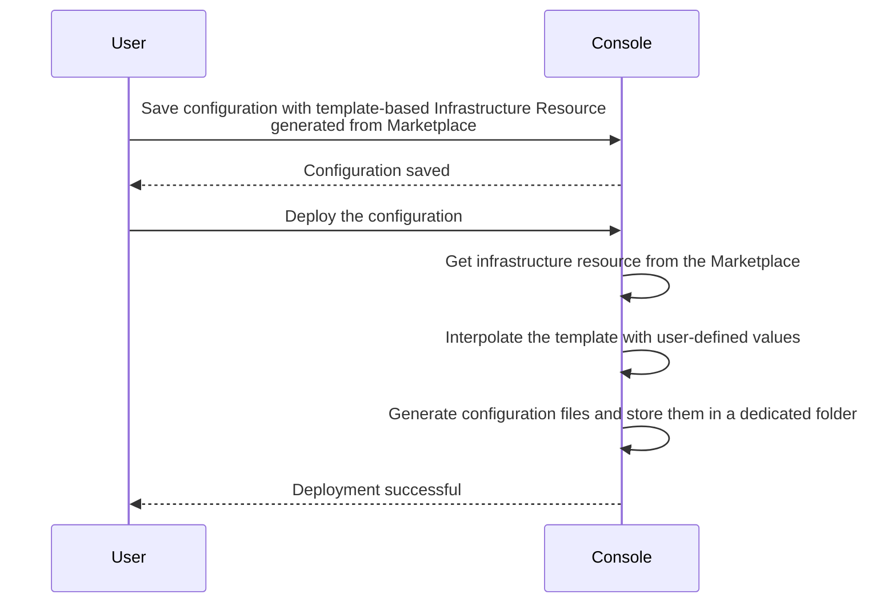

A Infrastructure Resource allows you to define custom objects that are not part of the standard Console resources and can be used to extend the Console capabilities. It provides a way to write configurations that can be translated into different configuration-as-code elements.

An Infrastructure resource may be either Kubernetes type, and thus refer to a particular Custom Kubernetes Resource, or to Non-Kubernetes ones (Lambda functions, Terraform resources, etc.).

:::info
In order to visualize your custom resources in the monitoring area, you must give permissions to the console service account. Please follow the guide found [here](/console/company-configuration/clusters-management/cluster-setup.mdx?type=manual#monitoring-custom-resources-from-the-console)
:::

## How to use the Infrastructure Resource

With Infrastructure Resources it is possible to:

- configure resources for virtually any runtime using templates that are populated with custom values at deployment time
- configure Custom Kubernetes Resources that are managed by the cluster (e.g. the Traefik `IngressRoute`)

To learn more about possible use cases, you can go to the [dedicated section](/console/design-your-projects/custom-resources/use-cases.md)

:::tip
You can also use Infrastructure Resources together with the [External Configuration Generator](/console/company-configuration/providers/extensions/orchestrator-generator/overview.mdx) to generate manifests for different runtimes.
:::

## How to manage an Infrastructure Resource in Console

It is possible to manage the Infrastructure Resource from inside the Design section of the Console, in the dedicated area called *Resources* under the *Infrastructure* category.

### Create an Infrastructure Resource

It is possible to create a new Infrastructure Resource from Marketplace or from scratch.

#### Create an Infrastructure Resource from Scratch

To create a resource from scratch, you need to provide the following information:

- **name**: the name of the Infrastructure Resource. It will be used to generate the manifest, and cannot be changed during updates;
- **apiVersion**: the apiVersion of the Infrastructure Resource, it can be any string. If you are creating a Custom Kubernetes Resource, it must be the apiVersion of the Infrastructure Resource Definition;
- **kind**: the kind of the Infrastructure Resource, it can be any string. If you are creating a Custom Kubernetes Resource, it must be the kind of the Infrastructure Resource Definition.
- **type**: the type of the Infrastructure Resource. 

If the type of the Infrastructure Resource is set to 'kubernetes', the following extra field is available:

- **resourceId**: The plural name for the Kubernetes Infrastructure resource definition. If set, the resource will be visible in the [Runtime](/development_suite/monitoring/resources/custom-resources.md) section of the console.

In creation, you will see the preview of the generated manifest.


#### Create an Infrastructure Resource from Marketplace

:::info
To allow users to add a Infrastructure Resource to their project from marketplace, you need to apply it using `miactl` ([see here for details](/software-catalog/manage-items/mia-ctl/create/create-item-by-type/create_infrastructure_resource.mdx)) or using [`Software Catalog`](/software-catalog/manage-items/mia-ctl/create/create-item-by-type/create_infrastructure_resource.mdx)
:::

To create a resource from Marketplace, you need to select the Infrastructure Resource you want to create.


The Marketplace could contain *versioned* Infrastructure Resources.
In that case, when selecting the Infrastructure Resource to create, you will see the available versions and you will be able to select the one you prefer.


In this case, you can only modify the *name* of the Infrastructure Resource: the *kind* and the *apiVersion* fields are managed by the versioned marketplace item, so you cannot modify them manually, neither during the creation nor the update.

### Update an Infrastructure Resource

Once you have created a Infrastructure Resource, it will be possible to update it. Click on the Infrastructure Resource you want to update in the sidebar, and you will see a YAML editor.

The Infrastructure Resource has some supported fields, other fields will be ignored. The supported fields are:

- **apiVersion** (*required*): the apiVersion of the Infrastructure Resource, it can be any string. If you are creating a Custom Kubernetes Resource, it must be the apiVersion of the Infrastructure Resource Definition;
- **kind** (*required*): the kind of the Infrastructure Resource, it can be any string. If you are creating a Custom Kubernetes Resource, it must be the kind of the Infrastructure Resource Definition.
- **metadata** (*required*): the metadata of the Infrastructure Resource, it can be any object;
  - **name** (*required*): the name of the Infrastructure Resource. It will be used to generate the manifest, and cannot be changed during updates;
  - **labels**: the labels of the Infrastructure Resource, it can be any key/value pair;
  - **annotations**: the annotations of the Infrastructure Resource, it can be any key/value pair;
- **spec** (*required*): the spec of the Infrastructure Resource, it can be any object.
- **runtime**: the runtime attributes of the Infrastructure Resource. From version _v13.3.0_, these properties are used to infer the status of the resource and show it in the _Runtime_ section of the Console.
  - **type**: The type of the Infrastructure resource. If valued, the only supported value for this field is `kubernetes`.
  - **resourceId**: The plural name for the Kubernetes Infrastructure resource definition.
  This fields is needed if you want monitoring the resource deployed in the dedicated menu of the runtime section



Infrastructure Resources created from Marketplace items can not have the `apiVersion` and the `kind` fields modified. Attempting to do so will result in an error badge shown in the UI, and the updates on the manifest will be ignored.

Each version of the Infrastructure Resource defines specific values for these fields.
You can select a new version by clicking on the icon at the top right corner of the badge, near the version name, and selecting the *Change version* option from the pop-up menu.
A modal window will open, where you can see the available versions of the Infrastructure Resource and select the one you want to use.


Inside the modal you can also see the `apiVersion` and the `kind` of the Infrastructure Resource of the selected version, to give you a better idea of the configuration you are selecting.

A small tag will also inform you which is the *latest* version of the plugin, the latest stable version released.

In case you need to update the `apiVersion` and the `kind` fields manually, completely changing the configuration of the Infrastructure Resource, you can do so by clicking the *Detach from Marketplace* button on the menu: this will detach the Custom Resource from the original Marketplace item, causing the resource to be fully editable.
However, you will not be able to use the Marketplace versioning feature anymore, and you will not be notified by any update made by the Marketplace creator of that item.

:::info
A version labelled with *N/A* refers to a Marketplace item that did not include a version when it was created.
This means that it has been created before the support of versioning in the Marketplace was implemented.

However, it does not mean that this version is not supported anymore, or that it is less secure: check out the available versions and choose the one that fits your needs. In case of further questions, please contact the Marketplace item creator.
:::

:::info
Anytime you access to the configuration page of your resource, you will be informed if the related Marketplace item have updates with an icon next to the version name.



This is the best way to be aware of updates of your Marketplace plugins.
:::

### Delete an Infrastructure Resource

To delete a Infrastructure Resource, you have to click on the delete button at the bottom of the page.

You need to insert the Infrastructure Resource name and click on the delete button.


## How to manage an Infrastructure Resource in the Marketplace

Users with appropriate permissions can manage the lifecycle of a Infrastructure Resource on the Marketplace, being able to publish their own Infrastructure Resources and update them.

Infrastructure Resources are published to the Marketplace using the `custom-resource` type in the marketplace item schema. Versioning is supported, allowing users to make updates without overwriting previous versions of the Infrastructure Resource.

To learn more on how to add or manage a Infrastructure Resource in the Marketplace, see the [Add Custom Resource to the Marketplace](/software-catalog/manage-items/mia-ctl/create/create-item-by-type/create_infrastructure_resource.mdx) section.

### Template-based Infrastructure Resource management

:::info
Please note that template-based Infrastructure Resources are only supported in Projects using the [Enhanced Workflow](/development_suite/set-up-infrastructure/overview.md).
:::

By default, Infrastructure Resources available in the Marketplace are built using templates. The custom resource item in the Marketplace defines a `generator` field that specifies the template and base folder for generated files. The `apiVersion` field is also set to the special value `custom-generator.console.mia-platform.eu/v1`, necessary to dynamically generate the resource from the Marketplace.

:::tip
For Template-based Infrastructure Resources, you can enable the automatic creation of a repository during the resource creation by specifying the `archive` field in the resource template. This field must contains the archive URL on which the repository is based.

For example:
```yaml
...
resources:
  service:
    archive: https://example.com/path/to/archive.zip
...
```
Refer to [Infrastructure Resource definition](/software-catalog/manage-items/mia-ctl/create/create-item-by-type/create_infrastructure_resource.mdx#infrastructure-resource-definition) schema
:::


Templates are stored as strings and interpolated at deployment time using the [mustache template system](https://mustache.github.io/). After creating the resource, the user can proceed with its deployment. The template outlines the configuration files that will be generated during deployment: during this process the template is populated with user-provided values, and the resulting files are stored in a dedicated folder in the Project repository, as defined in the Marketplace item specification.

:::tip
You can leverage templates to generate multiple files to be written in your configuration repository.
:::

Here is a sequence of what happens when a template-based Infrastructure Resource is deployed:



:::info
Deploying template-based Infrastructure Resources for different runtimes than Kubernetes will require additional configuration on the deployment pipeline, in order to handle the additional files generated from the template.
:::
