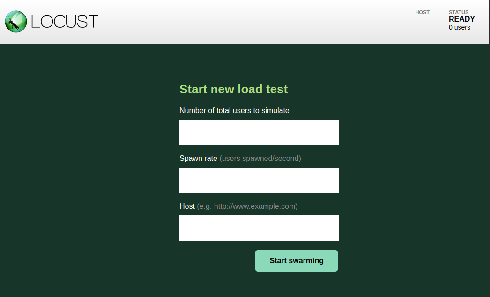
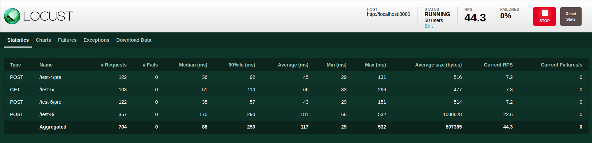
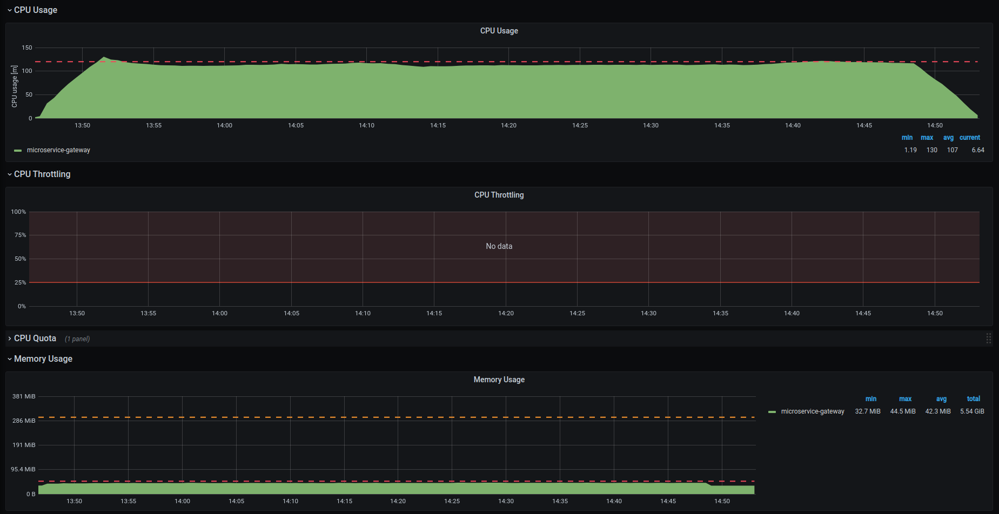
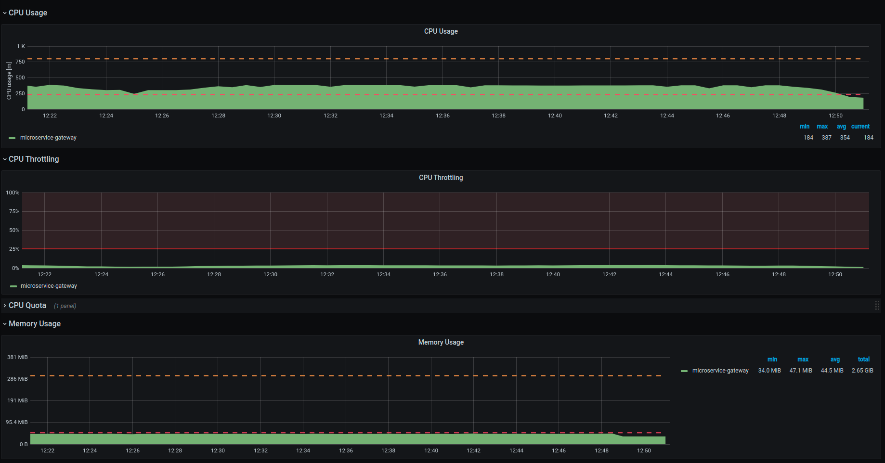

The ultimate objective is to find the optimal values for **requests** and **limits** of a microservice by performing a load test, to know more about those values [check this out](/development_suite/api-console/api-design/request_limits.mdx).

**Load testing** generally refers to the practice of modeling the expected usage of a software program by simulating multiple users accessing the program concurrently.

## Testing a Microservice

To test a microservice, a series of operations needs to be applied to load and stress that specific part of the project.
Usually, this process consists in:

1. Understanding the very purpose of the tested microservice

1. Finding specific APIs using that service

1. Creating multiple requests to those APIs

:::note Example:
**Testing the microservice-gateway**

This service is responsible for the orchestration of API decorators.

In the Console Design area you can create a few microservices to implement decorators and make various requests to the endpoints associated with those services.
:::

## Load Testing Tools

In order to reproduce the interaction of multiple users, we can leverage different load testing tools among which:

- [JMeter](https://jmeter.apache.org/)
- [Locust](https://locust.io/)
- [K6](https://k6.io/)
- [Fortio](https://fortio.org/)
- [Artillery](https://artillery.io/)

In this tutorial, we will focus on **Locust** as our main load testing tool. However, the following explanation can be useful even when using any other testing tool.

### Locust

Locust is a Python library for mocking users making requests to your application.
To configure the types of actions and access points that need to be tested, Locust leverages a configuration file referred to as the Locust file.

#### Locust file

A Locust file makes use of classes mocking different types of **users**, and each class defines a series of **tasks** to be reproduced by that user.
Further information regarding the creation of Locust files can be found in the [official documentation](https://docs.locust.io/en/stable/quickstart.html).

Here’s an example of a Locust file instance:

```python
import time
from locust import task, between
from locust.contrib.fasthttp import FastHttpUser


class User(FastHttpUser):
    wait_time = between(1, 1.5)

    @task
    def crud_service(self):
      self.client.get("/v2/my_collection/?_st=PUBLIC,DRAFT")

    @task(2)
    def authorization_service(self):
          self.client.get("/echo-acl-client-type-secreted",
          headers={'client-key': 'someClientKeyValue'})

    def on_start(self):
        print("A new test is starting")
```

You can use this Locust file as a template to test your application.

:::note info
In this tutorial we will create a **load-testing** folder and save the file as **my-locustfile.py**
:::

##### User

The class **FastHttpUser** defines a fast and lightweight user implementing a geventhttpclient. The property **wait_time** instead, will make the simulated users wait between 1 and 1.5 seconds after each task.

##### Tasks

We defined two tasks by decorating functions with a tag **@task** and assigning a specific weight between brackets:

- **crud_service** will be used to test services responsible for retrieving the collection my_collection from the database (please, keep in mind operating on a database during a load test may require an appropriate database scaling)
- **authorization_service** will be used to test a login operation with an appropriate client-key

##### Weights

Tasks are picked randomly. However, the weight determines the probability of that task to be executed. In this configuration, it will be two times more likely for Locust to pick authorization_service than crud_service.

## Executing a Load Test with Locust

### Launching a Locust Instance Locally

Once you created a Locust file, you need to launch a Locust instance to test your application. You can execute a Locust instance locally by calling:

```
locust -f path/to/your/locustfile
```

Following the previous example you can execute:

```
locust -f ./load-testing/my-locustfile.py
```

<br />

Now, you can access your Locust instance by connecting to `http://localhost:8089`.



This will prompt a new Locust window where you can specify:

- **users**: the total number of users testing your application. Each user opens a TCP connection to your application and tests it.
- **spawn rate**: the number of users that will be added for each second to the current users, until the total amount of users is reached.
- **host**: the host of the application you wish to test.

<br />

:::tip
Later in the process we will learn how to start a Locust instance from the cluster. However, launching a Locust instance locally is a necessary step to **assess the correctness of your test configuration**.
:::

<br />

Select a value for users and spawn rate. In this example we choose **50 users** and a **spawn rate of 10**.

When executing a Locust instance locally, it might be convenient to access the desired host using localhost. In our case, this might be easily achieved [connecting to an existing cluster](https://kubernetes.io/docs/tasks/access-application-cluster/access-cluster/) and using port forwarding to redirect a service to our local machine:

```
kubectl -n YOUR_NAMESPACE port-forward service/YOUR_SERVICE PORT
```

For instance, to redirect the service **api-gateway** from **development** namespace you can execute:

```
kubectl -n development port-forward service/api-gateway 8080
```

so you can use `http://localhost:8080` as your **host** value.

<br />

You can now click **Start Swarming** and begin your test.



Here’s how a working example of a Locust swarm test should look like. Once made sure your test configuration is correct, you can move to the execution of a swarm test directly from the cluster.

### Launching a Locust Instance From the Cluster

On most occasions, it will be useful to have access to cluster resources to run your tests (mocking thousands of requests per second can be pretty computationally demanding!).
In this case, an instance of Locust needs to be run directly from the cluster.

:::caution attention
This tutorial requires the usage of a **preconfigured namespace**.

In order to continue with the tutorial, you may need to ask your Mia Platform referent to give you access to a namespace created for load testing purposes.
:::

:::info
In this tutorial, we will refer to a specific namespace called **load-testing**. However, the following explanation is valid for any namespace on K8s.
:::

#### Connecting to Kubectl

First you need to make sure to have a proper connection to Kubectl.
You can [visualize your current configuration](https://kubernetes.io/docs/reference/kubectl/cheatsheet/#kubectl-context-and-configuration) running:

```
kubectl config view
```

#### Pushing your Locust file to the cluster

Once you are connected to the cluster, you can create a config map containing your Locust instance with the following command:

```
kubectl -n YOUR_NAMESPACE create configmap YOUR_LOCUST_FILE --from-file ./path/to/your/locust_file
```

This command will create a config map called **YOUR_LOCUST_FILE** on your K8s namespace.
You can later edit your configmap with:

```
kubectl -n YOUR_NAMESPACE edit configmap YOUR_LOCUST_FILE
```

or overwrite with:

```
kubectl -n YOUR_NAMESPACE create configmap YOUR_LOCUST_FILE --from-file ./path/to/your/locust_file --dry-run=client -o yaml | kubectl apply -f -
```

<br />

If you are using **load-testing** namespace, and you want to create a **my-loadtest-locustFile** configmap you can execute:

```
kubectl -n load-testing create configmap my-loadtest-locustfile --from-file ./load-testing/my-locustfile.py
```

and successively overwrite **my-loadtest-locustfile** with:

```
kubectl -n load-testing create configmap my-loadtest-locustfile --from-file ./load-testing/my-locustfile.py --dry-run=client -o yaml | kubectl apply -f -
```

<br />

:::caution attention
To apply these modifications, it might be necessary either to create a new **pod** or to restart the **deployment** mounting the config map you previously created.
:::

#### Creating a new K8s pod

You can create a new pod by deleting the existing one. Kubernetes will automatically start a new pod.
For instance, if you are using **load-testing** namespace you can execute:

```
kubectl -n load-testing get pods
```

to retrieve the names of the existing pods, then by executing

```
kubectl -n load-testing delete locust-worker-7f9f8c955f-l8nc4
```

you can kill the pod `locust-worker-7f9f8c955f-l8nc4` and create a new one.

#### Restarting a K8s deployment

The easiest way to restart a deployment is setting its replicas to 0 and again to 1:
You can [set replicas of a specific deployment](https://cloud.google.com/kubernetes-engine/docs/how-to/scaling-apps#scaling_an_application) by using:

```
kubectl -n YOUR_NAMESPACE scale deployment YOUR_DEPLOYMENT --replicas=NUMBER
```

When using **load-testing**, you can perform this operation with the following two commands:

```
kubectl -n load-testing scale deployment locust-worker --replicas=0
kubectl -n load-testing scale deployment locust-worker --replicas=1
```

#### Accessing Locust locally

Finally, you will need to access your Locust instance from your local machine.
The most straightforward approach is to redirect the cluster instance to a local port, which can be easily achieved with port forwarding.
If you are using **load-testing** namespace you can execute:

```
kubectl -n load-testing port-forward service/locust 8089
```

:::tip
In this example we choose the default Locust port **8089**, however, you can choose any port to achieve this result, as long as it matches the local port you access to.
:::

<br />

Now you should be able to visualize the Locust interface:


### Running a Load Test

In our tests, our goal is to identify requests and limits for **multiple user categories**.
We selected **four levels of users** representing different user bases. Thus, tests should be performed for each category and will have a different output for each one.
To model an increasing amount of users interacting with the console, we will **keep spawning a small number of new users every second**. This will help us
testing real case scenarios where the load on microservices sums up over time. The closer this value is to the total amount of users, the steepest the curve
will be in reaching that value.
Finally, we exploit Kubernetes [DNS records for services and pods](https://kubernetes.io/docs/concepts/services-networking/dns-pod-service/), so we can **contact services with consistent DNS names** instead of IP addresses.

:::note Test values
In our tests we will use the following values:

- **users**: `50`, `100`, `250`, `500`
- **spawn rate**: `value selected for users or less` **`(typically 5 - 10 users per second)`**
- **host**: `http://SERVICE.NAMESPACE.svc.cluster.local:port`

  `e.g. for the api-gateway running on the namespace "my-namespace":`

  **`http://api-gateway.my-namespace.svc.cluster.local:8080`**
  :::

## Monitoring CPU and Memory Usage

A useful tool that can be used to track system performances is **Grafana**.
For the cluster handled by Mia Platform, a series of dashboards has been setup to be ready to use for testing purposes.

### Connecting to Grafana

First, you have to connect to https://grafana.mia-platform.eu
Here you will be able to visualize CPU and memory usage for each microservice during your tests.


### Collecting Outcomes

Once you started a test, you can use Grafana dashboards to monitor the advancement of the test and report your results.

:::note Test Duration
Please keep in mind that the execution of a test **should be long enough for cpu and memory usage to have reached a stable situation** / a plateau, in order to be considered valid for the inference of requests and limits.
:::

The most important graphs you need to take into consideration are:

- CPU Usage
- CPU Throttling
- Memory Usage

In particular, you should always keep track of **maximum values**.

## Reporting Results

After a test is considered to have reached a plateau, where the CPU and memory levels are stable, you should report this information:

:::note from our setup

- **How the test has been set** (e.g. requests to api-gateway + authorization service (no login) - with request and limits set as returned in test before )
- **Time range** of the test execution (e.g. 22/04/2021 16.00 -16.30 )
  :::

:::note from Locust

- **Requests** and **limits** set for the microservice
- Number of **users spawned**
- Number of **requests per second** (RPS) served by the console
- Number of **failures**
  :::

:::note from Grafana

- **Maximum CPU Throttling** level
- **Maximum CPU** consumption reached during the test
- **Maximum Memory** consumption reached during the test
  :::

Additionally, you can collect reports from the tools you used for the test execution:

- Locust allows you to download from _Download Data_ tab a report in html format and csv files regarding requests, failures and exceptions
- Grafana allows you to create a link or a snapshot of the current dashboard using the share button.

## Updating Requests and Limits

From the data you previously collected, you can directly infer if requests and limits have been correctly set for the selected microservice.

### Validating a test

There are a few **constraints** that should be taken into consideration before selecting the next test parameters:

- **Requests per second** should match almost exactly the **number of users** spawned (< 0.5% difference)
- **Failures** should be almost **0**

:::warning Fail
If one of these two conditions is not met during the execution, the test should be stopped and restarted.
:::

If a test fails for one of the aforementioned reasons, you should look for a bottleneck in your test setup. The reason for this result to happen could be linked to other microservices not being correctly configured.

### Interpreting results

If you successfully passed the previous constraints, you should be able to determine the correctness of requests and limits using these **rules**:

- **CPU usage** should always correspond to the **CPU requests** level specified
- **CPU throttling** should be 0
- **Memory usage** should always correspond to the **memory requests** level specified

:::tip Success
If all these conditions are met, you correctly identified request and limit levels!
:::

<br />

Here’s an example of a successful test configuration:



During the majority of test cases, **one of these conditions could fail**. In that case, you need to correctly interpret the outcomes to update the requests and limits for the next test configuration.

:::note Updating Parameters
If the CPU/memory usage maximum level **overcomes the request level** you should consider updating the request level to that specific value.

Accordingly, the level of the limits should be updated to be around **3-4 times** the value specified for the requests.
:::

<br />

Here’s an example of a test configuration where the **CPU levels should be updated**:



In particular, for the next test setup we will have:

- **CPU requests** updated from **230** to **380**
- **CPU limits** updated from **800** to **1200**

## Useful Links

- [kubectl Cheat Sheet](https://kubernetes.io/docs/reference/kubectl/cheatsheet/)
- [Kubernetes requests vs limits: Why adding them to your Pods and Namespaces matters | Google Cloud Blog](https://cloud.google.com/blog/products/containers-kubernetes/kubernetes-best-practices-resource-requests-and-limits)
- [Setting Resource Requests and Limits in Kubernetes](https://www.youtube.com/watch?v=xjpHggHKm78)
