## Introduction to Data Lineage

Data lineage is a useful feature for understanding, visualizing, and describing the flow and transformations of data within an organization. By offering a detailed visualization of data dependencies and relationships, it enables users to perform impact analyses, ensure compliance, and identify potential bottlenecks or issues in data workflows.  

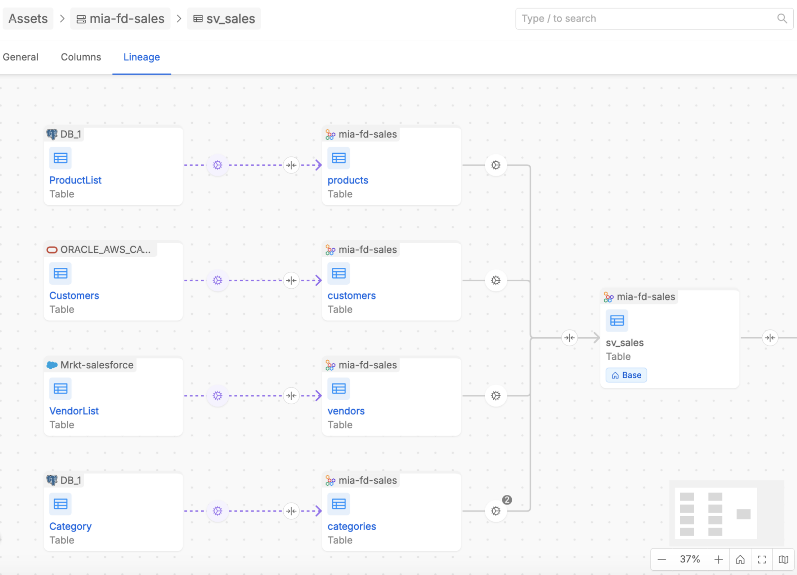

The **Data Lineage UI** provides two levels of visualization:  
- At the **Table Level**, users can explore relationships between individual tables, analyze how data is transformed across tables and describe some useful information about those relations.  
- At the **System of Record (SoR) Level**, users can view a high-level summary of aggregated relationships across databases, derived from the detailed table-level lineage.  

These levels of lineage are designed to complement each other, offering both granular insights and a holistic view of data flows. Together, they provide users with a powerful toolkit to monitor and understand their data ecosystem.

## Key concepts

Here are listed some entities and concepts useful to understand the Data Lineage solution of Mia-Platform Data Catalog.

### Assets: Real and Virtual

Within the Data Lineage UI, users will encounter two types of assets: **real** and **virtual**. Both asset types can represent either **tables** or **Systems of Record (SoRs)**, making the lineage system highly flexible.  

**Real assets** are derived directly from the Data Catalog, reflecting physical entities present in the organization's data environment that have been retrieved by the Data Catalog solution engine.

  

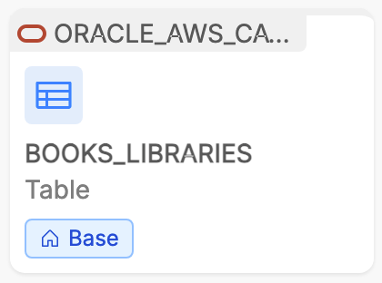

  

Examples include database tables or established Systems of Record containing production data. Metadata enrichment is fully supported for these assets, and their relationships — when automatically inferred — are immutable within the canvas.

**Virtual assets**, on the other hand, are created manually by users. They can be particularly beneficial in scenarios where real-world relationships are incomplete, under development, or unavailable. 

  

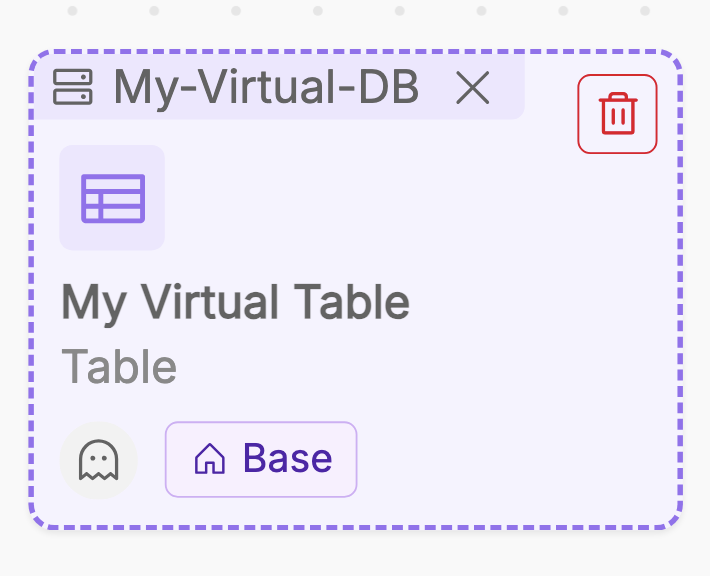

  

For instance, during the planning phase of a new data pipeline, users can create virtual tables to represent the expected data structures and link them with virtual jobs to simulate transformations. Similarly, virtual SoRs allow users to group tables conceptually, even if the underlying system is not yet fully integrated into the Data Catalog. This functionality empowers teams to perform proactive analyses and collaborative planning, ensuring a seamless transition from concept to implementation.

### Jobs: Real and Virtual

When navigating the lineage canvas, real and virtual assets are related each others by arrows that define the direction of the data flow and that contain one or more **Jobs**. A Job represents the descriptive content that explains the relationship between assets. As with assets, users can encounter two types of Jobs: **real** and **virtual**.  

  

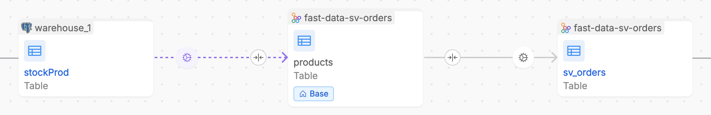

  

**Real Jobs** (displayed with a grey arrow in the image above) represent transformations or dependencies automatically inferred from runtime pipeline configurations. They are read-only within the lineage canvas, ensuring that the relationships accurately reflect the underlying physical processes. 

For each Real Job, users can inspect a detailed view that includes the job producer, a description and a snippet of code, if retrieved, showcasing the logic of the transformation. This transparency allows users to understand exactly how data flows between tables and ensures that relationships are grounded in real-world configurations.  

:::info
In case you have Fast-Data Projects adopting our [Mia-Platform Fast Data runtime solution](/fast_data/runtime_management/overview.mdx), it is possible to automatically retrieve and show inside the Data Lineage all the aggregation processes configured in order to populate and expose your Fast Data Single Views.  
To know more about how to get all the Fast Data runtime information coming from the data pipelines of your Fast Data Projects, please refer to the [related documentation](/data_catalog/data_catalog_job_runner.mdx#fast-data-jobs-sync).
:::

**Virtual Jobs** (displayed with a purple arrow in the image above), on the other hand, are fully customizable and can be created, modified, or deleted directly within the canvas. These jobs allow users to model planned transformations or describe physically relationships still not retrived inside Data Catalog. 

Each Virtual Job includes the job producer and an editable description field where users can document about some relevant information such as the type of implemented process (e.g. ETL, filtering, replica, aggregation, other), the purpose or expected behavior.

## Table-Level Lineage

The **Table-level lineage canvas** provides visualization of how tables are interconnected between each others. In particular, user can access the lineage canvas from the dedicated tab inside the [Table detail page](/data_catalog/frontend/data_catalog_assets.mdx#table-detail-page).

The navigation starts by centering the canvas around a **Base Table**, which serves as the starting point for exploration. The base table refers to the asset the user is on while browsing the Data Catalog and for which user wants to discover the lineage. By default, when entering the lineage canvas, the system displays one level of relationships to the left (upstream) and right (downstream) of the Base Table. Users can expand the lineage incrementally, level by level, to explore more complex relationships and dependencies.

This canvas not only displays the flow of data but also offers capabilities for enriching the lineage with virtual assets, creating new relationships, and inspecting existing ones. It acts as a workspace where users can model, document, describe, and analyze their data transformations in detail.

By clicking on the name of an asset displayed inside the lineage canvas, it is possible to enter its detail page directly inside to its lineage, wherein it is treated as the new Base asset in the canvas.  

### Job details

Users can interact with relationships between tables —represented as arrows— to inspect or manage the underlying jobs.

By clicking on an arrow that links together two tables, it is possible to access the list of one or more Jobs which express the process of the data flow between the two tables.

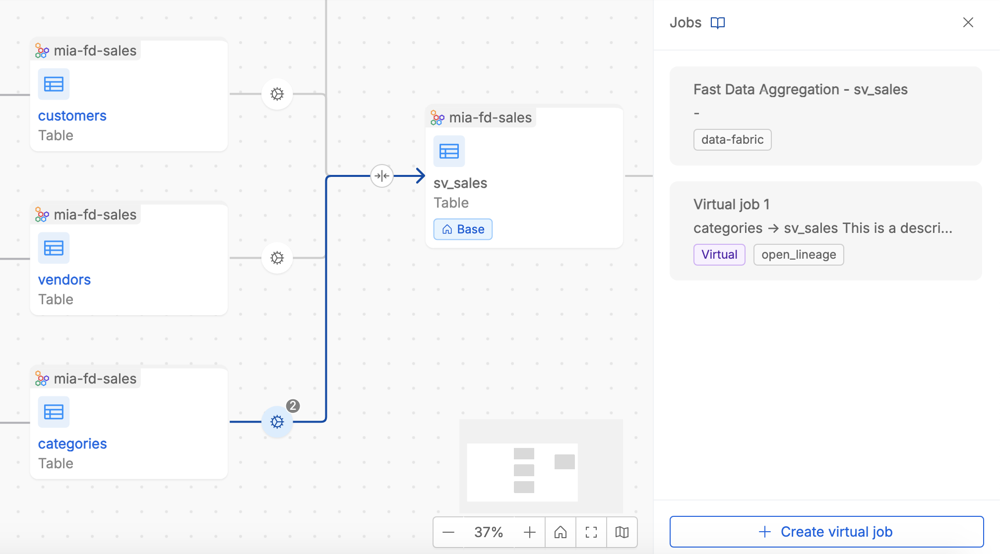

User can easily identify real and virtual jobs by tags and job producer information. Moreover, it is possible to access the **Job detail** by clicking inside a specific job card.

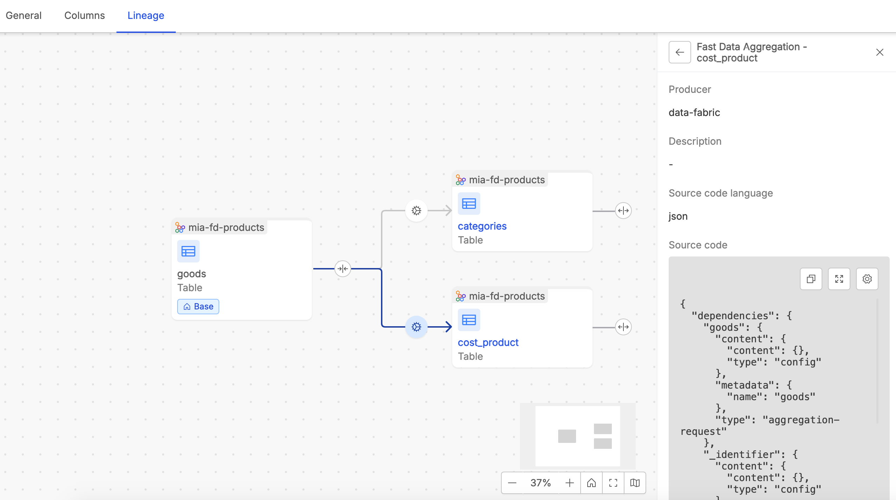

### Enriching the Lineage

At Table-level lineage, users with enough permissions can enrich the lineage information to better document and describe valuable information about how data flows and is treated along its lineage.

#### Creating and Linking Tables

Users can create new Virtual Tables directly within the canvas. These tables can be linked to existing tables —either real or virtual— by defining relationships through Virtual Jobs. When a Virtual Table is created, the system automatically generates a Virtual Job entity that refers to the relationship with the linked asset. This ensures that new tables are immediately integrated into the lineage, allowing for seamless exploration and enrichment.  

More specifically, inside the Table-level lineage, when hovering onto a table (real or virtual) in the lineage, user can click on the `+` button in order to:  

- Create a virtual table to establish a link with that table
- Link an existing table (both real and virtual) to the already existing one 

  

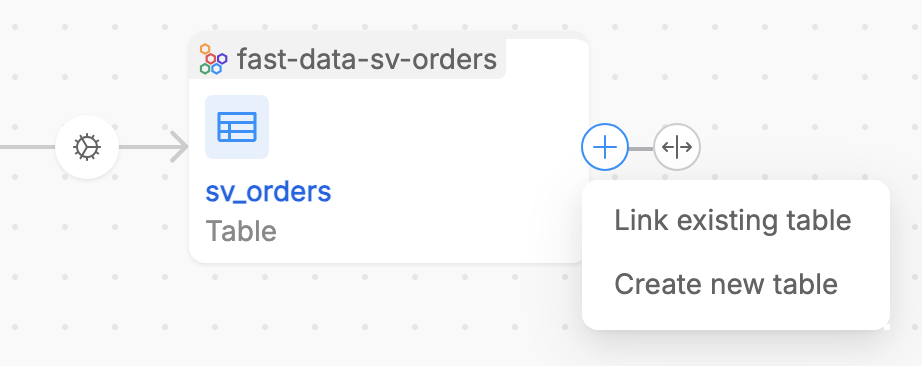

  

#### Adding/Removing Virtual SoR on a virtual table

Virtual Tables can also be associated with Virtual SoRs, enabling users to group them conceptually under larger organizational units. These associations help maintain clarity in complex data ecosystems and provide additional context for downstream analyses.  
It is possible to easily associate a virtual SoR to the virtual table by clicking on the `+ Add system` displayed inside the virtual table entity in the canvas. From the popover, user can enter an already existing name (among the list of the available virtual SoRs), or creating in place a new virtual SoR.

  

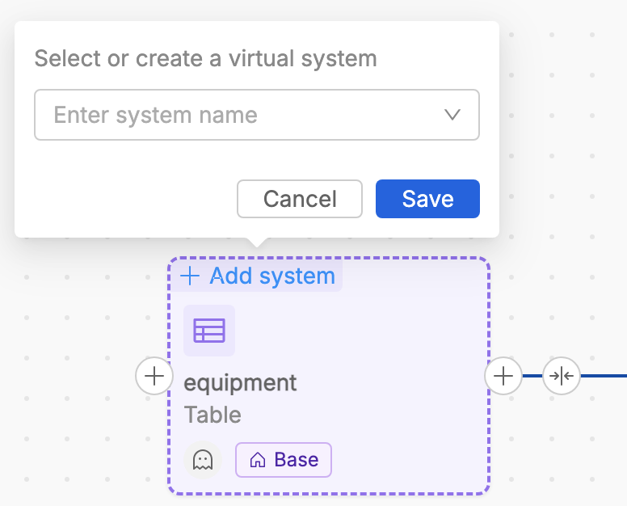

  

Then, from the canvas, it is possible to remove the association with a virtual SoR by clicking on the `X` button displayed alongside the virtual SoR name.

  

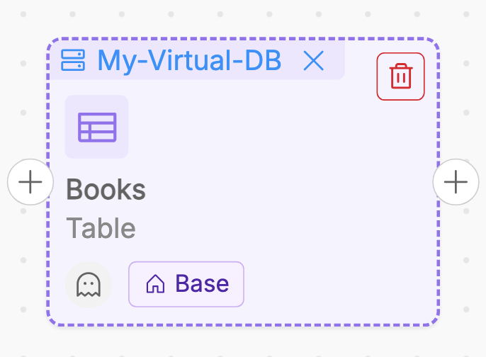

  

#### Deletion of Virtual Table

It is possible to delete a Virtual Table from its asset detail page. 

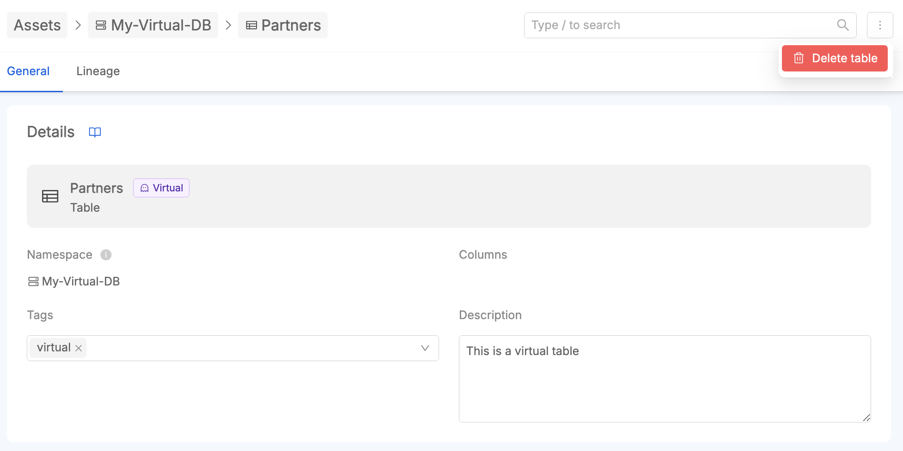

When a Virtual Table is deleted from the lineage canvas, its relationships, such as Virtual Jobs linking it to other tables, are also automatically removed.   
This behavior ensures that the deletion of a Virtual Table impacts only its immediate relationships, maintaining the integrity of other virtual or real assets in the lineage. Similarly, if a Virtual SoR no longer has any associated virtual tables, it will still persist within the system, providing users the flexibility to repurpose it or associate it to new Virtual Tables later. This separation of relationships and existence allows for a modular and non-destructive approach to lineage management.

#### Deletion of Virtual SoR

It is possible to delete a Virtual SoR from its asset detail page. 

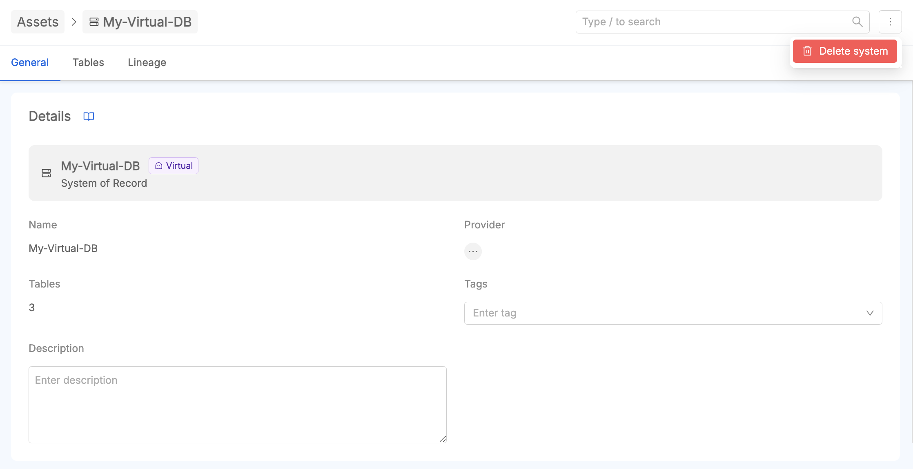

When deleting a virtual SoR, its reference to all the virtual tables associated to it is automatically removed.

#### Managing virtual jobs

At Table-level lineage, a user with enough permission can create, edit and delete virtual jobs.  
As already reported, a virtual job can be automatically created during the creation of a virtual table from the lineage canvas, as it is automatically related with an existent table. In case it is necessary to explain for example more than one process along a data flow, user can create another virtual job inside the relationship between two already linked tables. The creation button is available at the bottom of the Jobs list detail section as reported in the following image.

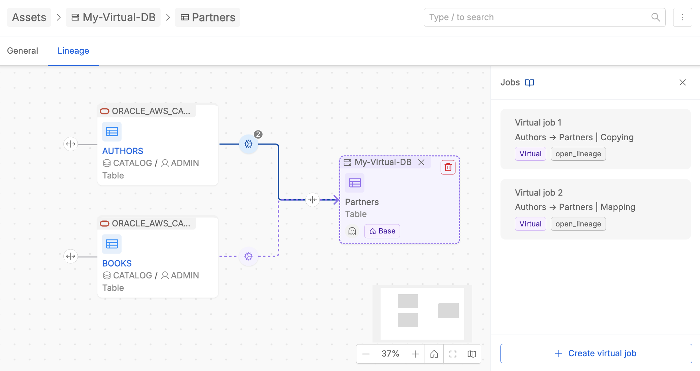

Once created, user can define a description for the new created job.

:::info
Please remind that jobs management feature is **available only for virtual Jobs**.
:::

User can also delete a virtual job. The `Delete Job` button is present inside the virtual job detail section.

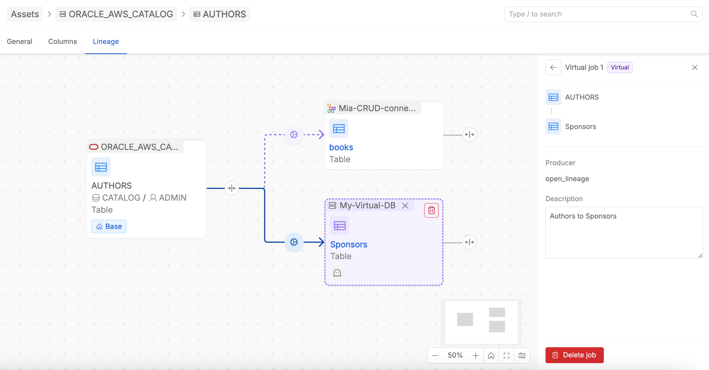

:::info
If a relationship between tables is defined solely by one Virtual Job, the deletion of that Virtual Job implies the automatic removal of the related table from the canvas, but it remains present among the Data Catalog assets.
:::

## System-of-Record-Level Lineage

The **System of Record (SoR) Level Lineage** offers a high-level summary of data flows, showing aggregated relationships across Systems of Records. 

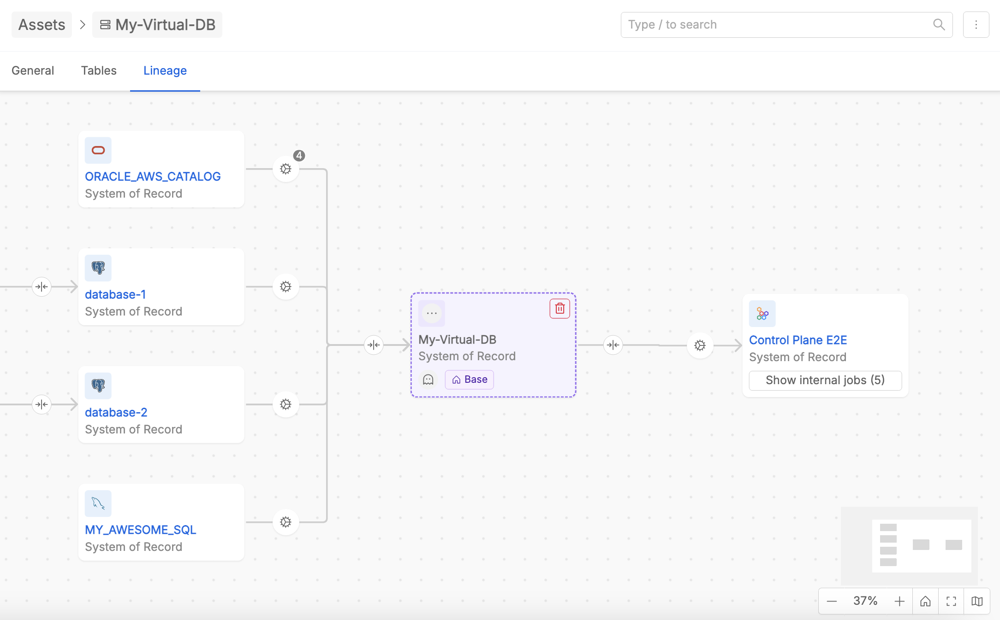

Unlike the detailed table-level lineage, this view is **read-only** and serves as an overview of how larger organizational units interact. It provides a macro perspective, making it easier to identify dependencies or potential bottlenecks at a strategic level.  

The SoR Lineage derives its information from the underlying table-level lineage. Each SoR relation reflects the combined relationships of their respective tables. For example, if multiple tables within two SoRs are connected by jobs, these relationships are aggregated and represented as a single arrow in the SoR Lineage view.  

### Exploring Relations at SoR-level

Clicking on a arrow between two SoRs lets user to see the list of jobs defined at table-level contributing to the relationship. This includes both Real and Virtual Jobs, and each job is clearly labeled to indicate its type.  
It is possible to filter the jobs list based on the table of the source System of Record where execution begins, and/or based on the table of the target System of Record where execution ends.  In this way, from a user perspective, it is easier to pinpoint relevant transformations or dependencies.

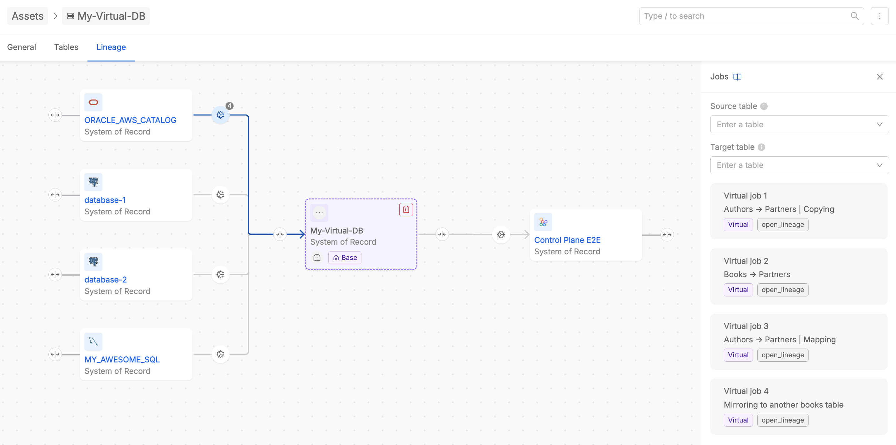

In case tables belonging to the same SoR are related each other, inside the SoR-level lineage canvas the SoR entity displays the number of internal jobs present. User can click on it in order to check the list of intra-SoR processes across its tables, and to filter them on the basis of the selected source and/or target tables.  

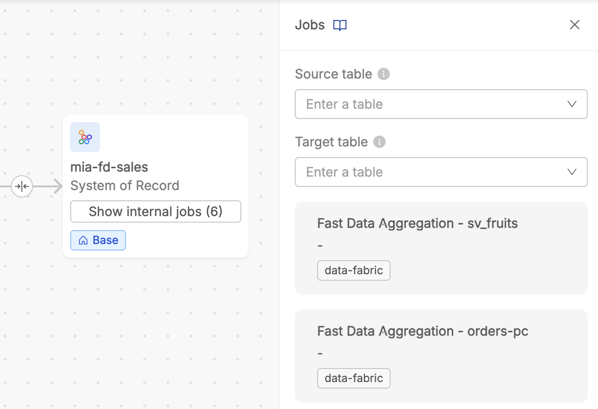

While no modifications can be made at this level, the SoR Lineage provides critical insights into how data moves across systems, helping users identify areas for optimization or further investigation.

## Key Scenarios and Examples

1. **Creating a Virtual Table and Linking It to a Real Table**  
   Imagine planning a new data pipeline where a table will aggregate metrics from an existing dataset. By creating a Virtual Table and linking it to a Real Table through a Virtual Job, users can model the expected transformation and document the intended logic before implementation.

2. **Inspecting Real Jobs Between Tables**  
   A Real Job connecting two tables contains a snippet of code that defines the transformation. This is useful for understanding the logic of automated pipelines and ensuring compliance with business rules or regulatory requirements.

3. **Filtering Jobs Between SoRs**  
   In a complex SoR Lineage view, where multiple jobs link two systems, users can filter the job list to focus on ingoing or outgoing tables of interest. This simplifies the process of analyzing specific data flows without navigating unnecessary details.

4. **Managing Virtual SoRs**  
   Virtual SoRs can be used to conceptually group Virtual Tables under a single organizational unit. For example, during a system migration project, users might create a Virtual SoR to represent the target environment and populate it with Virtual Tables representing planned datasets.

---

This documentation provides a comprehensive guide to the **Data Lineage UI**, detailing its features and workflows. By leveraging both table-level and SoR-level lineage, users can gain valuable insights into their data ecosystems and effectively plan, document, and analyze their data transformations.
