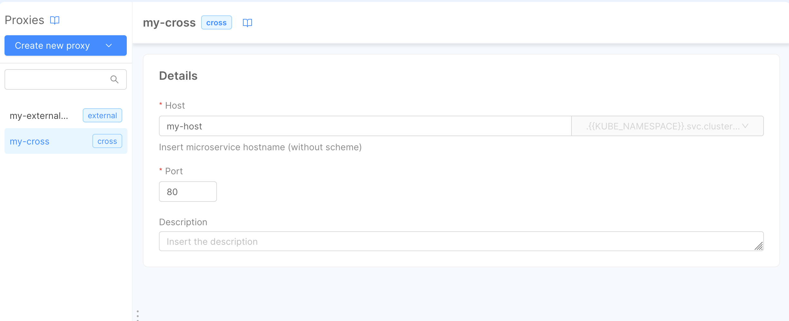

## What is a Proxy

A proxy allows you to contact endpoints outside your cluster or call a microservice in another namespace of the cluster.

For example, with proxies you can centralize control over external API usage by defining a unique point (the proxy) and call it by the microservices that need it, without spreading the same configuration across them.
Moreover being able to expose proxies on the same project domain, you'll be able to access external APIs from the outside of the cluster (for instance, from web applications) without having to deal with CORS or Content-Security Policy issues.

## Create a Proxy

You can create a proxy selecting one of the available proxy inside the marketplace, or you can create a custom proxy by yourself.
There are two types of proxy: [**External**](#external-proxy) and [**Cross Project**](#cross-projects-proxy).

:::caution
When you call an [external proxy](#external-proxy) any cookie/client-key are removed to avoid security issues. Instead, when you call a [cross projects proxy](#cross-projects-proxy) you will keep them.
:::

### External Proxy

:::info
An External Proxy allows you to contact endpoints outside your cluster.
:::

In order to create a new external proxy, open the `Proxies` section in the *Design area*, select `Create new proxy` and choose `External` as `Type`. Then enter the following information:

* **Name** (*required*): the name of the proxy
* **Url** (*required*): the endpoint of the proxy including the protocol (*https* or *http*)
* **Description**: optional description of the proxy

Once you have created the proxy you can manage, add and delete the HTTP Headers associated to proxy requests. This way all requests made through the proxy will include some specific headers.

For each header, you have to define:

* **Field Name** (*required*): the name of the header
* **Field Value** (*required*): the value of the header
* **Description**: optional description of the header

:::tip
For example, this feature is useful to call an external API passing an authorization header without spreading the information across the microservices in your project.
:::

:::warning
If the proxy host is unreachable you can see error logs in the API Gateway service pod.
:::


### Cross-Projects Proxy

:::tip
A Cross Projects proxy allows you to call a microservice in another namespace of the cluster.
:::

In order to create a new external proxy, open the `Proxies` in the *Design area*, select `Create new proxy` and choose `Cross Projects` as `Type`. Then enter the following information:

* **Name** (*required*): the name of the proxy
* **Host** (*required*): the hostname of the microservice excluding the scheme
* **Port** (*required*): the port of the microservice
* **Description**: optional description of the proxy



## Expose a Proxy

Before using a proxy you have to expose it by an [endpoint](/development_suite/api-console/api-design/endpoints.md#what-is-an-endpoint).

The `Type` of the endpoint must be `External Proxy/Cross Projects proxy`. In the `Microservice` field select the name of the proxy you want to expose. The proxy endpoint will be exposed on [API gateway](/runtime_suite/api-gateway/10_overview.md).

### How to call a Proxy

You can call a proxy endpoint making an HTTP request:

For example:

```bash
curl --request GET 
  --url https://your-domain/endpoint 
```

### How to call a proxy endpoint from a microservice

The proxy endpoints are exposed on the [API gateway](/runtime_suite/api-gateway/10_overview.md) so you can call them from your microservices making an HTTP request to the API Gateway: `http://api-gateway:8080/your-endpoint`.

You can also use the [Mia-Platform Service Libraries](/libraries/mia-service-libraries.md) that help you to get a proxy towards the API Gateway.
