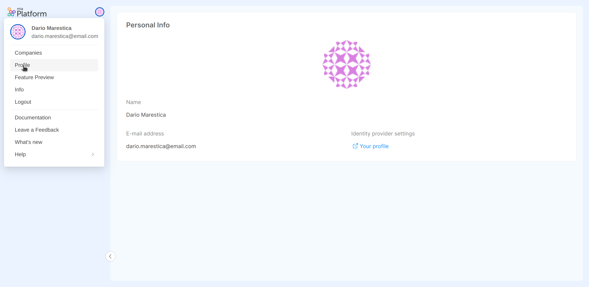
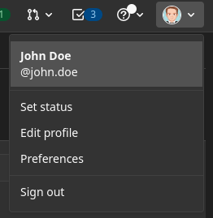

## User personal info

You can view your personal profile information inside the `Personal info` tab, which is available upon selecting the `Profile` voice from the dropdown menu that appears when hovering over your Console avatar.  

This tab displays a brief summary of your profile, including your avatar, name, email-address and an external link for managing the profile settings on the identity provider.  

### User avatar

Each user in the Console has an avatar image that will be visible from the Console launchbar and right inside the `Profile` section, under the `Personal info` tab. You can configured it according to the specific authentication provider. 

#### GitLab

To configure your avatar with GitLab, you should go in the `Edit profile` section, reachable from the top right corner.

Then, you can choose a new one in the `Public avatar` area.

#### Okta

Okta does not manage any profile picture.

To make up for this lack, [Gravatar](https://gravatar.com/) is used as fallback: register to this service in order to set up a profile picture while using Okta provider.

Follow these steps: 

* Create an account on Gravatar
* Set a gravatar on your email 
* Go on the section "My Profile" - "Website" and add the Console url 
