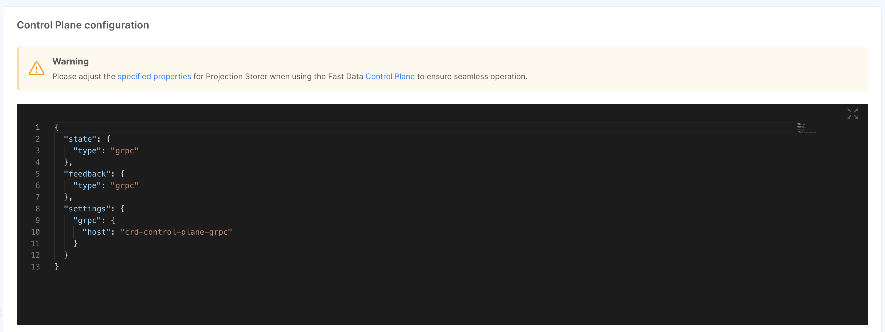

import Tabs from '@theme/Tabs';
import TabItem from '@theme/TabItem';
import SchemaViewer from "../snippets/schema_viewer.mdx";
import ControlPlaneSchema from "@site/static/schemas/fast-data-control-plane-client-config.schema.json"
import JSWorkloadSnippet from "./snippets/js-workload-configuration.md"

This section helps you configure new or existing Fast Data services so that they can communicate with the Control Plane Operator.

:::note Compatibility Matrix
To see if your microservices have support for your Control Plane Operator version, give a look at the [compatibility matrix section](/fast_data/runtime_management/compatibility_matrix.md).
:::

As mentioned in the [Overview section](/fast_data/runtime_management/overview.mdx#workload), a service configured
to interact with the Control Plane will have all its artifacts (topics, projections or single views) in a `paused` state,
meaning that no data will be processed until a [resume interaction](/fast_data/runtime_management/control_plane_frontend.mdx#pause-and-resume) will be requested by the user.

:::danger
If you are configuring Control Plane configurations for existing Fast Data workloads, they will be released in a 
`paused` state after deployment and they will __not__ process data.

This may cause some delay in your architecture.

To reduce as much possible this delay, you can relay on [Bulk actions](/fast_data/runtime_management/control_plane_frontend.mdx#bulk-actions) to quickly resume entire pipeline stages.
:::

## Configuration

To enable a Fast Data service to communicate with a Control Plane instance, you have to define a JSON configuration that should
match the one given to the Control Plane.

The JSON object has the same properties for all Fast Data microservices and must be compliant to the following JSON Schema.

<SchemaViewer schema={ControlPlaneSchema} />

Choose below the service you want to configure with Control Plane to see where to place this configuration.

<Tabs values={[
    {label: 'Projection Storer', value: 'projection-storer'},
    {label: 'Real-Time Updater', value: 'rtu'},
    {label: 'Single View Trigger Generator', value: 'svtg'},
    {label: 'Single View Creator', value: 'svc'}
]} queryString="workload">

<TabItem value="projection-storer">

#### Projection Storer

To configure the Control Plane connection for the Projection Storer, first [you need to attach the microservice to a System of Record](/fast_data/configuration/projection_storer.md#attach-to-system-of-record).

Then, you can scroll over the Control Plane section and write your JSON configuration. More details on the Control Plane
configuration for Projection Storer service can be found in the service [configuration page](/fast_data/configuration/projection_storer.md#runtime-management-config).



</TabItem>
<TabItem value="rtu">

#### Real-Time Updater
<JSWorkloadSnippet/>
</TabItem>

<TabItem value="svtg">

#### Single View Trigger Generator
<JSWorkloadSnippet/>
</TabItem>

<TabItem value="svc">

#### Single View Creator
<JSWorkloadSnippet/>

</TabItem>
</Tabs>

:::info gRPC Host Resolution

To enable gRPC communication between the Control Plane Operator and the Fast Data runtime, services within the Fast Data runtime should reference
the gRPC server contained in the Control Plane Operator using its corresponding [Kubernetes hostname](https://kubernetes.io/docs/concepts/services-networking/dns-pod-service/).

For example, consider a use case where we have a Control Plane Operator service named `control-plane-operator`.
Then, workloads should have the `settings` properties configured as follows:

```json
{
  // ...
  "settings": {
    "grpc": {
      "host": "control-plane-operator" 
      // or control-plane-operator.svc.cluster.local, etc...
    }
  }
  // ...
}
```

:::

### Force the Resume of Workload Operations 

If for some reasons either the `Control Plane` or `Control Plane Operator` are unreachable during service startup, it can be forced the resume of workload's data streams
after a certain timeout. This option can be tuned with the `settings.channel.forceResume` parameter, which can either be:

- a boolean flag set to `true`, which will resume data streams after 15 seconds;
- an object having a field `timeout.ms` that defines explicitly the number of milliseconds to wait before resuming data streams.

:::info
Please note that, even if the workload will resume the data stream, it will still try to connect to Control Plane until a successful connection will be established.
:::

## Bind Microservices to Runtime

Once a Control Plane configuration has been defined for one of the workloads above mentioned, upon saving,
the Console will create an additional configuration, that we refer to as **bindings**, that will contain 
the mapping between the Projections or the Single Views with a specific pipeline and its own artifacts.

This configuration will be read-only and:

- for the Projection Storer, the configuration will be managed internally by the microservice;
- for other microservices, an additional environment variable `CONTROL_PLANE_BINDINGS_PATH` managed by
  Mia-Platform Console will be set-up with the full path of the new configuration.   


