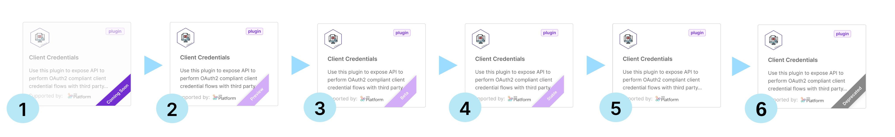
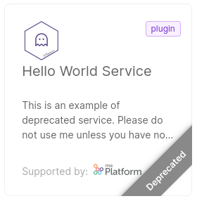
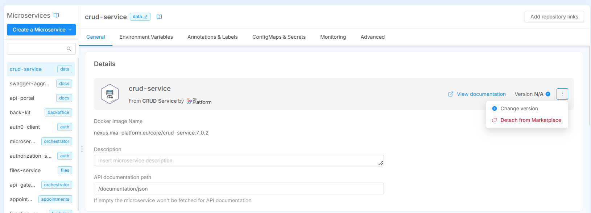

The Mia-Platform Marketplace contains several code resources that facilitate a faster and frictionless building of your architecture.

In the Marketplace, you will be able to choose from a set of **items**, also called **components**, to easily set up a single microservice or a bundle of resources **with predefined and tested functionalities**.

The types of Marketplace components you can use include:

* **[Plugin](/plugins/mia-platform-plugins.md)**: a ready-to-use Microservice.  

* **[Template](/marketplace/templates/mia_templates.md)**: a base repository with some boilerplate code from which you can start to create a new Microservice.

* **[Example](/marketplace/examples/mia_examples.md)**: a specific use-case, a ready-to-use model to create a new Microservice. On the contrary of the Template, an Example already contains some ready to use business logic code, that you can later modify to match your exact needs.

* **[Application](/marketplace/applications/mia_applications.md)**: a bundle of resources including Plugins, Templates, and Examples, but also Endpoints, Collections, and Public Variables.

* **[Proxy](/development_suite/api-console/api-design/proxy.md)**: specific configurations used to invoke APIs that are external to the current project, but may be provided by an external service or another project.

* **[Sidecars](/software-catalog/manage-items/mia-ctl/create/create-item-by-type/create_sidecar.md)**: secondary utility containers running side by side with the main container in the same host.

* **[Infrastructure Resources](/software-catalog/manage-items/mia-ctl/create/create-item-by-type/create_infrastructure_resource.mdx)**: custom objects that are not part of the standard Console supported resources.

* **[Extensions](/console/company-configuration/extensions.md)**: custom page that enhances Console capabilities by integrating it into the sidebar navigation.

:::info

Mia-Platform supported Templates and Example source code is open source software, hosted on public Git repositories.
You can visit the [Mia-Platform Marketplace GitHub page](https://github.com/mia-platform-marketplace) to browse the source code.

Feel free to contribute by opening a Pull Request!

:::

### Explore the Marketplace

Mia-Platform Marketplace has two different entry points, both located in the *Design Area* of the Console.

To browse Marketplace Applications, head to the *Applications* section and click on the button *Create new Application*. 
For more information see [the related page](/marketplace/applications/mia_applications.md).

To browse Markeplace Plugins, Templates and Examples, go to the *Microservices* section and click on the button *Create a Microservice*, then click on the option **For Marketplace** of the dropdown menu.

In both cases, you will be able to filter components by **Category**, a property reflecting the purpose, the field, or the use-case a component is associated with (e.g. Data visualization).

The results of your search will always appear organized by Category.

:::info

You can contribute to the Mia-Platform Marketplace by creating and sharing your own items. Find out more about how to [create your  Company Marketplace](/software-catalog/manage-items/overview.md).

:::

## Marketplace items lifecycle

Each Marketplace item has a predetermined **development lifecycle**:

The following are the expected stages along a Marketplace component lifecycle:

* **Coming soon**: implementation has just started, these components cannot be used yet (users can still be informed about the existence of a new component)

* **Preview**: first usable release, components may include bugs and be subject to undocumented breaking changes

* **Beta**: implementation is complete, these components won't be subject to any undocumented breaking change but may still include bugs (hence they must be used with caution)

* **Stable**: implementation is stable (bugs free). Consequently, this stage represents the period before the component's official release and its documentation in the release note.

* **Deprecated**: items may reach this state when support by maintainers is dropped. For more details consult the following section.

### Deprecated Items

Sometimes, a Marketplace item may become deprecated. This typically occurs when a newer item replaces it with enhanced features, or when a better solution is provided by a new application. 

In such cases, the maintainer may decide not to longer support the older item, meaning it will not receive any future updates.

The item will be marked as **Deprecated**. While you can still use it if necessary, its functionality may be limited or outdated compared to current standards. The suggested alternative will be published in the deprecated item documentation.

:::caution

It's important to consider the alternatives to a deprecated item. Using updated and supported items ensures better performance, security, and compatibility.

:::

### Set controlled versions for your Marketplace resources and make them available to users

:::info
This feature is currently available for the [Plugin](/software-catalog/manage-items/mia-ctl/create/create-item-by-type/create_plugin.md), [Infrastructure Resource](/software-catalog/manage-items/mia-ctl/create/create-item-by-type/create_infrastructure_resource.mdx), [Templates and Examples](/software-catalog/manage-items/mia-ctl/create/create-item-by-type/create_template_or_example.md) types.
:::

Marketplace creators have now the possibility to manage some types of resources through a governance based on a versioning system.

This means that, for these types of resources, it is possible to establish a more structured and transparent lifecycle management system, providing users access to all the versions of a resource and allowing them to see the release notes of each version and select and instantiate the version that best suits their configuration needs among the ones made available by the Marketplace creator.

This versioning system also provides significant advantages in a feature-branch design workflow, effectively leveraging different versions of the same Marketplace item across various branches of a project.

For instance, we imagine to have a project with three different revisions: *dev*, *stage* and *main*, with the latter being the branch with the official configuration. Let's also imagine to have installed in all the three revisions the *CRUD Service* plugin, which includes different versions.

In this scenario we can have:

- the `main` branch with the `6.6.0` version, which is the supported version in our project
- we can use the the version `6.10.0` in the `stage` branch where the latest manual tests and verifications are performed before to be included in the `main` branch
- at the same time we can experiment and test features using the version `7.0.0` in your `dev` branch without affecting the other branches and the existing configurations

This approach facilitates a smooth upgrade process, enables thorough testing of new features, and ensures compatibility across different stages of your project lifecycle. This flexibility allows for testing new versions in development environments while maintaining stable versions in production.
Such a structured approach will streamline resource management and ensure compatibility and stability across different use cases.
