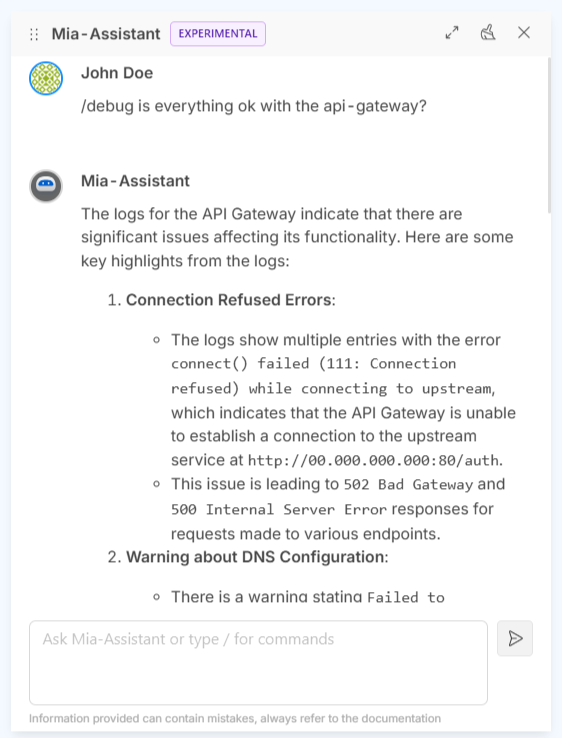

_April 17th, 2025_

## AI Agentic Features for your Company

From this Console release you can enable AI agentic features on your Company and Projects!
 
By turning on the "AI settings" toggle in the Company Settings page, you activate Mia-Assistant as an agent that accesses data within your Projects across your Company. This allows users to execute AI commands directly within their Projects.

For more details, check the related [documentation](/console/company-configuration/settings.md).

### Debug with Mia-Assistant

The first AI agentic feature available is Debug with Mia-Assistant.
Starting from this release, Mia-Assistant helps you gain deeper insights into your Projects’ Runtime!

When inside a specific Project, simply type `/debug` in the Mia-Assistant chat and start asking for information.

Learn more about the Debug command in the related [Mia-Assistant documentation](/console/assistant/overview.md).

## Customize Service account name for your Microservices

You can now assign a custom Service account name to each of your Microservices directly from the new "Service Account" card in the Microservice details page.

This allows for more granular access control by defining specific Kubernetes RBAC policies per service, improving security and ensuring that each Microservice can communicate with other services or cloud identities using its own dedicated Service Account with specific privileges, instead of relying on the default cluster-wide Service Account.

## Console

### Bug Fix

This version addresses the following bugs:

* we fixed a bug that prevented to link a newly created Envoy API Gateway to an already existing Listener.

## Marketplace

### Marketplace Updates

#### FHIR Adapter

The new minor version `1.1.0` of the FHIR Adapter is available!

This version adds a `POST /:resource/` endpoint to handle trailing slash.

#### O3 DICOM Service

The new patch version `0.1.7` of the O3 DICOM Service is available!

This releases uses a fixed length of 64 characters for the DICOM UIDs to ensure full compatibility with international standards.

## How to update your Console

For self-hosted installations, please head to the [self hosted upgrade guide](/infrastructure/self-hosted/installation-chart/100_how-to-upgrade.md) or contact your Mia-Platform referent and upgrade to _Console Helm Chart_ `v14.1.1`.

