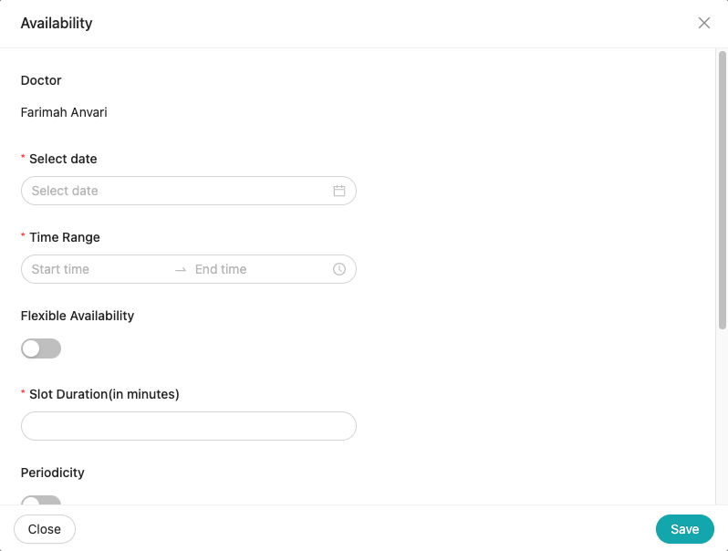

The `ck-availability-modal` web component is a modal specialized in adding/modify availabilities for the two kind of availability in flexible or normal availability.



## Usage

The web component consists of a form inside a modal with dynamically generated fields based on a Availability.


The web-component also listens to the [add-new](/microfrontend-composer/back-kit/70_events.md#add-new) event. Upon receiving a `add-new` event, the `ck-availability-modal` opens to create new availability Submitting the form will trigger the post of the availabilities.

The web-component also listens to the [selected-data](/microfrontend-composer/back-kit/70_events.md#selected-data) event. Upon receiving a `select-data` event, the `ck-availability-modal` opens in edit mode. For the modal to open correctly, the payload of the event must contain a valid `_id` of the availability that has to be edited. If the modal was opened in edit mode, the submitting of the form will trigger the patch of the selected appointment.

In order to open the `ck-availability-modal` in a Microfrontend Composer, a configuration is needed to configure a button to emit the custom event [`availability-modal`](/runtime_suite/care-kit/30_events.md#availabilitymodal). An example configuration follows: 

```
{
  "$ref": {},
  "content": {
    "attributes": {
      "style": "height: calc(100vh - 64px);"
    },
    "type": "row",
    "content": [
            {
        "type": "element",
        "tag": "bk-button",
        "properties": {
          "type": "default",
          "iconId": "PlusOutlined",
          "content": {
            "it": "Aggiungi piano",
            "en": "Add plan"
          },
          "clickConfig": {
            "type": "event",
            "actionConfig": {
              "label": "availability-modal",
              "payload": {
                slot:{}
              }
            }
          }
        }
      },
      
      {
        "type": "element",
        "tag": "ck-availability-modal",
        "properties": {
          "availabilityBasePath": "/v2/appointment-manager/appointments/",
          "dataSchema": {
            "type": "object",
            "properties": {
              "address": {
                "type": "string",
                "label": "Site"
              },
              "performance": {
                "type": "string",
                "format": "lookup",
                "label": {
                  "it": "Prestazione",
                  "en": "Performance"
                },
                "lookupOptions": {
                  "lookupDataSource": "performances",
                  "lookupValue": "_id",
                  "lookupFields": ["name"]
                },
                "unique": false,
                "formOptions": {
                  "readOnly": false
                },
                "visualizationOptions": {
                  "hidden": true
                }
              }
            }
          }
        }
      }
    ]
  }
}
```

## Properties & Attributes

| property               | type       | required | default | description                                                 |
|------------------------|------------|----------|---------|-------------------------------------------------------------|
| `availabilityBasePath` | string     | true     | /       | Base path to the Therapy and Monitoring Manager.            |
| `dataSchema`           | DataSchema | false    | -       | Defines a dataSchema for additional fields                  |
| `width`                | string     | false    | 800px   | The width of the modal. It must a valid CSS value.          |
| `height`               | string     | false    | 500px   | The minimum height of the modal. It must a valid CSS value. |

## Listens to

| event                                                                          | action                                            | emits              | on error |
|--------------------------------------------------------------------------------|---------------------------------------------------|--------------------|----------|
| availability-modal                                                             | Triggers the opening or the closing of the modal. | -                  | -        |
| [selected-data](/microfrontend-composer/back-kit/70_events.md#selected-data) | Triggers the opening of the modal in edit mod     | availability-modal | -        |
| add-new                                                                        | Listens to the add-new event to open modal        | -                  | -        |
| LookupLiveFound                                                                | Listens to the live lookup data                   | -                  | -        |
| LookupFound                                                                    | Listens to the lookup data                        | -                  | -        |

## Emits

| event              | description                                                     |
|--------------------|-----------------------------------------------------------------|
| availability-modal | Custom event, triggers the opening or the closing of the modal. |
