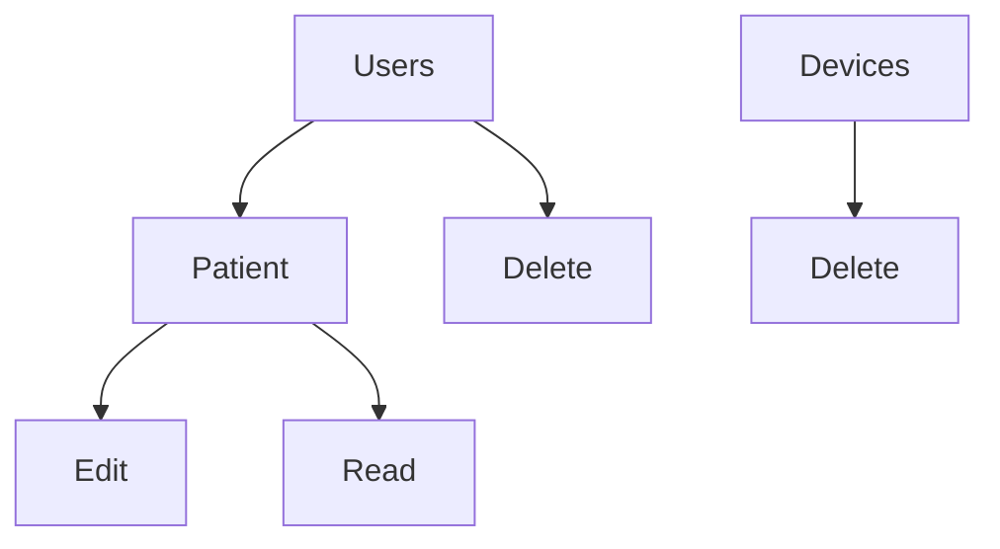
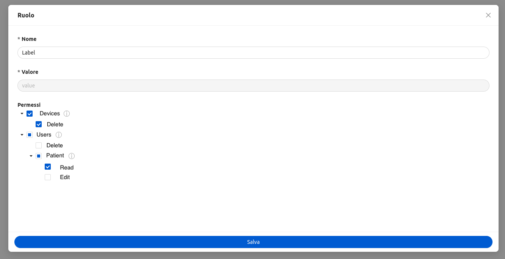
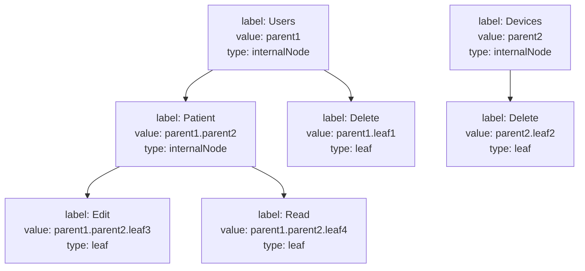

The `ck-roles-and-permissions-modal` web component facilitates the management of roles and their associated permissions. It allows you to create, edit and manage roles assigning permissions using a **tree structure**, where each node represents a permission.

* **Internal nodes**: represent categories or groups of permissions. They are parent nodes that can have child nodes (either other internal nodes or leaf nodes). When an internal node is selected, it implies that all its descendant nodes (both internal and leaf) are also selected.
* **Leaf nodes**: are the specific permissions themselves. These nodes represent actionable permissions (like "read", "edit", or "delete") and cannot have child nodes.
Selecting an internal node grants all the permissions contained within its child nodes, while selecting a leaf node grants only that specific permission.


## Example
An example of the permissions tree structure:


The web component will follow this structure and allow you to check the permissions of the role you are creating. if you check an internal node it actually means that all the leaf nodes connected to that node have been checked. 



## Usage

To integrate the `ck-roles-and-permissions-modal` into a Microfrontend Composer page, include the component in the page configuration.
Below is an example configuration:

```json
{
  "type": "element",
  "url": "/mia-care-web-components/mia-care-web-components.esm.js",
  "tag": "ck-roles-and-permissions-modal",
}
```

Upon completing an action, a feedback message will be displayed, indicating success or failure.

## Properties & Attributes

| property                | type     | required | default | description                                                                                     |
|-------------------------|----------|----------|---------|-------------------------------------------------------------------------------------------------|
| `rolesManagementEndpoint` | `string` | false    | /roles/    | Endpoint used to retrieve data of the roles. (See [Roles endpoint schema](#roles-endpoint-schema) for more information).             |
| `permissionsManagementEndpoint`        | `string` | false    | /permissions/        |  Endpoint used to retrieve data of the permissions. (See [Permissions endpoint schema](#permissions-endpoint-schema) for more information).     |
| `width`                 | `string` or `number` | false    | 70%   | The width of the modal. It must a valid CSS value.                                               |
| `readOnly`    | `boolean` | false    | false    | When set to `true`, this value ensures the modal is in read-only mode, preventing user input. |


## Listens to

| event                                                                          | action                                            | payload               |
|--------------------------------------------------------------------------------|---------------------------------------------------|----------|
| [selected-data](/microfrontend-composer/back-kit/70_events.md#selected-data) | Triggers the opening of the modal in edit mod     | The data of the role. Please note that the `_id` is required.         |
| [add-new](/microfrontend-composer/back-kit/70_events.md#add-new)                                                                        | Listens to the add-new event to open modal        | -                   |


## Communication with Endpoints

### Roles Management Endpoint

<a name="roles-endpoint-schema"></a>

It retrieves the list of roles and it allows either to create a new role or to edit an existing one
The endpoint should expose these methods

* **GET by id**: Retrieve a specific role with all schema information.
* **POST**: Create a new role with permissions selected assigned.
* **PATCH by id**: It allows to patch a specific role by changing either name or the list of permissions.

#### Schema

| property                | type     | required | description                                                                                     |
|-------------------------|----------|---------|-------------------------------------------------------------------------------------------------|
| `_id` | `string` | false      | The ID of the permission. This field is auto-generated from the backend.             |
| `label` | `string` | false       | Readable name of the role.            |
| `value`        | `string` | false       | Identifier that defines the role.         |
| `permissions`                 | `string[]` | false      | [Values of the permissions](#permissions-endpoint-schema) of the role.                                              


### Permission Endpoint

<a name="permissions-endpoint-schema"></a>

This endpoint manages the entire permission tree. It must serve all available permissions, both internal nodes and leaf nodes. This allows the web component to build the permission tree structure correctly.

It should expose an **EXPORT** which retrieve the list of all permissions 


#### Schema

| property                | type     | required  | description                                                                                     |
|-------------------------|----------|---------|-------------------------------------------------------------------------------------------------|
| `_id` | `string` | false       | The ID of the permission. This field is auto-generated from the backend.            |
| `label` | `string` | false       | Readable name of the permission.           |
| `value`       | `string` | false         | The format of this value is created by associating the value of the parent nodes and the identifier of the node. For example parent1.parent2 or parent1.parent2.leaf4      |
| `description`                 | `string` | false      | Description of the permission.                                              |
| `type`    | `Enum`: `leaf` or `intenalNode` | false      | This value indicates whether the permission type is a leaf or an internal node.


following this [example](#example) the expected data might look like this:
```json
[
  { "label": "Devices", "value": "parent2", "type": "internalNode" },
  { "label": "Edit", "value": "parent1.parent2.leaf3", "type": "leaf" },
  { "label": "Delete", "value": "parent2.leaf2", "type": "leaf" },
  { "label": "Users", "value": "parent1", "type": "internalNode" },
  { "label": "Patient", "value": "parent1.parent2", "type": "internalNode" },
  { "label": "Read", "value": "parent1.parent2.leaf4" },
  { "label": "Delete", "value": "parent1.leaf1", "type": "leaf"}
]
```

This would correspond to the following tree:



### Notes

Remember, the permissions for a role will always consist of the leaf node values, but the permissionsManagementEndpoint must provide the entire tree structure, including internal nodes, for the modal to work properly.

When adding a new permission, such as "Read" under a new category "Documents" the permissionsManagementEndpoint must return:

- An internal node for the "Documents" category with the value "documents".
- A leaf node for the "Read" permission with the value "documents.write".

This ensures that the frontend can properly display the hierarchy of permissions.

The expected response format in this case would be:
```json
[
  { "label": "Documents", "value": "documents", "type": "internalNode" },
  { "label": "Write", "value": "documents.write", "type": "leaf" }
]
```
