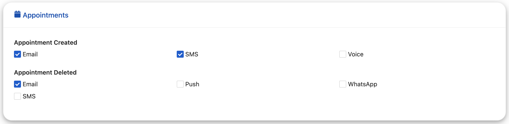

<!--
WARNING: this file was automatically generated by Mia-Platform Doc Aggregator.
DO NOT MODIFY IT BY HAND.
Instead, modify the source file and run the aggregator to regenerate this file.
-->

The `ck-notification-card` web component is used to select desirable notification between the available channel. The selection of a option will trigger the emission of `notification-config` event.




## Usage

Properties `clusterLabel` and `clusterIcon` will be shown in the card header. `clusterIcon` is contained the name of the card icon it should be the name of one of the `fontawesome` icons like `FaChartLine`.
Property `topics` will be the list of available events inside each card, it is contained 
```
{ 
  eventName: 'name',
  labels: {
    en: 'Name',
    it: 'Nome'
  }
}
```
### Available Topics

The list of available topics for each cluster is listed bellow:

`clusterName: Monitoring`
```
"topics": [
  {
    "eventName": "TMM/MonitoringCreated/v1",
    "labels": {
      "en": "Monitoring Created",
      "it": "Monitoraggio Creato"
    }
  },
  {
    "eventName": "TMM/MonitoringDeleted/v1",
    "labels": {
      "en": "Monitoring Deleted",
      "it": "Monitoraggio Eliminato"
    }
  },
  {
    "eventName": "TMM/MonitoringReminder/v1",
    "labels": {
      "en": "Monitoring Reminder",
      "it": "Promemoria Appuntamento"
    }
  },
  {
    "eventName": "TMM/MonitoringUpdated/v1",
    "labels": {
      "en": "Monitoring Updated",
      "it": "Monitoraggio Aggiornato"
    }
  },
  {
    "eventName": "TMM/ThresholdExceeded/v1",
    labels: {
      "en": "Threshold Exceeded",
      "it": "Soglia Superata"
    }
  }

]
```

`clusterName: Therapy`
```
"topics": [
  {
    "eventName": "TMM/TherapyCreated/v1",
    "labels": {
      "en": "Therapy Created",
      "it": "Terapia Creata"
    }
  },
  {
    "eventName": "TMM/TherapyDeleted/v1",
    "labels": {
      "en": "Therapy Deleted",
      "it": "Terapia Eliminata"
    }
  },
  {
    "eventName": "TMM/TherapyUpdated/v1",
    "labels": {
      "en": "Therapy Updated",
      "it": "Terapia Aggiornata"
    }
  },
  {
    "eventName": "TMM/TherapyReminder/v1",
    "labels": {
      "en": "Therapy Reminder",
      "it": "Promemoria terapia"
    }
  },
]
```

`clusterName: Appointments`
```
topics": [
  {
    "eventName": "AM/AppointmentCreated/v1",
    "labels": {
      "en": "Appointment Created",
      "it": "Appuntamento Creato"
    }
  },
  {
    "eventName": "AM/AppointmentDeleted/v1",
    "labels": {
      "en": "Appointment Deleted",
      "it": "Appuntamento Eliminato"
    }
  },
  {
    "eventName": "AM/AppointmentReminder/v1",
    "labels": {
      "en": "Appointment Reminder",
      "it": "Promemoria Appuntamento"
    }
  },
  {
    "eventName": "AM/AppointmentUpdated/v1",
    "labels": {
      "en": "Appointment Updated",
      "it": "Appuntamento Monitoraggio"
    }
  },
]
```

`clusterName: Administrations`
```
topics": [
  {
    "eventName": "IC/ResourceForbiddenEvent/v1",
    "labels": {
      "en": "Resource Forbidden Event",
      "it": "Violazione Integrità Risorsa"
    }
  }
]
```


For additional information about the behavior of the events, take a look at the [Event section][events].

Based on the available `topics` that you provide to the component, the cards contents will be rendered.

After the clusters have been retrieved, the available and enabled channels will be displayed on each category upon initialization. Every time a channel is selected a request contained the new enabled channels for the user will be sent to the `/user-notification-settings/` endpoint, and the list will updated based on the new list.

## Properties & Attributes

| property     | type     | required | default   |                           description                                  |
|--------------|----------|----------|-----------|------------------------------------------------------------------------|
|`NotificationBasePath`| `string` | true     | /         | Path the expose the Notification Manager service. The path must not have the trailing slash. |
|`clusterLabel`| `string` | true     |           | The label of the Card |
| `clusterIcon`| `string` | true     |           | The name of the icon in the card header |
| `topics`     | `array`  | true     |    []     | Array of available Event topics in each card                        |


## Listens to

| event | action | emits | on error |
|-------|--------|-------|----------|
|   -   |    -   |   -   |     -    |


## Emits

| event | description |
|-------|-------------|
|   -   |      -      |

[events]: https://git.tools.mia-platform.eu/mia-care/platform/plugins/notification-manager/-/blob/master/docs/10_overview.md?plain=0#default-events
