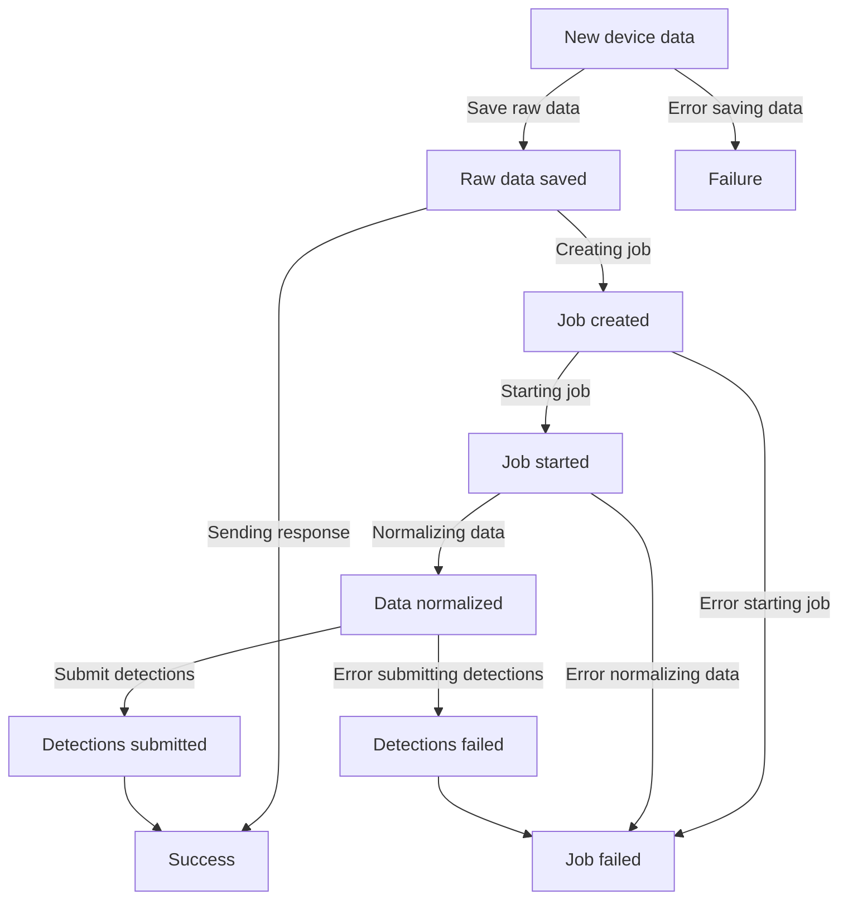

The Device Manager (also referred as DM) is a plugin to collect, store and visualize patient health data from medical and wearable devices.

The plugin currently supports the following providers:

- [Medisanté][medisante]
- [Apple HealthKit][apple-healthkit]

and enables real-time acquisition of health data from Medisanté medical devices and all kind of devices supported by Apple HealthKit.

The data acquisition process involves several steps, including:

- storing a copy of the raw device health data to ensure availability and integrity;
- normalizing health data to ensure consistency across different providers and devices and facilitate data analysis and visualization; 
- send relevant health data to the Therapy and Monitoring Manager to make it accessible in the context of a monitoring plan. 

The following table explains terms and expressions used throughout the documentation, so when you will encounter them you should assume they have the described meaning, unless stated otherwise.

| Term                 | Definition                                                                                                                |
|----------------------|---------------------------------------------------------------------------------------------------------------------------|
| Chart data           | Normalized data represented in a schema suitable for chart visualization.                                                 |
| Detection            | A [detection][tmm-detections] associated to a monitoring plan in the TMM.                                                 |
| DM                   | Acronym for *Device Manager*                                                                                            |
| Device               | A wearable or medical device used by a patient to collect health data.                                                    |
| Health data          | Patient data received from a device.                                                                                      |
| Health data format   | How health data is encoded (JSON, XML, FHIR, etc.).                                                                       |
| Health data schema   | The list and semantic of fields related to some health data.                                                              |
| Health data type     | A type of data received from one or more devices from a provider that share the same schema and format.                   |
| Normalized data      | Health data received from a device converted to a common data model based on the data type (see *Normalization*).         |
| Normalized data type | A data type referring a common data model, shared across different devices and/or providers.                              |
| Normalization        | The process of converting health data received from a provider to a common data model based on the data type.             |
| Measurement          | Health data received from a device expressed in a certain measurement unit (e.g. body temperature in Celsius degree).     |
| Prototype            | Class of measurements with a well-defined schema and semantic. See also [TMM prototype][tmm-prototypes].                  |
| Provider             | A third-party collecting data from a device and sending it to the Device Manager (e.g. Medisanté, Apple, Google, Garmin). |
| Raw data             | Health data received from a device in its original format and structure.                                                  |
| Raw data type        | An health data type referring some raw data sharing the same schema and format.                                           |
| TMM                  | Acronym for [*Therapy and Monitoring Manager*][tmm].                                                                      |

## Device lifecycle

### Enrollment

The first phase of the device lifecycle is the enrollment: the device is registered in the system alongside its technical specifications (manufacturer, model, serial number, etc.) and capabilities (which measurements it provides, like body temperature or blood pressure).
The enrollment processes may be entirely automatic, for example when a patient connect a device via Apple HealthKit, or manual, for example when a new device is registered on Medisanté administration portal.
At the end of the enrollment process, the device is ready to be assigned to a patient.

### Assignation

Each device can be assigned to different patients across its lifespan. When a device is assigned to a patient, the health data is automatically collected and processed.

### Data acquisition

Once a device is assigned to a patient, the generated health data is received by the service, that automatically stores a copy of the raw health data and schedule a background job to normalize it based on some customizable rules to ensure sintactic and semantic consistency across different providers and devices, allowing health data analysis and visualization no matter the source and format of the health data.
The service provides some default normalization rules for health data coming from officially supported medical or wearables devices, that you can later customize or completely override based on your specific needs.

| State                | Description                                                                                           |
|----------------------|-------------------------------------------------------------------------------------------------------|
| Raw data saved       | The received device data has been stored successfully in the [health data CRUD][crud-health-data].    |
| Job created          | A new job has been created and is ready to execute in the background the data acquisition flow.       |
| Job started          | The data acquisition job has started in the background.                                               |
| Data normalized      | The raw data has been normalized and stored successfully in the [health data CRUD][crud-health-data]. |
| Detections submitted | The job completed successfully, the normalized data were submitted as detections.                     |
| Detections failed    | An error occurred submitting the detections and the job failed.                                       |

## Providers

The service is designed to allow integration with different providers, currently we support [Medisanté][medisante] and [Apple HealthKit][apple-healthkit].

### Medisanté

Medisanté devices are managed on the dedicated [Medisanté portal][medisante-devices], currently the enrollment process requires you to also insert the device ID and name manually in the DM.
Once the device is enrolled, you have to assign directly the device to a patient with the DM.
To receive correctly the data, you need to add a webhook on the [Medisanté portal][medisante-webhooks] to send data to the [`POST /health-data/medisante/`][post-health-data-medisante] endpoint of the DM.

### Apple HealthKit

To collect health data to devices compatible with [Apple HealthKit][apple-healthkit], you require a mobile application the patient is going to use to login to our systems and grant the permissions to read the health data received from connected devices and sends it to the [`POST /health-data/healthkit/`][post-health-data-healthkit] endpoint of the DM. The first time a patient signs in, the application is going to ask for the required permissions.

If the patient does not grant all the requested permissions, the application will not work correctly.
Once the permissions have been granted to the application, a request will be sent to the DM to create a new device with the ID of the connected device and assign it to the logged-in patient.
The application is going to ask you permissions to read different kind of data from HealthKit, only the selected ones will be received by the DM.

[apple-healthkit]: https://developer.apple.com/documentation/healthkit
[medisante]: https://www.medisante-group.com/
[medisante-devices]: https://devices.medisante.net/devices
[medisante-webhooks]: https://devices.medisante.net/webhooks

[tmm]: /runtime_suite/therapy-and-monitoring-manager/10_overview.md
[tmm-detections]: /runtime_suite/therapy-and-monitoring-manager/10_overview.md#detections
[tmm-prototypes]: /runtime_suite/therapy-and-monitoring-manager/10_overview.md#prototypes

[crud-health-data]: /runtime_suite/device-manager/20_configuration.md#health-data
[post-health-data-medisante]: /runtime_suite/device-manager/30_usage.md#post-health-datamedisanteformat
[post-health-data-healthkit]: /runtime_suite/device-manager/30_usage.md#post-health-datahealthkitformat
