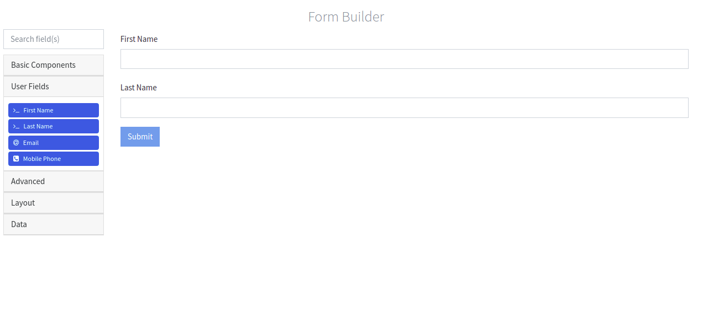

<!--
WARNING: this file was automatically generated by Mia-Platform Doc Aggregator.
DO NOT MODIFY IT BY HAND.
Instead, modify the source file and run the aggregator to regenerate this file.
-->

The Form Service Frontend is a Mia-Platform plugin that uses [formio.js](https://github.com/formio/formio.js) to provide a custom micro-frontend to build and visualize forms. It has two different frontends: the **Form Builder** and the **Form Visualizer**.

- The Form Builder allows users to create custom forms, that can be used for different use cases, by means of a customizable UI usable also by non-technical users.

- The Form Visualizer allows one to display forms created with the form builder. By using the form visualizer it is possible to fill forms and submit their data to a configurable endpoint.

The Form Service Frontend as a [micro-lc plugin](https://microlc.io/documentation/docs/micro-lc/plugin_configuration#qiankun-plugin) can be used with microlc itself, but it can also be integrated with the Mia Platform Headless CMS as an [iframe plugin](https://microlc.io/documentation/docs/micro-lc/plugin_configuration#iframe-plugin).

The output of the Form Builder is a JSON configuration of the form that later can be rendered with [formio.js renderer](https://github.com/formio/formio.js/wiki/Form-Renderer) or with the Form Visualizer.

The Mia-Platform Form Builder currently supports Forms and Wizards. An example of Form Builder can be found in the [formio.js demo page](https://formio.github.io/formio.js/app/builder). The image below shows a customized Form Builder (the `JSON` options are the ones found in the example provided [here](/runtime_suite/form-service-frontend/20_configuration.md#form-builder-options-parameters)).



The right side of the image above also shows the created form that can be displayed in the Form Visualizer and can be filled and submitted by a user. The image below shows the form, rendered in the Form Visualizer.


## How it works

The **Form Service Frontend** retrive the configuration needed from the the **Form Service Backend**. To know more about the backend service check [this guide](/runtime_suite/form-service-backend/10_overview.md).

The frontend service exposes the following routes:

### Form Builder

- `GET /builder/create-form`: it allows the creation of a new form template;
- `GET /builder/{id}`: it shows one form template by ID and let you update it.

:::info

The `baseUrl` property equal to the URL's origin is injected in the form builder and form visualizer options (`from version 1.1.0`). This enables the usage of relative URLs in the [formio select component](https://help.form.io/userguide/forms/form-components#select) using `URL` as *Data Source Type* (useful to define the data source according to the deployed environment).

:::
  
### Form Visualizer

- `GET /visualizer/fill-form/{id}`: it allows the end user to submit data on a new form, selected by form template ID;
- `GET /visualizer/{id}`: returns the submitted data for the specified form ID;
- `GET /visualizer/print-form/{id}`: (`from version 1.1.0`) returns a printable version of submitted data for a form ID (submit button is removed from Forms and Wizards are displayed as Forms);
- `GET /visualizer/fill-assignment/{assignmentId}`: (`from version 1.2.0`) it allows the end user to submit data on a new [form assignment](/runtime_suite/form-service-frontend/30_form_assignments.md), selected by form assignment ID.

:::info

The `/visualizer/fill-form/` and `/visualizer/{id}` routes (`from version 1.1.0`) accept the `onSubmitRedirect` query parameter which is used to redirect a user to a specific URL after a new form submission or after an update.

:::

:::info

The `/visualizer/fill-form/` route (`from version 1.4.0`) allows to pre-compile the inputs of the considered form. The values for the inputs to be pre-compiled must be passed as query parameters.

Example:
```
GET /visualizer/fill-form?formSchemaId=1234&key1=value1&key2=value2
```
In the above examples, the inputs with name `key1` and `key2` will be pre-compiled with values `value1` and `value2`, respectively.

If an input name present as a query parameter is not present in the form schema, that query parameter will be ignored.

:::

:::info

The frontend service endpoints are as described before when the Form Service Frontend is used in micro-lc. When the frontend is used standalone or integrated with the Mia-Platform Headless CMS the base path is `/#/`. With a frontend service endpoint equal to `/form-service`, the path to create a new custom form is `/form-service/#/builder/create-form`.

:::

#### Form data versioning support
From `version 1.5.0` the Form-Service Frontend supports the versioning of the form data. When calling the `GET /visualizer/{id}` and the `GET /visualizer/print-form/{id}` endpoints is possible to specify the `_v` parameter. This parameter will be passed to the Form-Service Backend that, if configured properly, will retrieve the right version of the requested form data.

:::info

When the `_v` parameter is specified, the form is set to `readOnly` mode. This means that the form inputs cannot be modified and the `submit` button is removed.

:::

#### Form data retrieve drafts support
From `version 1.6.0` the Form-Service Frontend supports the possibility to retrieve form drafts. When calling the `GET /visualizer/{id}` endpoint is possible to specify the `_status` parameter. This parameter will be passed to the Form-Service Backend that, if configured properly, will retrieve the draft version of the requested form data.

#### Form Availability and Expiration date support
From version `1.10.0` the Form Service enables the configuration of availability and expiration dates for forms via the `builder`. If either of these dates is defined and the relevant conditions are met, the form `visualizer` will trigger an error message, preventing the form from being rendered. You can customize the error title and message displayed for expired forms through the [configmap in the Form Service Backend](/runtime_suite/form-service-backend/20_configuration.md).

From version `2.1.1` the Form Servive allows you to edit the expired form metadata. After the form expiration date users are not allowed to change the `formSchema` and `formSubmittedUrl`. All the changes to the `formSchema` will be ignored.

## Further details

Follow the pages below to know more about the *Form Service Frontend*:

- [*Form Service Frontend* configuration](/runtime_suite/form-service-frontend/20_configuration.md)
