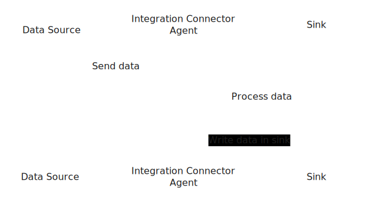
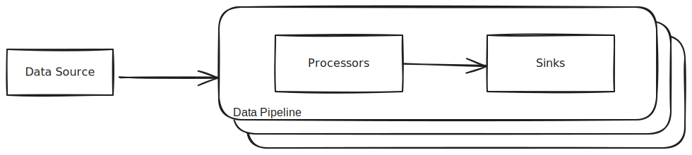

The Integration Connector Agent connects to external sources and keeps changes
synchronized between the source and one or more sinks. It also enables for data
processing before sending it to the sinks.

## Key Features

- **Connect to External Sources**: Monitor and retrieve changes from various external data sources.
- **Update Sinks**: Propagate detected changes to one or more sinks to keep data up-to-date.
- **Data Processing**: Configure processors to transform or process data before sending it to the sinks.

## Key Benefits

The Integration Connector Agent provides the flexibility to retrieve data from any source and deliver it to any sink.
This data can then be utilized for various purposes, including:

- **Data Accessibility**: Aggregate data from multiple sources by configuring the agent, simplifying data retrieval.
- **Analytics**: Centralized data storage enables advanced analytics and the creation of comprehensive scorecards.
- **External Integration**: Simplify the development of custom applications by building efficient data pipelines with the agent.

When used alongside Mia-Platform Console, the agent enhances the Console's extensibility features,
enabling users to integrate additional information into their Internal Developer Platform.
Examples include:

- Comprehensive scorecards
- Software catalog metadata augmentation
- Custom data visualizations

## Supported Sinks and Sources

Currently, the supported **Sources** are:

- Mia-Platform Console
- Jira

The supported **Sinks** are:

- MongoDB

More sources and sinks are planned for future releases.

## Architecture

As an integration developer, this tool is ideal for synchronizing data between different platforms or systems, ensuring
real-time updates across all configured sinks.

The following image illustrates the architecture of the Integration Connector Agent.



### Data Processing

For each source, you can configure different pipelines. Each pipeline can have one or more
processors and must have at least one sink.



### Use Cases

Below are some use cases with their related configuration files.

#### Integration with Jira as Source and MongoDB as Sink

The following configuration demonstrates how to integrate Jira with a MongoDB sink, using mapper processing.

Pipeline workflow:

1. The Jira source is configured with an authentication secret taken from the environment variable `JIRA_SECRET`
1. The input Jira issue event is mapped to the output event:
   - `key` maps to the issue.key field of the Jira event
   - `summary` maps to the issue.fields.summary field of the Jira event
   - `createdAt` maps to the issue.fields.created field of the Jira event
   - `description` maps to the issue.fields.description field of the Jira event
1. The MongoDB sink is configured with the URL taken from the environment variable `MONGO_URL`
   to save data into the collection `jira-issues`


Jira + MongoDB Sink Configuration

```json
{
  "integrations": [
    {
      "source": {
        "type": "jira",
        "authentication": {
          "secret": {
            "fromEnv": "JIRA_SECRET"
          }
        }
      },
      "pipelines": [
        {
          "processors": [
            {
              "type": "mapper",
              "outputEvent": {
                "key": "{{ issue.key }}",
                "summary": "{{ issue.fields.summary }}",
                "createdAt": "{{ issue.fields.created }}",
                "description": "{{ issue.fields.description }}"
              }
            }
          ],
          "sinks": [
            {
              "type": "mongo",
              "url": {
                "fromEnv": "MONGO_URL"
              },
              "collection": "jira-issues"
            }
          ]
        }
      ]
    }
  ]
}
```


