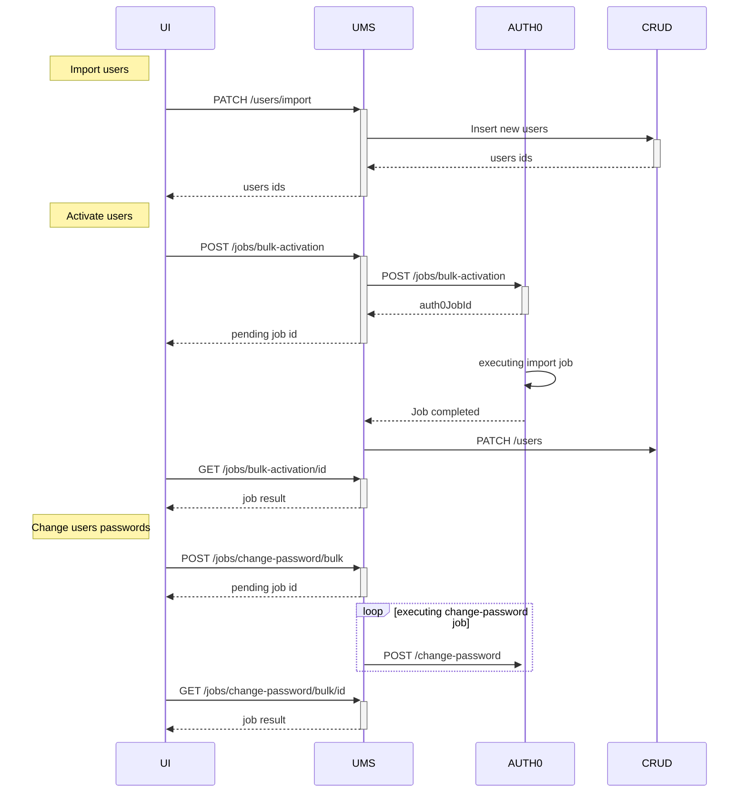

The main purpose of the User Manager is to ease user management operations.
It combines calls directed to the chosen authentication service and to the `users` CRUD collection.

:::note
As stated in the [configuration section][configuration], you can name the CRUD collections however you like.
For simplicity’s sake, in the following page it is assumed that you have called them `users` and `ums-config`.
:::

The User Manager Service provides two groups of endpoints: the first one includes all the authentication endpoints,
while the other one includes all the user management endpoints (creation, retrieval, deletion, etc.).

## Authentication Management

### POST /oauth/token

Login endpoint, allows obtaining an access-token and a refresh-token from the authentication service
if a valid username and password are provided.

#### Body

This request accepts the following fields:
- **username** - `string`: the user username;
- **password** - `string`: the user password.

#### Response

If the user is successfully authenticated, you will receive a response with a 200 status code, the `refreshToken` and
the `accessToken` with its expiration date `expireAt`.

:::caution
If in the advanced configuration of the console the auth0 client is set with `scope website`,
then only the `set-cookie` header with the `sid` is returned and the response body is empty.
:::

### POST /refreshtoken

Refresh token endpoint, it returns new access and refresh tokens.

#### Body

This request accepts the following fields:
- **refreshToken** - `string`: the old refresh token.

Moreover, the request also require the expired access token to be included in the headers.

#### Response

In case of success, you will receive a response with a 200 status code, the `refreshToken` and
the `accessToken` with its expiration date `expireAt`.

### POST /users/change-password

Triggers a 'change password' event in the authentication service.
In case of Auth0, a change password email will be sent to the user.

:::note
Since this endpoint is exposed as a `POST`, it can be used as an 'action' in the Mia-Platform [Microfrontend Composer][microfrontend-composer].
:::

#### Body

This request accepts the following fields:
- **authUserId** - `string`: the user id in the authentication service.

#### Response

If the change password request is correctly sent, you will receive a response with a 204 status code and no payload.

### POST /jobs/change-password/bulk

The endpoint creates an asynchronous job to trigger multiple 'change password' events in the authentication service.
In case of Auth0, a change password email will be sent to the users.

#### Body

This request accepts the following fields:
- **authUsersIds** - `string[]`: the users ids in the authentication service.

##### Example of body

```json
{
  "authUsersIds": [
    "auth0|56ko15das68cz132dsa6d4ef",
    "auth0|34ko15das68cz132dsa6d4aa",
    "auth0|98ko15das68cz132dsa6d4gv",
    "auth0|87ko15das68cz132dsa6d4ad"
  ]
}
```

#### Response

In case of successfully created job the response has status code 202 and the following format:

```json
{
  "jobId": "c735cf45-536b-45ce-8ef1-d0066515c185",
  "status": "pending",
  "jobCreatedAt": "2024-02-03T15:14:35.115Z"
}
```

The returned job id can be used to get the job status through the [GET /jobs/change-password/bulk/:id][get-jobs-change-password-bulk-id] endpoint.

In case of failure due to a bad request the response shows an appropriate 4xx status code and relevant information about why the request is invalid.

### GET /jobs/change-password/bulk/:id

This endpoint returns the status and relevant information about a job created by the UMS in order to trigger multiple 'change password' events in Auth0. 

The job id is returned when the job is created using the endpoint [POST /jobs/change-password/bulk][post-jobs-change-password-bulk].

#### Response

In case of a matching id a successful response with status code 200 is returned with the following format:

Job pending:
```json
{
  "jobId": "c735cf45-536b-45ce-8ef1-d0066515c185",
  "status": "pending",
  "jobCreatedAt": "2024-02-03T15:14:35.115Z"
}
```

Job completed:
```json
{
  "status": "completed",
  "jobId": "c735cf45-536b-45ce-8ef1-d0066515c185",
  "jobCreatedAt": "2024-02-03T15:14:35.115Z",
  "summary": {
    "failed": 1,
    "completed": 3,
    "total": 4
  },
  "completed": [
      {
          "authUserId": "45eed68c453446ac36f09sj6",
      },
      {
          "authUserId": "45eed68c453446ac36f09sj8",
      },
      {
          "authUserId": "45eed68c453446ac36f09sj9",
      },
  ],
  "failures": [
      {
          "authUserId": "45eed68c453446ac36f09sj7",
      }
  ]
}
```

The job never fails. If all the attempts to trigger change-password events fail the summary will show only failed operations.  
```json
{
  "status": "completed",
  "jobId": "c735cf45-536b-45ce-8ef1-d0066515c185",
  "jobCreatedAt": "2024-02-03T15:14:35.115Z",
  "summary": {
    "failed": 4,
    "completed": 0,
    "total": 4
  },
  "failures": [
      {"...": "..."},
      {"...": "..."},
      {"...": "..."},
      {"...": "..."},
  ]
}
```

If the request path parameter `id` does not match an existing job the response returns a 404 status code.

### POST /users/register

If `POST /users/` has the query parameters `postponeAuthUserCreation` set to `true`, it creates only the user on the CRUD and postpone the creation on the authentication service. `POST /users/register` retrieves data of the user on the CRUD and create the user on the authentication service only if in the configurations of its userGroup `authUserCreationDisabled` equals `false`.

#### Query parameters

This request accepts the following query parameter:
- **sendResetPwdEmail** - `booelan`: if `false` the reset password email is not sent.

#### Body

This request accepts the following fields:
- **_id (required)** - `string`: user id in the `users` CRUD.
- **password** - `string`: optional password. 

:::caution
The password is randomly generated if the environment variable `RANDOM_PWD_GEN` is set to `true` or if the password is not defined.
:::

#### Response

If the user is created in the authentication service correctly, you will receive a response with a 204 status code and no payload.

## User Management

### POST /users/

Creates a new user in the `users` CRUD collection and in the chosen authentication service.

If the `expirationDate` field is set, the UMS will automatically schedule a job on the Timer Service to automatically block the user on expiration.

:::caution

Since v1.4.0 the UMS relies on the Timer Service to automatically block the user on expiration,
so you must set the [`TIMER_SERVICE` env var][environment-variables] to get the user automatically blocked.

:::

:::note
In case the user group has the `authUserCreationDisabled` property set to `true` in the configuration CRUD,
no user is created in the authentication service (only the CRUD collection element is created)
and no roles are assigned to the user (in case Rönd is enabled).
:::

#### Body

This request accepts the following 'standard' fields:
- **username** - `string`: the user username;
- **email** - `string`: the user email address;
- **blocked** - `boolean`: to create a 'blocked' user;
- **userGroup (required)** - `string`: the group to which the user belongs;
- **roles** - `array`: the roles to be assigned to the user via Rönd.
- **expirationDate** - `Date` (from v1.4.0): the expiration date/time of the user account.

:::note

If you are upgrading to v1.4.0 or later from a previous version and use `expirationDate` as a custom property,
you need to rename that property before upgrading.

:::

Additional fields can also be added to the body, depending on the `users` CRUD collection.
All these additional fields must be defined in the schema stored in the `ums-config` CRUD collection.
The user json will be validated against its group schema before user insertion.

:::note
The user is first created in the `users` CRUD collection.
If this operation succeeds the user is also created in the chose authentication service and the CRUD entry is updated
with the `authUserId`.
In case one of these two operations fail, the user creation is backtracked (the entry in the CRUD is removed and the
user is removed from the authentication service) and and error is returned.
:::

:::note
If the environment variable `ROND_ENABLED` is set to true and in the request body is present the array **roles**, 
a request towards the Rönd service is performed in order to set the roles and permissions.
:::

#### Query parameters

This request accepts the following query parameter:
- **postponeAuthUserCreation** - `booelan` (from v1.3.0): if `true` the user is only created in the `users` CRUD collection.
- **sendResetPwdEmail** - `booelan`: if `false` the reset password email is not sent.

:::note
If a user is created only in the `users` CRUD collection, either with `authUserCreationDisabled` or `postponeAuthUserCreation` equal to true, there is no control on uniqueness based on username or email.
You make these properties unique [indexes][crud-indexes] to enforce users with unique username or email in the `users` CRUD collection.
:::

#### Response

If the user is successfully created, you will receive a response with a 200 status code and the `_id` of the newly
created user in the payload. The `_id` is to the `_id` of the user in the `users` CRUD collection.

If the client tries to set the `expirationId` field or the user object fails the validation against its group schema, a `400 Bad Request` code is returned.

### POST /users/with-id

Creates a new user in the `users` CRUD collection from an existing user in the chosen authentication service.

#### Body

This request accepts the following 'standard' fields:
- **authUserId** - `string`: the user id in the authentication service.
- **blocked** - `boolean`: to create a 'blocked' user;
- **userGroup (required)** - `string`: the group to which the user belongs;
- **roles** - `array`: the roles to be assigned to the user via Rönd.
- **expirationDate** - `Date` (from v1.4.0): the expiration date/time of the user account.

:::caution

Since v1.4.0 the UMS relies on the Timer Service to automatically block the user on expiration,
so you must set the [`TIMER_SERVICE` env var][environment-variables] in order to get the user automatically blocked.

Furthermore, if you are upgrading to v1.4.0 or later from a previous version and use `expirationDate` as a custom property,
you need to rename that property before upgrading.

:::

Similarly to the [POST /users/][post-users], additional fields can also be added to the body
and must be defined in the schema stored in the `ums-config` CRUD collection.
Validation is also performed against such schema.

:::note
If the environment variable `ROND_ENABLED` is set to true a request towards the Rönd service is performed in order to set the user's roles and permissions.
:::

#### Response

If the user is successfully created, you will receive a response with a 200 status code and the `_id` of the newly
created user in the payload. The `_id` is to the `_id` of the user in the `users` CRUD collection.

:::note
If the user json fails the validation against its group schema, a `400 Bad Request` code is returned.
:::

### GET /users/

Returns the list of users. This endpoint is a direct proxy to the `GET /users` of the CRUD service and it has no side effects. When configured, additional properties are retrieved from auth0. In such case, the `acl_rows` headers will not be forwarded to the auth0-client.  

### DELETE /users/:id

Deletes a single user from both the CRUD and the Auth service, calling both the `DELETE /users/:id` of the CRUD service and the authentication service delete.

If the user is set to expire in a future date/time, the UMS will automatically contact the Timer Service, if configured, to abort the job responsible for blocking the user on expiration.

:::caution

Since v1.4.0 the UMS relies on the Timer Service to automatically block the user on expiration,
so you must set the [`TIMER_SERVICE` env var][environment-variables] to get the user automatically blocked.

:::

:::note
The `id` used as path parameter in this endpoint is the CRUD `_id` of the desired user.
:::

#### Response

If the user is successfully deleted, you will receive a response with a 204 status code and no payload.

If the Auth or CRUD service returns an error, you will receive a response with a 500 status code and a payload looking like this:

```json
{
  "statusCode": 500,
  "error": "Internal Server Error",
  "message": "Error while deleting user: CRUD GET /users/:id responded with a 500 status code",
}
```

If the Timer Service returns an error, the endpoint will simply ignore it, without returning any error.  

### PATCH /users/:id

Updates the user with the specified id in both the `user` CRUD collection and the authentication service.

If the `expirationDate` field is set, the UMS will automatically schedule a job on the Timer Service to automatically block the user on expiration.

If the `expirationDate` field is unset, the UMS will automatically abort the job on the Timer Service.

If the `expirationDate` field is modified, the UMS will automatically reschedule the job on the Timer Service.

:::danger

Updating or unsetting the `expirationDate` poses relevant security risks you should be aware of, since a user could potentially remove the expiration date on his/her account.
When configuring the UMS, you must set the appropriate ACL or RBAC policies to ensure, for example, that a user cannot change the details of his/her account,
including the expiration date, or that only users from certain groups or with certain privileges can call this endpoint.

:::

:::caution

Since v1.4.0 the UMS relies on the Timer Service to automatically block the user on expiration,
so you must set the [`TIMER_SERVICE` env var][environment-variables] to get the user automatically blocked.

:::

:::note
The `id` used as path parameter in this endpoint is the CRUD `_id` of the desired user.

The user schema is validated against the new `userGroup` if set, otherwise against the actual `userGroup`. If a non-existing `userGroup` is set, the PATCH throws a Bad request.

It's not allowed to change `authUserId` parameter.
:::

:::note
If the environment variable `ROND_ENABLED` is set to true a request towards the Rönd service is performed in order to update the user's roles and permissions.
:::

:::caution
If the roles are successfully revoked but an error happen during the grant procedure, you will end up with an user with no roles. So, if an error occurred, be sure to check that the user have its roles.
:::

#### Body

The body of this request has the same interface of a CRUD service `PATCH /users/:id` request, except for the following fields that are not editable: `authUserId`, `expirationId`.

#### Response

If the user is successfully updated, you will receive a response with a 200 status code and the updated user in the payload.

If the Auth, CRUD or Timer service returns an error, you will receive a 500 status code and a response looking like this:

```json
{
  "statusCode": 500,
  "error": "Internal Server Error",
  "message": "Error while deleting user: CRUD PATCH /users/:id responded with a 404 status code",
}
```

### GET /users/count

Returns the number of users.
This endpoint is a direct proxy to the `GET /users/count` of the CRUD service and has no side effects.

### POST /users/state

Changes the state of the users matching the provided filters.

This endpoint combines calls to the `POST /users/:id/state` of the CRUD service and a `PATCH` on the authentication service,
and may have the following side effects.

:::note
A user set to `DRAFT` or `TRASH` states is set to `blocked: true` in the authentication service, in order to prevent the user to authenticate in any system.

A user set to `PUBLIC` state is set to `blocked: false` in the authentication service, in order to 'unblock' a previously blocked user.

A user set to `DELETED` is deleted from the authentication service only if the [AUTH_HARD_DELETE][environment-variables] is set to `true`,
otherwise its behavior is the same as the `DRAFT` and `TRASH` cases.
Note that in any case a user set to `DELETED` is never deleted from the CRUD with this endpoint (its state is only set to `DELETED`).
:::

#### Body

The body of this request has the same interface of the CRUD service `POST /users/state` endpoint and expects a list of filters and transitions in the body, like:

```json
[
  {
    "filter": {
      "_id": "66e19957f72ba7349eb7b7b2"
    },
    "stateTo": "TRASH"
  },
  {
    "filter": {
      "_id": "66e19957f72ba7349eb7b7b3"
    },
    "stateTo": "DELETED"
  }
]
```

#### Response

If the users states are successfully updated, you will receive a response with a 200 status code,
and the number of updated users in the payload.

### GET /userinfo

Returns the data of the logged used. It acts as a combination of a `/userinfo` on the authentication service and a `GET /users/:id` on the CRUD.

:::note
The behavior of this endpoint can be configured through the `USERINFO_ADDITIONAL_PROPERTIES` environment variable,
which represents the CRUD user properties that must be returned.

If an empty variable is provided, only the auth client properties will be returned by the `/userinfo`.
If the `USERINFO_ADDITIONAL_PROPERTIES` is not defined (thus `undefined`), all the CRUD user properties will be
returned.

Note that the auth client properties, coming from the auth client `/userinfo` endpoint, are always returned.
:::

:::info
Cookies `sid` and `client-key` must be passed as headers to the `/userinfo`.
:::

If the Rönd roles collection is configured and the `ROLES_CRUD_ENDPOINT` environment variable is defined, the response payload will contain also the `permissions` array (checking the user's current roles).

:::note
In order to retrieve the user's `permissions`, you also need to add the `permissions` property to the `USERINFO_ADDITIONAL_PROPERTIES` environment variable.
:::

#### Response

In case of success, you will receive a response with a 200 status code and the user properties in the payload.

:::note
This endpoint is not intended to be used with users which have been created only in the CRUD.
In such cases, the endpoint will return the following message: `Missing authUserId, user not logged`.
:::

### POST /users/:id/soft-delete

Change the state of the user to `DELETED` in the CRUD and, if the `AUTH_HARD_DELETE` env var is set to true or false, delete or block the Auth service, respectively.

:::note

If a direct transition to the `DELETED` state is not supported by the CRUD, the endpoint will perform multiple requests in order to get to the final desired state, for example from `PUBLIC` to `TRASH` and then from `TRASH` to `DELETED`.

:::

:::note

The `id` used as path parameter in this endpoint is the CRUD `_id` of the desired user.

:::

#### Response

If the user is successfully deleted, you will receive a response with a `204` status code and no payload.

If the Auth or the CRUD service returns an error, you will receive a response with a `500` status code and a payload looking like this:

```json
{
  "statusCode": 500,
  "error": "Internal Server Error",
  "message": "Error while deleting user: CRUD GET /users/:id responded with a 500 status code",
}
```

:::caution

If multiple requests are required to reach the desired user state, for example from `PUBLIC` to `TRASH` and then to `DELETED`, but one of those requests fail, the user reaches an intermediate state, for example `TRASH`, which is consistent between the CRUD and the auth provider, and you will receive a response with a `500` status code and a payload looking like this:

```json
{
  "statusCode": 500,
  "error": "Internal Server Error",
  "message": "Error while soft deleting user: CRUD POST /users/:id/state responded with a 500 status code",
}
```
You can call again this endpoint to resume the operation from the intermediate state.

:::


### PATCH /users/import

Import all the users from a CSV file in the database.

The users in the file that specify an `_id` field are updated in the users collection performing a patch with the values of the user specified in the file.

The users in the file that do not specify an `_id` field are inserted in the users collection.

:::warning

To prevent the insertion of duplicated users in the database is necessary to define a [unique index][mongo-unique-index] on the `email` and `username` fields.

:::

:::warning

Due to performance issues the maximum number of users that can be safely imported is 200.

:::

:::note

The maximum file size is 1Mb.

:::

:::warning

To avoid compatibility issues it is suggested to use a Crud Service version >= 6.9.6.

:::

:::note

The `expirationDate` field is not supported, therefore users imported with this field won't expire after the specified date.

:::

:::warning

In order to parse arrays, the CSV delimiter must be different from the comma character `,` (e.g. a semicolon) and array fields must be formatted with square brackets and have **no quotes**.

- valid array `[item1, item2, item3]`
- invalid array `["item1", "item2", "item3"]`

:::

#### Request

The request must be of type multipart and can contain the following data:

- **file (required)** - the CSV file with the users to be imported;
- **delimiter** - the delimiter character used to parse the CSV file, which defaults to `,`;
- **encoding** - the type of encoding necessary to read the file content, which defaults to `utf8`;
- **escape** - the escape option to parse the file, which defaults to `"`, and can be set to `null`.

An example of request looks like:

```sh
curl -X PATCH 'https://example.com/ums/users/import' \
-H 'Content-Type: multipart/form-data;boundary=XXXXX' \
-F 'file=@"/path/to/file.csv"' \
-F 'delimiter=";"'
```

#### Response

In case of success the returned response contains the updated and inserted users ids and details about the invalid rows that failed validation. The response looks like:

```json
{
  "updated": [
    "45eed68c453446ac36f09sj7",
    "23esa68c453446ac36f09xs4"
    "14efa68c453446ac36f76uy8"
     ],
  "inserted": [
    "45dhj68c453446ac36f09po0",
    "46ecf68c453446ac36f09ev4"
     ],
  "invalid": [
    {
      "row": 5,
      "error": "Skipping record: invalid json schema, missing required field"
    },
    {
      "row": 7,
      "error": "Skipping record: userGroup missing on csv record"
    }
  ]
}
```

If the whole import operation fails, an HTTP error is returned.

### GET /jobs/bulk-activation/:id

This endpoint returns the status and relevant information about a job created by the UMS in order to activate multiple users in Auth0. 

The job id is returned when the job is created using the endpoint [POST /jobs/bulk-activation][post-jobs-bulk-activation].

#### Response

In case of a matching id a successful response with status code 200 is returned with the following format:

Job pending:
```json
{
  "jobId": "c735cf45-536b-45ce-8ef1-d0066515c185",
  "status": "pending",
  "jobCreatedAt": "2024-02-03T15:14:35.115Z"
}
```

Job completed:
```json
{
  "status": "completed",
  "jobId": "c735cf45-536b-45ce-8ef1-d0066515c185",
  "jobCreatedAt": "2024-02-03T15:14:35.115Z",
  "summary": {
    "failed": 1,
    "updated": 3,
    "inserted": 5,
    "total": 9
  },
  "failures": [
      {
          "userId": "45eed68c453446ac36f09sj7",
          "errors": [
              {
                    "code": "NON_UNIQUE_PROPERTY_VALUE",
                    "message": "Property \"username\" has non-unique value: mario"
                }
          ]
      }
  ]
}
```


Job failed:
```json
{
  "jobId": "c735cf45-536b-45ce-8ef1-d0066515c185",
  "status": "failed",
  "jobCreatedAt": "2024-02-03T15:14:35.115Z"

}
```

If the request path parameter `id` does not match an existing job the response returns a 404 status code.


### POST /jobs/bulk-activation

This endpoint allows the bulk activation of users in Auth0. It starts an asynchronous job to handle the import.

The input body accepts data in the following format:

```json
[
  { "filter": { "userId": "78erdnjwq9enkdsakdnklasj" } },
  { "filter": { "userId": "12pjmczofsd58sda154sdf8s" } },
  { "filter": { "userId": "87ko15das68cz132dsa6d4ad" } },
  { "filter": { "userId": "45asda9samsad25a65as1dd1" } }
]
```

The input is an array of objects with the following fields:

- `filter`, which contains the `userId` of the selected user (the `_id` of the document in the crud collection);

An optional boolean query parameter `upsert` can be set added to the request. If set to `false` it disables users update, allowing only the creation of new users. It defaults to `true`.

:::warning

Due to performance issues the maximum number of users that can be activated is limited to 200 units.

:::

:::warning

The maximum number of users that can be confidently included  in a single job operation is approximately 2000 units. This is due to the Auth0 bulk import API 500KB limit on the accepted file size.

:::

#### Response

In case of successfully created job the response has status code 202 and the following format:

```json
{
  "jobId": "c735cf45-536b-45ce-8ef1-d0066515c185",
  "status": "pending",
  "jobCreatedAt": "2024-02-03T15:14:35.115Z"
}
```

The returned job id can be used to get the job status through the [GET /jobs/bulk-activation/:id][get-jobs-bulk-activation-id] endpoint.

In case of failure due to a bad request the response shows 404 status code and relevant information about why the request is invalid.


## Bulk users operations guidelines

This section explains the complete flow of operations to create accounts for multiple users. In particular it involves three steps:

- bulk import of users
- bulk activation of users
- bulk change-password events

The new users must be imported in the database collection. This can be achieved sending a CSV file at the endpoint [`PATCH /users/import`][patch-users-import], which returns the ids of the inserted users.

Then the imported users must be activated in the authentications provider. It is sufficient to send the ids of the users to the endpoint [`POST /jobs/bulk-activation`][post-jobs-bulk-activation], which starts an asynchronous job to activate all the users and returns the job id. The [`GET /jobs/bulk-activation/:id`][get-jobs-bulk-activation-id] endpoint is used to retrieve the status of the job, and returns the result when all operations are completed.

Finally the new activated users must set a new password. The endpoint [`POST /jobs/change-password/bulk`][post-jobs-change-password-bulk] takes care of sending an email to each user with a link to change its password. Giving as input a list of authentication users ids it starts an asynchronous job to trigger multiple change-password events for each user. The [`GET /jobs/change-password/bulk/:id`][get-jobs-change-password-bulk-id] endpoint is used to retrieve the status of the job, and returns the result when all operations are completed.

The following sequence diagram shows an overview of the complete operations flow.



[crud-indexes]: /development_suite/api-console/api-design/crud_advanced.md#indexes
[microfrontend-composer]: /microfrontend-composer/overview.md
[mongo-unique-index]: https://www.mongodb.com/docs/manual/core/index-unique/ "MongoDB unique index"

[configuration]: /runtime_suite/user-manager-service/20_configuration.md
[environment-variables]: /runtime_suite/user-manager-service/20_configuration.md#environment-variables

[get-jobs-bulk-activation-id]: #get-jobsbulk-activationid
[get-jobs-change-password-bulk-id]: #get-jobschange-passwordbulkid
[patch-users-import]: #patch-usersimport
[post-jobs-bulk-activation]: #post-jobsbulk-activation
[post-jobs-change-password-bulk]: #post-jobschange-passwordbulk
[post-users]: #post-users
