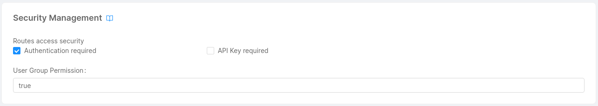
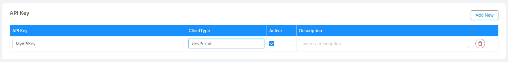
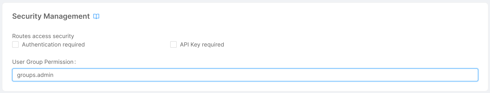
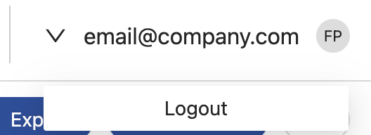
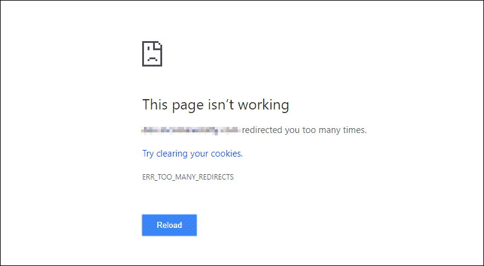
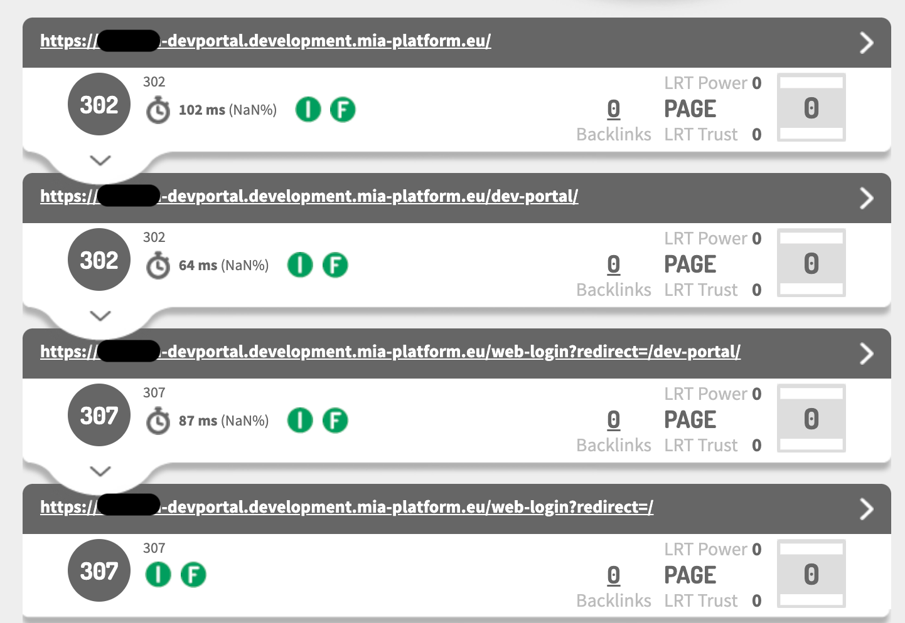

The Dev Portal can be protected by unauthorized users by configuring an authentication process. From the design area of the console, you can apply specific configurations to integrate different authentication providers. 

In this guide, we show how to configure the Dev Portal with [Auth0](https://auth0.com/).

## Protect the Dev Portal Entrypoint

The first thing you want to do is to enable authentication on the Dev Portal entrypoints you want to protect. This step will inform the [Api Gateway](/runtime_suite/api-gateway/10_overview.md) to redirect any request to an authentication process.

Move to the design area of the console, go to the endpoints page, and select a Dev Portal entrypoint you want to protect. By default, the main entrypoint selected when creating a new Dev Portal Application will be the `/dev-portal` endpoint.

Move to the **Security Management** card and check the `Authentication Required` checkbox.



Repeat this operation for all the other endpoints you want to associate with an authentication process. 
In general, authentication should be enabled for any endpoint giving the user access to a part of your application or one of its resources.


## Configure the Api Gateway

Once you have enabled the authentication on the Dev Portal entrypoints, you need to properly configure the Api Gateway to correctly reroute your requests to an authentication process.

From the design area of the console go to **Advanced** and select the `api-gateway` microservice.

:::info
This will be the only step requiring an advanced configuration.
:::

Open the file **server-extension.conf** and write the following configuration:
```conf
error_page 401 = @error401;

location @error401 {
  include /etc/nginx/customization.d/header-debug.conf;

  if ($type = "text/html") {
    return 302 '$original_request_scheme://$original_request_host/web-login?redirect=$original_request_uri$is_args$args';
  }

  default_type $type;
  return 401 $content_401;
}
```

This configuration will tell the APi Gateway to redirect (302) any **unauthorized request** (401) to `/web-login` endpoint, without modifying the original request.

## Configure Login Site 

Exit the advanced section, and move back to the microservices section. 

Check the existence of **oauth-login-site** among your microservices. If it does not exist, create a new one from the marketplace by clicking `Create a Microservice` and moving to the very end to create a new service from docker image. 

Compile the creation form as follows: 

- Name: **oauth-login-site**;
- Docker Image Name: **nexus.mia-platform.eu/backoffice/login-site**.

:::info
This microservice will be responsible for the **authentication** part of the process, allowing the user to insert his/her credentials and proceed with the login process.
:::

### Readiness and Liveness

Move to the runtime card and remove the default value from the following properties:

- **Readiness Path**;
- **Liveness Path**.

### Environment Variables

Now, go to the environment variables section and make sure they are compiled as follows:

- HTTP_PORT: **8080**.

### Endpoints

Finally, move to the endpoints section and create the endpoint `/web-login`.

Compile the creation form as follows: 

- type: **Microservice**
- Microservice: **oauth-login-site**
- Rewrite Base Path: **/web-login**


## Configure the Authorization Service 

Move back to the microservices section and check the existence of **authorization-service** among your microservices. If it does not exist, create a new one from the marketplace by clicking `Create a Microservice` and selecting the respective card.

:::info
This configuration will lead the authorization service to verify all the routes involved in the authorization process.
:::

### Environment Variables

Now, go to the environment variables section and make sure they are compiled as follows:

- **HTTP_PORT**: 3000;
- **CONFIGURATION_PATH**: /configs;
- **CONFIGURATION_FILE_NAME**: auth;
- **BACKOFFICE_HEADER_KEY**: isbackoffice;
- **USERINFO_URL**: http://auth0-client/userinfo;
- **CUSTOM_USER_ID_KEY**: sub;
- **HEADERS_TO_PROXY**: x-request-id,request-id,cookie,authorization,client-type,host,x-forwarded-host;
- **AUTHORIZATION_STRICT_MODE_ENABLED**: true;
- **CLIENT_TYPE_HEADER_KEY**: client-type;
- **CUSTOM_PERMISSIONS_KEY**: permissions;
- **AUTHORIZATION_HEADERS_TO_PROXY**: cookie,authorization.

To have further details regarding the Authorization Service configuration please refer to the official [documentation](/runtime_suite/authorization-service/20_configuration.md).


## Configure Auth0 Client

Again, check the existence of **auth0-client** among your microservices. If it does not exist, create a new one from the marketplace by clicking `Create a Microservice` and selecting the respective card.

### Environment Variables

Move to the environment variables section, where you will find a series of variables populated with the following format `CHANGE_WITH_YOUR_VALUE`. 
Make sure at least these variables are defined (Redis variables can be directly set as specified here):

- **HTTP_PORT**: 3000;
- **SERVICE_CONFIG_FILE_NAME**: config;
- **SERVICE_CONFIG_PATH**: /configs;
- **REDIS_HOSTS**: redis.default.svc.cluster.local;
- **REDIS_MODE**: normal;
- **MONGODB_URL**: the url of your MongoDB database.

Modify the remaining variables with values that correctly suit your project.

:::note
If you already defined a variable with the desired value in the Envs or in the Public Variables sections, you can also use the interpolation format `{{VARIABLE_NAME}}`.
:::

### ConfigMap

Move to the automatically created configuration **auth0-client-config** and start editing the **config.json** configuration file.

The final configuration should look something like the following:

```json
{
  "clients": {
    "devPortal": {
      "auth0Url": "{{AUTH0_URL}}",
      "clientId": "{{AUTH0_DEV_PORTAL_CLIENT_ID}}",
      "clientSecret": "{{AUTH0_DEV_PORTAL_CLIENT_SECRET}}",
      "redirectUrl": "{{AUTH0_DEV_PORTAL_CALLBACK_URL}}",
      "scopes": [
        "offline_access",
        "profile",
        "email",
        "website"
      ]
    }
  },
  "defaultClient": "devPortal",
  "managementClient": {
    "auth0Url": "{{AUTH0_URL}}",
    "clientId": "{{AUTH0_MANAGEMENT_CLIENT_ID}}",
    "clientSecret": "{{AUTH0_MANAGEMENT_CLIENT_SECRET}}"
  },
  "customClaimsNamespaces": [
    "https://mia-platform.eu/app_metadata",
    "https://mia-platform.eu/user_metadata"
  ]
}
```

Make sure you defined the following variables in the Envs section:

- **AUTH0_URL**: the URL of your Auth0 instance;
- **AUTH0_DEV_PORTAL_CLIENT_ID**: the client id obtained after configuring your application on Auth0;
- **AUTH0_DEV_PORTAL_CLIENT_SECRET**: the client secret obtained after configuring your application on Auth0;
- **AUTH0_DEV_PORTAL_CALLBACK_URL**: the URL where you want to be redirected after authentication;
- **AUTH0_MANAGEMENT_CLIENT_ID**: the management client id obtained on Auth0;
- **AUTH0_MANAGEMENT_CLIENT_SECRET**: the management client secret obtained on Auth0.

:::caution
Auth0 clientIds and secrets require access to the Auth0 platform and to have the necessary permissions to register the Dev Portal application.
:::

### Endpoints

Finally, move to the endpoints section and start creating the following endpoints:

- `/authorize`:
   - type: **Microservice**
   - Microservice: **auth0-client**
   - Rewrite Base Path: **/authorize**
- `/oauth/token`:
   - type: **Microservice**
   - Microservice: **auth0-client**
   - Rewrite Base Path: **/oauth/token**

To have further details regarding the Auth0 Client configuration please refer to the official [documentation](/runtime_suite/auth0-client/20_configuration.md).

## Configure API Key clientType:

The final configuration step is to change the API key client type with the one defined as defaultClient in the Auth0 Client configuration.

:::info
This step will allow the oauth-login-site microservice to obtain the right client key necessary for the authorization process.
:::

In our case, the client type will be **devPortal**. 

The final configuration will look something like this: 



After that, you finally completed the configuration of the authentication process.
You can now try to access your application. You should be automatically redirected to a login page.

:::caution
In order to grant access to a user, make sure his/her credentials are also defined on your Auth0 platform.
:::

## How to Configure Different Levels of Permissions

When configuring your application, it may be useful to configure different levels of permissions. For instance, you might want to separate users accessing the marketplace section of the Dev Portal from the ones maintaining its content, thus accessing the backoffice section.

A simple way to determine the right permissions for a particular set of users when accessing the application is to define **permission groups**.

:::info
Permission groups need to be first defined on your Auth0 platform. Check out the official [documentation](https://auth0.com/docs/api/authorization-extension#groups) to learn more about permission groups.
:::

In order to link a permission group to your authentication process using the console, you just need to associate it to one of your endpoints. Move to the endpoints section and select the endpoint you wish to add a permission group to. 

Go to the **Security Management** card and type inside **User Group Permission** the group you want to specify.

The final result should look like this:



:::info
Once you have defined a permission group for an endpoint, all the users accessing that route will need to be part of the relative group on the Auth0 platform to successfully log into the application.
:::

## User info and Logout

After users have logged in, it may be useful to show them their personal information and the logout button, like the following example:



To show the user info and the logout button you just need to edit a couple of properties of micro-lc.

During the creation of the **Dev Portal** application two instances of micro-lc were created:

- `dev-portal-frontend`
- `dev-portal-backoffice`

Inside them you can find the `config.json` config-map file, where you can configure the page layout to show a user menu. Namely, you have to add the `userMenu` property
to the `bk-layout` component inside of `layout` following the [official documentation](http://localhost:3000/docs/microfrontend-composer/back-kit/60_components/390_layout.md#user-menu).

Moreover, you possibly need to expose the `userinfo` and `logout` on the API Gateway, based on the authentication you used.

In this guide we use [Auth0](https://auth0.com/) and the `auth0-client` microservice, so you need to expose the following APIs:

- `/userinfo`:
   - type: **Microservice**
   - Microservice: **auth0-client**
   - Rewrite Base Path: **/**
- `/logout`:
   - type: **Microservice**
   - Microservice: **auth0-client**
   - Rewrite Base Path: **/logout**

:::warning
Remember to configure the _Allowed logout URLs_ on Auth0, otherwise the logout flow will not work.
:::

## Troubleshooting

Following some common error use case.

### Redirects loop - Too many redirects

After you configured the authentication flow can happen that you get the following error:



Moreover, if you check the redirects flow, you will get something like this:



When this error happens, you probably forgot to configure the `/web-login` _Rewrite Base Path_ property during the _Oauth Login Site_ endpoint configuration.

Check the [configuration](/runtime_suite_applications/dev_portal/authentication_configuration.md#configure-login-site) section to set the right _Rewrite Base Path_.
