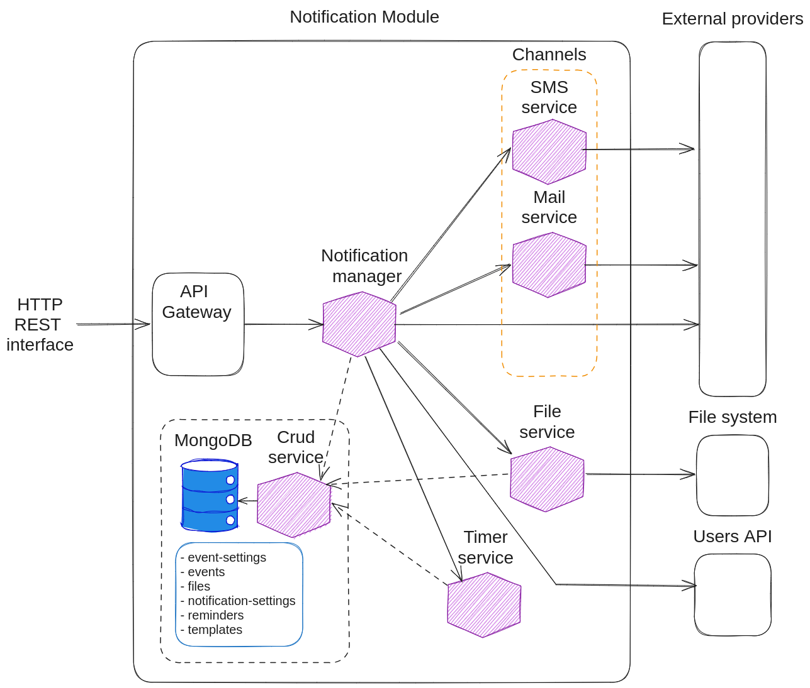

<!--
WARNING: this file was automatically generated by Mia-Platform Doc Aggregator.
DO NOT MODIFY IT BY HAND.
Instead, modify the source file and run the aggregator to regenerate this file.
-->

The **Notification Module** provides developers with a pre-made but extensible solution to send user notifications by using templates or free-text messages, across the most common notification channels (email, sms, push, voice, whatsapp).

This software component built with a microservice architecture sends messages through a series of communication channels. It exposes a synchronous HTTP REST and an asynchronous Kafka-based API to send messages and fetch notification info.
The internal communication between different microservices is implemented with synchronous HTTP REST interfaces.

The module is packaged as a [Mia-Platform Application][mia-application], enabling developers to configure everything in just a few steps and have all the services up and running.

It installs the [Notification Manager Service][mia-notification-manager] and its dependencies, enabling all communication channels by default. This is the list of the installed microservices:

| Component                                        | Version |
|--------------------------------------------------|---------|
| [Notification Manager][mia-notification-manager] | 2.4.0   |
| [SMS Service][mia-sms-service]                   | 1.2.0   |
| [Email Service][mia-mail-service]                | 3.3.0   |
| [Files Service][mia-files-service]               | 2.10.1  |
| [Timer Service][mia-timer-service]               | 2.1.3   |
| [CRUD Service][mia-crud-service]                 | 7.1.0   |
| [API Gateway][mia-api-gateway]                   | 5.0.2   |

## Module Architecture

This is an high level overview of the NM:

*Overview of Notification Module architecture, based on an Http REST interface to send messages through various communication channels.*

Incoming requests are redirected to the [Notification Manager][mia-notification-manager], which is the core component of the whole module and implements the business logic of sending messages. It is responsible for validating external requests and send the correct messages to the correct users.

The Messages are sent using external providers, that can be called directly by the Notification Manager or by the two microservices  [SMS Service][mia-sms-service] and [Mail Service][mia-mail-service]. The supported communication channels are:

- [mail][channel-mail];
- [sms][channel-sms];
- [voice][channel-push];
- [push][channel-voice];
- [whatsapp][channel-whatsapp]. 

Email attachments are handled by the [Files Service][mia-files-service], which supports the most adopted file system providers.

Messages can also be scheduled in the future using the [Timer Service][mia-timer-service].

All data, with the exception of users, is handled by the [CRUD Service][mia-crud-service], which is a thin layer API built over a [MongoDB][mongodb] database. These are the database collections:

- [event-settings][crud-devent-settings];
- [events][crud-events];
- [files][crud-files];
- [notification-settings][crud-notification-settings];
- [notifications][crud-notifications];
- [reminders][crud-reminders];
- [templates][crud-templates].

Details about the collections schema are in the [Notification Manager][mia-notification-manager-crud] configuration documentation.

Users data can be requested from an external API, which must expose an compatible with the CRUD Service and the data model described [here][mia-notification-manager-users].

[mia-notification-manager]: /runtime_suite/notification-manager-service/configuration#channels-configuration
[mia-notification-manager-crud]: /runtime_suite/notification-manager-service/configuration#crud-collections
[mia-notification-manager-users]: /runtime_suite/notification-manager-service/configuration#users-crud
[mia-sms-service]: /runtime_suite/sms-service/overview
[mia-mail-service]: /runtime_suite/ses-mail-notification-service/configuration
[mia-files-service]: /runtime_suite/files-service/configuration
[mia-timer-service]: /runtime_suite/timer-service/configuration
[mia-crud-service]: /runtime_suite/crud-service/overview_and_usage
[mia-api-gateway]: /runtime_suite/api-gateway/overview

[mongodb]: https://www.mongodb.com/

[crud-devent-settings]: /runtime_suite/notification-manager-service/configuration#event-settings-crud
[crud-events]: /runtime_suite/notification-manager-service/configuration#events-crud
[crud-files]: /runtime_suite/files-service/configuration#crud-collection
[crud-notification-settings]: /runtime_suite/notification-manager-service/configuration#notification-settings-crud
[crud-notifications]: /runtime_suite/notification-manager-service/configuration#notifications-crud
[crud-reminders]: /runtime_suite/timer-service/configuration#dedicated-crud
[crud-templates]: /runtime_suite/notification-manager-service/configuration#templates-crud

[channel-mail]: /runtime_suite/notification-manager-service/overview#email
[channel-sms]: /runtime_suite/notification-manager-service/overview#sms
[channel-push]: /runtime_suite/notification-manager-service/overview#push-notifications
[channel-voice]: /runtime_suite/notification-manager-service/overview#voice-calls
[channel-whatsapp]: /runtime_suite/notification-manager-service/overview#whatsapp-messages

[newman-cli]: https://learning.postman.com/docs/collections/using-newman-cli/command-line-integration-with-newman/
