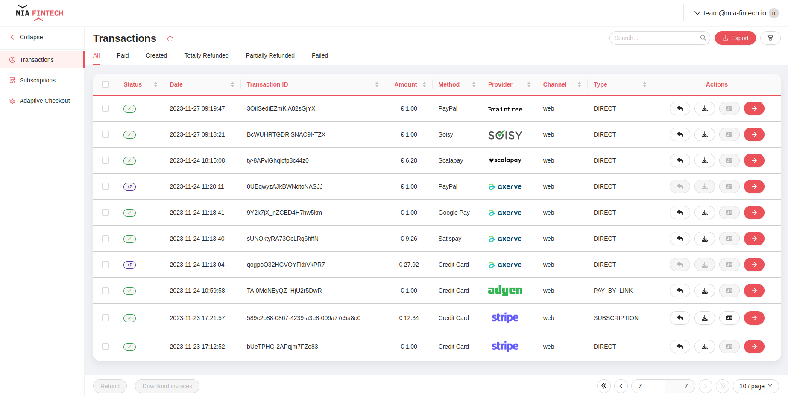
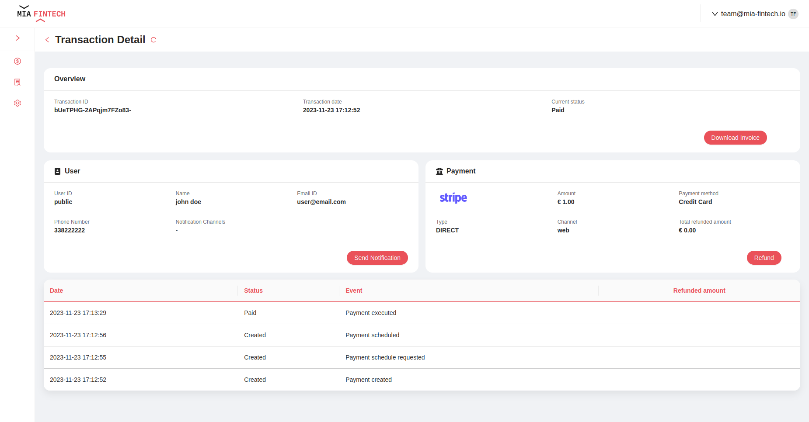
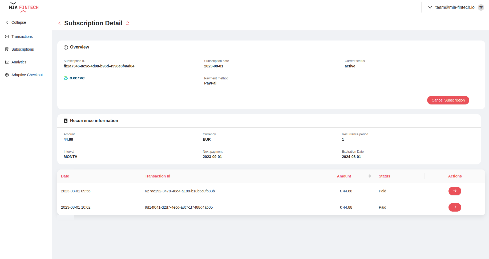
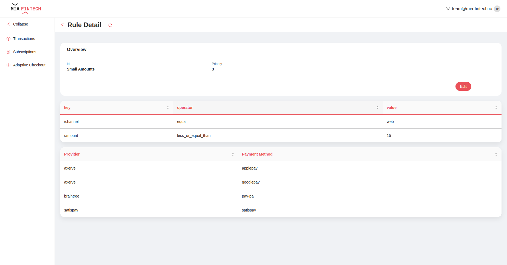

<!--
WARNING: this file was automatically generated by Mia-Platform Doc Aggregator.
DO NOT MODIFY IT BY HAND.
Instead, modify the source file and run the aggregator to regenerate this file.
-->

The Payment Integration Hub provides already configured pages that allow to perform actions on payments and includes customizable dashboards to monitor custom payment KPIs.

The pages are fully customizable, and they can be modified to implement new functionalities and adapt to specific needs; for more details on how to configure the pages you can refer to [Microfrontend Composer documentation](../../microfrontend-composer/back-kit/overview).

The complete configuration of all pages is available on [GitHub](https://github.com/Mia-FinTech/payment-backoffice#--backoffice-templates---payment).
It is also possible to define them as templates in your own project following this [guide](../../microfrontend-composer/composer/configurator_settings#template-sources), the URL to insert is `https://raw.githubusercontent.com/Mia-FinTech/payment-backoffice/main/`.

:::note
The Backoffice is not included by default in the Payment Integration Hub Application.
:::

:::note
A set of ready to use configuration for MongoDB View, that make your data available to the backoffice, are available in the [configuration section](./50_configuration.md#view).
:::

## Transactions

### Transactions Overview



On the **Transactions page** a table with all the transactions stored on the database is shown. For each transaction the following information are available:
- **Status**: current status of the payment (e.g. *Created*, *Paid*, *Partially Refunded*, *Totally Refunded*, *Failed*)
- **Date**: creation date of the payment
- **Transaction ID**: unique ID of the payment set by the merchant
- **Amount**: amount of the payment
- **Method**: method of the payment
- **Channel**: channel used for the payment

The list of transactions can be filtered by status, date, amount, method and/or type. Moreover, a search bar allows to find a transaction via its ID.

For each transaction the following actions are available:
- **refund** the payment (partially or totally)
- **download** invoice of the payment
- go to **subscription** (enabled only if it is a recurrent payment)
- go to **detail**

:::note
The **refund** and **download** actions are available also as bulk actions
:::

In addition, it is possible to export payments information in CSV or Excel format.

### Transaction Detail



It is available a dedicated view for each payment by clicking the dedicated button that redirects the user to a page with the following information:
- **Overview section**
  - Transaction ID
  - Transaction date
  - Current status
- **User section**
  - User ID
  - User name
  - User email
  - User phone number
  - Notification channels
- **Payment section**
  - Amount
  - Payment provider
  - Payment method
  - Type (Direct, Subscription, Pay by link)
  - Channel used for payment
  - Total refunded amount
- **History section**
  - Date
  - Status
  - Event
  - Refunded amount (optional)

The following actions are available:
- **refund** the payment (partially or totally)
- **download** invoice of the payment
- **send notification** about the payment to the customer (at the moment only emails are supported)

## Subscriptions

### Subscriptions Overview


The subscription section shows an overview of all the subscriptions stored in the database. For each subscription the following information are available:

- **Status**: current status of the subscription (e.g. **Created**, **Active**, **Not Active**)
- **Date**: creation date of the subscription
- **Subscription ID**: unique ID of the subscription
- **Amount**: amount of each subscription payment
- **Method**: method of the subscription payments
- **Provider**: provider chosen for the subscription payments

The list of subscriptions can be filtered by status, date, amount and/or provider. Moreover, a search bar allows to find a subscription via its ID.

In addition, it is possible to export subscriptions information in CSV or Excel format.

### Subscription Detail



The subscription detail page shows a dedicated view for each subscription, it is reachable clicking the arrow button next to each subscription in the overview page.

This page provides the following information:

- **Overview section**
  - subscription ID
  - subscription date
  - status
  - provider
  - method
- **Recurrence information section**
  - amount
  - currency
  - recurrence period
  - interval
  - next payment date
  - expiration date
- **History section**
  - date
  - transaction ID
  - amount
  - status

The following actions are available:
- **cancel** the subscription
- go to each **payment detail** page (using the arrow button next to each payment in the history section).

## Adaptive Checkout Configurator

On the **Adaptive Checkout** page the user can quickly manage the configuration of the adaptive checkout and add, change or remove rules.
Two pages are available:
1. an overview page where you can monitor all active rules and where you can create new rules or remove existing ones

2. a detail page where you can view the detail of the individual rule, specifically: enabled provider-payment method pairs and custom rules.


## Analytics Page


On **Analytics page** are shown the following plots and KPIs:
- **Daily payments**: stock chart that shows the amount of the payments over days; the plot can be filtered both with temporal filters (e.g. YTD, MTD or custom time frame).
- **Percentage** of payments on each status (e.g. _Payment Created_, _Payment Paid_, _Payment Partially Refunded_, _Payment Totally Refunded_, _Payment Failed_).
- **Payments Amount by Method**: stock chart that shows the amount of payments grouped by payment method; the plot can be filtered with temporal filters.
- **Payments Amount by Channel**: stock chart that shows the amount of payments grouped by payment channel; the plot can be filtered with temporal filters.

:::note
A preconfigured dashboard page is available as an iFrame at **/data-visualization/#/transactions-analytics**
:::

## Provider logo

To include the logos of providers you need, follow these steps:

- Go in the Microservices Section of your Console Project
- Find the `micro-lc` service
- under the `micro-lc-assets` ConfigMap add one entry, named `{{provider-name}}.svg`, for each provider

  <details>
    <summary>adyen.svg</summary>

    ```svg
    <svg xmlns="http://www.w3.org/2000/svg" fill="#0abf53" width="90" height="30" viewBox="0 0 90 30" aria-label="Adyen logo" role="img" data-j-logo-image="" class="ds-logo__image" data-v-56c1f8cb=""><path d="M27.7851 18.5234H26.0557C25.555 18.5234 25.1454 18.1138 25.1454 17.6131V6.622H21.7093C19.957 6.622 18.5234 8.05563 18.5234 9.80784V19.3198C18.5234 21.0721 19.957 22.5057 21.7093 22.5057H34.4071V0H27.7851V18.5234ZM12.6978 6.6221H0.22756V10.5816H8.35145C8.85209 10.5816 9.26169 10.9913 9.26169 11.4919V18.5235H7.53224C7.0316 18.5235 6.622 18.1139 6.622 17.6132V12.5614H3.18584C1.43363 12.5614 0 13.995 0 15.7473V19.2972C0 21.0494 1.43363 22.483 3.18584 22.483H15.8837V9.78518C15.8837 8.05573 14.4501 6.6221 12.6978 6.6221ZM44.6018 18.5235H46.3313V6.6221H52.9533V25.9419C52.9533 27.6942 51.5196 29.1278 49.7674 29.1278H37.2971V24.4856H46.3313V22.5058H40.2554C38.5032 22.5058 37.0696 21.0722 37.0696 19.3199V6.6221H43.6916V17.6132C43.6916 18.1139 44.1012 18.5235 44.6018 18.5235ZM68.2908 6.6221H55.593V19.32C55.593 21.0722 57.0266 22.5058 58.7788 22.5058H71.2491V18.5462H63.1252C62.6246 18.5462 62.215 18.1366 62.215 17.636V10.5816H63.9444C64.4451 10.5816 64.8547 10.9913 64.8547 11.4919V16.5437H68.2908C70.043 16.5437 71.4767 15.1101 71.4767 13.3579V9.80794C71.4767 8.05573 70.043 6.6221 68.2908 6.6221ZM74.1163 6.6221H86.8141C88.5891 6.6221 90 8.05573 90 9.78518V22.483H83.378V11.4919C83.378 10.9913 82.9684 10.5816 82.4677 10.5816H80.7383V22.5058H74.1163V6.6221Z" data-v-56c1f8cb=""/></svg>
    ```
  </details>

  <details>
    <summary>axerve.svg</summary>

    ```svg
    <svg xmlns="http://www.w3.org/2000/svg" width="168" height="32" viewBox="0 0 168 32" fill="none">
    <path fill-rule="evenodd" clip-rule="evenodd" d="M156.659 10.9727C155.965 11.301 155.424 11.7322 155.034 12.2672C154.644 12.8021 154.389 13.3239 154.267 13.8349H163.069C162.777 12.7411 162.235 11.9086 161.444 11.3373C160.652 10.7664 159.758 10.4808 158.76 10.4808C158.054 10.4808 157.353 10.6448 156.659 10.9727ZM168 17.2257H154.12C154.243 17.8332 154.48 18.4707 154.833 19.1397C155.186 19.8078 155.716 20.3607 156.422 20.798C157.128 21.2359 157.883 21.4542 158.686 21.4542C159.879 21.4542 160.823 21.2419 161.517 20.8163C162.211 20.3914 162.777 19.8015 163.215 19.0483L167.525 19.9595C166.746 21.8068 165.583 23.2046 164.037 24.1521C162.491 25.1003 160.707 25.5738 158.686 25.5738C157.42 25.5738 156.214 25.3428 155.071 24.8816C153.926 24.4197 152.928 23.7575 152.076 22.8943C151.223 22.0314 150.554 21.0046 150.067 19.8138C149.579 18.6227 149.336 17.3346 149.336 15.9492C149.336 14.5637 149.579 13.276 150.067 12.0849C150.554 10.8941 151.229 9.8669 152.094 9.00405C152.958 8.14157 153.969 7.473 155.125 6.99909C156.282 6.52517 157.493 6.28784 158.76 6.28784C159.952 6.28784 161.103 6.51282 162.211 6.9624C163.319 7.41236 164.299 8.04986 165.151 8.8764C166.003 9.70294 166.679 10.6931 167.178 11.8479C167.677 13.002 167.951 14.2482 168 15.5846V17.2257Z" fill="#00466E"/>
    <path fill-rule="evenodd" clip-rule="evenodd" d="M140.829 25.0275H135.715L128.118 6.79834H133.305L138.273 19.1575L143.239 6.79834H148.426L140.829 25.0275Z" fill="#00466E"/>
    <path fill-rule="evenodd" clip-rule="evenodd" d="M117.372 25.0275H112.433V16.1486C112.422 15.5511 112.465 12.0058 115.005 9.38877C116.151 8.20698 118.256 6.79834 121.771 6.79834H125.445V11.5393H121.771C120.317 11.5393 119.264 11.8961 118.552 12.6305C117.381 13.8363 117.37 16.0209 117.37 16.0411C117.371 16.067 117.372 16.0932 117.372 16.1194V25.0275Z" fill="#00466E"/>
    <path fill-rule="evenodd" clip-rule="evenodd" d="M97.801 10.9727C97.1072 11.301 96.5657 11.7322 96.1757 12.2672C95.7864 12.8021 95.531 13.3239 95.4091 13.8349H104.211C103.919 12.7411 103.377 11.9086 102.586 11.3373C101.794 10.7664 100.9 10.4808 99.901 10.4808C99.1956 10.4808 98.4955 10.6448 97.801 10.9727ZM109.142 17.2257H95.2625C95.3848 17.8332 95.6218 18.4707 95.975 19.1397C96.3283 19.8078 96.8578 20.3607 97.564 20.798C98.2697 21.2359 99.025 21.4542 99.8279 21.4542C101.021 21.4542 101.965 21.2419 102.659 20.8163C103.353 20.3914 103.919 19.8015 104.357 19.0483L108.667 19.9595C107.888 21.8068 106.725 23.2046 105.179 24.1521C103.633 25.1003 101.849 25.5738 99.8279 25.5738C98.5619 25.5738 97.3566 25.3428 96.2128 24.8816C95.0683 24.4197 94.0696 23.7575 93.2176 22.8943C92.3656 22.0314 91.6962 21.0046 91.2087 19.8138C90.7215 18.6227 90.4781 17.3346 90.4781 15.9492C90.4781 14.5637 90.7215 13.276 91.2087 12.0849C91.6962 10.8941 92.3712 9.8669 93.2356 9.00405C94.1004 8.14157 95.111 7.473 96.2672 6.99909C97.4237 6.52517 98.635 6.28784 99.901 6.28784C101.094 6.28784 102.245 6.51282 103.353 6.9624C104.461 7.41236 105.441 8.04986 106.293 8.8764C107.145 9.70294 107.821 10.6931 108.32 11.8479C108.819 13.002 109.093 14.2482 109.142 15.5846V17.2257Z" fill="#00466E"/>
    <path fill-rule="evenodd" clip-rule="evenodd" d="M89.0193 25.0275H83.285L79.3043 19.2672L75.3595 25.0275H69.6249L75.7612 16.168L69.6249 6.79834H75.3595L79.3043 12.9237L83.285 6.79834H89.0193L82.883 16.168L89.0193 25.0275Z" fill="#00466E"/>
    <path fill-rule="evenodd" clip-rule="evenodd" d="M56.0045 21.4116C53.1604 21.4116 50.8548 18.9579 50.8548 15.9309C50.8548 12.904 53.1604 10.4502 56.0045 10.4502C57.8503 10.4502 59.4647 11.4868 60.3733 13.0396V18.0763C60.3733 18.3076 60.3872 18.5356 60.4082 18.7613C59.5063 20.3478 57.8739 21.4116 56.0045 21.4116ZM65.31 18.0764V6.835H60.3733V7.74689C58.9498 6.82788 57.275 6.28809 55.4749 6.28809C50.341 6.28809 46.1799 10.6053 46.1799 15.9311C46.1799 21.2568 50.341 25.574 55.4749 25.574C58.0595 25.574 60.3966 24.478 62.0811 22.7115C63.4027 24.268 65.3715 25.26 67.5705 25.26V20.3325C66.3244 20.3325 65.31 19.32 65.31 18.0764Z" fill="#00466E"/>
    <path fill-rule="evenodd" clip-rule="evenodd" d="M0 4.47631L4.37568 8.74995C4.73128 8.39046 5.34089 7.94391 5.65329 7.73928C7.41559 6.57789 9.47312 6.01329 11.607 6.10743C16.6153 6.32718 20.7831 10.3911 21.0956 15.3586L27.2188 14.9784C26.9727 11.0642 25.2661 7.37687 22.4134 4.59557C19.562 1.81574 15.8202 0.189257 11.8777 0.0163405C11.6325 0.00536553 11.3878 0 11.1439 0C7.96605 0.000243888 4.91215 0.911652 2.27963 2.64667C2.14489 2.73422 0.936244 3.52905 0 4.47631Z" fill="url(#paint0_linear)"/>
    <path fill-rule="evenodd" clip-rule="evenodd" d="M21.0954 15.3585C21.2697 18.1308 20.3177 20.766 18.4151 22.7785C16.5109 24.793 13.9309 25.9027 11.1509 25.9027V31.9999C15.5771 31.9999 19.8551 30.1605 22.8867 26.9534C25.9612 23.7012 27.4997 19.4482 27.2187 14.9783L21.0954 15.3585Z" fill="url(#paint1_linear)"/>
    <path fill-rule="evenodd" clip-rule="evenodd" d="M11.0042 31.9999H11.1993V25.9027H11.0042C8.96218 25.9027 7.17534 24.4752 6.84796 22.5827C6.61187 21.2196 7.18761 20.1572 7.55204 19.6453L2.54271 16.125C0.966678 18.3395 0.348487 20.9998 0.801025 23.6163C1.64229 28.474 5.93331 31.9999 11.0042 31.9999Z" fill="url(#paint2_linear)"/>
    <path fill-rule="evenodd" clip-rule="evenodd" d="M7.51279 19.699C9.38725 17.1826 12.2662 15.7393 15.4114 15.7393C15.7451 15.7393 16.0811 15.7559 16.3942 15.7871C21.1343 16.2853 25.5245 18.432 28.7558 21.8316L33.2157 17.645C28.9797 13.188 23.2346 10.375 17.0237 9.72208C16.4917 9.66916 15.9493 9.64209 15.4114 9.64209C10.3765 9.64209 5.54141 12.0993 2.54272 16.1251L7.51279 19.699Z" fill="url(#paint3_linear)"/>
    <defs>
    <linearGradient id="paint0_linear" x1="3.18381" y1="5.89565" x2="5.789" y2="18.0194" gradientUnits="userSpaceOnUse">
    <stop stop-color="#88E766"/>
    <stop offset="1" stop-color="#63DA90"/>
    </linearGradient>
    <linearGradient id="paint1_linear" x1="20.7913" y1="11.1219" x2="8.02112" y2="21.5749" gradientUnits="userSpaceOnUse">
    <stop stop-color="#63DA90"/>
    <stop offset="1" stop-color="#47D0AF"/>
    </linearGradient>
    <linearGradient id="paint2_linear" x1="11.0103" y1="23.9443" x2="5.40139" y2="20.8303" gradientUnits="userSpaceOnUse">
    <stop stop-color="#47D0AF"/>
    <stop offset="1" stop-color="#1FC2DD"/>
    </linearGradient>
    <linearGradient id="paint3_linear" x1="6.32203" y1="23.072" x2="25.4063" y2="31.7853" gradientUnits="userSpaceOnUse">
    <stop stop-color="#1FC2DD"/>
    <stop offset="1" stop-color="#00B7FF"/>
    </linearGradient>
    </defs>
    </svg>
    ```
  </details>

  <details>
    <summary>braintree.svg</summary>

    ```svg
    <svg xmlns:dc="http://purl.org/dc/elements/1.1/" xmlns:cc="http://creativecommons.org/ns#" xmlns:rdf="http://www.w3.org/1999/02/22-rdf-syntax-ns#" xmlns:svg="http://www.w3.org/2000/svg" xmlns="http://www.w3.org/2000/svg" xmlns:sodipodi="http://sodipodi.sourceforge.net/DTD/sodipodi-0.dtd" xmlns:inkscape="http://www.inkscape.org/namespaces/inkscape" width="636.7973" height="87.391731" viewBox="0 0 168.48595 23.122395" version="1.1" id="svg8" inkscape:version="0.92.0 r15299" sodipodi:docname="braintree.svg">
      <defs id="defs2"/>
      <sodipodi:namedview id="base" pagecolor="#ffffff" bordercolor="#666666" borderopacity="1.0" inkscape:pageopacity="0.0" inkscape:pageshadow="2" inkscape:zoom="0.35" inkscape:cx="317.39866" inkscape:cy="42.695874" inkscape:document-units="mm" inkscape:current-layer="layer1" showgrid="false" fit-margin-top="0" fit-margin-left="0" fit-margin-right="0" fit-margin-bottom="0" units="px" inkscape:window-width="1280" inkscape:window-height="744" inkscape:window-x="-4" inkscape:window-y="-4" inkscape:window-maximized="1"/>
      <metadata id="metadata5">
        <rdf:RDF>
          <cc:Work rdf:about="">
            <dc:format>image/svg+xml</dc:format>
            <dc:type rdf:resource="http://purl.org/dc/dcmitype/StillImage"/>
            <dc:title/>
          </cc:Work>
        </rdf:RDF>
      </metadata>
      <g inkscape:label="Layer 1" inkscape:groupmode="layer" id="layer1" transform="translate(107.41292,-137.00756)">
        <g transform="matrix(0.35277777,0,0,-0.35277777,-107.14834,159.86537)" inkscape:label="ink_ext_XXXXXX" id="g58" style="fill:#000000">
          <g transform="scale(0.1)" id="g60" style="fill:#000000">
            <path inkscape:connector-curvature="0" id="path62" style="fill:#000000;fill-opacity:1;fill-rule:nonzero;stroke:none" d="M 155.465,96.7969 H 266.934 C 352.98,96.7969 396,125.156 396,179.91 c 0,53.77 -45.957,83.106 -135.91,83.106 H 155.465 Z m 0,400.8871 V 343.191 h 97.781 c 73.332,0 111.465,27.383 111.465,77.247 0,50.851 -39.109,77.246 -112.445,77.246 z M 0,13.6797 V 96.7969 H 65.5117 V 497.684 H 0 v 83.117 h 262.047 c 120.262,0 193.598,-55.735 193.598,-152.539 0,-63.555 -37.153,-102.668 -84.086,-121.242 67.464,-18.582 115.375,-66.493 115.375,-132 C 486.934,71.375 406.758,13.6797 275.73,13.6797 H 0"/>
            <path inkscape:connector-curvature="0" id="path64" style="fill:#000000;fill-opacity:1;fill-rule:nonzero;stroke:none" d="m 962.156,308.973 c -9.777,33.242 -34.222,52.804 -66.488,52.804 C 820.383,361.777 749,306.043 749,204.355 V 96.7969 H 893.715 V 13.6797 H 571.047 v 83.1172 h 91.906 V 347.109 h -72.351 v 83.114 h 157.421 v -70.399 c 26.403,48.887 80.18,84.082 151.555,84.082 80.184,0 130.042,-45.957 144.712,-111.465 l -82.134,-23.468"/>
            <path inkscape:connector-curvature="0" id="path66" style="fill:#000000;fill-opacity:1;fill-rule:nonzero;stroke:none" d="m 1402.18,181.863 c -27.38,9.778 -68.45,17.598 -106.58,17.598 -54.76,0 -107.56,-17.598 -107.56,-67.469 0,-37.1482 33.24,-54.7576 79.2,-54.7576 63.56,0 134.94,34.2306 134.94,92.8906 z m 0,74.309 v 23.465 c 0,58.672 -46.94,83.117 -97.78,83.117 -47.91,0 -88.98,-19.563 -122.23,-49.863 l -56.71,61.589 c 39.12,36.184 94.85,69.426 178.94,69.426 104.62,0 185.78,-55.734 185.78,-161.328 V 96.7969 h 60.62 V 13.6797 H 1402.18 V 57.6836 C 1379.69,21.5039 1319.07,0 1259.42,0 c -86.05,0 -160.36,43.9922 -160.36,131.016 0,102.664 100.72,141.777 192.62,141.777 44.99,0 82.14,-8.801 110.5,-16.621"/>
            <path inkscape:connector-curvature="0" id="path68" style="fill:#000000;fill-opacity:1;fill-rule:nonzero;stroke:none" d="m 1912.6,513.328 h -96.8 v 127.11 h 96.8 z M 2072.96,96.7969 V 13.6797 h -420.45 v 83.1172 h 174.05 V 347.109 h -132.98 v 83.114 H 1912.6 V 96.7969 h 160.36"/>
            <path inkscape:connector-curvature="0" id="path70" style="fill:#000000;fill-opacity:1;fill-rule:nonzero;stroke:none" d="m 2176.63,96.7969 h 63.55 V 347.109 h -59.65 v 83.114 h 144.72 v -53.778 c 25.42,41.063 78.22,67.461 142.75,67.461 92.89,0 159.38,-58.664 159.38,-153.508 V 96.7969 h 63.56 V 13.6797 h -216.09 v 83.1172 h 66.49 V 266.934 c 0,72.351 -44,92.89 -84.09,92.89 -65.52,0 -131.02,-48.898 -131.02,-124.179 V 96.7969 h 66.48 V 13.6797 h -216.08 v 83.1172"/>
            <path inkscape:connector-curvature="0" id="path72" style="fill:#000000;fill-opacity:1;fill-rule:nonzero;stroke:none" d="m 2809.27,347.109 h -108.53 v 83.114 h 108.53 v 150.578 h 86.04 V 430.223 h 202.4 v -83.114 h -202.4 V 172.09 c 0,-64.543 44.98,-90.9377 96.8,-90.9377 48.89,0 89.96,27.3707 120.27,57.6837 l 57.69,-59.6368 C 3131.94,38.125 3073.27,0 2992.11,0 2887.49,0 2809.27,57.6836 2809.27,169.148 v 177.961"/>
            <path inkscape:connector-curvature="0" id="path74" style="fill:#000000;fill-opacity:1;fill-rule:nonzero;stroke:none" d="m 3639.42,308.973 c -9.78,33.242 -34.22,52.804 -66.49,52.804 -75.28,0 -146.67,-55.734 -146.67,-157.422 V 96.7969 h 144.72 V 13.6797 h -322.67 v 83.1172 h 91.91 V 347.109 h -72.35 v 83.114 h 157.42 v -70.399 c 26.4,48.887 80.18,84.082 151.56,84.082 80.18,0 130.04,-45.957 144.71,-111.465 l -82.14,-23.468"/>
            <path inkscape:connector-curvature="0" id="path76" style="fill:#000000;fill-opacity:1;fill-rule:nonzero;stroke:none" d="m 3871.18,264.969 h 256.17 c -12.71,59.648 -65.51,99.738 -124.17,99.738 -66.5,0 -117.34,-41.066 -132,-99.738 z M 4218.29,77.2344 C 4175.27,32.2656 4099,0 4013.93,0 c -139.82,0 -237.6,93.8672 -237.6,221.953 0,128.086 94.85,221.953 226.85,221.953 131.02,0 222.93,-100.715 222.93,-237.597 v -14.668 h -358.84 c 14.66,-69.426 72.35,-111.4652 147.64,-111.4652 62.58,0 116.35,25.4182 145.69,57.6832 l 57.69,-60.6246"/>
            <path inkscape:connector-curvature="0" id="path78" style="fill:#000000;fill-opacity:1;fill-rule:nonzero;stroke:none" d="m 4406.04,264.969 h 256.18 c -12.71,59.648 -65.51,99.738 -124.18,99.738 -66.48,0 -117.33,-41.066 -132,-99.738 z M 4753.16,77.2344 C 4710.13,32.2656 4633.87,0 4548.8,0 c -139.82,0 -237.6,93.8672 -237.6,221.953 0,128.086 94.84,221.953 226.84,221.953 131.03,0 222.94,-100.715 222.94,-237.597 v -14.668 h -358.85 c 14.67,-69.426 72.36,-111.4652 147.65,-111.4652 62.58,0 116.35,25.4182 145.69,57.6832 l 57.69,-60.6246"/>
          </g>
        </g>
      </g>
    </svg>
    ```
  </details>

  <details>
    <summary>flowpay.svg</summary>

    ```svg
    <svg xmlns="http://www.w3.org/2000/svg" version="1.1" width="674" height="120">
    <path d="M0 0 C1.09815285 -0.00021904 1.09815285 -0.00021904 2.2184906 -0.0004425 C4.63169343 0.00025263 7.04481851 0.00802631 9.45800781 0.01586914 C11.13380898 0.01773474 12.80961069 0.01915797 14.4854126 0.02015686 C18.89127107 0.02397087 23.29709647 0.03379163 27.70294189 0.04486084 C32.20071973 0.05509896 36.69850293 0.05965963 41.19628906 0.06469727 C50.01791816 0.07541489 58.83952273 0.09247792 67.66113281 0.11352539 C67.52793556 1.711704 67.38714375 3.30925082 67.24316406 4.90649414 C67.16557861 5.79618896 67.08799316 6.68588379 67.00805664 7.60253906 C66.54875009 10.9269359 65.43953196 13.28126008 63.66113281 16.11352539 C63.14550781 16.95915039 62.62988281 17.80477539 62.09863281 18.67602539 C57.64645592 23.12820228 52.658334 25.83143587 46.34082031 26.42602539 C43.42975737 26.42602539 40.56289861 26.33788873 37.66113281 26.11352539 C37.71333984 27.27368164 37.71333984 27.27368164 37.76660156 28.45727539 C38.08229082 40.60379527 38.08229082 40.60379527 34.66113281 46.11352539 C26.47757319 54.29708501 18.57794626 54.69250637 7.60253906 55.19750977 C-0.22389856 55.68237668 -6.33619297 56.72589294 -11.77636719 62.86352539 C-14.36787614 68.25386402 -15.07371905 72.65770346 -13.21386719 78.30102539 C-11.53523286 82.10592987 -9.72580411 84.59133832 -6.33886719 87.11352539 C-3.05837717 88.36131914 0.24927865 89.29865537 3.66113281 90.11352539 C3.66113281 90.77352539 3.66113281 91.43352539 3.66113281 92.11352539 C-9.34404732 93.1493362 -19.47365098 88.41748145 -29.42480469 80.44165039 C-36.5938889 74.01419558 -42.63319747 63.73743811 -43.53173828 54.02978516 C-44.07936053 38.90711385 -42.83690029 26.89116949 -32.33886719 15.11352539 C-31.6234375 14.22600586 -31.6234375 14.22600586 -30.89355469 13.32055664 C-23.20825439 4.57321736 -11.41014882 -0.05971929 0 0 Z " fill="#52CAF4" transform="translate(43.3388671875,-0.113525390625)"/>
    <path d="M0 0 C8.58 0 17.16 0 26 0 C28.97 10.89 31.94 21.78 35 33 C36.27875 29.019375 37.5575 25.03875 38.875 20.9375 C39.27444824 19.69605225 39.67389648 18.45460449 40.08544922 17.17553711 C40.56522217 15.6790564 40.56522217 15.6790564 41.0546875 14.15234375 C41.37937012 13.14163818 41.70405273 12.13093262 42.03857422 11.08959961 C43.0800296 7.74282008 44.03708138 4.37021517 45 1 C49.95 1 54.9 1 60 1 C62.56796789 7.57399781 64.66158458 14.2413093 66.6875 21 C67.00783203 22.06089844 67.32816406 23.12179688 67.65820312 24.21484375 C68.4411813 26.80918936 69.2217197 29.40424199 70 32 C71.7840918 28.75911908 72.75568787 25.56542625 73.69140625 21.9921875 C73.99626953 20.84105469 74.30113281 19.68992187 74.61523438 18.50390625 C74.92783203 17.30636719 75.24042969 16.10882813 75.5625 14.875 C76.18691063 12.4968984 76.81312059 10.11926827 77.44140625 7.7421875 C77.71670166 6.6888623 77.99199707 5.63553711 78.27563477 4.55029297 C79 2 79 2 80 0 C88.25 0 96.5 0 105 0 C104.32474321 4.05154071 103.74201196 7.12236651 102.40527344 10.86523438 C102.08113464 11.7805896 101.75699585 12.69594482 101.42303467 13.63903809 C101.07202698 14.61409302 100.72101929 15.58914795 100.359375 16.59375 C99.99531555 17.61746704 99.6312561 18.64118408 99.25616455 19.69592285 C98.09213677 22.96564426 96.92118383 26.23283588 95.75 29.5 C94.97740581 31.66650312 94.20526586 33.83316828 93.43359375 36 C91.61430244 41.10524369 89.78978374 46.20859484 87.96264648 51.31103516 C86.62398063 55.05033663 85.28842904 58.79074706 83.953125 62.53125 C83.30859375 64.3359375 82.6640625 66.140625 82 68 C75.73 68 69.46 68 63 68 C61.22315248 63.26173994 59.56362764 58.7869337 58.17578125 53.96875 C57.71655273 52.38320312 57.71655273 52.38320312 57.24804688 50.765625 C56.93931641 49.68796875 56.63058594 48.6103125 56.3125 47.5 C55.99216797 46.39140625 55.67183594 45.2828125 55.34179688 44.140625 C54.55837568 41.42788294 53.7778521 38.71434315 53 36 C52.7326001 36.89831543 52.4652002 37.79663086 52.18969727 38.72216797 C51.19784156 42.05106078 50.20434175 45.37945357 49.2097168 48.70751953 C48.77936714 50.14872822 48.34967607 51.59013374 47.9206543 53.03173828 C47.30429871 55.10240803 46.68558736 57.17236115 46.06640625 59.2421875 C45.69459229 60.4885498 45.32277832 61.73491211 44.93969727 63.01904297 C44 66 44 66 43 68 C36.73 68 30.46 68 24 68 C17.80430414 51.27534603 11.72721568 34.5137295 5.8125 17.6875 C5.5210611 16.85997223 5.22962219 16.03244446 4.92935181 15.17984009 C4.10332224 12.83280232 3.27967339 10.48494567 2.45703125 8.13671875 C2.08282043 7.07316666 2.08282043 7.07316666 1.7010498 5.98812866 C0 1.11575774 0 1.11575774 0 0 Z " fill="#102F50" transform="translate(320,24)"/>
    <path d="M0 0 C7.899375 -0.061875 15.79875 -0.12375 23.9375 -0.1875 C26.4137085 -0.21481201 28.88991699 -0.24212402 31.44116211 -0.27026367 C33.42821771 -0.27903463 35.41527875 -0.28667712 37.40234375 -0.29296875 C38.4142981 -0.30831665 39.42625244 -0.32366455 40.46887207 -0.33947754 C49.90206934 -0.34291906 57.24038234 1.41535944 64.20703125 7.96484375 C71.88410418 16.67890693 72.69771454 25.90447999 72.17919922 37.05126953 C71.49625515 44.47805367 67.58695633 51.16141195 62 56 C53.34574669 61.83658944 43.56192806 62.29783184 33.4375 62.125 C29.993125 62.08375 26.54875 62.0425 23 62 C23 71.9 23 81.8 23 92 C15.41 92 7.82 92 0 92 C0 61.64 0 31.28 0 0 Z M23 20 C23 27.26 23 34.52 23 42 C27.7953125 42.185625 27.7953125 42.185625 32.6875 42.375 C33.68612061 42.42962402 34.68474121 42.48424805 35.71362305 42.54052734 C40.48562246 42.68580089 40.48562246 42.68580089 44.73828125 40.81347656 C47.45088839 37.7889196 48.68952185 35.0261635 48.625 31 C48.64433594 29.7934375 48.64433594 29.7934375 48.6640625 28.5625 C47.69771796 24.83354696 46.17080581 22.16434217 43 20 C39.52344622 19.27646082 36.2188449 19.43183729 32.6875 19.625 C29.490625 19.74875 26.29375 19.8725 23 20 Z " fill="#0F2F51" transform="translate(436,0)"/>
    <path d="M0 0 C2.625 2.25 2.625 2.25 4 4 C4.33 2.02 4.66 0.04 5 -2 C12.59 -2 20.18 -2 28 -2 C28 20.44 28 42.88 28 66 C20.41 66 12.82 66 5 66 C4.505 62.535 4.505 62.535 4 59 C3.55269531 59.40992188 3.10539063 59.81984375 2.64453125 60.2421875 C2.03996094 60.78101562 1.43539062 61.31984375 0.8125 61.875 C0.22082031 62.40867187 -0.37085938 62.94234375 -0.98046875 63.4921875 C-7.48207925 68.34638799 -15.28689574 67.64143886 -23 67 C-32.32003046 64.74907881 -38.63212386 59.48617111 -43.67578125 51.4375 C-48.9608399 41.70925045 -49.68093456 30.27918551 -46.8125 19.625 C-43.5244653 10.35183302 -37.63678804 2.20581523 -28.58203125 -2.16796875 C-18.71174195 -5.51037196 -9.16590677 -5.03359629 0 0 Z M-22.8125 21.0625 C-25.16635383 26.88519106 -25.87605002 33.32993575 -23.9375 39.375 C-22.10251117 43.38235229 -19.79366946 45.68164644 -16 48 C-11.33400275 49.36835256 -7.85180675 49.25135281 -3.1875 47.875 C1.16955053 45.3120291 3.40306596 42.79080211 5 38 C5.70086813 30.88791188 5.39954936 24.8431515 1 19 C-2.51072498 15.6564524 -5.27036909 14.72724953 -10 14.5 C-15.74737464 14.75063739 -19.02162226 16.74874257 -22.8125 21.0625 Z " fill="#0F2F51" transform="translate(561,26)"/>
    <path d="M0 0 C20.79 0 41.58 0 63 0 C63 6.6 63 13.2 63 20 C50.13 20 37.26 20 24 20 C24 25.61 24 31.22 24 37 C35.22 37 46.44 37 58 37 C58 43.27 58 49.54 58 56 C46.78 56 35.56 56 24 56 C24 67.88 24 79.76 24 92 C16.08 92 8.16 92 0 92 C0 61.64 0 31.28 0 0 Z " fill="#0F2F50" transform="translate(135,0)"/>
    <path d="M0 0 C7.60351806 5.6483277 12.45146073 13.4334425 14.32421875 22.7265625 C15.16945947 32.90196035 13.62670932 41.830207 7.05078125 49.84765625 C-0.26574432 57.80975761 -8.3936315 63.26044379 -19.3984375 63.96484375 C-31.61507193 64.2792839 -41.00647557 62.74039981 -50.671875 54.6484375 C-58.24410551 47.38618134 -62.13619033 39.42799408 -62.7265625 28.90625 C-62.55895114 18.41120016 -58.79000383 10.3728052 -51.67578125 2.7265625 C-36.4495702 -10.07076754 -16.57111705 -10.56181087 0 0 Z M-36.55078125 17.7890625 C-40.34424492 23.03296816 -40.28241868 27.36126538 -39.67578125 33.7265625 C-38.40423979 38.16480912 -35.90687319 40.90706549 -31.92578125 43.1640625 C-27.13038221 45.21923352 -22.81514321 45.86466113 -17.7578125 44.03125 C-13.39923021 41.81943212 -10.92281284 39.13420139 -8.67578125 34.7265625 C-6.99532315 28.78894387 -8.03561245 24.15980562 -10.67578125 18.7265625 C-14.45240934 13.92922412 -18.11895965 12.18256527 -24.11328125 11.4140625 C-29.25229486 12.04077148 -33.21114324 13.84134011 -36.55078125 17.7890625 Z " fill="#0F2F51" transform="translate(304.67578125,29.2734375)"/>
    <path d="M0 0 C8.58 0 17.16 0 26 0 C30.29 11.55 34.58 23.1 39 35 C41.18935447 31.7159683 42.46680112 28.38103705 43.8203125 24.70703125 C44.08383514 24.00100266 44.34735779 23.29497406 44.61886597 22.56755066 C45.45786061 20.31719413 46.29149183 18.06489369 47.125 15.8125 C47.69365774 14.28437392 48.26266409 12.75637752 48.83203125 11.22851562 C50.22606084 7.48739539 51.61281842 3.74369342 53 0 C61.25 0 69.5 0 78 0 C74.6250984 10.1247048 74.6250984 10.1247048 73.07739258 13.58129883 C72.72828827 14.3666098 72.37918396 15.15192078 72.01950073 15.96102905 C71.46264084 17.19655014 71.46264084 17.19655014 70.89453125 18.45703125 C70.49783234 19.34645416 70.10113342 20.23587708 69.69241333 21.1522522 C68.40304219 24.04077785 67.10783534 26.9266447 65.8125 29.8125 C64.91633425 31.81695372 64.02058662 33.82159442 63.12524414 35.82641602 C61.30490739 39.90163494 59.48262796 43.97597716 57.65917969 48.04980469 C55.17028654 53.61412819 52.6954525 59.18458926 50.2265625 64.7578125 C49.85840927 65.5884874 49.49025604 66.41916229 49.11094666 67.27500916 C47.71437543 70.4263388 46.31790712 73.57771237 44.92324829 76.72988892 C43.98009046 78.86087423 43.03516434 80.99106716 42.08984375 83.12109375 C41.29888306 84.90664673 41.29888306 84.90664673 40.49194336 86.72827148 C39.06707493 89.85290932 37.53581325 92.92837351 36 96 C28.41 96 20.82 96 13 96 C16.31711992 86.04864023 16.31711992 86.04864023 19.05078125 81.4609375 C25.86591282 69.67144919 25.86591282 69.67144919 26.08984375 56.58984375 C24.16183013 51.70886543 21.56377227 47.1993793 18.96386719 42.64990234 C15.15558802 35.77501768 12.18914966 28.44663082 9.03479004 21.25668335 C7.88269558 18.64246208 6.71544654 16.0356044 5.54199219 13.4309082 C5.1755661 12.61696091 4.80914001 11.80301361 4.43161011 10.96440125 C3.73397855 9.41577679 3.03554152 7.86751488 2.33621216 6.31965637 C0 1.11184215 0 1.11184215 0 0 Z " fill="#0F2F50" transform="translate(596,24)"/>
    <path d="M0 0 C7.59 0 15.18 0 23 0 C23 30.36 23 60.72 23 92 C15.41 92 7.82 92 0 92 C0 61.64 0 31.28 0 0 Z " fill="#112F4E" transform="translate(209,0)"/>
    <path d="M0 0 C0.87510727 0.00565979 1.75021454 0.01131958 2.65184021 0.01715088 C5.41301081 0.03932065 8.17282368 0.08947729 10.93359375 0.140625 C12.81964255 0.1607152 14.70571195 0.17896153 16.59179688 0.1953125 C21.18540909 0.23912132 25.77802225 0.30801009 30.37109375 0.390625 C32.95789731 5.04893261 33.02871257 9.38989375 31.90625 14.51171875 C29.93601843 20.6788933 26.3077549 23.50443882 20.9140625 26.96875 C14.95166077 29.3615992 8.67665718 29.18178006 2.3125 29.47460938 C-5.51393762 29.95947629 -11.62623203 31.00299255 -17.06640625 37.140625 C-19.64442117 42.50289603 -20.37805179 46.90389779 -18.50390625 52.515625 C-16.83915001 56.43360945 -14.50695301 59.2792231 -11.62890625 62.390625 C-19.00622248 62.20146305 -23.92017341 57.02614885 -28.94140625 52.140625 C-34.09589447 43.74071827 -35.86934994 35.17772571 -34.62890625 25.390625 C-33.67087115 22.12059703 -32.34641282 19.32469872 -30.62890625 16.390625 C-30.05140625 15.33875 -29.47390625 14.286875 -28.87890625 13.203125 C-21.57510878 4.07337817 -11.51981271 -0.28705888 0 0 Z " fill="#4D69B3" transform="translate(48.62890625,25.609375)"/>
    <path d="M0 0 C1.08384727 0.00848969 1.08384727 0.00848969 2.18959045 0.01715088 C4.47215211 0.03934243 6.75307823 0.08949951 9.03515625 0.140625 C10.59307611 0.16071256 12.15102085 0.17895936 13.70898438 0.1953125 C17.50582775 0.2391497 21.30146582 0.30805079 25.09765625 0.390625 C24.964459 1.98880361 24.82366719 3.58635043 24.6796875 5.18359375 C24.60210205 6.07328857 24.5245166 6.9629834 24.44458008 7.87963867 C23.98527352 11.20403551 22.8760554 13.55835969 21.09765625 16.390625 C20.58203125 17.23625 20.06640625 18.081875 19.53515625 18.953125 C15.08297936 23.40530189 10.09485743 26.10853548 3.77734375 26.703125 C0.86628081 26.703125 -2.00057796 26.61498833 -4.90234375 26.390625 C-5.23234375 27.710625 -5.56234375 29.030625 -5.90234375 30.390625 C-6.39734375 28.905625 -6.39734375 28.905625 -6.90234375 27.390625 C-26.70234375 26.895625 -26.70234375 26.895625 -46.90234375 26.390625 C-46.57234375 25.730625 -46.24234375 25.070625 -45.90234375 24.390625 C-45.28359375 24.266875 -44.66484375 24.143125 -44.02734375 24.015625 C-41.70600828 23.5986313 -41.70600828 23.5986313 -40.71484375 21.328125 C-38.90234375 19.390625 -38.90234375 19.390625 -36.890625 19.3046875 C-35.34136199 19.40199658 -33.79415349 19.54508873 -32.25390625 19.73828125 C-28.64781476 19.20515477 -27.28590979 17.05548145 -24.90234375 14.390625 C-23.28135485 12.69927163 -21.65633976 11.01176785 -20.02734375 9.328125 C-18.82464844 8.07322266 -18.82464844 8.07322266 -17.59765625 6.79296875 C-11.95139353 1.76043024 -7.55055982 -0.22733131 0 0 Z " fill="#02BDEE" transform="translate(85.90234375,-0.390625)"/>
    <path d="M0 0 C0.87510727 0.00565979 1.75021454 0.01131958 2.65184021 0.01715088 C5.41301081 0.03932065 8.17282368 0.08947729 10.93359375 0.140625 C12.81964255 0.1607152 14.70571195 0.17896153 16.59179688 0.1953125 C21.18540909 0.23912132 25.77802225 0.30801009 30.37109375 0.390625 C31.10189641 2.36809103 31.76531122 4.37134989 32.37109375 6.390625 C32.04109375 7.050625 31.71109375 7.710625 31.37109375 8.390625 C29.72294678 8.40464355 29.72294678 8.40464355 28.04150391 8.41894531 C23.92229283 8.45914718 19.80380516 8.52498606 15.68505859 8.59814453 C13.91041433 8.62618049 12.13564922 8.6474805 10.36083984 8.66162109 C-5.7082196 8.7911274 -5.7082196 8.7911274 -20.00390625 15.640625 C-25.96178441 21.88221164 -28.0981286 29.17383912 -27.9609375 37.6796875 C-26.69688133 48.00033431 -18.62994509 55.38958616 -11.62890625 62.390625 C-19.00622248 62.20146305 -23.92017341 57.02614885 -28.94140625 52.140625 C-34.09589447 43.74071827 -35.86934994 35.17772571 -34.62890625 25.390625 C-33.67087115 22.12059703 -32.34641282 19.32469872 -30.62890625 16.390625 C-30.05140625 15.33875 -29.47390625 14.286875 -28.87890625 13.203125 C-21.57510878 4.07337817 -11.51981271 -0.28705888 0 0 Z " fill="#015A82" transform="translate(48.62890625,25.609375)"/>
    <path d="M0 0 C1.2065625 0.0309375 1.2065625 0.0309375 2.4375 0.0625 C2.4375 1.0525 2.4375 2.0425 2.4375 3.0625 C1.695 3.784375 0.9525 4.50625 0.1875 5.25 C-6.33266407 11.91834962 -7.93102528 19.47242193 -7.83984375 28.5703125 C-7.17217177 36.97733714 -3.9687158 44.4677382 2.4375 50.0625 C7.07717529 53.62365428 11.21859138 55.07840081 16.8125 56.3125 C17.54855469 56.48523438 18.28460938 56.65796875 19.04296875 56.8359375 C20.83863016 57.2557025 22.63774377 57.66065419 24.4375 58.0625 C24.4375 58.7225 24.4375 59.3825 24.4375 60.0625 C11.43231987 61.09831081 1.3027162 56.36645606 -8.6484375 48.390625 C-14.78911499 42.88519001 -18.8321027 35.80942388 -21.5625 28.0625 C-21.31901886 25.08707798 -21.02350816 23.64923766 -19.1875 21.3125 C-17.5625 20.0625 -17.5625 20.0625 -14.5625 19.0625 C-12.97691619 17.42747064 -12.97691619 17.42747064 -11.5 15.5 C-9.96484375 13.55859375 -9.96484375 13.55859375 -8.5625 12.0625 C-7.9025 12.0625 -7.2425 12.0625 -6.5625 12.0625 C-6.418125 11.299375 -6.27375 10.53625 -6.125 9.75 C-5.5625 7.0625 -5.5625 7.0625 -4.5625 4.0625 C-3.9025 4.0625 -3.2425 4.0625 -2.5625 4.0625 C-2.8925 3.0725 -3.2225 2.0825 -3.5625 1.0625 C-2.5625 0.0625 -2.5625 0.0625 0 0 Z " fill="#03BDEE" transform="translate(22.5625,31.9375)"/>
    <path d="M0 0 C1.32 0 2.64 0 4 0 C4 0.66 4 1.32 4 2 C3.34773438 2.23074219 2.69546875 2.46148437 2.0234375 2.69921875 C-6.26843076 5.79338198 -11.37972796 8.8133444 -15.23828125 17.03515625 C-17.55415747 23.00892927 -18.15513484 29.35991656 -16.19921875 35.5234375 C-12.65728018 43.24023838 -6.9410209 49.0589791 -1 55 C-8.37731623 54.81083805 -13.29126716 49.63552385 -18.3125 44.75 C-23.46404929 36.35488264 -25.24909342 27.7825039 -24 18 C-22.59286418 13.284379 -20.43494686 8.59108081 -17 5 C-16.34 5 -15.68 5 -15 5 C-14.01 6.485 -14.01 6.485 -13 8 C-12.01 7.67 -11.02 7.34 -10 7 C-10 5.68 -10 4.36 -10 3 C-9.04287109 2.80083984 -9.04287109 2.80083984 -8.06640625 2.59765625 C-7.24011719 2.42105469 -6.41382812 2.24445312 -5.5625 2.0625 C-4.32693359 1.80146484 -4.32693359 1.80146484 -3.06640625 1.53515625 C-1.02338796 1.19247006 -1.02338796 1.19247006 0 0 Z " fill="#034870" transform="translate(38,33)"/>
    <path d="M0 0 C1.2065625 0.0309375 1.2065625 0.0309375 2.4375 0.0625 C2.4375 1.0525 2.4375 2.0425 2.4375 3.0625 C1.695 3.784375 0.9525 4.50625 0.1875 5.25 C-5.48235566 11.04871602 -7.57247077 17.77779255 -8.125 25.75 C-8.20878906 26.92949219 -8.29257813 28.10898437 -8.37890625 29.32421875 C-8.43949219 30.22785156 -8.50007812 31.13148437 -8.5625 32.0625 C-8.8925 32.0625 -9.2225 32.0625 -9.5625 32.0625 C-9.8925 28.7625 -10.2225 25.4625 -10.5625 22.0625 C-11.8825 22.0625 -13.2025 22.0625 -14.5625 22.0625 C-14.5625 22.7225 -14.5625 23.3825 -14.5625 24.0625 C-15.8825 24.0625 -17.2025 24.0625 -18.5625 24.0625 C-18.8925 26.3725 -19.2225 28.6825 -19.5625 31.0625 C-21.5625 28.0625 -21.5625 28.0625 -21.375 25.5625 C-20.49990139 22.86988888 -19.78524287 21.77230221 -17.5625 20.0625 C-16.5725 19.7325 -15.5825 19.4025 -14.5625 19.0625 C-12.97691619 17.42747064 -12.97691619 17.42747064 -11.5 15.5 C-9.96484375 13.55859375 -9.96484375 13.55859375 -8.5625 12.0625 C-7.9025 12.0625 -7.2425 12.0625 -6.5625 12.0625 C-6.418125 11.299375 -6.27375 10.53625 -6.125 9.75 C-5.5625 7.0625 -5.5625 7.0625 -4.5625 4.0625 C-3.9025 4.0625 -3.2425 4.0625 -2.5625 4.0625 C-2.8925 3.0725 -3.2225 2.0825 -3.5625 1.0625 C-2.5625 0.0625 -2.5625 0.0625 0 0 Z " fill="#1CC4EF" transform="translate(22.5625,31.9375)"/>
    <path d="M0 0 C0 0.99 0 1.98 0 3 C-0.66 3.185625 -1.32 3.37125 -2 3.5625 C-5.69577748 5.33339338 -8.25615495 7.75242051 -11.23046875 10.5390625 C-13 12 -13 12 -15 12 C-15 12.66 -15 13.32 -15 14 C-15.7425 14.433125 -16.485 14.86625 -17.25 15.3125 C-20.12300898 16.83380576 -20.12300898 16.83380576 -21.8125 19.5 C-26.67337415 25.05528474 -33.98066943 25.52879494 -41 26 C-40.67 25.34 -40.34 24.68 -40 24 C-39.38125 23.87625 -38.7625 23.7525 -38.125 23.625 C-35.80366453 23.2080063 -35.80366453 23.2080063 -34.8125 20.9375 C-33 19 -33 19 -30.98828125 18.9140625 C-29.43901824 19.01137158 -27.89180974 19.15446373 -26.3515625 19.34765625 C-22.74547101 18.81452977 -21.38356604 16.66485645 -19 14 C-5.58243451 0 -5.58243451 0 0 0 Z " fill="#18C6F5" transform="translate(80,0)"/>
    <path d="M0 0 C0.69222656 0.59748047 0.69222656 0.59748047 1.3984375 1.20703125 C6.65975191 5.48054948 11.45053452 7.44011153 18 9 C18.79664062 9.20496094 19.59328125 9.40992187 20.4140625 9.62109375 C22.27193654 10.09705088 24.13539998 10.55111481 26 11 C26 11.66 26 12.32 26 13 C15.28904985 13.85308453 5.99215015 10.72227737 -3 5 C-2.01 4.67 -1.02 4.34 0 4 C-0.33 3.01 -0.66 2.02 -1 1 C-0.67 0.67 -0.34 0.34 0 0 Z " fill="#0BB3E8" transform="translate(21,79)"/>
    <path d="M0 0 C1.32 0 2.64 0 4 0 C4 0.66 4 1.32 4 2 C3.00419922 2.36351562 3.00419922 2.36351562 1.98828125 2.734375 C-3.02882989 4.63867996 -6.87412797 6.49926009 -11 10 C-11.99 10 -12.98 10 -14 10 C-14 10.66 -14 11.32 -14 12 C-14.66 12 -15.32 12 -16 12 C-16.33 12.99 -16.66 13.98 -17 15 C-19.0625 15.6875 -19.0625 15.6875 -21 16 C-20.77139942 14.53815942 -20.51629608 13.08044581 -20.25 11.625 C-20.11078125 10.81289063 -19.9715625 10.00078125 -19.828125 9.1640625 C-19 7 -19 7 -16.921875 5.7109375 C-15.97054688 5.35902344 -15.97054688 5.35902344 -15 5 C-14.01 6.485 -14.01 6.485 -13 8 C-12.01 7.67 -11.02 7.34 -10 7 C-10 5.68 -10 4.36 -10 3 C-9.04287109 2.80083984 -9.04287109 2.80083984 -8.06640625 2.59765625 C-7.24011719 2.42105469 -6.41382813 2.24445312 -5.5625 2.0625 C-4.32693359 1.80146484 -4.32693359 1.80146484 -3.06640625 1.53515625 C-1.02338796 1.19247006 -1.02338796 1.19247006 0 0 Z " fill="#024267" transform="translate(38,33)"/>
    <path d="M0 0 C0.66 0 1.32 0 2 0 C2 0.99 2 1.98 2 3 C3.32 3.66 4.64 4.32 6 5 C6 5.66 6 6.32 6 7 C6.74894531 6.92007813 7.49789063 6.84015625 8.26953125 6.7578125 C11 7 11 7 12.94921875 8.6796875 C13.80966797 9.76636719 13.80966797 9.76636719 14.6875 10.875 C15.26886719 11.59429687 15.85023437 12.31359375 16.44921875 13.0546875 C17.21685547 14.01761719 17.21685547 14.01761719 18 15 C18.66 15.66 19.32 16.32 20 17 C13.54606113 16.83451439 9.59820726 13.11740612 5 9 C2.29598393 6.09318273 0.58671684 3.96033867 0 0 Z " fill="#035780" transform="translate(17,71)"/>
    <path d="M0 0 C0.33 0 0.66 0 1 0 C1 1.65 1 3.3 1 5 C-4.75 5.125 -4.75 5.125 -7 4 C-7.33 4.66 -7.66 5.32 -8 6 C-9.0828125 5.68289062 -10.165625 5.36578125 -11.28125 5.0390625 C-16.65047632 3.69675592 -21.98881315 3.54858069 -27.5 3.375 C-29.01980469 3.31699219 -29.01980469 3.31699219 -30.5703125 3.2578125 C-33.04670284 3.16436381 -35.52310151 3.07860127 -38 3 C-38 2.67 -38 2.34 -38 2 C-25.46 2 -12.92 2 0 2 C0 1.34 0 0.68 0 0 Z " fill="#2574B3" transform="translate(80,32)"/>
    <path d="M0 0 C-0.14069196 2.12534659 -0.28770921 4.25027529 -0.4375 6.375 C-0.51871094 7.55835938 -0.59992187 8.74171875 -0.68359375 9.9609375 C-1 13 -1 13 -2 15 C-1.34 15 -0.68 15 0 15 C0.33 17.64 0.66 20.28 1 23 C-1.78377547 20.59583028 -3.01765406 18.55155842 -4 15 C-4.30429436 10.31386681 -4.56942707 5.48836149 -3 1 C-1 0 -1 0 0 0 Z " fill="#3D71AF" transform="translate(24,51)"/>
    <path d="M0 0 C1.2065625 0.0309375 1.2065625 0.0309375 2.4375 0.0625 C2.4375 1.0525 2.4375 2.0425 2.4375 3.0625 C1.695 3.784375 0.9525 4.50625 0.1875 5.25 C-2.62885134 8.13035932 -4.01886773 10.58834261 -5.66796875 14.1953125 C-6.5625 16.0625 -6.5625 16.0625 -8.5625 19.0625 C-7.99429252 13.60770815 -6.61612055 9.15190744 -4.5625 4.0625 C-3.9025 4.0625 -3.2425 4.0625 -2.5625 4.0625 C-2.8925 3.0725 -3.2225 2.0825 -3.5625 1.0625 C-2.5625 0.0625 -2.5625 0.0625 0 0 Z " fill="#39BCE8" transform="translate(22.5625,31.9375)"/>
    <path d="M0 0 C1.32 0 2.64 0 4 0 C4 0.66 4 1.32 4 2 C3.32453125 2.26554687 2.6490625 2.53109375 1.953125 2.8046875 C0.61507812 3.33449219 0.61507812 3.33449219 -0.75 3.875 C-1.63171875 4.22304688 -2.5134375 4.57109375 -3.421875 4.9296875 C-5.6740248 5.8646709 -7.83649459 6.87780794 -10 8 C-10 6.35 -10 4.7 -10 3 C-9.04287109 2.80083984 -9.04287109 2.80083984 -8.06640625 2.59765625 C-7.24011719 2.42105469 -6.41382813 2.24445312 -5.5625 2.0625 C-4.73878906 1.88847656 -3.91507813 1.71445312 -3.06640625 1.53515625 C-1.02338796 1.19247006 -1.02338796 1.19247006 0 0 Z " fill="#084374" transform="translate(38,33)"/>
    <path d="M0 0 C0.51949219 0.27714844 1.03898437 0.55429688 1.57421875 0.83984375 C5.36216005 2.80733267 8.70699113 4.46337389 13 5 C13 5.33 13 5.66 13 6 C3.58997722 7.51708428 3.58997722 7.51708428 -1 5 C-0.34 4.67 0.32 4.34 1 4 C0.67 2.68 0.34 1.36 0 0 Z " fill="#0AABDD" transform="translate(26,83)"/>
    <path d="M0 0 C1.32 0.33 2.64 0.66 4 1 C3.0625 3.4375 3.0625 3.4375 1 6 C-1.98877701 6.7524935 -4.92545953 6.92909865 -8 7 C-7.67 6.34 -7.34 5.68 -7 5 C-6.38125 4.87625 -5.7625 4.7525 -5.125 4.625 C-2.32606997 3.80178529 -1.54719585 2.39815356 0 0 Z " fill="#2AC4F1" transform="translate(47,19)"/>
    <path d="M0 0 C1.8125 0.125 1.8125 0.125 4 1 C5.75 4.0625 5.75 4.0625 7 7 C3 7 3 7 0.75 5 C0.1725 4.34 -0.405 3.68 -1 3 C-0.67 2.01 -0.34 1.02 0 0 Z " fill="#09507E" transform="translate(20,71)"/>
    <path d="M0 0 C1.32 0 2.64 0 4 0 C4 0.66 4 1.32 4 2 C4.66 2 5.32 2 6 2 C6 2.66 6 3.32 6 4 C6.99 3.67 7.98 3.34 9 3 C10.32 4.32 11.64 5.64 13 7 C7.53228436 6.59992325 4.04064621 4.53855408 0 1 C0 0.67 0 0.34 0 0 Z " fill="#026894" transform="translate(24,81)"/>
    <path d="M0 0 C4.29 0 8.58 0 13 0 C13 0.33 13 0.66 13 1 C12.37351562 1.10957031 11.74703125 1.21914063 11.1015625 1.33203125 C10.28429687 1.49058594 9.46703125 1.64914063 8.625 1.8125 C7.40683594 2.03873047 7.40683594 2.03873047 6.1640625 2.26953125 C3.64179359 2.87544942 3.64179359 2.87544942 2 6 C1.34 4.02 0.68 2.04 0 0 Z " fill="#172E43" transform="translate(596,24)"/>
    <path d="M0 0 C0.66 1.32 1.32 2.64 2 4 C0.35 5.65 -1.3 7.3 -3 9 C-3.33 8.34 -3.66 7.68 -4 7 C-3.22265625 5.2734375 -3.22265625 5.2734375 -2.0625 3.375 C-1.381875 2.26125 -0.70125 1.1475 0 0 Z " fill="#75CBF1" transform="translate(7,20)"/>
    <path d="M0 0 C0.66 0.33 1.32 0.66 2 1 C-1.32307692 5.8 -1.32307692 5.8 -4.75 6.8125 C-5.4925 6.874375 -6.235 6.93625 -7 7 C-2.25 1.125 -2.25 1.125 0 0 Z " fill="#396BA9" transform="translate(32,38)"/>
    <path d="M0 0 C2.5654594 2.5654594 2.54046087 4.47686668 3 8 C1.35 6.68 -0.3 5.36 -2 4 C-1.34 2.68 -0.68 1.36 0 0 Z " fill="#3F71B4" transform="translate(27,72)"/>
    </svg>
    ```
  </details>

  <details>
    <summary>nexi.svg</summary>

    ```svg
    <svg xmlns:xlink="http://www.w3.org/1999/xlink" xmlns="http://www.w3.org/2000/svg" width="240.9px" height="73.00062px" viewBox="0 0 240.9 73.00062" version="1.1">
      <defs>
        <path d="M0 0L240.9 0L240.9 73.0006L0 73.0006L0 0Z" id="path_1"/>
        <clipPath id="mask_1">
          <use xlink:href="#path_1"/>
        </clipPath>
      </defs>
      <g id="nexi-logo-white">
        <path d="M0 0L240.9 0L240.9 73.0006L0 73.0006L0 0Z" id="Background" fill="none" fill-rule="evenodd" stroke="none"/>
        <g clip-path="url(#mask_1)">
          <g id="nexi-logo-white">
            <g id="Symbols">
              <g id="logo-dark">
                <g id="logo-double">
                  <g id="nexi">
                    <path d="M223.38 70.8106L240.9 70.8106L240.9 2.19061L223.38 2.19061L223.38 70.8106L223.38 70.8106L223.38 70.8106Z" id="Fill-36" fill="#2D32AA" fill-rule="evenodd" stroke="none"/>
                    <path d="M33.58 0.000614448C17.15 0.000614448 0 5.84061 0 5.84061L0 70.8406L17.89 70.8406L17.89 17.8806C22.9269 16.1051 28.24 15.2416 33.58 15.3306C45.26 15.3306 50 21.5406 50 31.3906L50 70.8106L67.89 70.8106L67.89 31.3906C68.26 10.2206 58.4 0.000614448 33.58 0.000614448" id="Fill-37" fill="#2D32AA" stroke="none"/>
                    <path d="M218.64 2.19061L197.1 2.19061L180.67 22.2606L171.55 11.0006C166.975 5.17667 159.955 1.80719 152.55 1.88062L142 1.88061L169 36.1806L141.26 70.8106L162.42 70.8106L179.94 49.6406L190.16 62.0506C194.54 67.8906 201.84 70.8106 209.16 70.8106L219.38 70.8106L191.26 35.4006L218.64 2.19061L218.64 2.19061Z" id="Fill-38" fill="#2D32AA" stroke="none"/>
                    <path d="M110.59 15.0006C118.59 15.0006 125.19 18.6406 127.38 24.8506L92 31.0006C93.83 20.7906 101.13 15.0006 110.61 15.0006M144.56 57.7006L132.88 48.2106C127.863 54.3157 120.341 57.8078 112.44 57.7006C104.274 57.8719 96.7945 53.1483 93.44 45.7006L146.36 36.5706C146.346 31.5608 145.354 26.6013 143.44 21.9711C137.846 8.59328 124.73 -0.0840795 110.23 0.000614448C90.15 0.000614448 74.46 14.6006 74.46 36.5006C74.46 57.6706 89.79 73.0006 112.05 73.0006C129.21 73.0006 139.05 64.2406 144.54 57.6706" id="Fill-39" fill="#2D32AA" fill-rule="evenodd" stroke="none"/>
                  </g>
                </g>
              </g>
            </g>
          </g>
        </g>
      </g>
    </svg>
    ```
  </details>

  <details>
    <summary>satispay.svg</summary>

    ```svg
    <svg xmlns="http://www.w3.org/2000/svg" viewBox="0 0 305.796 71.97">
      <g fill="#f94c43">
        <path d="M90.212 49.934h.534a41.951 41.951 0 0 0 8.665 1.133c4.134 0 7.133-1 7.133-4.533 0-6.533-16.2-3.933-16.2-14.731 0-5.867 5.466-9 12.33-9a26.681 26.681 0 0 1 8 1.2v4.932h-.533a24.324 24.324 0 0 0-7.532-1.332c-3.266 0-6.666.733-6.666 4.2 0 6.2 16.2 3.732 16.2 14.2 0 7.6-6.133 9.867-12.931 9.867a42.491 42.491 0 0 1-9-1ZM166.666 54.666a19.206 19.206 0 0 1-6.666 1.2c-3.267 0-8.4-.733-8.4-8.265v-19.2h-4.134v-4.665h4.134V16.27l4.733-1h.533v8.466h10.267v4.666h-10.266v19.065c0 3.4 2.866 3.666 4.2 3.666a19.816 19.816 0 0 0 5.134-1ZM186.192 49.934h.534a41.951 41.951 0 0 0 8.665 1.133c4.134 0 7.133-1 7.133-4.533 0-6.533-16.2-3.933-16.2-14.731 0-5.867 5.466-9 12.331-9a26.691 26.691 0 0 1 8 1.2v4.932h-.534a24.323 24.323 0 0 0-7.531-1.332c-3.267 0-6.668.733-6.668 4.2 0 6.2 16.2 3.732 16.2 14.2 0 7.6-6.132 9.867-12.931 9.867a42.491 42.491 0 0 1-9-1ZM215.185 23.803l4.666-1h.667v4.068a17.855 17.855 0 0 1 11.131-4.069c6.867 0 12.2 4.867 12.2 15.266 0 10.2-5.331 17.8-16.464 17.8a31.341 31.341 0 0 1-6.866-.8v15.529l-4.666 1h-.667Zm5.333 26.6a41.805 41.805 0 0 0 7.067.667c6.532 0 10.666-4.134 10.666-12.2 0-7.466-2.468-11.264-7.8-11.264-3.134 0-6.6 1.332-9.933 4.266ZM288.039 54.598 277.29 23.736h6.132L290.971 48h.467l8.291-24.264h6.067l-11.757 32.4c-2.8 8-6.268 11.866-12 15.464l-3-3.866c5.8-4.132 7.265-6.466 9.465-11.865M272.642 54.866l-4.333.867h-.733v-4.4h-.134c-2.8 2.133-6.2 4.333-10.8 4.333a8.24 8.24 0 0 1-8.332-8.667c0-7.73 6.932-8.8 10.665-9.332l8.332-1.132v-2.133c0-5.333-2.533-6.8-7.132-6.8a27.037 27.037 0 0 0-9.6 2.134l-.6-4.933a34.853 34.853 0 0 1 11.2-2c6.6 0 11.465 2.733 11.465 11.6Zm-5.333-14.4-8.6 1.267c-2.267.333-4.8 1.266-4.8 4.865a4.236 4.236 0 0 0 4.533 4.4c2.934 0 6.268-1.868 8.866-3.733ZM141.337 34.402c0-8.866-4.867-11.6-11.465-11.6a34.876 34.876 0 0 0-11.2 2l.6 4.933a27.015 27.015 0 0 1 9.6-2.134c4.6 0 7.132 1.467 7.132 6.8v2.133l-8.332 1.132c-3.733.535-10.665 1.6-10.665 9.332a8.24 8.24 0 0 0 8.332 8.667c4.6 0 8-2.2 10.8-4.333h.134v4.4h.733l4.333-.867Zm-5.333 12.865c-2.6 1.865-5.933 3.733-8.866 3.733a4.235 4.235 0 0 1-4.533-4.4c0-3.6 2.534-4.533 4.8-4.866l8.6-1.267ZM173.196 55.733h.021l-.021-.023ZM177.862 22.802l-4.666 1v31.907l.021.022h.667l4.646-.994V22.802ZM177.862 11.989l-4.666 1v5.647l.021.022h.667l4.646-1v-5.669Z"/>
        <path d="M220.518 36.979a2.667 2.667 0 1 1-2.669-2.662 2.665 2.665 0 0 1 2.666 2.666M57.501 1.917a1.125 1.125 0 0 0-.8-1.921h-16.7l9.709 9.707ZM34.165 25.258 22.223 13.317 11.476 24.064.33 35.209a1.125 1.125 0 0 0 0 1.592l11.146 11.147 10.747 10.747 11.942-11.943-9.952-9.951-.8-.8.8-.8ZM49.715 62.302l-9.666 9.668h16.616a1.125 1.125 0 0 0 .8-1.921Z"/>
        <path d="M71.608 35.209 60.462 24.063 47.91 11.517 36.728.33a1.121 1.121 0 0 0-.759-.323c-.013 0-.024-.007-.037-.007h-20.7a1.125 1.125 0 0 0-.8 1.921l9.595 9.596 11.942 11.937 11.755 11.755.8.8-.8.8-11.755 11.748-11.942 11.941-9.55 9.551a1.125 1.125 0 0 0 .8 1.921h20.7a1.125 1.125 0 0 0 .8-.329L47.91 60.498l12.552-12.55 11.146-11.147a1.125 1.125 0 0 0 0-1.592"/>
      </g>
    </svg>
    ```
  </details>

  <details>
    <summary>scalapay.svg</summary>

    ```svg
    <svg xmlns="http://www.w3.org/2000/svg" width="132" height="35" viewBox="0 0 132 35" fill="none">
    <path fill-rule="evenodd" clip-rule="evenodd" d="M0.256527 15.5036C-0.0990205 15.0963 -0.0832167 14.4871 0.292984 14.0984L4.2983 9.96013C4.71179 9.53291 5.40037 9.53291 5.81386 9.96013L8.87503 13.1229C9.28852 13.5501 9.9771 13.5501 10.3906 13.1229L13.3641 10.0507C13.7776 9.62348 14.4662 9.62348 14.8797 10.0507L18.8708 14.1743C19.2468 14.5628 19.2628 15.1716 18.9077 15.579L10.4151 25.3224C9.99624 25.8029 9.24538 25.8032 8.8262 25.3229L0.256527 15.5036ZM23.3848 22.2368L24.9814 19.7895C25.8176 20.5789 27.1101 21.0526 28.3518 21.0526C29.2388 21.0526 29.923 20.6053 29.923 19.9737C29.923 18.0526 23.9677 18.7368 23.9677 14.6316C23.9677 12.1842 26.2484 10.6579 28.6813 10.6579C30.2778 10.6579 32.0264 11.2895 32.8373 11.9474L31.2915 14.4211C30.6579 13.9474 29.8217 13.5526 28.9347 13.5526C28.0224 13.5526 27.2621 13.9211 27.2621 14.5789C27.2621 16.2368 33.2175 15.5789 33.2175 20C33.2175 22.4474 30.9114 23.9474 28.3265 23.9474C26.6286 23.9474 24.8293 23.3421 23.3848 22.2368ZM44.8747 19.1053L47.4089 21.0789C45.9644 23.0789 44.1398 23.9474 41.8337 23.9474C38.0324 23.9474 35.2448 21 35.2448 17.3158C35.2448 13.6053 38.1084 10.6579 41.859 10.6579C43.9877 10.6579 45.8884 11.6842 47.0288 13.2105L44.6973 15.3421C44.0384 14.4474 43.0501 13.8158 41.859 13.8158C39.9584 13.8158 38.5392 15.3684 38.5392 17.3158C38.5392 19.3158 39.9331 20.7895 41.9351 20.7895C43.2782 20.7895 44.3425 19.9474 44.8747 19.1053ZM58.4326 19.2105V15.3947C57.7484 14.4474 56.6587 13.8158 55.3916 13.8158C53.4656 13.8158 52.2238 15.4737 52.2238 17.3158C52.2238 19.3158 53.6176 20.7895 55.4676 20.7895C56.7094 20.7895 57.7991 20.1579 58.4326 19.2105ZM61.727 10.9211V23.6842H58.5593V22.6579C57.5456 23.5526 56.3799 23.9474 55.1382 23.9474C53.3135 23.9474 51.5903 23.1053 50.5006 21.7895C49.5376 20.6316 48.9294 19.0526 48.9294 17.3158C48.9294 13.5526 51.6156 10.6579 54.9608 10.6579C56.3546 10.6579 57.5963 11.1316 58.5593 11.9474V10.9211H61.727ZM68.8228 5V23.6842H65.5283V5H68.8228ZM81.1136 19.2105V15.3947C80.4293 14.4474 79.3396 13.8158 78.0725 13.8158C76.1466 13.8158 74.9048 15.4737 74.9048 17.3158C74.9048 19.3158 76.2986 20.7895 78.1486 20.7895C79.3903 20.7895 80.48 20.1579 81.1136 19.2105ZM84.408 10.9211V23.6842H81.2403V22.6579C80.2266 23.5526 79.0609 23.9474 77.8191 23.9474C75.9945 23.9474 74.2713 23.1053 73.1816 21.7895C72.2186 20.6316 71.6104 19.0526 71.6104 17.3158C71.6104 13.5526 74.2966 10.6579 77.6417 10.6579C79.0355 10.6579 80.2773 11.1316 81.2403 11.9474V10.9211H84.408ZM88.2093 30V10.9211H91.377V11.9474C92.34 11.1316 93.5817 10.6579 94.9755 10.6579C98.3207 10.6579 101.007 13.5526 101.007 17.3158C101.007 19.0526 100.424 20.6316 99.4611 21.7895C98.3714 23.1053 96.6228 23.9474 94.7982 23.9474C93.5564 23.9474 92.492 23.5789 91.5037 22.7895V30H88.2093ZM91.5037 15.3947V19.2105C92.1373 20.1579 93.227 20.7895 94.4687 20.7895C96.3187 20.7895 97.7125 19.3158 97.7125 17.3158C97.7125 15.4737 96.4707 13.8158 94.5447 13.8158C93.2776 13.8158 92.1879 14.4474 91.5037 15.3947ZM112.537 19.2105V15.3947C111.853 14.4474 110.764 13.8158 109.496 13.8158C107.57 13.8158 106.329 15.4737 106.329 17.3158C106.329 19.3158 107.723 20.7895 109.572 20.7895C110.814 20.7895 111.904 20.1579 112.537 19.2105ZM115.832 10.9211V23.6842H112.664V22.6579C111.65 23.5526 110.485 23.9474 109.243 23.9474C107.418 23.9474 105.695 23.1053 104.605 21.7895C103.642 20.6316 103.034 19.0526 103.034 17.3158C103.034 13.5526 105.72 10.6579 109.066 10.6579C110.459 10.6579 111.701 11.1316 112.664 11.9474V10.9211H115.832ZM123.536 30H120.089L123.485 22.3947L117.986 10.9211H121.61L125.208 18.5789L128.528 10.9211H132L123.536 30Z" fill="#272727"/>
    </svg>
    ```
  </details>

  <details>
    <summary>soisy.svg</summary>

    ```svg
    <svg xmlns="http://www.w3.org/2000/svg" version="1.1" width="1024" height="512">
    <path d="M0 0 C0.67709015 0.00054382 1.3541803 0.00108765 2.05178833 0.00164795 C19.91050729 0.06729825 35.5599298 3.48670243 52 10.375 C49.42557028 14.45756246 46.83582094 17.72073505 43.3125 21.0625 C38.84023242 25.42907145 34.88047677 30.0281235 31.0078125 34.9296875 C29.0974163 37.2563568 27.29042908 39.4183061 25 41.375 C22.14547934 41.27119925 19.77514794 40.94426112 17 40.375 C-4.90805139 35.99338972 -24.98092973 39.93482559 -43.703125 52.13671875 C-45.90898484 53.79111363 -47.95959655 55.52117041 -50 57.375 C-50.74507813 58.02855469 -51.49015625 58.68210938 -52.2578125 59.35546875 C-66.65906028 72.75595185 -74.3813876 92.31998272 -75.3203125 111.77734375 C-75.95322974 133.77673752 -71.12146959 152.40827717 -58 170.375 C-57.52949219 171.03242188 -57.05898438 171.68984375 -56.57421875 172.3671875 C-45.79786726 186.1634605 -27.12222785 195.1769737 -10 197.375 C10.96719635 199.17612946 30.53376817 195.53084559 47.4375 182.375 C48.97508417 181.06101875 50.49745633 179.72891075 52 178.375 C52.95132813 177.54548828 52.95132813 177.54548828 53.921875 176.69921875 C67.05987993 164.52040444 75.14647045 144.82438017 76.1262207 127.09033203 C76.50513636 114.94337872 76.73989985 102.18100532 71.8984375 90.78125 C70.86358622 88.00964831 70.55354457 86.30687739 71 83.375 C72.72265625 80.98046875 72.72265625 80.98046875 75.0625 78.5625 C75.88878906 77.68980469 76.71507812 76.81710938 77.56640625 75.91796875 C78.36949219 75.07878906 79.17257812 74.23960937 80 73.375 C81.1756524 72.04958296 82.34319277 70.71689639 83.5 69.375 C84.66589865 68.04099504 85.83262409 66.70771241 87 65.375 C87.74507812 64.52421875 88.49015625 63.6734375 89.2578125 62.796875 C90.03898438 61.91515625 90.82015625 61.0334375 91.625 60.125 C92.33914063 59.31546875 93.05328125 58.5059375 93.7890625 57.671875 C96.04471434 55.32854764 98.41904069 53.34920747 101 51.375 C117.90627329 79.22315068 125.31941915 112.0494052 118.03125 144.41015625 C113.24762144 163.39755494 105.48471741 180.20020536 93 195.375 C92.39285156 196.12265625 91.78570312 196.8703125 91.16015625 197.640625 C75.98220393 215.67519873 54.39111101 227.09469066 32 233.375 C30.80890625 233.71660156 29.6178125 234.05820312 28.390625 234.41015625 C-2.7485704 241.71902853 -37.75817671 235.77912119 -65.06738281 219.57373047 C-91.34481714 203.27481655 -109.10459289 177.49171735 -116.49658203 147.63037109 C-123.93926667 114.28627766 -118.00054524 80.25319814 -100 51.375 C-97.20568618 47.49946927 -94.19100851 43.92647428 -91 40.375 C-90.42765625 39.67246094 -89.8553125 38.96992188 -89.265625 38.24609375 C-67.89383334 12.24374723 -32.70916797 -0.04461539 0 0 Z " fill="#4C4F53" transform="translate(338,157.625)"/>
    <path d="M0 0 C4.66960891 4.42093151 6.82719109 8.88198989 7.3125 15.22265625 C7.19801716 20.251724 6.00458403 24.61148011 2.671875 28.453125 C-2.3155339 32.93961511 -6.72621181 35.10581513 -13.59375 34.86328125 C-20.26974573 34.12285263 -25.60593963 31.20712695 -31.3046875 27.8125 C-48.20483639 17.7847547 -67.9910218 12.51326258 -87.578125 16.3828125 C-96.93106737 19.10094449 -104.43530303 23.03750555 -109.5546875 31.6875 C-112.05138925 38.27362704 -111.72344127 45.97154563 -109.2421875 52.5 C-104.69219012 61.23788424 -94.62701776 65.459365 -85.7421875 68.625 C-78.57980776 70.87595815 -71.31584512 72.77994337 -64.06591797 74.72509766 C-14.74757946 88.07807222 -14.74757946 88.07807222 1.2578125 104.625 C1.84046875 105.21023438 2.423125 105.79546875 3.0234375 106.3984375 C14.06897482 118.28075795 16.04593868 134.02486497 15.609375 149.60546875 C14.66799961 167.30535781 7.32039927 182.16998513 -5.4921875 194.3125 C-25.81873518 211.89221691 -53.39799535 215.10550065 -79.203125 213.34375 C-104.86225161 211.21249096 -139.46294857 201.27561993 -156.95703125 181.06640625 C-160.57167963 176.12295934 -161.64932616 170.66881134 -160.7421875 164.625 C-158.83072845 158.74943555 -155.84556373 155.02725082 -150.7421875 151.625 C-145.01382137 149.20146048 -139.71117623 149.11249607 -133.7421875 150.625 C-130.16414416 152.27549775 -126.99313574 154.40844438 -123.7421875 156.625 C-102.09883908 171.19263836 -77.9505877 179.93020536 -51.515625 174.9296875 C-42.47726179 172.62654998 -34.89060985 168.633657 -29.7421875 160.625 C-26.35099581 154.09218484 -25.42836644 147.30131226 -27.43359375 140.1640625 C-30.90045248 131.4316401 -38.03969455 127.31613114 -46.2734375 123.4453125 C-54.62876007 119.84188694 -63.60945447 117.81364121 -72.38720703 115.50878906 C-130.64954752 100.16097415 -130.64954752 100.16097415 -144.7421875 79.625 C-150.91334909 68.39434103 -153.12480866 58.51845395 -153.0546875 45.8125 C-153.04904785 44.74805664 -153.0434082 43.68361328 -153.03759766 42.58691406 C-152.77923855 25.90356631 -147.30142499 11.86907562 -135.7421875 -0.375 C-101.42428276 -33.29589269 -35.86574568 -28.30659749 0 0 Z " fill="#4C4F53" transform="translate(771.7421875,180.375)"/>
    <path d="M0 0 C27.08708941 -0.45012759 60.57077066 5.32154945 81.16796875 24.56640625 C85.37696442 29.73671575 86.04672174 35.68324984 85.43359375 42.12109375 C83.37042835 49.16012864 79.22241026 52.98381264 72.99609375 56.49609375 C64.41815672 58.58827351 57.51030576 56.14841281 50.1015625 51.73046875 C49.32425781 51.240625 48.54695312 50.75078125 47.74609375 50.24609375 C30.86066729 39.80831057 10.23520685 35.26129261 -9.38671875 38.8125 C-18.05371938 41.2155315 -25.64491201 45.36027591 -30.56640625 53.12109375 C-33.33130508 60.44807566 -33.52211458 67.57543301 -30.77734375 74.890625 C-24.45831513 86.52986804 -10.08360358 90.14848992 1.71484375 93.67382812 C9.12416963 95.83647286 16.56306687 97.8877478 24.01171875 99.91015625 C47.62600638 106.34704238 72.16252623 113.60324807 86.43359375 135.12109375 C92.08960075 145.44006836 93.78109737 154.73589152 93.74609375 166.37109375 C93.76220703 167.42683594 93.77832031 168.48257813 93.79492188 169.5703125 C93.80501762 186.06675523 88.2684277 201.05367617 76.66015625 212.953125 C75.92539063 213.66855469 75.190625 214.38398438 74.43359375 215.12109375 C73.84320313 215.74371094 73.2528125 216.36632812 72.64453125 217.0078125 C56.75935544 232.57808394 31.51178986 236.50042572 10.26879883 236.35546875 C-20.65880967 235.72301579 -54.70892572 226.09524921 -77.62890625 204.37109375 C-81.9762157 199.32260536 -82.05865351 194.91983157 -81.94140625 188.390625 C-81.39704183 183.6444477 -79.91123721 180.51609717 -76.56640625 177.12109375 C-70.90251907 172.79732273 -65.57731562 171.64577786 -58.56640625 172.12109375 C-53.31894097 174.06552269 -49.05988764 176.66388258 -44.50390625 179.87109375 C-23.48195826 194.17530582 0.44716701 201.42513136 25.96875 197.58984375 C33.95154647 195.52397237 42.9852545 192.04593185 47.84765625 185.1015625 C51.80553556 178.25819018 52.49084277 171.91082473 51.43359375 164.12109375 C49.37210024 156.68759068 44.33342999 152.35458317 37.828125 148.62890625 C27.84845409 143.64552595 17.15966169 141.00219437 6.43359375 138.12109375 C-53.8292578 121.86786503 -53.8292578 121.86786503 -67.91015625 99.24609375 C-75.84442634 84.27577282 -77.14571833 64.53323855 -72.65625 48.23046875 C-66.02024035 29.29762401 -53.74009359 16.83753813 -35.98706055 7.95581055 C-24.60159971 2.56062332 -12.52593211 0.42530547 0 0 Z " fill="#4C4F53" transform="translate(83.56640625,157.87890625)"/>
    <path d="M0 0 C6.01474535 5.61730823 10.60222351 12.4890708 15.125 19.3125 C16.43378143 21.25986401 17.7437032 23.20646205 19.0546875 25.15234375 C19.71049805 26.12800293 20.36630859 27.10366211 21.04199219 28.10888672 C24.06089288 32.5664705 27.15190848 36.97224581 30.25 41.375 C34.36378926 47.22958967 38.45673823 53.09646517 42.5 59 C51.49355624 72.1209771 60.56949918 85.18841816 70 98 C70.35078613 97.49887695 70.70157227 96.99775391 71.06298828 96.48144531 C76.56022135 88.62825521 82.05745443 80.7750651 87.5546875 72.921875 C88.40933594 71.7009314 88.40933594 71.7009314 89.28125 70.45532227 C90.43485221 68.80734251 91.58849863 67.1593937 92.7421875 65.51147461 C95.68592516 61.30654577 98.62887053 57.10106637 101.5703125 52.89453125 C108.55633551 42.90547534 115.55451758 32.92533653 122.60058594 22.97851562 C123.98993241 21.01423374 125.37410052 19.04637863 126.7578125 17.078125 C139.96605548 -1.66310392 139.96605548 -1.66310392 148 -4 C155.09407162 -5.00456197 161.13839874 -4.28187894 167 0 C171.55437822 4.79408234 173.29676938 8.64733589 173.375 15.25 C173.40335938 16.32765625 173.43171875 17.4053125 173.4609375 18.515625 C172.40819404 26.47365182 167.35603202 32.56732744 162.625 38.8125 C161.36835425 40.49469057 160.11184776 42.17698519 158.85546875 43.859375 C158.21528809 44.71208984 157.57510742 45.56480469 156.91552734 46.44335938 C153.9009262 50.46692592 150.91866147 54.5141279 147.9375 58.5625 C147.35822754 59.34794189 146.77895508 60.13338379 146.18212891 60.94262695 C141.7128246 67.0100726 137.29674236 73.11466703 132.89428711 79.23071289 C128.96601014 84.68107084 124.99277148 90.09675057 121 95.5 C116.38459845 101.74794306 111.79679603 108.01442607 107.25 114.3125 C106.52683594 115.31410156 106.52683594 115.31410156 105.7890625 116.3359375 C104.81261405 117.69095553 103.84758353 119.05427276 102.89399719 120.42547607 C101 123 101 123 98.52580261 125.86065674 C90.44509371 135.50704411 89.61534827 143.34089647 89.91015625 155.62109375 C89.91399751 157.37793083 89.9129628 159.13478456 89.90733337 160.89161682 C89.903552 165.47487193 89.95641126 170.05556309 90.0246582 174.63824463 C90.12409565 181.99388949 90.13425111 189.35023105 90.14742851 196.70643806 C90.15992367 199.26104271 90.19582973 201.81445504 90.2358551 204.36875916 C90.24889069 205.94041603 90.26152108 207.51207634 90.27368164 209.08374023 C90.29082718 209.78463776 90.30797272 210.48553528 90.32563782 211.20767212 C90.34377901 217.48896492 88.74434499 221.9256438 84.6875 226.75 C79.68421022 230.93880075 74.59290359 233.15169513 68 233 C60.95976795 232.06056558 56.8398726 229.60657458 52.375 224.1328125 C49.22919738 219.25324367 48.73081016 215.00526757 48.83984375 209.29492188 C48.84586105 208.5347879 48.85187836 207.77465393 48.858078 206.9914856 C48.87124013 205.34529695 48.88835693 203.69913617 48.90899658 202.05302429 C48.94779095 198.53571632 48.94974346 195.01868933 48.95379639 191.50119781 C48.96150684 184.96220648 48.98271134 178.42418447 49.07177734 171.88574219 C49.13243809 167.32765772 49.14345176 162.77168486 49.12307739 158.21327209 C49.12434377 156.48785188 49.14333165 154.76233968 49.18136597 153.03733826 C49.45544977 140.07479147 46.8464061 133.4192942 38 124 C36.85380498 122.49403885 35.72600481 120.97340455 34.63671875 119.42578125 C34.14953369 118.74845947 33.66234863 118.0711377 33.16040039 117.37329102 C32.67434326 116.69322998 32.18828613 116.01316895 31.6875 115.3125 C30.57554303 113.76560905 29.4635632 112.21873452 28.3515625 110.671875 C27.79629883 109.89779297 27.24103516 109.12371094 26.66894531 108.32617188 C23.97232368 104.56762727 21.26876936 100.8141024 18.5625 97.0625 C17.76235474 95.95322144 17.76235474 95.95322144 16.94604492 94.8215332 C12.99686917 89.35658392 9.00624584 83.92321038 5 78.5 C-0.09622299 71.60129969 -5.15743426 64.67909957 -10.16040039 57.71240234 C-12.90975066 53.88440587 -15.6794853 50.07473353 -18.4921875 46.29296875 C-35.19042949 23.75596753 -35.19042949 23.75596753 -34.453125 13.31640625 C-33.09374793 6.3671769 -29.78347756 1.93276474 -24 -2 C-15.65193565 -5.81107286 -7.73985265 -4.43186685 0 0 Z " fill="#4C4F53" transform="translate(849,162)"/>
    <path d="M0 0 C4.34569374 3.72488035 7.35384777 7.92838518 7.828125 13.73828125 C7.94417722 20.73042763 7.4194507 25.19389661 2.5390625 30.53125 C-1.01949304 33.85129645 -4.83610992 36.5813936 -8.8125 39.375 C-16.85960796 45.10790165 -24.67596924 51.06020852 -32.375 57.25 C-33.8909375 58.4565625 -33.8909375 58.4565625 -35.4375 59.6875 C-40.11136868 63.44691611 -44.5407485 67.26339987 -48.70703125 71.578125 C-50.48300591 73.35825885 -52.34048949 74.98934856 -54.25 76.625 C-60.87323827 82.35147487 -66.93810148 88.58863207 -72.63671875 95.23046875 C-74.47778067 97.36941035 -76.36148387 99.46539037 -78.25 101.5625 C-97.50882843 123.2885206 -113.63455986 147.66473388 -127.0625 173.3828125 C-127.5380835 174.28008057 -128.01366699 175.17734863 -128.50366211 176.10180664 C-129.43585087 177.86412434 -130.35416637 179.63387509 -131.25610352 181.41186523 C-134.68376808 187.86548 -138.22012765 191.86504255 -145.375 194.25 C-151.6427346 194.7616518 -157.03347951 194.93819272 -162.375 191.25 C-167.35059925 186.98759795 -169.93665616 181.95051824 -172.9375 176.1875 C-181.8267536 159.55146423 -191.46224668 143.7531923 -202.44140625 128.41015625 C-204.56752827 125.4319953 -206.56651368 122.43576772 -208.375 119.25 C-200.95373024 107.35910187 -192.27712665 96.42063799 -178.375 92.25 C-168.73229172 104.85842096 -159.66717445 117.70611506 -151.375 131.25 C-147.82757182 127.00650435 -144.83564352 122.49410034 -141.8125 117.875 C-129.8479502 99.80388727 -116.68242406 82.79939673 -101.88671875 66.9453125 C-99.50838383 64.39313351 -97.18773326 61.79904659 -94.875 59.1875 C-87.53216401 51.0171172 -79.74935949 43.35813332 -71.375 36.25 C-70.32468829 35.33689426 -69.27528918 34.42273825 -68.2265625 33.5078125 C-55.23022379 22.20545663 -41.53911624 12.03766765 -27.375 2.25 C-26.29605469 1.50234375 -25.21710938 0.7546875 -24.10546875 -0.015625 C-16.10139636 -5.09975682 -8.1757168 -4.23926056 0 0 Z " fill="#52B45B" transform="translate(489.375,120.75)"/>
    <path d="M0 0 C4.4230738 3.22660532 6.5404862 7.53942735 8.23828125 12.6328125 C8.34059763 15.33771661 8.38608886 18.01713096 8.38545227 20.72233582 C8.38912896 21.5563828 8.39280565 22.39042978 8.39659375 23.24975091 C8.40763903 26.05477176 8.41147587 28.85975557 8.4152832 31.66479492 C8.42154723 33.67193724 8.42819398 35.67907839 8.43519592 37.68621826 C8.45261156 43.14714337 8.46315932 48.60805972 8.47140145 54.06900573 C8.47655064 57.48042118 8.48262642 60.89183392 8.48891258 64.30324745 C8.50796662 74.9755637 8.52219706 85.64787302 8.53052455 96.32020301 C8.5402974 108.64169448 8.56661738 120.96300632 8.60702544 133.2844345 C8.63718159 142.80641113 8.65199297 152.32833627 8.65530556 161.85035974 C8.65765668 167.53815539 8.66662532 173.2257592 8.69176674 178.91350365 C8.71504344 184.2659411 8.71928218 189.61806033 8.70900536 194.97053528 C8.70850978 196.93289562 8.71483646 198.8952716 8.7285614 200.857584 C8.74628041 203.54155988 8.73917424 206.22439374 8.72602844 208.90837097 C8.73699769 209.68066628 8.74796693 210.45296159 8.75926858 211.24865979 C8.68364997 217.66565398 6.568095 222.56196385 2.703125 227.65625 C-2.20727303 232.00151271 -7.22435756 233.50726647 -13.76171875 233.6328125 C-20.19989363 232.73786053 -24.61445345 230.78547545 -28.76171875 225.6328125 C-29.33921875 224.9315625 -29.91671875 224.2303125 -30.51171875 223.5078125 C-33.25134587 219.39837182 -32.90999459 215.20894742 -32.90888977 210.46736145 C-32.91256646 209.62514736 -32.91624315 208.78293328 -32.92003125 207.91519755 C-32.93107707 205.08253769 -32.93491346 202.24991451 -32.9387207 199.41723633 C-32.94498469 197.39038984 -32.95163143 195.36354451 -32.95863342 193.33670044 C-32.97604942 187.82205799 -32.98659691 182.30742422 -32.99483895 176.79276109 C-32.99998804 173.3478437 -33.00606383 169.90292902 -33.01235008 166.45801353 C-33.03140419 155.68104581 -33.04563464 144.90408496 -33.05396205 134.12710363 C-33.06373503 121.68449186 -33.09005532 109.24205796 -33.13046294 96.79950887 C-33.16061827 87.18411476 -33.17543039 77.56877165 -33.17874306 67.95333117 C-33.18109427 62.20964496 -33.19006406 56.46614872 -33.21520424 50.7225132 C-33.2384795 45.317547 -33.24272025 39.91289593 -33.23244286 34.50789261 C-33.23194725 32.52618169 -33.23827493 30.54445529 -33.2519989 28.56279182 C-33.2697155 25.85254517 -33.26261287 23.14342972 -33.24946594 20.43318176 C-33.26591981 19.26306595 -33.26591981 19.26306595 -33.28270608 18.06931144 C-33.20742583 11.61991072 -31.30638905 6.25203368 -26.76171875 1.57421875 C-26.10171875 1.11917969 -25.44171875 0.66414062 -24.76171875 0.1953125 C-24.10171875 -0.27777344 -23.44171875 -0.75085938 -22.76171875 -1.23828125 C-15.33930118 -5.42788804 -7.15862529 -3.89660786 0 0 Z " fill="#4C4F53" transform="translate(551.76171875,161.3671875)"/>
    </svg>
    ```
  </details>

  <details>
    <summary>stripe.svg</summary>

    ```svg
    <svg xmlns="http://www.w3.org/2000/svg" width="120" height="60" fill-rule="evenodd" fill="#6772e5"><path d="M101.547 30.94c0-5.885-2.85-10.53-8.3-10.53-5.47 0-8.782 4.644-8.782 10.483 0 6.92 3.908 10.414 9.517 10.414 2.736 0 4.805-.62 6.368-1.494v-4.598c-1.563.782-3.356 1.264-5.632 1.264-2.23 0-4.207-.782-4.46-3.494h11.24c0-.3.046-1.494.046-2.046zM90.2 28.757c0-2.598 1.586-3.678 3.035-3.678 1.402 0 2.897 1.08 2.897 3.678zm-14.597-8.345c-2.253 0-3.7 1.057-4.506 1.793l-.3-1.425H65.73v26.805l5.747-1.218.023-6.506c.828.598 2.046 1.448 4.07 1.448 4.115 0 7.862-3.3 7.862-10.598-.023-6.667-3.816-10.3-7.84-10.3zm-1.38 15.84c-1.356 0-2.16-.483-2.713-1.08l-.023-8.53c.598-.667 1.425-1.126 2.736-1.126 2.092 0 3.54 2.345 3.54 5.356 0 3.08-1.425 5.38-3.54 5.38zm-16.4-17.196l5.77-1.24V13.15l-5.77 1.218zm0 1.747h5.77v20.115h-5.77zm-6.185 1.7l-.368-1.7h-4.966V40.92h5.747V27.286c1.356-1.77 3.655-1.448 4.368-1.195v-5.287c-.736-.276-3.425-.782-4.782 1.7zm-11.494-6.7L34.535 17l-.023 18.414c0 3.402 2.552 5.908 5.954 5.908 1.885 0 3.264-.345 4.023-.76v-4.667c-.736.3-4.368 1.356-4.368-2.046V25.7h4.368v-4.897h-4.37zm-15.54 10.828c0-.897.736-1.24 1.954-1.24a12.85 12.85 0 0 1 5.7 1.47V21.47c-1.908-.76-3.793-1.057-5.7-1.057-4.667 0-7.77 2.437-7.77 6.506 0 6.345 8.736 5.333 8.736 8.07 0 1.057-.92 1.402-2.207 1.402-1.908 0-4.345-.782-6.276-1.84v5.47c2.138.92 4.3 1.3 6.276 1.3 4.782 0 8.07-2.368 8.07-6.483-.023-6.85-8.782-5.632-8.782-8.207z"/></svg>
    ```
  </details>

- Go to Microfrontend Composer Section and select Webserver Configuration
- In the Content Types tab add the following:

  ```json
  {
    ".svg": "image/svg+xml"
  }
  ```
