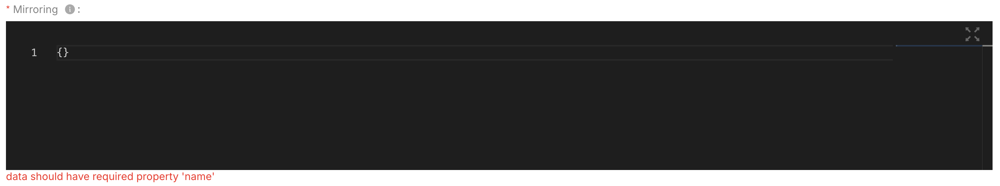
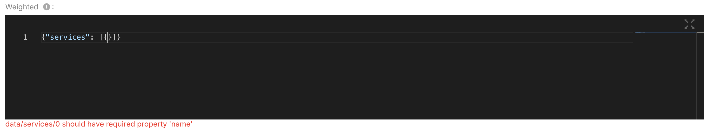
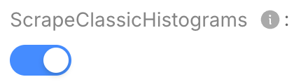
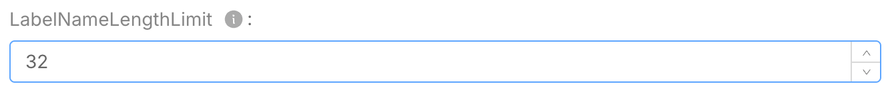

import Tabs from '@theme/Tabs';
import TabItem from '@theme/TabItem';

When designing your Project in the Mia-Platform Console, you can define and configure
[Infrastructure Resources](/console/design-your-projects/custom-resources/custom-resources.md)

An infrastructure resource may be either Kubernetes type, and thus refer to a particular Custom Kubernetes Resource,
or to Non-Kubernetes ones (Lambda functions, Terraform resources, etc.).

An Infrastructure Resource can be created from scratch or from an existing Marketplace item and added to your Project.
To adding an infrastructure resource to you project you need to adding in the Markeplace using by [`miactl`](/cli/miactl/20_setup.md) o the [`Sofware Catalog`](/software-catalog/manage-items/software-catalog-ui/create/overview.md).

## Create a new Infrastructure Resource

### Infrastructure Resource definition

The following JSON Schema is the schema used to validate the requests used to add or edit custom-resource in the Console Marketplace.

JSON Schema


```json
{
  "type": "object",
  "additionalProperties": false,
  "properties": {
    "name": {
      "type": "string"
    },
    "runtime": {
      "type": "object",
      "description": "The object used to view the status of your Current Kubernetes Resources directly in the Console Runtime section",
      "properties": {
        "type": {
          "type": "string",
          "description": "The type of the Infrastructure resource. At the moment the only supported type by the marketplace is 'kubernetes'"
        },
        "resourceId": {
          "type": "string",
          "description": "The plural name for the Infrastructure resource definition."
        }
      }
    },
    "generator": {
      "type": "object",
      "required": ["type", "templates"],
      "properties": {
        "type": {"type": "string","enum": ["template"]},
        "configurationBaseFolder": {"type": "string"},
        "templates": {
          "type": "array",
          "items": {
            "type": "object",
            "required": ["template", "name"],
            "properties": {
              "template": {"type": "string"},
              "name": {"type": "string"},
              "fileExtension": {
                "type": "string",
                "description": "The extension of the file to generate. If not set, default is .yml"
              },
              "folderName": {
                "type": "string",
                "description": "The name of the folder where the file will be created, below the configurationBaseFolder"
              }
            },
          }
        }
      },
    },
    "meta": {
      "type": "object",
      "properties": {
        "kind": {"type": "string"},
        "apiVersion": {"type": "string"}
      }
    },
    "spec": {"type": "object"},
    "attributes": {
      "type": "object",
      "description": "Attributes to be used to generate the form to manage the Infrastructure Resource",
      "additionalProperties": {
        "type": "object",
        "properties": {
          "type": {
            "type": "string",
            "enum": ["input"]
          }
        }
      }
    },
    "service": {
      "type": "object",
      "properties": {
        "archive": {
          "type": "string",
          "description": "URL for an tar.gz archive to be used to generate a new repository"
        }
      }
    },
    "labels": {
      "type": "array",
      "items": {
        "type": "object",
        "properties": {
          "name": {"type": "string"},
          "value": {"type": "string"}
        }
      }
    },
    "annotations": {
      "type": "array",
      "items": {
        "type": "object",
        "properties": {
          "name": {"type": "string"},
          "value": {"type": "string"}
        }
      }
    },
    "jsonSchema": {
      "type": "object",
      "additionalProperties": "true"
    }
  }
}
```


This schema can be used to define both available types of Infrastructure Resources:
generic **template-based** Infrastructure Resources, and **Kubernetes-specific** ones.

Here some examples of a template-based Infrastructure Resource:


ExternalOrchestratorLambda


```yaml
name: ExternalOrchestratorLambda
meta:
    kind: ExternalOrchestratorLambda
    apiVersion: custom-generator.console.mia-platform.eu/v1
spec:
  code: the code
generator:
  type: template
  configurationBaseFolder: base-folder-name
  templates:
    - template: this template can take some values from the spec, such as %spec.code%
      name: template-name
      fileExtension: json # default is yaml
      folderName: template-folder-name
```


A Kubernetes-specific Infrastructure Resource, used to configure [`kube-green`](https://kube-green.dev/):


SleepInfo


```yaml
name: sleepInfo
meta:
    apiVersion: kube-green.com/v1alpha1
    kind: SleepInfo
spec:
    sleepAt: "20:00"
    timeZone: Europe/Rome
    weekdays: "1-5"
runtime:
  type: kubernetes
  resourceId: sleepinfos
```


### Define Marketplace item to upload

First of all, we need to create or edit a new file that includes the Marketplace item information and the Infrastructure Resource that we want to add.

Here is an example of Marketplace item definition for a template-based Infrastructure Resource:


template-custom-resource.yaml


```yaml
name: Google Cloud Function External
description: Google Function Template with external repository handled by Developer Team
type: custom-resource
tenantId: my-company-id
itemId: google-function-external-template
image:
  localPath: ../../images/google-cloud-functions.png
supportedByImage:
  localPath: ../../images/mia-platform-logo.png
categoryId: serverless
version:
  name: 1.0.0
  releaseNote: Initial release
resources:
  meta:
    apiVersion: custom-generator.console.mia-platform.eu/v1
    kind: GoogleFunctionTemplateGenerator
  name: my-google-function
  spec:
    targetRuntime: nodejs20.x
    helloMessage: Say hello from your Cloud Function
    targetRepositoryId: 1234
  generator:
    configurationBaseFolder: googlecloudfunctions
    templates:
      - name: configs
        template: |
          TARGET_RUNTIME=%spec.targetRuntime%
          HELLO_MESSAGE=%spec.helloMessage%
          TARGET_REPOSITORY_ID=%spec.targetRepositoryId%
        fileExtension: env
    type: template
```


Here is an example of Marketplace item definition for a Kubernetes-specific Infrastructure Resource:


k8s-custom-resource.yaml


```yaml
name: Traefik IngressRoute
description: The configuration of the IngressRoute resource for Traefik
type: custom-resource
tenantId: my-company-id
itemId: traefik-ingressroute
imageUrl: imageUrl.png
supportedByImageUrl: supportedByImageUrl.png
supportedBy: my-company-id
categoryId: kubernetes-custom-resource
version:
  name: 1.0.0
  releaseNote: Initial release
documentation:
  type: externalLink
  url: https://docs.mia-platform.eu/docs/infrastructure/paas/tools/traefik#expose-an-endpoint
resources:
  name: default
  meta:
    apiVersion: traefik.io/v1alpha1
    kind: IngressRoute
  labels:
    - name: app.kubernetes.io/instance
      value: ingress-controller
  runtime:
    type: kubernetes
    resourceId: ingressroutes
  spec:
    entryPoints:
      - websecure
    routes:
      - match: Host(`{{PROJECT_HOST}}`)
        kind: Rule
        services:
        - name: api-gateway
          port: 8080
```


Please note that:

- the `type: custom-resource` is required to specify that this resource is a Custom Resource
- the `version` property is required and must be composed by its _name_, e.g. to define this item as a version `1.0.0`,
and the _releaseNote_ to highlight the latest updates of said release

:::info
Versions are not mandatory but highly recommended to avoid overwriting existing resources.

Also, it is required to follow the [Semantic Versioning](https://semver.org/) convention when creating new versions:
this convention is used to group the different versions of the same marketplace items and determine the _latest_ version
that will be used by the Console to help the user to determine the best version to use and be notified of further updates.
:::

### Publish the new Infrastructure Resource

To publish or create new item into the marketplace you can use the
[CLI](/software-catalog/manage-items/mia-ctl/update/overview.md) or the
[Software Catalog](/software-catalog/manage-items/software-catalog-ui/create/overview.md).

### Update the Infrastructure Resource

To update new versions into the marketplace you can use the
[CLI](/software-catalog/manage-items/mia-ctl/update/overview.md) or the
[Software Catalog](/software-catalog/manage-items/software-catalog-ui/create/overview.md).

When updating a Infrastructure Resource, it is recommended to create a new version of the Marketplace item to avoid overwriting the existing one.
The new version should contain the updated resource definition and a release note detailing the changes.

In case you are trying to overwrite a versioned Marketplace Infrastructure Resource, remember that only few fields can be modified.
For more information, refer to the [dedicated section on the "Create your Company Marketplace" page](/software-catalog/manage-items/overview.md#editing-a-versioned-resource).

#### Update non-versioned Infrastructure Resources

To update non-versioned infrastructure resource into the marketplace you can use the [CLI](/software-catalog/manage-items/mia-ctl/update/overview.md).
In this case you can update it by using the `miactl marketplace apply` command, passing the company id (`tenantId` of your resource) and the resource file you created before with the modifications you need.

Since this is a non-versioned element, all field values can be updated without limitations. However, please make sure to use the same `itemId` and the same `tenantId` of the resource you want to update.

In case you lost the original resource file (or simply you do not have it anymore), you can retrieve it from the Marketplace by using the `miactl marketplace get` command:

```bash
miactl marketplace get --object-id 66423781fdd3d6dd3ca62b7b > my-custom-resource.yaml
```

You can use the result as a template to modify the resource you want to update.

### Monitoring a Custom Kubernetes Resource in order to see it in the Runtime Area

If you've upgraded to Console release `v13.3.0`, you can now view the status of your Current Kubernetes Resources directly in the Runtime section.
To enable this feature, please follow the instructions above to [update](#update-the-infrastructure-resource) to publish a new version that include the new fields `runtime` as described into [JSONSchema](#infrastructure-resource-definition)

### Generate dynamic form of the to customize validation of your Infrastructure Resource

If you have upgraded the Console to version `v13.6.1`, you can now generate a dynamic form.
This documentation serves as a guide for users to understand and effectively utilize the dynamic form fields generated from a JSON schema.
By following the examples and descriptions provided, users can create forms that are both functional and user-friendly, ensuring a smooth data entry experience.

:::info
In the next versions of the Console we want to add dynamic form generation also in the details section
:::

The Frontend of the Console generate the Form using the roles below:

### Supported JSON Schema Types

<Tabs groupId="types" queryString>
  <TabItem value="type-object" label="type Object" default>

#### Object field

Visualized as Editor


    ```json
    {
      "jsonSchema": {
        "type": "object",
        "required": ["mirroring"],
        "properties" {
          "mirroring": { "type": "object", "description": "Mirroring defines the Mirroring service configuration" }
        }
      }
    }
    ```

##### Validation:

The editor generated from this type can validate with [ajv library](https://ajv.js.org/) the sub schema used to fields



    ```json
    {
      "jsonSchema": {
        "type": "object",
        "required": ["mirroring"],
        "properties" {
          "mirroring": {
            "type": "object",
            "additionalProperties": false,
            "required": ["name"],
            "properties": {
              "name": { "type": "string" }
            }
          }
        }
      }
    }
    ```

  </TabItem>
  <TabItem value="type-array" label="type Array">

#### Array field

Visualized as Editor


    ```json
    {
      "jsonSchema": {
        "type": "object",
        "properties": {
          "services": {
            "items": {
              "additionalProperties": false,
              "properties": {
                "healthCheck": {
                  "additionalProperties": false,
                  "properties": {
                    "followRedirects": { "type": "boolean" },
                  }
                }
              }
            }
          }
        }
      }
    }
    ```

##### Validation:

The editor generated from this type can validate with [ajv library](https://ajv.js.org/) the sub schema used to fields



    ```json
    {
      "jsonSchema": {
        "type": "object",
        "properties": {
          "services": {
            "items": {
              "type": "object",
              "properties": {
                "healthCheck": {
                  "type": "object",
                  "properties": {
                    "followRedirects": { "type": "boolean" },
                  }
                }
              }
            }
          }
        }
      }
    }
    ```

  </TabItem>

  <TabItem value="type-string" label="type String">

#### String type

Used for textual input. It can include various validations such as minimum and maximum length.
When using a string field, ensure that the input meets the specified length requirements.


    ```json
    {
      "jsonSchema": {
        "type": "object",
        "properties": {
          "type": "string",
          "minLength": 5,
          "maxLength": 100,
          "description": "Enter your full name."
        }
      }
    }
    ```


  </TabItem>

  <TabItem value="type-boolean" label="type Boolean">

The boolean type is used for true/false values. This is typically represented as a switch in the form.



    ```json
    {
      "jsonSchema": {
        "type": "object",
        "properties": {
          "boolean": {
            "type": "boolean",
            "description": "Do you agree to the terms and conditions?"
          }
        }
      }
    }
    ```

  </TabItem>

  <TabItem value="type-integer" label="type Integer">

#### Integer type

Specifically for whole numbers. It behaves similarly to the number type but restricts input to integers.



    ```json
    {
      "jsonSchema": {
        "type": "object",
        "properties": {
          "integer": {
            "type": "integer",
            "minimum": 1,
            "maximum": 10,
            "description": "Enter an integer between 1 and 10."
          }
        }
      }
    }
    ```

  </TabItem>
  <TabItem value="type-number" label="type Number">

#### Number type

Used for numerical input, which can include both integers and floating-point numbers.


    ```json
    {
      "jsonSchema": {
        "type": "object",
        "properties": {
          "number": {
            "type": "number",
            "minimum": 0,
            "maximum": 100,
            "description": "Enter a value between 0 and 100"
          }
        }
      }
    }
    ```

  </TabItem>
</Tabs>

### Unsupported JSON Schema Features

While our dynamic form fields support a wide range of JSON schema features, there are certain features that are not supported.
Additionally, being aware of the unsupported features will help users avoid potential issues when designing their schemas.
Below is a list of unsupported features:

* **$ref**: Reference to external schemas

* **oneOf**: Validation against one of the specified schemas
* **allOf**: Validation against all of the specified schemas
* **anyOf**: Validation against any of the specified schemas
* **not**: Validation against the negation of the specified schema

* **string** format: Specific string formats such as email, date, etc
* **number** exclusiveMinimum and exclusiveMaximum: Exclusive range validation for numbers

* **dependencies**: Conditional validation based on the presence of other fields

#### Partially supported JSON Schema Features

* **additionalProperties**: Validation of additional properties work only for types array or object in the schema
* **patternProperties**: Validation of properties matching a specific pattern
