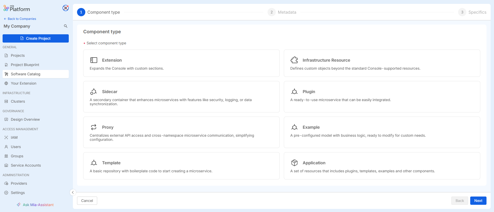
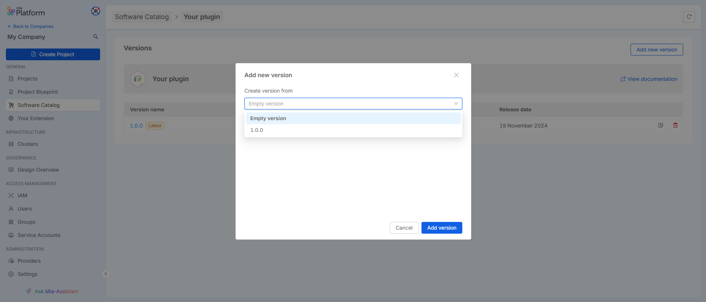

To create a new item in the catalog, click on the "Add Item" button. This will open a user interface (UI) that guides you through the item creation process. The process is divided into the following steps:

1. **Select the Item Type**
Choose the type of item you want to create from the available options. This will determine the set of fields and attributes you need to provide during the creation process.

2. **Enter Metadata**
Fill in the necessary metadata for the item. This typically includes basic information such as the name, description, category, and any other required attributes. 

3. **Enter Assets**
After entering the metadata, you will need to specify additional details for the item. A default schema of resources will be provided to assist you in adding the relevant specifics. This schema serves as a template to help ensure all necessary information is included and formatted correctly.

Follow the on-screen instructions to complete the item creation process. Once all steps are completed, you can save and submit the item to be added to the catalog.

## Create a New Version

Create a new version is available only for items that support versioning. You can start the creation of a new version from either of the following options:

#### From the Version Overview Page
On the item’s overview page, you can create a new version by selecting the "Add new version" option. Here, you can choose whether to start from an existing version or create the new version from scratch.

#### From the Version Detail Page
You can also create a new version directly from the version detail page. Click on the button with the three dots to open the option to create a new version based on the version you are currently viewing.

