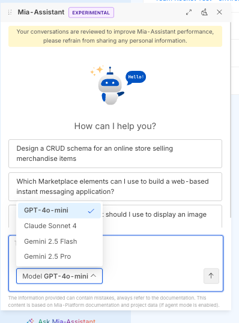

In order to upgrade Mia-Platform Console, all you need to do is to update the `mia-console` Chart version dependency in your `Chart.yaml` file.

:::tip
When upgrading Mia-Platform Console to a new major release, always remember that updates must be performed one major at a time. Therefore, in order to upgrade from v12 to v14 you must first upgrade to the latest v13 version.

To find out how to upgrade your installation to the latest version of v13.
:::

```yaml title="Chart.yaml" {9} showLineNumbers
apiVersion: v2
name: console
version: "0.0.0"
kubeVersion: ">= 1.20.0"
description: Self Hosted Console Installation Chart
type: application
dependencies:
  - name: mia-console
    version: "X.Y.Z"
    repository: "https://nexus.mia-platform.eu/repository/helm-internal/"
```

When upgrading also make sure to check if any new configuration option is available or if something has been removed.

:::info
The Chart version follows [semver](https://semver.org/) policy so any breaking change with the Chart will always be followed by a Major release. Minor releases may include new configuration options while as a general rule of thumb, patches never holds new configuration options but only internal updates and fixes.
:::

## Console v14 - version upgrades

### Upgrade from v14.0.3 to v14.1.0

With Console v14.1.0, the Mia-Assistant evolves and now supports multiple LLM models!  
For this reason few changes are necessary to configure it properly.

#### Multiple LLM configurations

First of all, `configurations.assistant.llm` is now `configurations.assistant.llms` (note the final `s`) and is now accepting a list of llm configurations.  
Update the already configured LLM to be an item in this list

e.g., (before)

```yaml
configurations:
  # ...
  assistant:
    llm:
      type: "azure"
      apiVersion: "..."
      # ...
```

e.g., (after)

```yaml
configurations:
  # ...
  assistant:
    llms: # note the final 's'
      - type: "azure" # note the '-'
        apiVersion: "..." # note the increased indentation
        # ...
```

#### LLM DisplayName

`configurations.assistant.llm` items now require a `displayName` field to be set. This value is shown to the user when selecting the related model on the Mia-Assistant chat panel.



Make sure to include this field in all the configured models.

```diff
configurations:
  # ...
  assistant:
    llms:
      - type: "azure"
        apiVersion: "..."
+       displayName: "GPT-4o Mini"
        # ...
```

#### Assistant Keys

1. `configuration.assistant.keys.embeddings` field has been moved into `configuration.assistant.embeddings.apiKey`

```diff
configurations:
  # ...
  assistant:
    keys:
-     embeddings: "embeddings-apiKey"
    llms:
      # ...
    embeddings:
      type: "azure"
+     apiKey: "embeddings-apiKey"
      # ...
```

2. `configuration.assistant.keys.llm` field is now split to support credentials for multiple providers:

- `configuration.assistant.keys.azureLlmApiKey`
- `configuration.assistant.keys.openaiLlmApiKey`
- `configuration.assistant.keys.vertexAICredentials`

Ensure to move the apiKey used before into the correct field 

Follow the [Assistant documentation](/infrastructure/self-hosted/installation-chart/helm-values/75_assistant.md#llm-and-embeddings-model-configuration) to learn more about how to configure it.

#### Specific upgrade for LLM/Embeddings using `vertex` models

If you currently configured Mia-Assistant to use models from VertexAI you should now specify the `configuration.assistant.keys.vertexAICredentials` field.

This field automatically creates a Secret on k8s with specified credentials and mounts it in the mia-assistant container.

### Upgrade from last Console v13 to v14.0.0

No further changes are needed for the upgrade. Enjoy ;)
