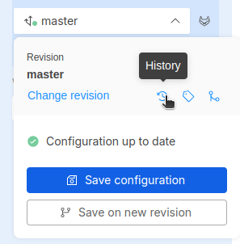
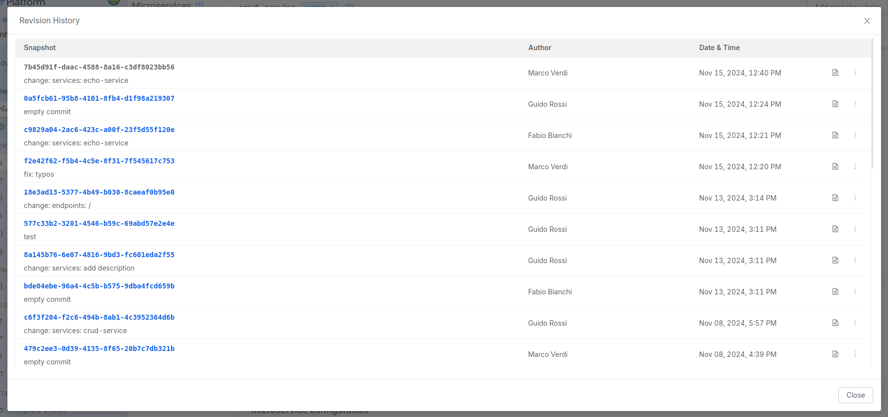
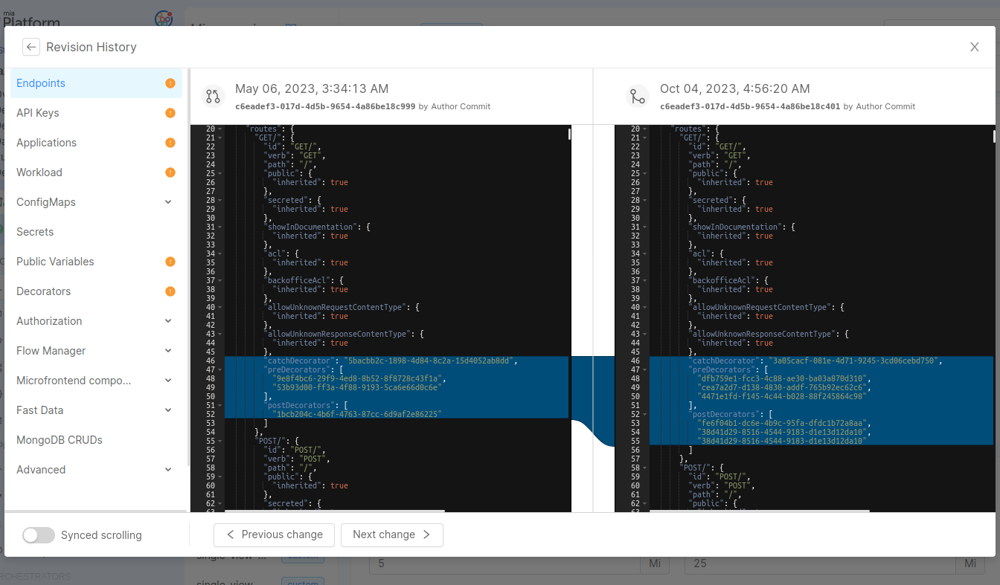
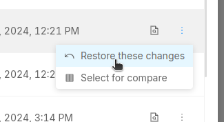
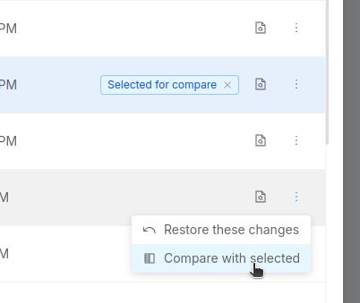
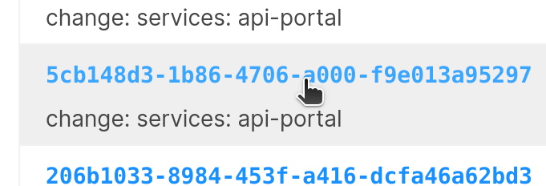
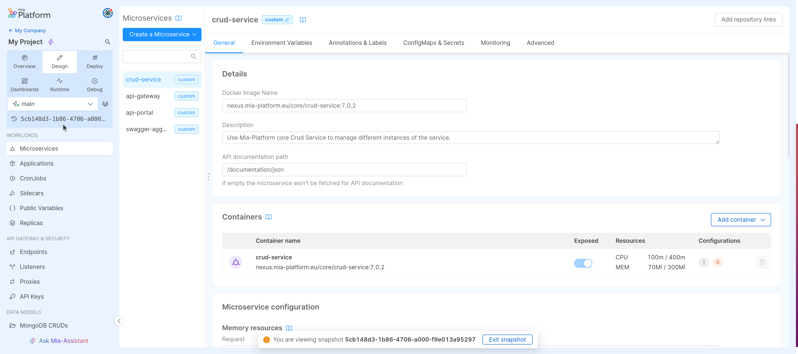
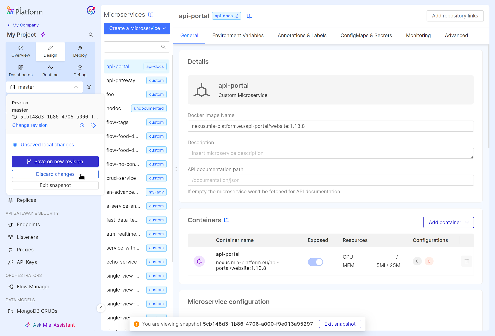
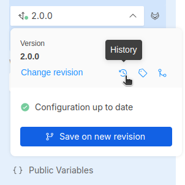
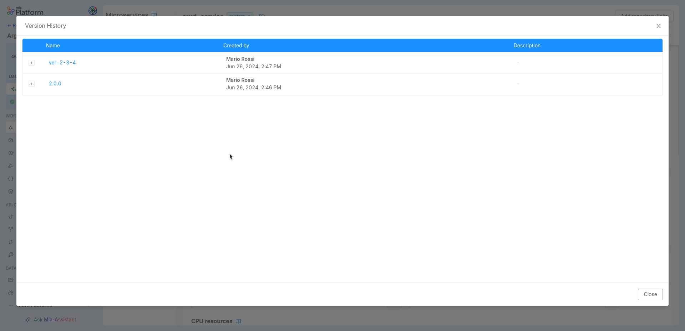

In Projects adopting the Enhanced Workflow, `Revisions` and `Versions` replace the concept of `Branches` and `Tags`.
The Console will not rely on the typical Git-based instruments anymore and will instead adopt a **new configuration management system**.

Developers can manage *revisions* and *versions* from the dedicated sections inside the Project Overview area.

## Revisions Section

 Revisions can be accessed and deleted from the Revisions management page:

## Versions Section

Versions work as immutable snapshots of the configuration in a particular moment, with their description and release note. They can be viewed and deleted through the versions management page:

:::info
Versions can only be deleted by Project Administrators.
:::

## Revision history

The Enhanced Workflow feature replaces the `Commit History` with the `Revision History`.
The Revision History allows to keep track of how a revision has changed over time, tracking all past snapshots of the Project configuration saved by the users.

Once that a revision is selected, its history is accessible in the Design Area by clicking the related icon in the branch action popover as shown in the image above.

It contains the list of snapshots of the Project configuration on the current revision or version, created each time it has been saved.  
It also includes useful information such as the snapshot date, author, associated message, and any tags associated with it.
Moreover, the document icon on the right side of the table allows the user to visualize changes between the selected snapshot and the previous one,
in order to better understand the configuration's evolution over time.

:::tip
From the revision history you can restore previous changes using the specific option in the contextual menu:
click on the three dots icon, and then select *Restore these changes* to update the configuration to the selected snapshot.

:::

### Compare different revisions

It is possible also to see the differences between to revisions by clicking *Select for compare* option in the menu of the revision you are interested:
the selected revision will appear highlighted in the revision history and then you can select another revision by clicking the *Compare with selected* button.

After doing so, the comparison of the two configurations will be displayed to give the possibility to better understand the changes between the two revisions.

### Snaphot review

On the revision history, it is possible to click on a snapshot ID to access its configuration and review and edit it using the Design section.

Once a snapshot is loaded, a warning message will appear as an overlay at the bottom with a button to exit the snapshot and return to the latest revision configuration.

From the revision status popover it is also possible to:

- exit the snapshot
- discard snapshot changes without exiting the snapshot review
- save snapshot changes to a new revision

### Default revision configuration

In the [Project Settings](/products/console/project-configuration/project-settings.md) section, if the Enhanced Workflow is enabled, it is possible to select one of the already existing revisions as **default revision**.

:::info
If no default revision is specified, the Console will use `main` as the default revision.
This revision will have an empty configuration if no other `main` branch was previously created on the Project.
:::

## Version History

Similarly to the Revision History, the Version History lists all the versions created on the Project.

To open the Version History, select any version in the Design Area and click the related icon in the branch action popover as shown in the image above.

The table shows the name of each version with other useful info such as the author's name, the creation date and the description. Expanding the collapsed row of each version makes it possible to read its release note (if provided), and by clicking on the version name you can load the version configuration directly in the Design area.

## Best Practices

With the **Enhanced Project Workflow** paradigm shift, working with the Console may require some habit changes; this section presents some best practices that may help with such change.

### Revision management

Working with revisions in the Enhanced Workflow is not that different from working with branches in the Standard Workflow; revisions have their own history and can be deployed on different environments, therefore patterns such as **Git Flow** or **Trunk-based development** can be applied to the **Enhanced Project Workflow** as well.

#### Trunk-based

If you are **working in a small team**, in general, we advise using **trunk-based development**, with a single revision that represents your Project's state-of-the-art that gets versioned every time a release is needed.

Create new revisions whenever you need to experiment or are unsure of the changes to be made, but [*remember to merge*](/products/console/api-console/api-design/merge_collaboration.md#how-to-perform-a-merge-of-configurations) them in the main trunk as soon as possible to prevent headaches in reconciling diverging revisions.

:::tip
When a version is deployed a tag is created on Git. Such tag has a different name based on the target environment making it possible to verify configuration changes between different deployments of the same version!
:::

#### Git Flow

If you are working in **larger teams** or need to make more **structured change reviews**, use **Git Flow** instead and create a revision for each environment your project has. The daily work will be done in the revision associated with the "lower" environment;
whenever changes can be promoted to a "higher" environment, use the [merge](/products/console/api-console/api-design/merge_collaboration.md#how-to-perform-a-merge-of-configurations) feature to bring those changes to the revision associated with it.

:::tip
In a project with two environments (e.g. development and production), make sure to have at least two revisions.

Developers will make changes in the `development` revision and deploy such revision in the development environment; to promote changes to the production environment, use the [merge](/products/console/api-console/api-design/merge_collaboration.md#how-to-perform-a-merge-of-configurations) feature to incorporate them into the correct revision and finally deploy it to the production environment.
:::
