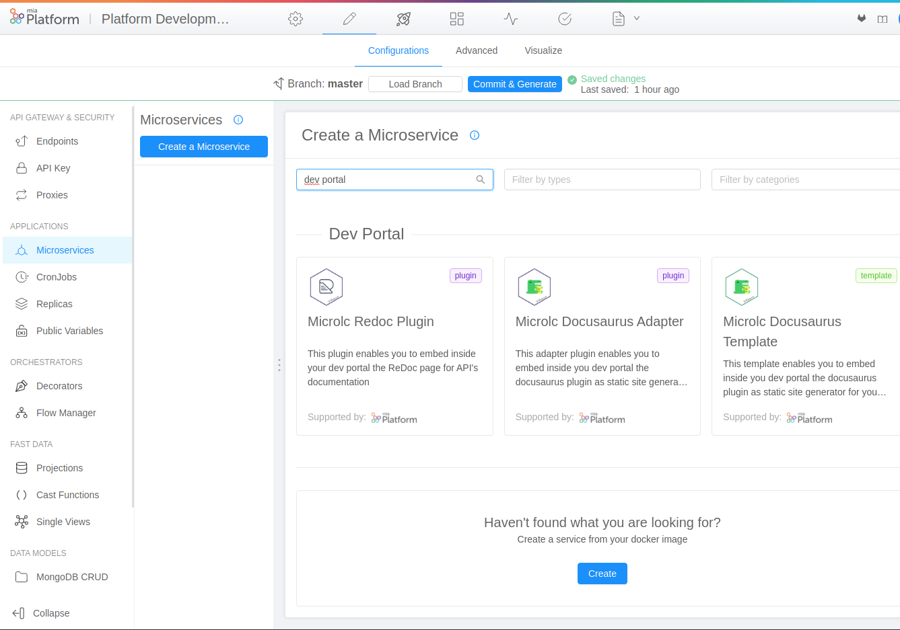
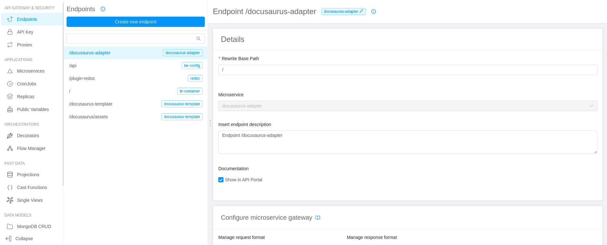
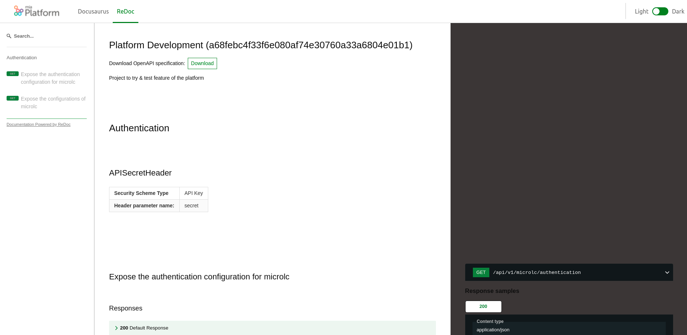

[ReDoc](https://redoc.ly/) is an OpenAPI-genereted API reference documentation generator that can be use to produce documentation for your APIs quickly.

In the dev portal, `ReDoc` can be used to create the API documentations just setting up the link to your OpenAPI specification.

## Microservice creation for `ReDoc`

To create an instance of `ReDoc`:

1. Go to the `Microservices` section;
2. Create a new microservice using the `Microlc ReDoc Plugin` in the `Dev Portal` category of the marketplace;
   
3. Configure the microservice with a custom name and description;
4. Complete the creation to deploy an instance of `ReDoc`.

## ReDoc endpoint configuration

1. Create a new endpoint;
2. Define the `Base path` where you want to expose `ReDoc` (e.g. `/plugin-redoc`);
3. As type, use `Microservice`;
4. Select the microservice name used for `ReDoc`;
5. Complete the creation.

After that, the situation should be similar to the following:



## ReDoc configuration

Like all the plugins of `microlc` you should refer to the [core configuration section](https://microlc.io/documentation/docs/micro-lc/core_configuration#plugins)
for the setup and to correctly configure Redoc you **must** set one `props`:

- _openApiSpecUrl_ : the url to your `Swagger` or `OpenApi` specification.

Here follows a full configuration example:

```json {10}
{
  "id": "redoc-plugin",
  "label": "ReDoc",
  "icon": "fas fa-link",
  "order": 4,
  "integrationMode": "qiankun",
  "pluginRoute": "/redoc/",
  "pluginUrl": "https://plugin-url.com",
  "props": {
    "openApiSpecUrl": "http://petstore.swagger.io/v2/swagger.json"
  }
}
```

## Result

After a deployment, your new Dev Portal should be exposed at the `/` path of your host (e.g. `https://your-host-com/`),
and should be similar to the following:


