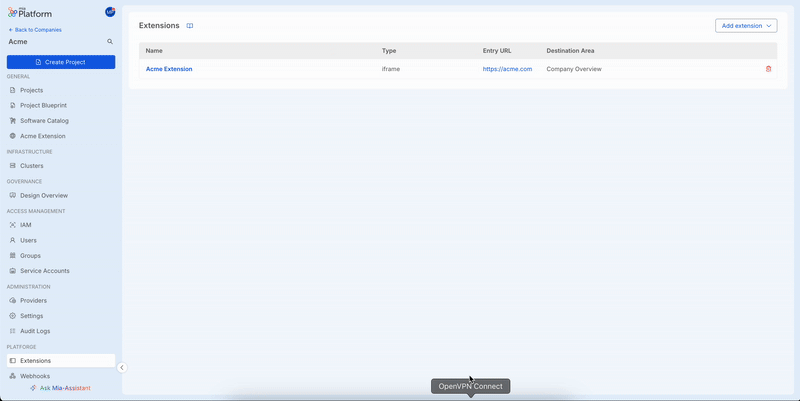

# Integrate Mia-Platform Console Single Sign-On (SSO) for extensions

Using Mia-Platform extensions, users can access custom data and perform custom actions. If this data is protected, or these actions may be restricted to a specific set of users only, you need a way to authenticate the user and validate its permissions.  

By using the *Mia-Platform Console SSO (SSO)* you empower your extensions with this exact capability, getting rid of multiple logins, while also delegating to Mia-Platform all of the heavy lifting and security concerns. In this way you can focus just on what really matters to your users.

In this page you can find out how this feature works and how you can enable it for your extensions.

## Prerequisites

:::info
This feature is currently available for `iframe` and `external link` extensions. For more information on extension types and features, see [Manage Extensions][docs-manage-extensions].
:::

In order to integrate with Mia-Platform Console SSO, your extension MUST define and expose:

- a [*Login Entry Point*][extension-login-entry-point] used to start the login flow towards the Mia-Platform Console
- a [*Callback Endpoint*][extension-callback-url] that will be used by the Console as the [OAuth 2.0 Redirection Endpoint][ietf-redirection-endpoint] when performing the authentication flow
- a [*Token Endpoint*][extension-token-endpoint] exposed by the extension backend that acts as proxy endpoint towards the Console `/api/oauth/token` endpoint

## Enable Console SSO for extensions

From the extension detail configuration page, scroll down to the *Console SSO* card to enable the feature for your extension. Specify here the Callback URL exposed by the extension and save.

You should now see the *Console SSO* enabled for your extension.



## OAuth 2.0 Flow: Authorization Code Grant

*Console SSO* for an extension implements the OAuth 2.0 flow with *Authorization Code Grant*. This means that under the hood, the login flow follows the scheme below. Learn more about OAuth 2.0 and this specific flow on the [RFC-6749][ietf-oauth-2-auth-code-grant].
```
     +----------+
     | Resource |
     |   Owner  |
     |          |
     +----------+
          ^
          |
         (B)
     +----|-----+          Client Identifier      +---------------+
     |         -+----(A)-- & Redirection URI ---->|               |
     |  User-   |                                 | Authorization |
     |  Agent  -+----(B)-- User authenticates --->|     Server    |
     |          |                                 |               |
     |         -+----(C)-- Authorization Code ---<|               |
     +-|----|---+                                 +---------------+
       |    |                                         ^      v
      (A)  (C)                                        |      |
       |    |                                         |      |
       ^    v                                         |      |
     +---------+                                      |      |
     |         |>---(D)-- Authorization Code ---------'      |
     |  Client |          & Redirection URI                  |
     |         |                                             |
     |         |<---(E)----- Access Token -------------------'
     +---------+       (w/ Optional Refresh Token)
```
:::info
When accessing an extension from within the Mia-Platform Console, the user is already logged in the system thus, when starting a new OAuth 2.0 flow for an extension, the user grant is considered implicit and no further action is expected from the user.

This means that in the sequence above, the (B) part is done without requiring any user action. This behavior may however change in the future.
:::

## Extension Login Entry Point

This is the entry point for the entire authorization flow. It can be any of:

- a frontend page that shows some UI to inform the user about the login
- a frontend page that automatically starts the login flow
- a backend endpoint that just redirects the *user-agent* to the Console authorization page

It doesn't matter which of these techniques you will choose. What matters is that - in order to perform the login - this endpoint MUST:

- generate a new `state` that will be used throughout all the login flow
- redirect the *user-agent* (the browser in use) to the specific extension authorization page of the Console, specifying the generated `state`

The Console endpoint that handles extension authorization is the following one, preceded by the Console base URL:

`/oauth/authorize?tenantId={tenantId}&extensionId={extensionId}&state={state}`

Here an example of a frontend page that starts the login flow when the user clicks on a Login button:

```js
function performExtensionLogin() {
   const tenantId = 'acme'
   const extensionId = 'acme-extension-123'
   
   // Remember to store the state and validate it throughout the login flow
   const state = crypto.randomUUID()
   
   window.location.replace(
     `https://<CONSOLE_URL>/oauth/authorize?tenantId=${tenantId}&extensionId=${extensionId}&state=${state}`
   )
}
```

```html
<!-- When user clicks the button the login flow is started -->
<button onclick="performExtensionLogin()">Login with Mia-Platform</button>
```

:::info
How the extension generates and stores the `state` is not scope of this guide.
:::

## Extension Callback URL

As per [OAuth 2.0 specification][ietf-redirection-endpoint]: *"The redirection endpoint URI MUST be an absolute URI [...] The endpoint URI MAY include an "application/x-www-form-urlencoded" formatted query component which MUST be retained when adding additional query parameters. The endpoint URI MUST NOT include a fragment component"*

:::info
Currently, only valid *HTTPS* URLs can be configured as redirection endpoints.  
:::

In OAuth 2.0 with Authorization Code Grant, the *authorization server* redirects the *user-agent* back to the *client* (in this case the extension frontend) using the redirection URI configured earlier (the extension's *Callback URL*), providing an authorization `code` and the `state` provided by the client earlier.

This endpoint MUST be able to read the authorization `code` and the `state` from the query component and request an access token from the Console token endpoint forwarding both the authorization `code` and the `state`.

:::info
For safety reasons, all modern browsers block Cross Origin requests, thus you need to implement a proxy endpoint in order to contact the Console token endpoint.
:::

## Extension Token Endpoint

As all modern browsers block Cross Origin requests, in order to request an access token from the Console endpoint, you MUST expose an extension backend endpoint acting as a proxy towards the Console token endpoint.

Here a simple example of a `POST /api/token` proxy API towards the Console `POST https://<CONSOLE_URL>/api/oauth/token` endpoint.
It is implemented in Go as a Fiber app, but you can implement yours using your favorite development stack:

```go
package main

func main() {
     app := fiber.New()

     app.Post("/api/token", func(c *fiber.Ctx) error {
          tokenResponse, err := http.Post(
               "https://<CONSOLE_URL>/api/oauth/token",
               "application/json",
               bytes.NewReader(c.Body()),
          )
          if err != nil {
               c.Send([]byte(err.Error()))
               return c.SendStatus(http.StatusInternalServerError)
          }
          defer tokenResponse.Body.Close()

          responseBodyBytes, err := io.ReadAll(tokenResponse.Body)
          if err != nil {
               c.Send([]byte(err.Error()))
               return c.SendStatus(http.StatusInternalServerError)
          }
          return c.Send(responseBodyBytes)
     })

     log.Fatal(app.Listen(":3000"))
}
```

The access token is contained in the response body as a `JSON` structured in this way:

```json
{
    "accessToken": "my-access-token",
    "refreshToken": "my-refresh-token",
    "expireAt": 1234567890
}
```

Further detail on this API can be found on the [Authentication Service documentation][docs-authentication-service-get-token].

:::info
How you should store and communicate the access token to the extension frontend is not scope of this guide.

Whether you choose to set an HttpOnly Cookie for your extension domain, or store the access token securely in your favorite way does not make any difference.
:::

## Validate Access Token

An access token generated by the Mia-Platform SSO for your extension defines the following standard JWT claims:

- **iss**: the *issuer* of the token. In this case is the base URL of the Console instance that generated it
- **aud**: the list of *audiences* that the token was generated for. In this case it contains the base URL of your extension

To understand better these and other standard JWT claims, check out the [RFC-7519: JSON Web Token (JWT) - Claims][ietf-jwt-claims].

When using the *Console SSO* for your extension, remember to validate tokens when needed. To do this:

- use the Console `/jwks` endpoint to retrieve the [JSON Web Key][ietf-jwks] Set and validate the token against it
- ensure that the **aud** claim refers to your extension application

:::warning
If the audiences claim (**aud**) does not include your application URL, it means that the token was not signed for your application to be used, you MUST reject that request!
:::

[ietf-redirection-endpoint]: https://datatracker.ietf.org/doc/html/rfc6749#section-3.1.2
[ietf-oauth-2-auth-code-grant]: https://datatracker.ietf.org/doc/html/rfc6749#section-4.1.2
[ietf-jwt-claims]: https://datatracker.ietf.org/doc/html/rfc7519#section-4.1
[ietf-jwks]: https://datatracker.ietf.org/doc/html/rfc7517

[docs-authentication-service-get-token]: https://docs.mia-platform.eu/docs/runtime_suite/authentication-service/usage#get-jwt-token

[docs-manage-extensions]: /products/console/company-configuration/extensions.md
[extension-login-entry-point]: #extension-login-entry-point
[extension-callback-url]: #extension-callback-url
[extension-token-endpoint]: #extension-token-endpoint
