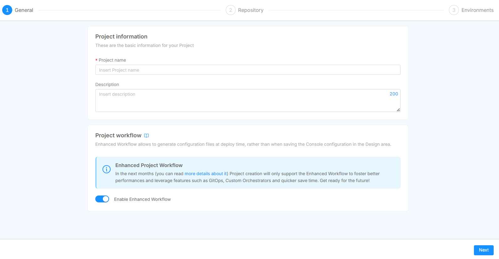
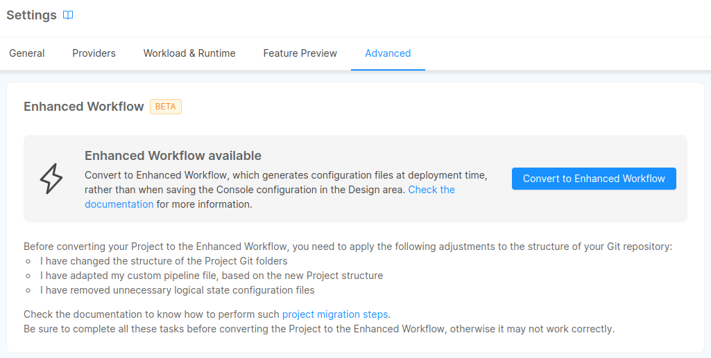

import Tabs from "@theme/Tabs"
import TabItem from "@theme/TabItem"

In order to adopt the Enhanced Workflow on your Projects, you can either create new Projects with this feature already enabled or migrate already existing Projects from the Standard to the Enhanced Workflow.

### Create a new Project with Enhanced Workflow

Newly created Projects will use the **Enhanced Project Workflow** by default from the very first moment of their life following the [Project creation process](/products/console/project-configuration/create-a-project.mdx#creation-process).

:::info
By disabling the `Enable the Enhanced Project Workflow` switch, it is still possible to create a new Project with the Standard Workflow
:::



When making this choice, also make sure the *Project Template* you wish to start from is already supporting the new folder structure required by the **Enhanced Project Workflow**.

If not, you can still start from any template and after the Project creation you may have to follow the [migration guide](#migrating-your-projects) in order to adapt the created Project repository to [the new folder structure](#git-repository-adjustments).

:::info
After the Project creation is completed, in the Project Settings, you will be able to select the *deployment strategy* between **Push** (for [Pipeline-based deployments](/products/console/deploy/pipeline-based/index.md)) and **Pull** (for [GitOps-based deployments](/products/console/deploy/gitops-based/index.md)).


:::

## Migrate existing Projects

To enable the **Enhanced Project Workflow** on an existing Project, head to the **Advanced** tab in the [**Project Settings**](/products/console/project-configuration/project-settings.md) page and press the *Convert to Enhanced Workflow* button.



:::caution
Enabling the Workflow on an existing Project will not make any changes to the Project repository, so make sure to follow the [migration guide](#migrating-your-projects) below before converting the Project to the new workflow.
:::


Enable the Workflow on a whole Company

If you want to ensure that all Projects in your Company adopt the **Enhanced Project Workflow**, you can open a service request and ask for the support of a Mia-Platform referent in order to activate the `ENABLE_CONF_GENERATION_ON_DEPLOY` feature toggle at Company level. The activation of this feature at the Company level also disallows the creation of new Projects with the Standard Workflow.


### Steps to migrate your Projects

In order for the migration to succeed, there are some manual adjustments that need to be performed, which can be summarized with the following steps:

 - Secret Variables security enforcement
 - Git repository structure clean-up
 - Feature activation
 - Default revision setup and adjustment of a few Project Settings

#### Secret Variables Security Enforcement

Despite secrets providers are supported in the **Enhanced Project Workflow** as these currently are in the Standard Workflow too, there are a few constraints to consider when migrating to this workflow whether you are planning to use a **[Push](/products/console/deploy/pipeline-based/index.md)** or **[Pull](/products/console/deploy/gitops-based/index.md)** *deploy strategy*.

When using `PUSH` mode (pipeline-based deploy) all secrets providers supported in the Standard Workflow are supported as well; You can define secrets and use them in your Projects as you always did.

When using `PULL` mode (GitOps-based deploy), only Secrets stored in Vault are currently supported. 

:::caution
Altough Standard Workflow allows you to interpolate Secret Variables on your Project, we discourage this usage pattern. This practice opens severe security implications, exposing values that are supposed to be secret as plain text when inspecting containers on Kubernetes.  
To avoid this bad practice to be used, Secret Variables interpolation is **not supported** on the Enhanced Project Workflow. Please make sure to fix any Secret Variable usage before migrating to the Enhanced Workflow.
:::


#### Git Repository adjustments

With the new Workflow we changed the way Console organizes the Git repository.  
Previously, Console supported two different folder structures based on whether the Project used [`kustomize`](/products/console/project-configuration/kustomize-your-configurations/migrate-to-kustomize.md) or not.  
With the new workflow Console uses a single common structure for both the cases. This structure contains the following directories:

- `environments`: this one is automatically generated by the Console and contains one directory for each environment. Here are stored all the configurations files generated at each deploy.
- `configuration`: contains your global customization files to be applied to all environments. If the Project uses [`kustomize`](/products/console/project-configuration/kustomize-your-configurations/manage-a-kustomize-project.md) there will be also a `kustomization.yaml` manifest file.
- `overlays`: containing one directory for each environment. Here all your environment-specific patch files are stored, as well as a `kustomization.yaml` manifest if you are using [`Kustomize`](/products/console/project-configuration/kustomize-your-configurations/manage-a-kustomize-project.md).

The final repository structure should be similar to the following: 

```
├── overlays
│ ├── dev
│ │ └─── <dev custom file>
│ ├── production
│ │ └─── <prod custom file>
│ ├── other_env_id
│ │ └─── <env_id custom file>
│ └── ....
│
├── configuration
│ └─── <global custom files>
│
├── environments
│ ├── dev
│ │ └── <k8s config files>
│ ├── production
│ │ └── <k8s config files>
│ ├── other_env_id
│ │ └── <k8s config files>
│ └ .....
```

:::caution
All the contents of the `environments` directory are generated from scratch each time, any additional file that is not managed by the Console will be overwritten!
:::

The migration process for the git repository differs depending on whether the Project is using kustomize or not.  
Follow the right section for your Project to correctly update the git repository:

<Tabs
  defaultValue="plain"
  groupId="git-repo-migration"
  values={[
      { label: 'Plain', value: 'plain', },
      { label: 'Kustomize', value: 'kustomize', },
  ]}
>
<TabItem value="kustomize">

Edit `overlays/:environmentId/kustomization.yml` file and replace the path `../../configuration` with `../../environments/:environmentId`.  
When generating the `environments/:env/kustomization.yml`, the Console will automatically import the `configuration/kustomization.yml` if present.

Your `kustomization.yml` file should look like this:

```yaml
apiVersion: kustomize.config.k8s.io/v1beta1
kind: Kustomization
resources:
- ../../environments/dev
```

Within the `configuration` folder you have to delete all the k8s configuration files previously handled by the Console. Leaving only the `kustomization.yml` and your custom files (if any).


</TabItem>
<TabItem value="plain">

Create a folder named `overlay` and one subfolder for each environment of the Project. These subfolders should be named using the environment Id.
To do this, you can refer to the example structure just above.

Move every k8s configuration file from the `configuration/:envId` to the relative directory just created inside the `overlays` folder.
The `configuration` folder should then contain only global customization files (if any).

</TabItem>
</Tabs>


#### Other common cleanup for git repository

- If you have a pipeline file (e.g. `gitlab-ci.yml`) it may contain deployment scripts that may work based on the previous directory structure. For this reason, custom pipelines have to be updated according to the new directory structure; if your Project is using a pipeline provided by Mia-Platform templates, a new template can be used: please ask your Mia-Platform referent to know which one.

- All the Console configuration state files and directories that were previously saved on Git can now be safely removed.  
Here is a list of the files and directories that can be deleted:
  - `api-console-config.json`
  - `fastdata-config.json`
  - `mia-craft-config.json`
  - `rbacManagerConfig.json`
  - `backofficeConfigurations.json`
  - `config-maps`
  - `config-extension`
  - `variables`
  - `overlays/:env/variables.env`
