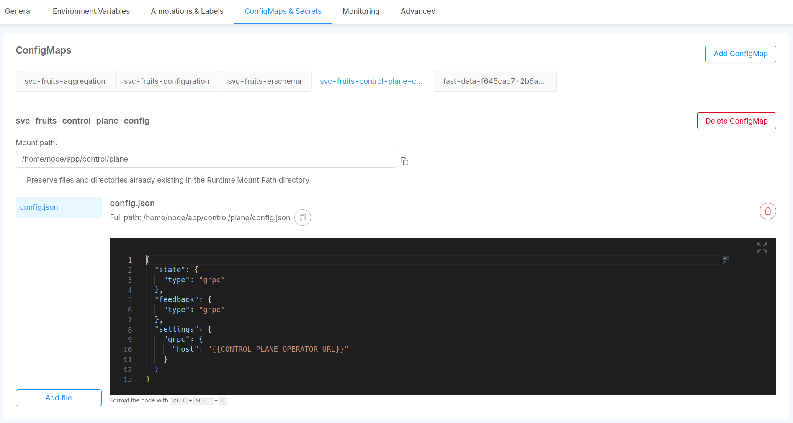

The Control Plane Configuration is managed by a dedicated Config Map.

In [the Config Map section of the Design Area](/products/console/api-console/api-design/services.md#configmaps), create a new Config Map (e.g. `control-plane-configuration`),
then create a JSON file (e.g. `config.json`) where you will write your own configuration.

To made the service aware of the Control Plane configuration, add a new environment variable called 
`CONTROL_PLANE_CONFIG_PATH` where you will use as value the full path of the configuration file inside
your microservice. 

:::tip
If the Control Plane is configured [with both feedback and state as gRPC channels](/products/fast_data/runtime_management/control_plane.mdx?control-plane-configuration=runtime#grpc),
the same Config Map can be shared across microservices.
:::