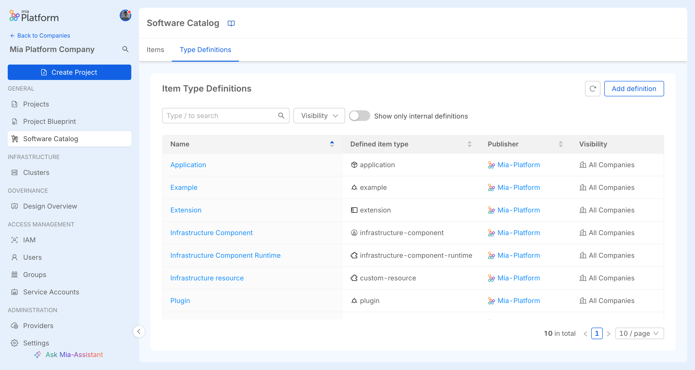
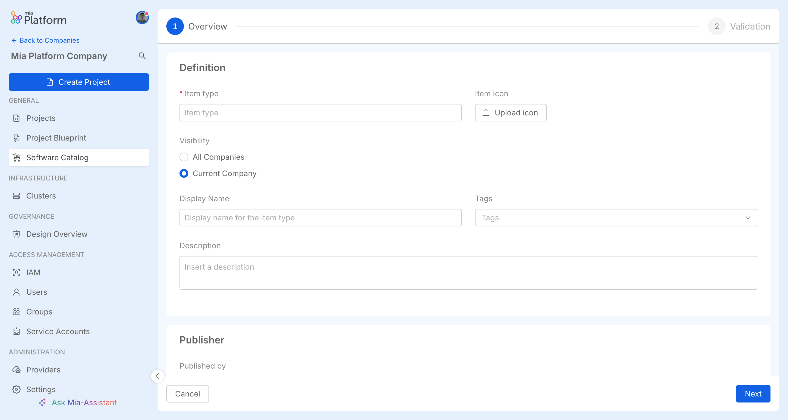
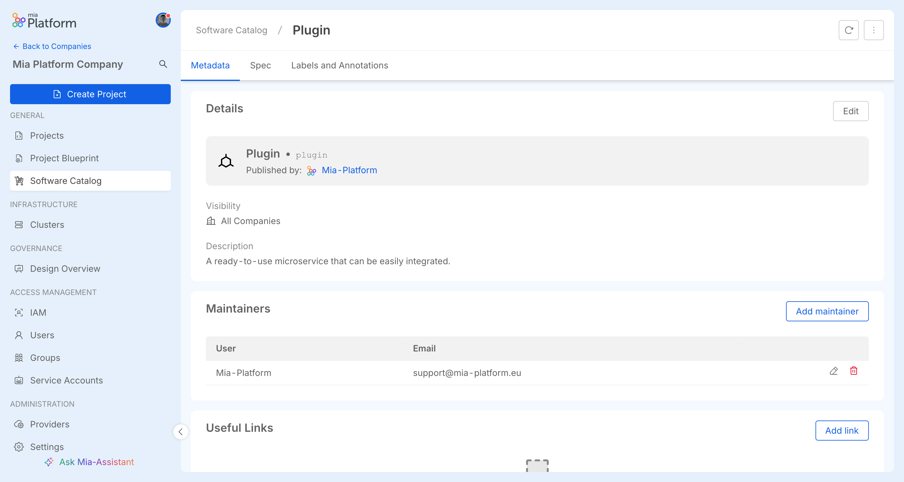
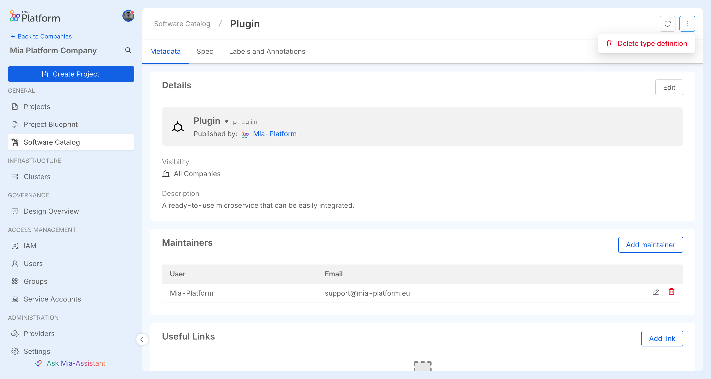
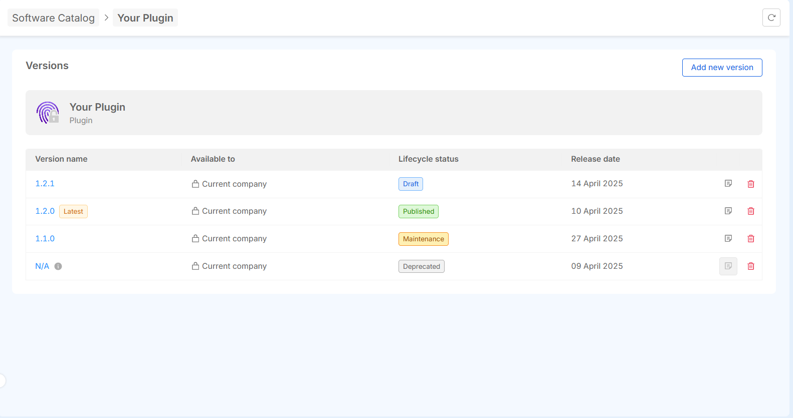
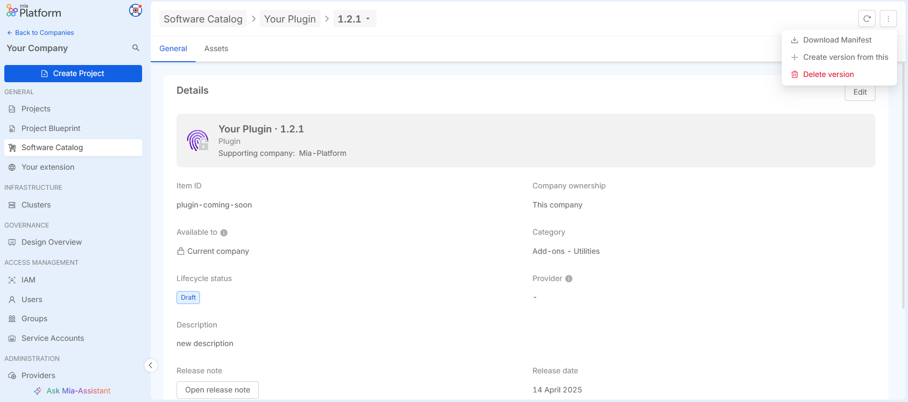
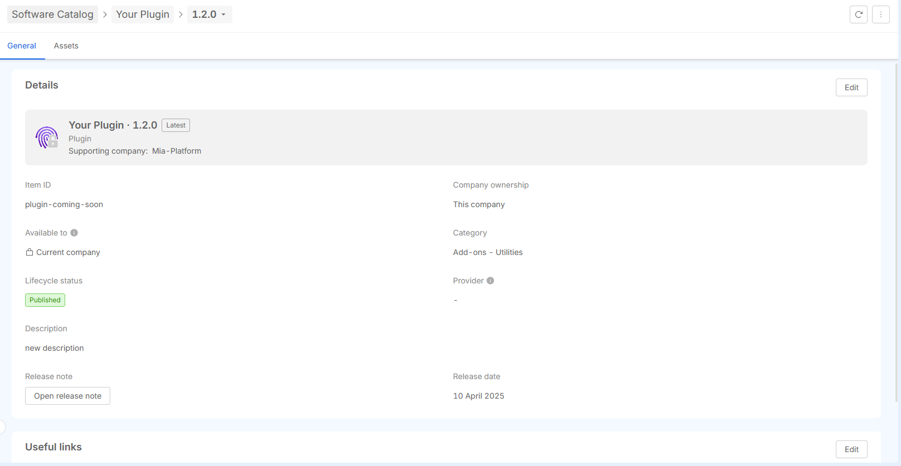

:::info
You need to have *Company Owner* or *Project Administrator* role at Company level to perform the following actions
:::

## Item Type Definitions

Go to **Software Catalog > Type Definitions** to view and explore Catalog [Item Type Definition](/products/software-catalog/basic-concepts/10_items-types.md).

The ITDs Catalog page includes a search bar and advanced filters to narrow results by:

- **availability**: this filter determines whether an ITD is accessible to all Companies, or restricted to the current Company only.

Additionally, users can also toggle between Company-specific and all available ITDs.

Each ITD has a detail page with three tabs.

- **Metadata**: this tab presents general information regarding the definition.
- **Assets**: this tab displays a JSON representation of the definition [`spec` property](/products/software-catalog/items-manifest/overview.md#item-type-definition).
- **Labels and Annotation**: this tab displays the labels and annotations of the ITD.

### Create ITDs

To create a new ITD in the Catalog, click on the "Add definition" button. This will open a user interface that guides you through the ITD creation process.

### Edit ITDs

To edit an ITD, an `Edit` button is available in the relevant tab. The availability of this button depends on whether the item belongs to your Company, as well as on your permissions inside that company.

:::warning
Editing the validation of an ITD may cause the items referring it to go in a state of error where their assets **do not comply** with the ITD validation schema anymore.
:::

### Delete ITDs

You can delete an ITD using the `Delete type definition` button. This will permanently remove the ITD from the Catalog. The action is irreversible, so be sure to confirm your decision before proceeding with deletion.

:::warning
Deleting an ITD that is referenced by some items will cause them to be considered of an **unknown type**. While in this state, their assets will not be editable.
:::

## Items

### List items

Go to **Software Catalog > Items** to view and explore Catalog [items](/products/software-catalog/basic-concepts/05_items-data-structure.md).

The items Catalog page includes a search bar and advanced filters to narrow results by:

- **type**: filter item by their specific type
- **lifecycle status**: e.g., Coming Soon, Draft, Published, etc..
- **availability**: this filter determines whether an item is public, accessible to all Companies, or restricted to the current Company only.

Additionally, users can also toggle between Company-specific and all available items.

Each item has a detail page with two tabs.

- **Metadata**: this tab presents an initial Details section containing [metadata](/products/software-catalog/basic-concepts/05_items-data-structure.md) about the item, including its name, general information, and useful links.
- **Assets**: this tab displays a JSON representation of the [`resources` property](/products/software-catalog/items-manifest/overview.md) specific to the item.

#### Versions

If versioning is supported, the first page lists all versions with release dates and notes.

Selecting a version opens its details. Breadcrumbs at the top help navigate between versions and related items.

### Create items

To create a new item in the Catalog, click on the "Add Item" button. This will open a user interface that guides you through the item creation process. The process is divided into the following steps:

1. **select the [item type](/products/software-catalog/basic-concepts/10_items-types.md)**: choose the type of item you want to create from the available options. This will determine the set of fields and attributes you need to provide during the creation process;

2. **enter [metadata](/products/software-catalog/basic-concepts/05_items-data-structure.md)**: fill in the necessary metadata for the item. This typically includes basic information such as the name, description, category, and any other required attributes;

3. **enter [assets](/products/software-catalog/items-manifest/overview.md)**: after entering the metadata, you will need to specify additional details (`resources` property) for the item type. A default schema of resources will be provided to assist you in adding the relevant specifics. This schema serves as a template to help ensure all necessary information is included and formatted correctly.

Once all steps are completed, you can save and submit the item to be added to the Catalog.

#### Create a New Version

Create a new version is available only for items that support versioning. You can start the creation of a new version from either of the following options:

##### From the Version Overview Page

On the item’s overview page, you can create a new version by selecting the "Add new version" option. Here, you can choose whether to start from an existing version or create the new version from scratch.

##### From the Version Detail Page

You can also create a new version directly from the version detail page. Click on the button with the three dots to open the option to create a new version based on the version you are currently viewing.

### Edit items

To edit an item, an `Edit` button is available in the relevant tab (such as metadata or assets). The availability of this button depends on whether the item is versioned and which section you're attempting to edit.

1. **Item without versioning support**: for items that do not support versioning, you have full editing access to all fields, including the technical details (e.g., a`assets`). No version history to manage, so changes are immediate and permanent

2. **Item With Versioning Support**: for items that support versioning, editing capabilities are more restricted to ensure version control. Specifically, only the `metadata` of the item can be edited, such as the name, description, etc.

If you need to update or change the `assets` of a versioned item, you must create a new version of the item. This ensures that the `assets` are updated while keeping the version history intact.

Even in cases where the version is marked as `N/A`, it behaves the same as any other version — only metadata can be edited, and assets cannot be modified.

### Delete items

If an item is versionable, you can delete any specific version of the item by using the dedicated `Delete` button available for each version. This allows you to remove individual versions without affecting the entire item or other versions.

For items that are not versionable, you can delete the entire item by using the `Delete Item` button. This will permanently remove the item from the Catalog.

Both actions are irreversible, so be sure to confirm your decision before proceeding with deletion.
