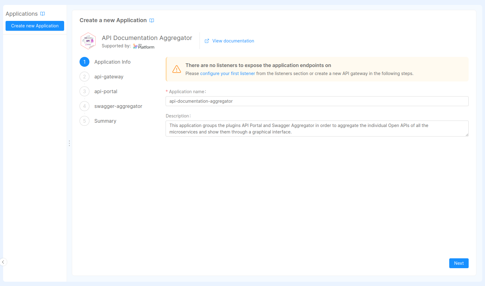

The **API Documentation Aggregator** application can be added to your project by visiting Mia-Platform [Applications](/runtime-components/applications/mia_applications.md). To configure it properly, there are essentially 2 ways.

## 1. Creating a new API Documentation Aggregator application (recommended)

The creation of the application is divided in several steps, allowing the **Swagger Aggregator** and **API Gateway** services, each with the necessary endpoints, to be added to the project in addition to the API Portal itself (both are needed to make the API Portal work properly: the Swagger Aggregator is responsible for aggregating the individual [Open APIs](https://swagger.io/resources/open-api/) of all the microservices indicated in the configuration, while the API Gateway is needed to manage endpoints).

By default, the API Portal is exposed on `/documentations/api-portal`. If you want to expose it on another path, you can change it in the `Endpoints` section.

Moreover, the endpoint `/api/openapi` rewrites on `/openapi/v3-1`, meaning it will request the Open API v3.1 specification to the `Swagger Aggregator`. It's possible to change the rewrite path and the available ones are:
- `/openapi/v2` for Swagger v2
- `/openapi/v3` for Open API v3 specification
- `/openapi/v3-1` for Open API v3.1 specification

:::warning
Please, be aware that the API Portal is public by default, so the users do not need to perform any login step to view your API Portal.   
You can block unauthorized users to access the API Portal by checking `Authentication required` to the `GET /` route of the endpoint that exposes the API Portal. Doing so, only users with the cookie can access it, but the login page for setting the cookie is not autogenerated, hence you need to configure the login process by yourself.
:::

:::tip
You can set up a login process by using the [Auth0 Client](/runtime-components/plugins/auth0-client/10_overview.md) plugin, that you can find in the [Marketplace](/runtime-components/overview_marketplace.md).
:::

## 2. Step-by-step manual configuration

This procedure allows you to manually add the various services and endpoints needed to make the API Portal work properly, effectively generating the resources that are automatically created when you add an API Documentation Aggregator application to the project.

1. Add the **Swagger Aggregator** plugin to the project via the "Microservices" section;
2. Add the **API Gateway** plugin to the project via the "Microservices" section;
3. [Create three new endpoints](/products/console/api-console/api-design/endpoints.md) with the following configurations:
    - Endpoint 1:
      * Base path: `/documentations/api-portal`
      * Type: `Microservice`
      * Microservice: `swagger-aggregator`
      * Rewrite base path: `/swagger`
    - Endpoint 2:
      * Base path: `/api/openapi`
      * Type: `Microservice`
      * Microservice: `swagger-aggregator`
      * Rewrite base path: it depends on the documentation version you want to see.
        * `/openapi/v3-1` for Open API v3.1
        * `/openapi/v3` for Open API v3.0
        * `/openapi/v2` for Swagger v2
    - Endpoint 3:
      * Base path: `/api/openapi/raw`
      * Type: `Microservice`
      * Microservice: `swagger-aggregator`
      * Rewrite base path: `/`

:::note
Take a look at the "Environment Variables" tab of the API Portal service, and make sure the HTTP_PORT where the web server is exposed is properly set, with value `8080`.
:::

## Environment variables

The API Portal accepts the following environment variables:

- **HTTP_PORT** (default: 8080): defines the http port to use
