The following image represents what a user visualizes for a Flow Manager service linked to the Configurator.

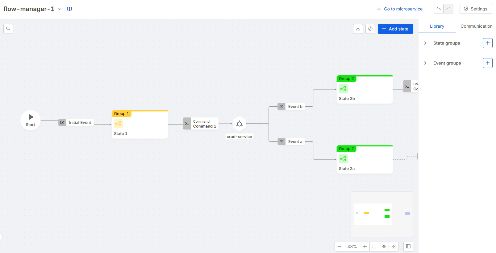

In order to describe the functionalities of the tool let's split the interface in 3 main components:
- [Header](#header)
- [Canvas](#canvas)
- [Side Panel](#side-panel)

## Header

The header is always displayed on top of the Configurator, it provides the following features:

- **Flow Selector**: the flow selector component is placed on the left side of the header. It provides a dropdown menu which allows to switch from a Flow Manager service to another.

- **Go to microservice**: the *Go to microservice* button is placed on the right side of the header. It redirects the user to the Microservices section in Design Area, in particular to the linked Flow Manager microservice.

- **History Buttons**: the history buttons are placed on the right side of the header. They provide the standard history actions: *undo* and *redo*. The history is based on actions that result in configuration changes: the maximum supported length is 10 actions.

- **Settings**: the settings buttons are placed on the right side of the header. They provide a dropdown menu with the following options:
    - Persistency Management
    - Service settings
    - Unlink microservice (only for linked services)
    - New layout (only if you have not switched to the new layout yet)
    - Download service configuration
    - Upload service configuration

#### Persistency Management

The persistency management modal allows to configure the persistency method used by the Flow Manager service. The displayed types depend on the Flow Manager version as described [here](/runtime-components/plugins/flow-manager-service/changelog.md).

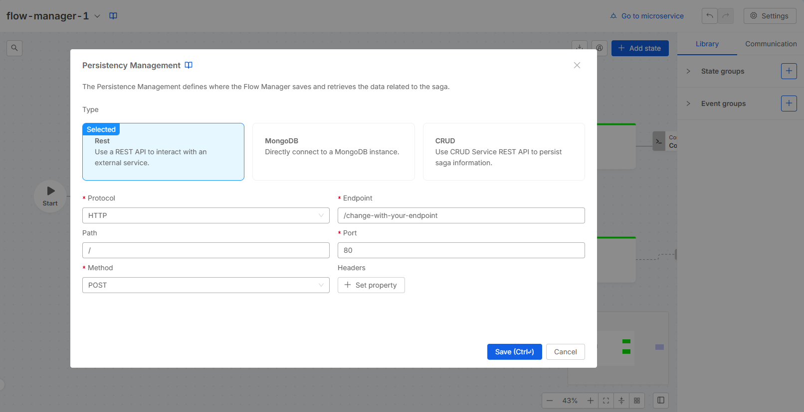

#### Service settings

The service settings modal includes:

- Deep merge: allows to configure the deep merge setting of the Flow Manager as described [here](/runtime-components/plugins/flow-manager-service/30_configuration.md#settings).

:::info
This feature is available starting from Flow Manager version `2.6.0`.
:::

- Events: Enabling the Events toggle configures the Flow Manager to respond with an error if an unexpected event is received. If the event is as expected, the Flow Manager will respond with an "OK" status.

:::info
This feature is available starting from Flow Manager version `2.6.5`.
:::

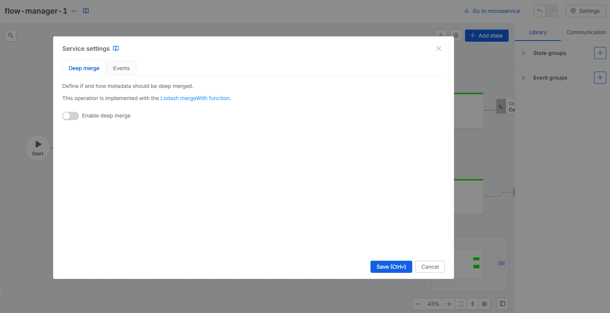

#### Unlink Microservice

The unlink microservice modal alerts the user before actually performing the [unlink process](/products/console/api-console/api-design/flow-manager-configurator/overview.md#unlink).

#### New Layout

The New Layout modal allows you to switch to the new layout, which includes the canvas view for external executors. Once you switch to the new layout, this action is irreversible, and the option to switch will no longer be visible.

#### Download service configuration

The Service Configuration modal allows you to download and copy the configuration of the Flow Manager Service, regardless of whether the service is linked to the configurator.

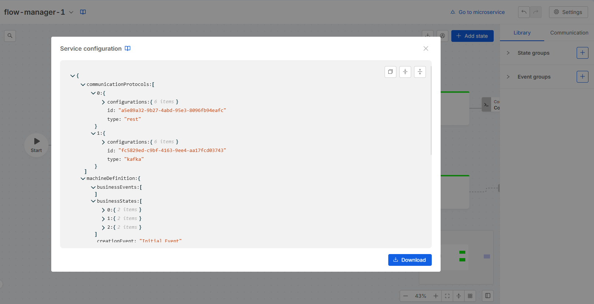

#### Upload service configuration

The Upload service configuration modal allows you to upload a configuration of the flow manager service from an existing json file or by typing the json in the editor.
It is possible to choose the version of the flow manager service's configuration that will be uploaded.

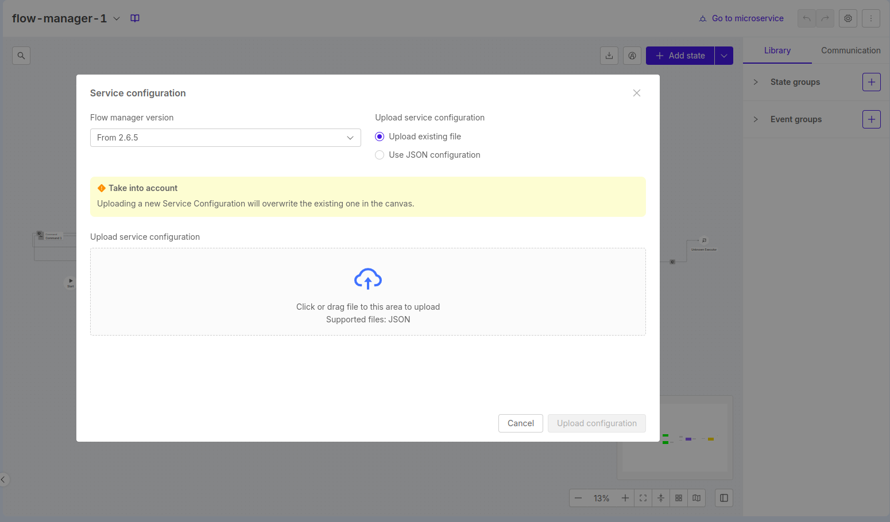

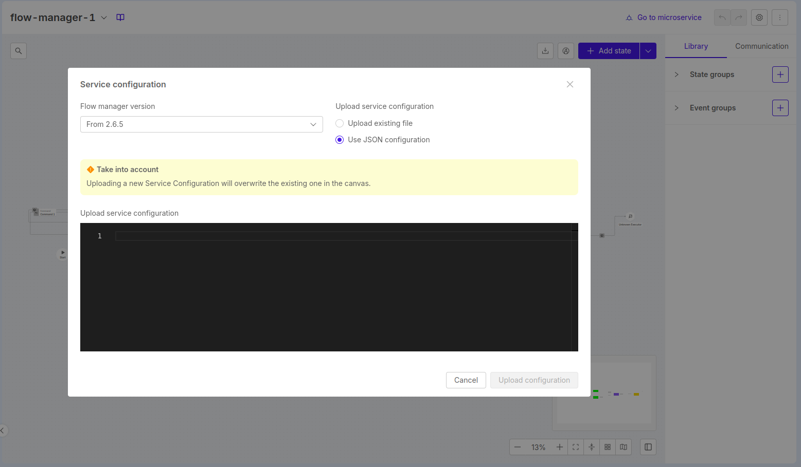

## Canvas

The canvas component allows you to visualize the configured flow, with states and external executors represented as nodes, and events and commands represented as edges.

:::info
Events that link the same states are collapsed into a single edge.
:::

### Create Entities

You can create new entities on the canvas in the following ways:

- **New States**:
    - Click the Add state button located in the top-right corner of the canvas.
    - Double-click on an empty space within the canvas.

- [New layout] **New Logic Blocks**: which includes commands/wait events and the external executor
    - Drag and drop from the right handle of the source state to an empty area on the canvas.

- **New Events**:
    - [New layout] Drag and drop from the right handle of an external executor to the left handle of the target state or to an empty area of the canvas.
    - [Old layout] Drag and drop from the right handle of the source state to the left handle of the target state.

Additionally, you can create
- [New layout] a logic block, event, and state simultaneously by dragging and dropping from the right handle of the source state to the left handle of the target state.
- [Old layout] both a state and an event at the same time by drag and drop from the right handle of the source state to an empty area of the canvas.

### Create shapes and notes

Starting from the "Add State" button, you can also add shapes and notes to the canvas.

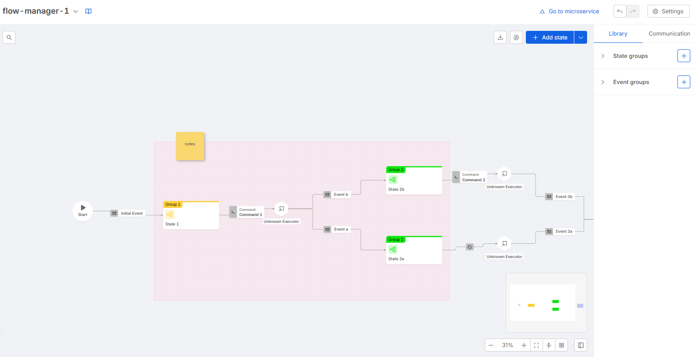

In detail:

- Shapes: by clicking on the canvas, you can create a new shape and resize it according to your needs. You can also assign a name to the shape and change its color.

- Notes: by clicking on the canvas, you can create a new note and resize it as needed. The content can be written directly in the sidebar, and you can change the note color.

### Control Buttons

Control buttons are placed in the corners of the canvas.

Button placed in the top left corner provide the following features:
- Searchbar &rarr; searches for states, events and shapes of the flow, clicking on an item will cause it to be centered and selected

Button placed in the top right corner provide the following features:
- Download flow &rarr; exports an image representing the whole flow or the current view
- Highlight &rarr; enters the [highlight mode](/products/console/api-console/api-design/flow-manager-configurator/overview.md#highlight-mode)
- Add state &rarr; creates a new state
    - Add shape &rarr; creates a new shape
    - Add note &rarr; creates a new note

Button placed in the bottom right corner provide the following features:
- Zoom out
- Zoom in
- Fit view &rarr; centers the flow and chooses the right zoom to visualize the entire flow
- Collapse/Expand &rarr; collapses or expands nodes and edges
- Auto layout &rarr; auto computes and sets nodes and edge positions
- Toggle side panel visibility.

## Side Panel

The side panel component is displayed on the right side of the Configurator, it can be collapsed using [a control button](#control-buttons) on the canvas.

The side panel can display many *scenarios* as described below.

### Library and Communication

This is the default scenario. This scenario is composed by 2 tabs: Library and Communication.

#### Library

This tab contains the State Groups and Event Groups recap. It allows to open the creation modal or the edit form for each of the entities above.

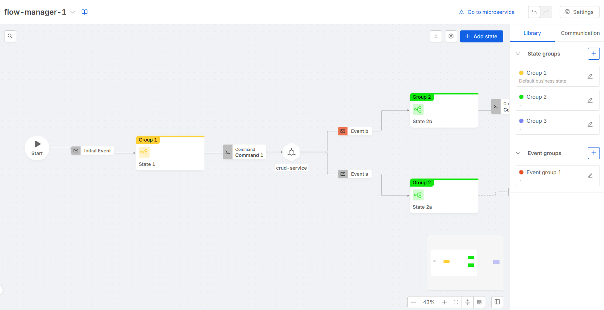

- **State Group**

[State group](/runtime-components/plugins/flow-manager-service/30_configuration.md#business-states-of-the-machine) creation modal can be opened clicking the *Plus* button placed in the [library](#library) scenario. A form placed in the side panel allows to edit or delete the selected state group.

- **Event Group**

[Event group](/runtime-components/plugins/flow-manager-service/30_configuration.md#business-events-of-the-machine) creation modal can be opened clicking the *Plus* button placed in the [library](#library) scenario. A form placed in the side panel allows to edit or delete the selected event group.

#### Communication

This tab contains the Commands, Protocols, Hooks and Side Effects recap. It allows to open the creation modal or the edit form for each of the entities above.

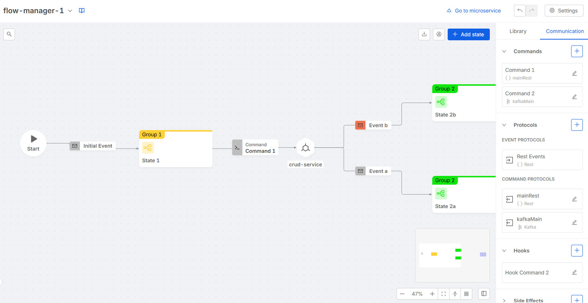

##### Command

[Command](/runtime-components/plugins/flow-manager-service/30_configuration.md#states-of-the-machine) creation modal can be opened clicking the *Plus* button placed in the [communication](#communication) scenario. A wizard will help the creation process following these steps:
1. Set a label, an optional description, and optionally select or write the external executor (from the microservices already instantiated in the console)
2. set a communication protocol (either using an existing one or creating a new one on the spot)
3. set an optional hook  (either using an existing one or creating a new one on the spot).

A form placed in the side panel allows to edit or delete the selected command. Moreover it allows to set a custom hook which is not registered in the hooks recap and thus cannot be reused elsewhere.

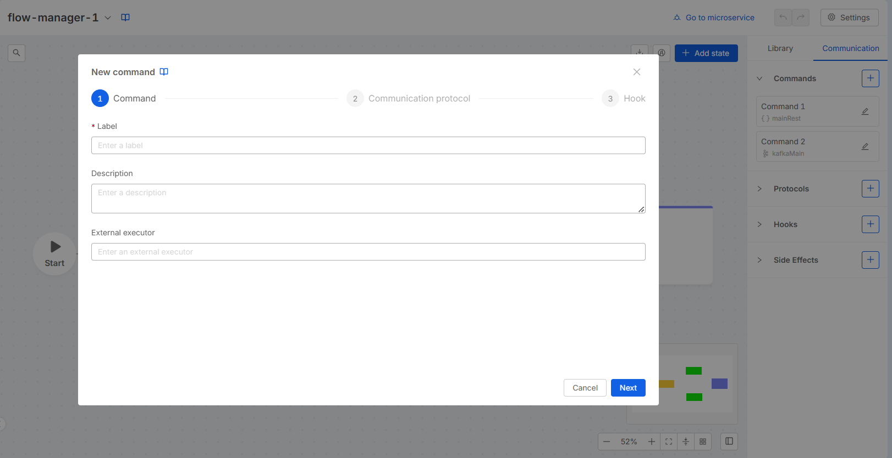

##### Protocol

[Protocol](/runtime-components/plugins/flow-manager-service/30_configuration.md#communication-protocols) creation modal can be opened clicking the *Plus* button placed in the [communication](#communication) scenario. With Kafka type it is possible to create an event, command or duplex protocol; with REST type it is possible to create only command protocols.

A form placed in the side panel allows to edit or delete the selected protocol.

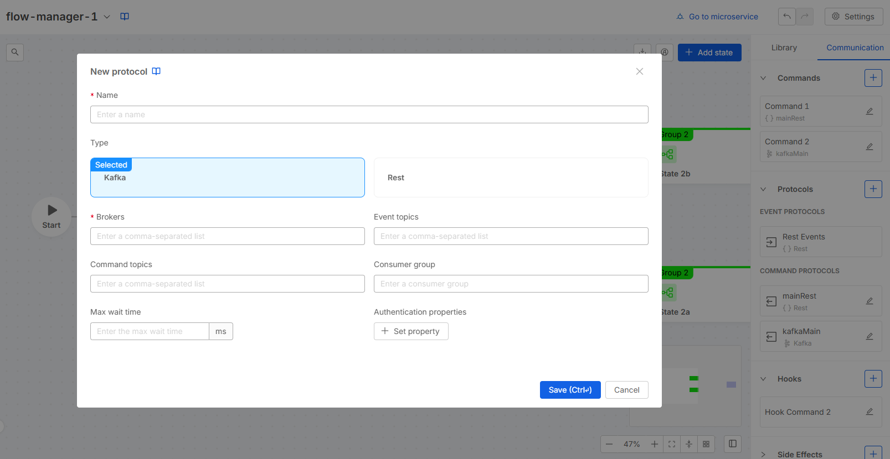

##### Hook

[Hook](/runtime-components/plugins/flow-manager-service/30_configuration.md#command-hook) creation modal can be opened clicking the *Plus* button placed in the [communication](#communication) scenario. A form placed in the side panel allows to edit or delete the selected hook.

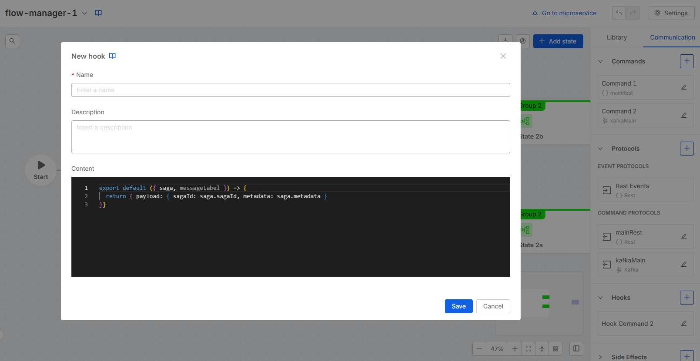

##### Side Effect

[Side effect](/runtime-components/plugins/flow-manager-service/30_configuration.md#states-of-the-machine) creation modal can be opened clicking the *Plus* button placed in the [communication](#communication) scenario. A wizard will help the creation process following these steps:
1. set a label and an optional description
2. set a communication protocol (either using an existing one or creating a new one on the spot)
3. set an optional hook  (either using an existing one or creating a new one on the spot).

A form placed in the side panel allows to edit or delete the selected side effect. Moreover it allows to set a custom hook which is not registered in the hooks recap and thus cannot be reused elsewhere.

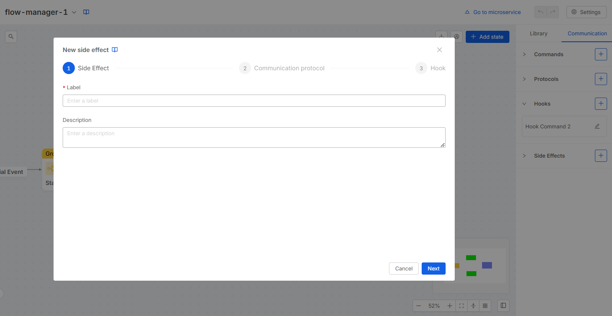

### State

This form allows to edit or delete the selected [state](/runtime-components/plugins/flow-manager-service/30_configuration.md#states-of-the-machine). It can be visualized selecting a state (i.e. a node) on the canvas.

:::info
The "Is final" toggle is automatically disabled and set to `false` when an outgoing event (targeting a different state) is created.
:::

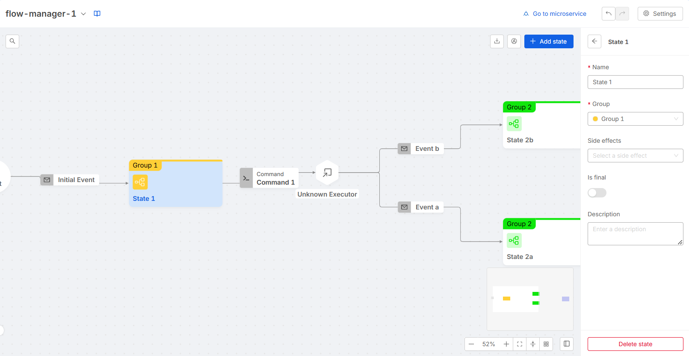

### Initial Event

This form allows to edit or delete the [initial event](/runtime-components/plugins/flow-manager-service/30_configuration.md#machine-definition). It can be visualized selecting the initial event on the canvas.

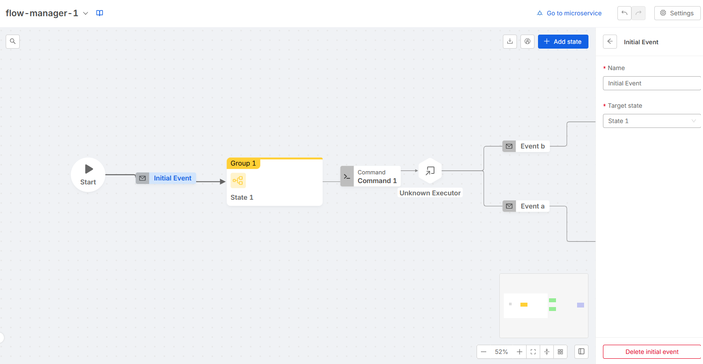

### Logic Block

[New Layout] The Logic Block form allows you to edit or delete the selected logic block. It can be visualized by selecting a command or external executor on the canvas.

You can choose between two modes for the logic block:
- Wait for an external event: In this case, you can manually enter the external executor.
- Select a command: The external executor will be pre-filled with the executor associated with the command, but you can overwrite it if needed.

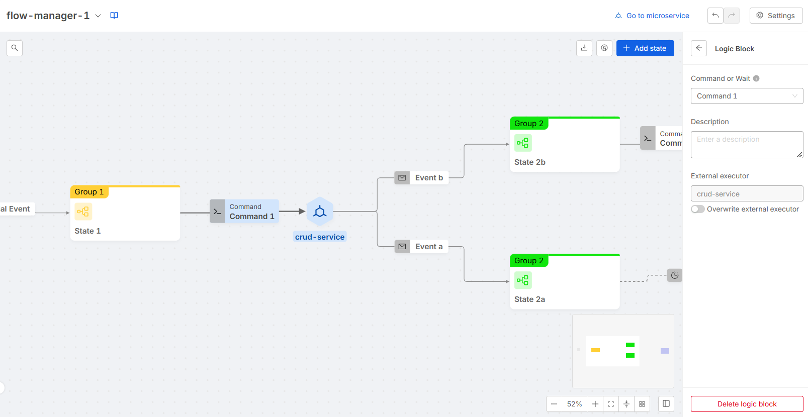

### Event

This form allows to edit or delete the selected [event](/runtime-components/plugins/flow-manager-service/30_configuration.md#states-of-the-machine). It can be visualized selecting an event (i.e. an edge) on the canvas. In case the edge refers to multiple events, the scenario will display a collapsed form for each event.

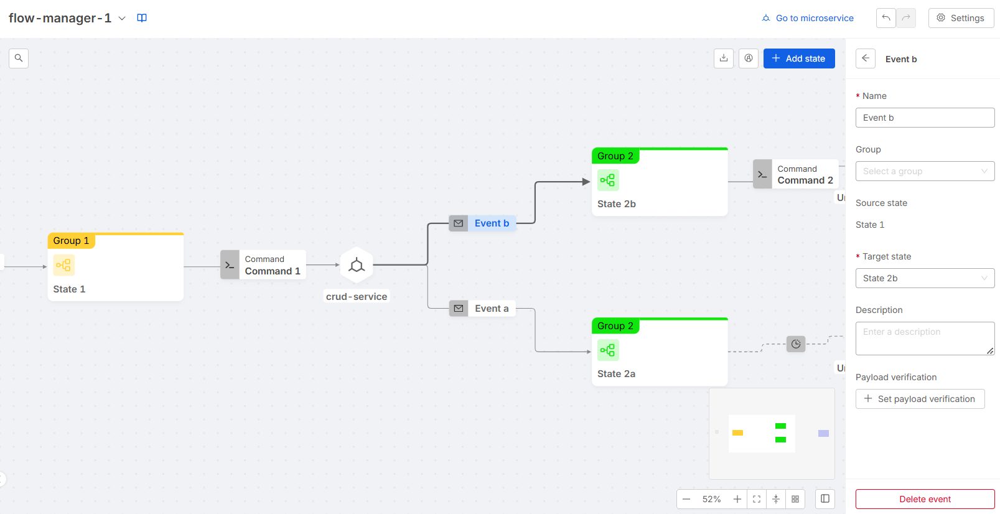
