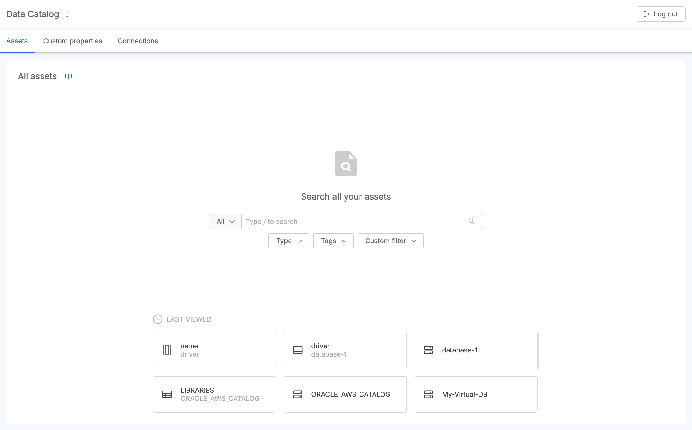
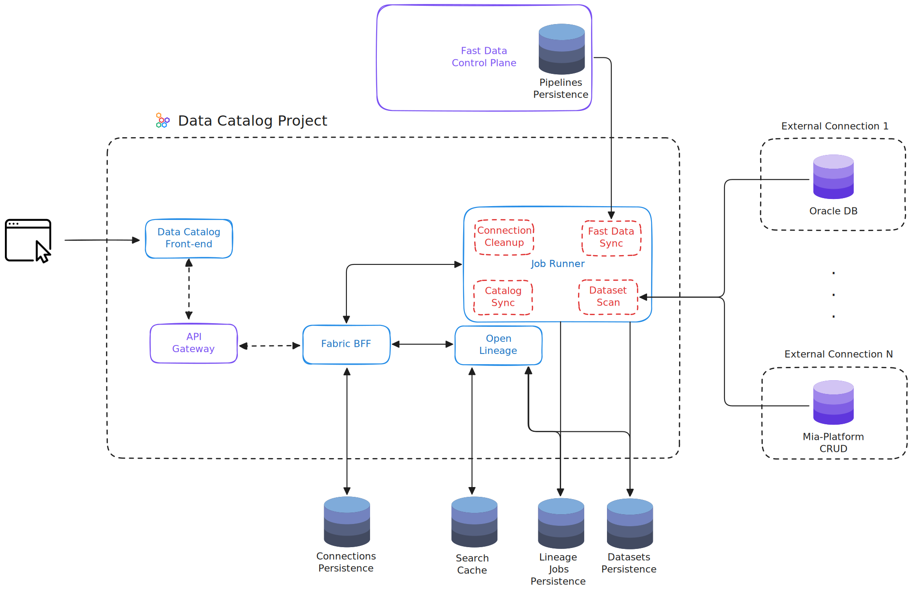

**Data Catalog** is a crucial tool for managing and governing data within an organization.  
It serves as a centralized and organized repository of metadata that describes the company’s data, including its origins, characteristics, and relationships.  
The catalog provides a clear and detailed overview of the available data resources, facilitating their access, management, and informed use.

In today’s business landscape, characterized by a growing volume of data generated and consumed, a Data Catalog becomes essential for several reasons:

* **Data Governance**: Data governance involves controlling and managing data to ensure it is accurate, consistent, and compliant with regulations. A Data Catalog helps organizations maintain data quality and ensures proper and secure data use, aiding in adherence to company policies and external regulations.

* **Data Discovery**: With the increasing complexity of business information systems and the proliferation of data, finding and accessing the right data can become challenging. A Data Catalog provides tools for searching and discovering data, improving efficiency and reducing the time needed to find information coming from numerous and heterogenous system of records.

* **Regulations and Compliance**: Organizations are subject to numerous regulations and data management laws, such as GDPR in Europe and CCPA in California. A Data Catalog facilitates compliance by tracking and documenting data origins and flows, supporting auditing and reporting activities.

* **Data Policies**: Company data policies define how data should be managed, shared, and protected. A Data Catalog helps ensure that these policies are adhered to, providing visibility and control over data management practices.

Many are the challenges that companies have to deal with every day:

* **Data Integration**: Companies often face difficulties in integrating data from different sources. Without a centralized view, obtaining a unified and coherent perspective of the data is challenging.

* **Data Quality**: Maintaining data quality and accuracy is another continuous challenge, especially when data is dispersed across various systems and formats.

* **Security and Privacy**: Ensuring that sensitive data is protected and that privacy regulations are followed and guaranteed is crucial but complex.

* **Data Access and Utilization**: Facilitating access to the right data for the right people without compromising security can be difficult to manage without a centralized system.

## Mia-Platform Data Catalog

In order to help companies solve all these challenges, we offer **Mia-Platform Data Catalog**, a core component of Mia-Platform suite and a powerful tool for the Data Governance.  
With Mia-Platform, it is possible to take advantage of the synergies with [**Fast Data**](/products/fast_data/what_is_fast_data.md) product, paving the way to the implementation of a Data Fabric solution. 

### Key features

Mia-Platform Data Catalog offers many powerful features for building your Data Product:

* **Data Cataloging**: Organizes and collects available information about company's system of records, tables and columns, making it easy for an analyst to find and understand the data needed for a report.

* **Metadata Management**: Provides full management of custom properties to be assigned to the collected assets for metadata enrichment.

* **Search and Discovery**: Allows users to search for and discover data using advanced queries and filters on tags and custom properties. Advanced search capabilities enables a data scientist to quickly find specific assets for data analysis.

* **Collaborative Environment**: Enables users to collaborate in searching and enriching assets in the same centralized source of truth, facilitating knowledge sharing on assets.

* **Policy Management and Access Control**: Allows to establish customized data classification levels and tagging based on data sensitivity, ensuring that asset information is handled according to its classification, such as public, internal, or confidential. Moreover, it enables access control on users, which can have read-only permissions or also metadata enrichment capabilities on assets. This ensures that only authorized users can view or modify certain data.

* **Data Lineage**: Allows to track the origin and flow of data through systems to help understand how data are transformed and used through various business processes, useful to identify and resolve data quality issues.

* **Connections Management**: Allows to add, edit and synchronize external data sources to retrieve their assets.

### Metadata Enrichment

**Metadata enrichment** is a critical aspect of managing data assets within a Data Catalog.  
Metadata enrichment refers to the process of enhancing the existing metadata with additional information that provides more context, detail, and value to the data assets.  
This additional layer of metadata can significantly improve the usability, discoverability, and governance of data assets.  
Here is summarized why metadata enrichment is so important:

* **Enhanced Data Discoverability**: Enriching metadata helps users find relevant data more efficiently. By adding descriptive information, keywords, and data classifications, users can perform more precise searches and filters, thus improving the speed and accuracy of data discovery.

* **Improved Data Understanding**: Enriched metadata provides users with a clearer understanding of what the data represents, how it should be used, and its relevance to specific business contexts. This helps users to make more informed decisions.

* **Data Quality and Consistency**: By standardizing and enriching metadata, organizations can ensure consistency in data descriptions and definitions across various datasets. This reduces ambiguity and discrepancies, leading to more reliable and high-quality data.

* **Facilitating Compliance and Governance**: Enriched metadata supports compliance efforts by clearly documenting data ownership, sensitivity levels, and regulatory requirements. This is crucial for adhering to data protection laws and internal policies.

* **Enhanced Collaboration**: Detailed and enriched metadata facilitates better collaboration among teams by providing a shared understanding of data assets.

### Main stakeholders

Within an organization, several stakeholders can benefit from using Mia-Platform Data Catalog:

* **Data Analysts and Data Scientists**: Benefit from faster search and better understanding of data, accelerating analysis times and improving the effectiveness of their research.

* **Data Engineers**: Use the catalog to understand data origins and transformations, facilitating the design and maintenance of data flows.

* **Business Intelligence (BI) Professionals**: Can more effectively find and use data for analysis and reporting, improving the quality of business insights.

* **Chief Data Officers (CDO) and Data Governance Teams**: Use the Data Catalog to implement and monitor data governance policies, ensuring compliance with regulations and maintaining data quality.

* **Compliance and Audit Teams**: Gain from the catalog’s ability to facilitate regulatory compliance and internal audits.

* **Business Users and Decision Makers**: Can access the necessary data and information for informed decision-making, thanks to the availability and clarity of data resources.

### Benefits

Adopting Mia-Platform Data Catalog offers numerous benefits:

* **Increased Efficiency**: Reduces the time required to find and access data, optimizing work processes and increasing productivity.

* **Data Quality Assurance**: Helps maintain data quality through centralized management and monitoring of data information.

* **Compliance Facilitation**: Supports adherence to regulations and laws, aiding in audit and reporting activities.

* **Improved Collaboration**: Enhances collaboration between teams by providing a common space for sharing data information and knowledge.

* **Decision Support**: Provides decision-makers with a solid foundation of accurate and well-organized data for informed and strategic decisions.

## Setup Mia-Platform Data Catalog

Start to setup your Data Catalog Project in Mia-Platform Console.  
Find in the Marketplace the [Data Catalog Application](/runtime-components/applications/data-catalog/10_overview.md), that offers pre-configured bundle of resources that allows you to easily instantiate and deploy a working Data Catalog product. Give a look at the following [documentation page](/products/data_catalog/frontend/overview.mdx) to see how to navigate Mia-Platform Data Catalog. Among application resources there is a service in charge of extracting metadata regarding the several tables and data structures existing on configured
sources (System of Records) of your company, in order to populate the information inside your Data Catalog to start the experience within Data Catalog frontend.

Actually, it is possible to acquire metadata coming from different supported System of Records:  

- Oracle Database
- Postgres Database
- MySQL Database
- Microsoft SQL Server Database
- Mia-Platform MongoDB CRUD Service
- Salesforce SObjects API
- SAP HANA

In summary, a Data Catalog is an essential tool for effective data management. It offers a comprehensive solution for cataloging, discovering, governing,
and complying with data requirements, providing significant benefits in terms of efficiency, quality, and transparency.
Implementing a Data Catalog not only optimizes data management but also contributes to robust governance and improves analytical
and decision-making capabilities within the organization.

---

## Architecture

In the diagram below is shown how the services involved in the aforementioned Marketplace components are linked together. 

In particular, the Data Catalog FE interacts with the application's microservices through the [Fabric BFF](/products/data_catalog/data_catalog_fabric_bff.mdx). 
This component manages also the _Connections_ that can be configured from the frontend to retrieve data from external sources.

To retrieve data from external sources, the [Job Runner](/products/data_catalog/data_catalog_job_runner.mdx) can schedule a job to launch an _Agent Dataset Scan_ task that will store them as _Datasets_.
Other tasks can be scheduled, like the _Fast Data Sync_, that can retrieve pipelines from [Fast Data Control Plane](/products/fast_data/runtime_management/overview.mdx) and use them as _Lineage Jobs_.

_Assets_ and _Lineage Jobs_ are managed by the [Open Lineage service](/products/data_catalog/data_catalog_open_lineage.mdx), which provides features to retrieve data.

The following paragraph provides useful links to go into detail about the various components that enable the adoption of our Data Catalog solution.

---

## Useful Resources

Here are some useful links to learn more about Mia-Platform Data Catalog features and configuration steps:

- visit the dedicated [documentation page](/products/data_catalog/frontend/overview.mdx) to discover all the features available from the Data Catalog Application frontend and how to configure it properly;
- visit the dedicated [documentation page](/products/data_catalog/data_catalog_fabric_bff.mdx) for configuring the Data Catalog BFF, a key resource for the Data Catalog Application;
- visit the dedicated [documentation page](/products/data_catalog/data_catalog_job_runner.mdx) for configuring the Data Catalog Job Runner to populate your Data Catalog and keep up to date with your data sources;
- visit the dedicated [documentation page](/products/data_catalog/data_catalog_open_lineage.mdx) to discover the Open Lineage pattern adopted in our Data Catalog solution;
- visit the dedicated [documentation page](/products/data_catalog/database_setup.mdx) to know how to properly prepare the database wherein all Data Catalog assets and information is stored;
- visit the [guide about secure access](/products/data_catalog/secure_access.mdx) to know how to manage Data Catalog user permissions through authorization mechanisms;
- visit the [compatibility matrix](/products/data_catalog/compatibility_matrix.md) to check whether your infrastructure and services are already equipped to support our Data Catalog solution.